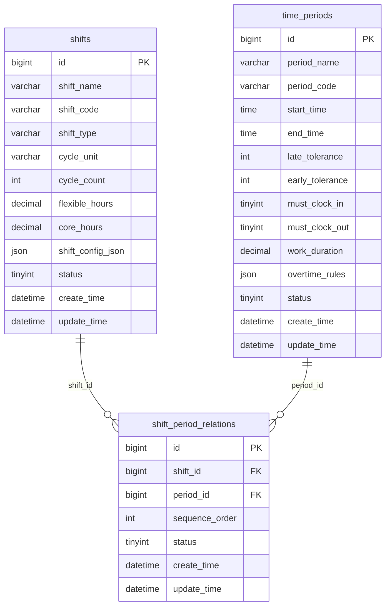
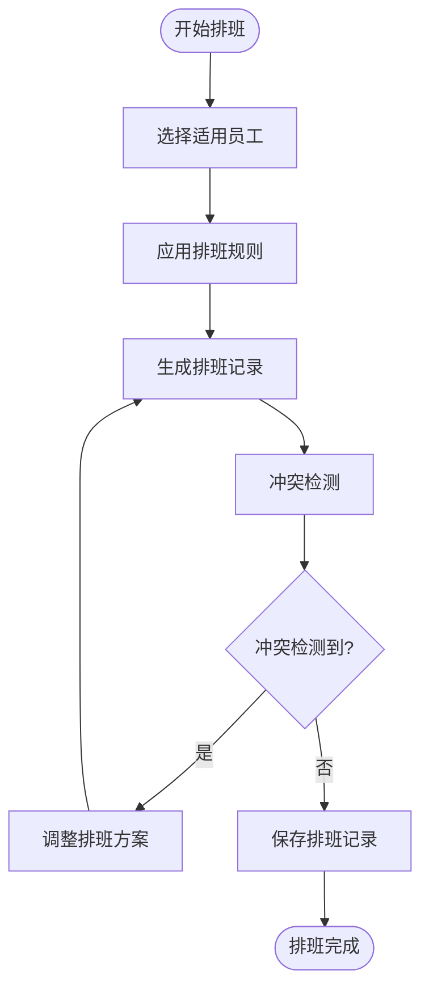

# 轮班规则

<cite>
**本文档引用的文件**   
- [班次时间段管理.md](file://documentation\03-业务模块\考勤\班次时间段管理.md)
- [排班管理.md](file://documentation\03-业务模块\考勤\排班管理.md)
- [考勤前端原型布局\班次时间功能布局文档_完整版.md](file://documentation\03-业务模块\考勤\考勤前端原型布局\班次时间功能布局文档_完整版.md)
- [AttendanceShiftController.java](file://microservices\ioedream-attendance-service\src\main\java\net\lab1024\sa\attendance\controller\AttendanceShiftController.java)
- [AttendanceShiftServiceImpl.java](file://microservices\ioedream-attendance-service\src\main\java\net\lab1024\sa\attendance\service\impl\AttendanceShiftServiceImpl.java)
</cite>

## 目录
1. [轮班规则概述](#轮班规则概述)
2. [轮班模式配置](#轮班模式配置)
3. [常见轮班模式配置示例](#常见轮班模式配置示例)
4. [轮班规则与班次关联配置](#轮班规则与班次关联配置)
5. [轮班冲突检测机制](#轮班冲突检测机制)
6. [轮班提醒功能](#轮班提醒功能)

## 轮班规则概述

轮班规则是考勤系统中的核心配置模块，用于定义和管理各种轮班模式、班次安排和排班策略。系统通过灵活的配置支持多种班次类型，包括规律班次、弹性班次、三班倒、四班三倒等，满足不同部门和岗位的排班需求。

轮班规则主要由班次表（shifts）、时间段表（time_periods）和班次时间段关联表（shift_period_relations）三个核心数据表构成。班次表存储班次的基本信息和配置，时间段表定义具体的工作时间段，班次时间段关联表实现班次与时间段的多对多关联关系，支持一个班次包含多个时间段的复杂配置。

**Section sources**
- [班次时间段管理.md](file://documentation\03-业务模块\考勤\班次时间段管理.md#L1-L381)

## 轮班模式配置

轮班模式的配置主要通过班次表的`shift_config_json`字段实现，该字段以JSON格式存储详细的班次规则。配置参数包括轮班周期、轮班顺序、轮班间隔等关键属性。

### 轮班周期配置

轮班周期通过`cycle_unit`（周期单位）和`cycle_count`（周期数）两个字段定义。周期单位支持天、周、月三种选择，周期数表示一个完整轮班周期的天数。例如，三班倒模式通常配置为7天一个周期。

```json
{
  "shift_pattern": "rotating",
  "rotation_cycle_days": 7,
  "cycle_unit": "天",
  "cycle_count": 7
}
```

### 轮班顺序配置

轮班顺序通过`rotation_sequence`数组定义，该数组存储班次ID的序列，表示轮班的顺序。系统根据此序列自动安排员工的班次轮换。

```json
{
  "rotation_sequence": [1, 2, 3]
}
```

### 轮班间隔配置

轮班间隔通过`min_rest_days`（最少休息天数）和`max_continuous_days`（最大连续工作天数）等参数控制，确保员工有足够的休息时间，避免过度劳累。

```json
{
  "max_continuous_days": 6,
  "min_rest_days": 1
}
```

**Section sources**
- [班次时间段管理.md](file://documentation\03-业务模块\考勤\班次时间段管理.md#L242-L262)

## 常见轮班模式配置示例

### 三班倒模式配置

三班倒模式将一天分为早班、中班、晚班三个班次，每班8小时，员工按7天周期轮换。

```json
{
  "shift_pattern": "rotating",
  "rotation_sequence": [101, 102, 103],
  "rotation_cycle_days": 7,
  "flexible_start_time": "08:00",
  "flexible_end_time": "20:00",
  "core_start_time": "10:00",
  "core_end_time": "16:00",
  "break_duration": 60,
  "break_times": [
    {
      "start": "12:00",
      "end": "13:00"
    }
  ],
  "cross_day_enabled": true,
  "max_continuous_days": 6,
  "min_rest_days": 1
}
```

### 四班两倒模式配置

四班两倒模式使用四个班组，每天安排两个班次，实现24小时连续生产。每个班组工作两天休息两天。

```json
{
  "shift_pattern": "rotating",
  "rotation_sequence": [201, 202, 203, 204],
  "rotation_cycle_days": 8,
  "work_days": 2,
  "rest_days": 2,
  "shift_duration": 12,
  "cross_day_enabled": true,
  "max_continuous_days": 2,
  "min_rest_days": 2
}
```

### 弹性工作制模式配置

弹性工作制模式允许员工在规定的核心工作时间外自由选择上下班时间。

```json
{
  "shift_pattern": "flexible",
  "flexible_start_time": "08:00",
  "flexible_end_time": "20:00",
  "core_start_time": "10:00",
  "core_end_time": "16:00",
  "core_hours": 6.0,
  "flexible_hours": 2.0,
  "must_clock_in": 1,
  "must_clock_out": 1
}
```

**Section sources**
- [班次时间段管理.md](file://documentation\03-业务模块\考勤\班次时间段管理.md#L242-L262)
- [考勤前端原型布局\班次时间功能布局文档_完整版.md](file://documentation\03-业务模块\考勤\考勤前端原型布局\班次时间功能布局文档_完整版.md#L1490-L1510)

## 轮班规则与班次关联配置

轮班规则与班次的关联通过`shift_period_relations`表实现，该表建立了班次与时间段的多对多关系，支持复杂轮班场景的实现。

### 班次时间段关联

一个班次可以关联多个时间段，通过`sequence_order`字段控制时间段的顺序。例如，标准早班可以关联"标准工作时间"和"午休时间"两个时间段。



**Diagram sources**
- [班次时间段管理.md](file://documentation\03-业务模块\考勤\班次时间段管理.md#L127-L173)

### 班次模板配置

班次模板用于批量应用相同的班次配置，支持部门模板、岗位模板和个人模板三种类型。模板配置包含适用范围、排班模式、约束条件等信息。

```json
{
  "template_name": "技术部标准排班模板",
  "cycle_type": "weekly",
  "cycle_days": 7,
  "schedule_pattern": [
    {
      "day_of_week": 1,
      "shift_id": 101,
      "required_employees": 5,
      "skill_requirements": ["开发", "测试"]
    },
    {
      "day_of_week": 2,
      "shift_id": 102,
      "required_employees": 3,
      "skill_requirements": ["运维"]
    }
  ],
  "rotation_rules": {
    "auto_rotation": true,
    "rotation_frequency": "weekly",
    "fairness_factor": 0.8
  },
  "constraints": {
    "max_consecutive_days": 6,
    "min_rest_hours": 12,
    "weekend_balance": true,
    "holiday_preference": false
  },
  "applicable_employees": {
    "departments": [1, 2, 3],
    "positions": [10, 20],
    "exclude_employees": [1001, 1002]
  }
}
```

**Section sources**
- [排班管理.md](file://documentation\03-业务模块\考勤\排班管理.md#L208-L244)

## 轮班冲突检测机制

轮班冲突检测机制确保排班的合理性，避免员工在同一时间被安排多个班次或违反排班规则。

### 冲突检测规则

系统在生成排班时会自动检测以下冲突：
- **时间冲突**：员工在同一时间被安排多个班次
- **连续工作天数冲突**：超过最大连续工作天数限制
- **休息时间冲突**：休息时间少于最少休息天数要求
- **技能要求冲突**：员工技能不符合班次要求
- **法定节假日冲突**：在法定节假日安排工作

### 冲突处理流程



**Diagram sources**
- [排班管理.md](file://documentation\03-业务模块\考勤\排班管理.md#L250-L252)

## 轮班提醒功能

轮班提醒功能通过移动端推送轮班变更通知，确保员工及时了解自己的排班情况。

### 提醒配置

提醒配置包含提醒渠道、提醒时间和提醒内容等参数。系统支持APP推送、邮件、短信等多种提醒方式。

```json
{
  "notification": {
    "enabled": true,
    "channels": ["app", "email", "sms"],
    "advance_time": 24,
    "content_template": "您在{date}的班次已安排为{shift_name}，请准时到岗。"
  }
}
```

### 提醒触发条件

系统在以下情况下会触发轮班提醒：
- **排班生成**：新排班周期开始时
- **排班变更**：班次发生调整时
- **临时排班**：安排临时班次时
- **调班审批**：调班申请审批通过时

提醒功能通过调用通知服务实现，确保消息的及时送达。

**Section sources**
- [考勤前端原型布局\班次时间功能布局文档_完整版.md](file://documentation\03-业务模块\考勤\考勤前端原型布局\班次时间功能布局文档_完整版.md#L927-L936)
- [AttendanceShiftServiceImpl.java](file://microservices\ioedream-attendance-service\src\main\java\net\lab1024\sa\attendance\service\impl\AttendanceShiftServiceImpl.java#L124-L148)