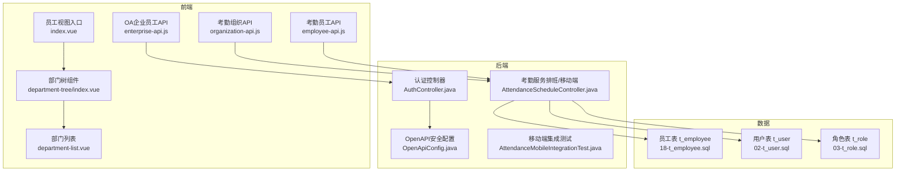
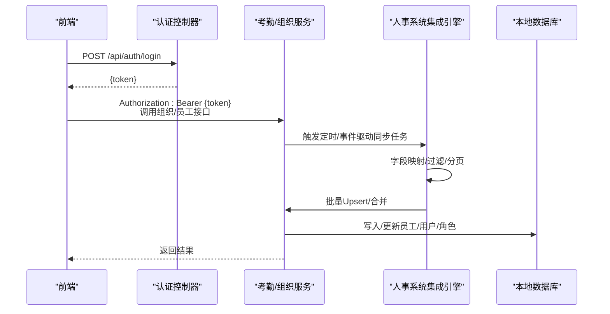
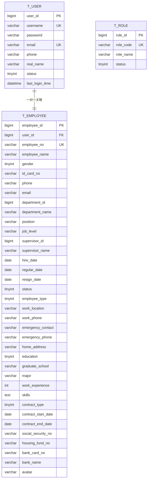
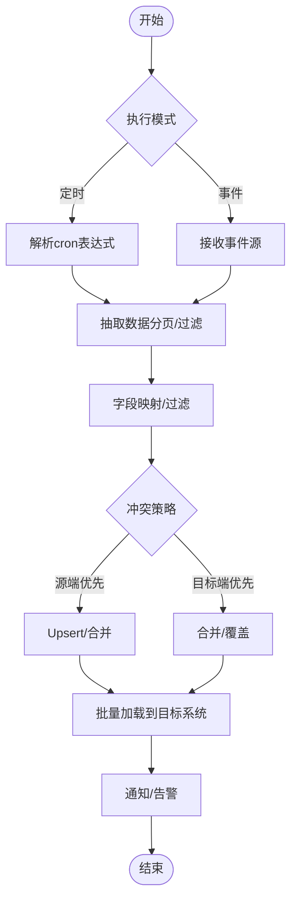
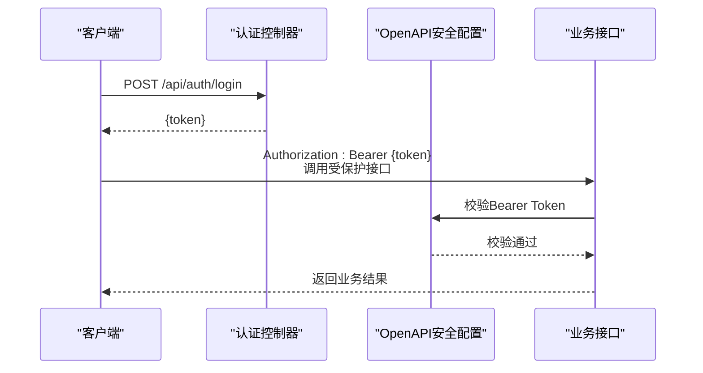
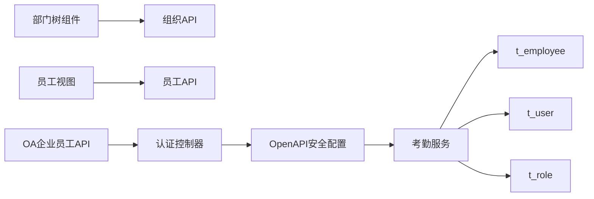

# 与人事系统集成

<cite>
**本文引用的文件**
- [第三方系统集成实现方案.md](file://documentation/03-业务模块/第三方系统集成实现方案.md)
- [smart-person.md](file://documentation/technical/smart-person.md)
- [考勤系统数据库ER图设计.md](file://documentation/03-业务模块/考勤/考勤系统数据库ER图设计.md)
- [排班管理.md](file://documentation/03-业务模块/考勤/排班管理.md)
- [基础信息功能布局文档_完整版.md](file://documentation/03-业务模块/考勤/考勤前端原型布局/基础信息功能布局文档_完整版.md)
- [接口文档模板.md](file://documentation/06-模板工具/文档模板/接口文档模板.md)
- [全局架构规范.md](file://documentation/01-核心规范/架构规范/全局架构规范.md)
- [PRODUCTION_SECURITY_CHECKLIST.md](file://PRODUCTION_SECURITY_CHECKLIST.md)
- [18-t_employee.sql](file://database-scripts/common-service/18-t_employee.sql)
- [02-t_user.sql](file://database-scripts/common-service/02-t_user.sql)
- [03-t_role.sql](file://database-scripts/common-service/03-t_role.sql)
- [employee-api.js](file://smart-admin-web-javascript/src/api/business/oa/enterprise-api.js)
- [organization-api.js](file://smart-admin-web-javascript/src/api/business/attendance/basic-info/organization-api.js)
- [employee-api.js](file://smart-admin-web-javascript/src/api/business/attendance/basic-info/employee-api.js)
- [department-tree/index.vue](file://smart-admin-web-javascript/src/views/system/employee/components/department-tree/index.vue)
- [department-list.vue](file://smart-admin-web-javascript/src/views/system/department/department-list.vue)
- [index.vue](file://smart-admin-web-javascript/src/views/system/employee/index.vue)
- [AuthController.java](file://restful_refactor_backup_20251202_014224/microservices_ioedream-auth-service_src_main_java_net_lab1024_sa_auth_controller_AuthController.java)
- [OpenApiConfig.java](file://microservices/ioedream-common-service/src/main/java/net/lab1024/sa/common/config/OpenApiConfig.java)
- [AttendanceMobileIntegrationTest.java](file://microservices/ioedream-attendance-service/src/test/java/net/lab1024/sa/attendance/integration/AttendanceMobileIntegrationTest.java)
- [AttendanceScheduleController.java](file://restful_refactor_backup_20251202_014224/microservices_ioedream-attendance-service_src_main_java_net_lab1024_sa_attendance_controller_AttendanceScheduleController.java)
- [employee-api.js](file://smart-admin-web-javascript/src/api/system/employee-api.js)
</cite>

## 目录
1. [引言](#引言)
2. [项目结构](#项目结构)
3. [核心组件](#核心组件)
4. [架构总览](#架构总览)
5. [详细组件分析](#详细组件分析)
6. [依赖分析](#依赖分析)
7. [性能考虑](#性能考虑)
8. [故障排查指南](#故障排查指南)
9. [结论](#结论)
10. [附录](#附录)

## 引言
本文件面向“与人事系统集成”的目标，系统化阐述考勤系统如何从人事系统同步员工基本信息与组织架构数据，涵盖字段映射、触发机制与频率配置、安全认证方案、数据冲突解决策略，并结合数据库ER图说明考勤系统本地存储人事数据的表结构设计与一致性校验机制。文档同时给出可操作的接口调用路径与可视化图示，帮助开发者与运维快速落地。

## 项目结构
围绕“人事系统集成”，本仓库的关键落点包括：
- 业务模块与集成规范：第三方系统集成实现方案、考勤系统数据库ER图、考勤前端原型布局
- 技术规范与安全：接口文档模板、全局架构规范、生产安全检查清单
- 数据库脚本：员工、用户、角色等核心表结构
- 前端API与视图：组织树、员工列表、OA企业员工接口
- 后端鉴权与网关：认证控制器、OpenAPI安全配置

图表来源
- [enterprise-api.js](file://smart-admin-web-javascript/src/api/business/oa/enterprise-api.js#L47-L69)
- [organization-api.js](file://smart-admin-web-javascript/src/api/business/attendance/basic-info/organization-api.js#L61-L95)
- [employee-api.js](file://smart-admin-web-javascript/src/api/business/attendance/basic-info/employee-api.js#L86-L95)
- [department-tree/index.vue](file://smart-admin-web-javascript/src/views/system/employee/components/department-tree/index.vue#L1-L42)
- [department-list.vue](file://smart-admin-web-javascript/src/views/system/department/department-list.vue#L95-L152)
- [index.vue](file://smart-admin-web-javascript/src/views/system/employee/index.vue#L1-L70)
- [AuthController.java](file://restful_refactor_backup_20251202_014224/microservices_ioedream-auth-service_src_main_java_net_lab1024_sa_auth_controller_AuthController.java#L1-L58)
- [OpenApiConfig.java](file://microservices/ioedream-common-service/src/main/java/net/lab1024/sa/common/config/OpenApiConfig.java#L111-L140)
- [AttendanceScheduleController.java](file://restful_refactor_backup_20251202_014224/microservices_ioedream-attendance-service_src_main_java_net_lab1024_sa_attendance_controller_AttendanceScheduleController.java#L30-L335)
- [AttendanceMobileIntegrationTest.java](file://microservices/ioedream-attendance-service/src/test/java/net/lab1024/sa/attendance/integration/AttendanceMobileIntegrationTest.java#L24-L212)
- [18-t_employee.sql](file://database-scripts/common-service/18-t_employee.sql#L1-L69)
- [02-t_user.sql](file://database-scripts/common-service/02-t_user.sql#L1-L41)
- [03-t_role.sql](file://database-scripts/common-service/03-t_role.sql#L1-L29)

章节来源
- [接口文档模板.md](file://documentation/06-模板工具/文档模板/接口文档模板.md#L1-L72)
- [全局架构规范.md](file://documentation/01-核心规范/架构规范/全局架构规范.md#L1062-L1113)
- [PRODUCTION_SECURITY_CHECKLIST.md](file://PRODUCTION_SECURITY_CHECKLIST.md#L261-L287)

## 核心组件
- 人事系统集成引擎与任务配置：提供定时/事件驱动的同步任务、字段映射、冲突策略与通知通道
- 考勤系统本地存储：员工表、用户表、角色表
- 前端组织与员工视图：部门树、员工列表、OA企业员工接口
- 后端鉴权与API安全：Bearer Token认证、权限控制、OpenAPI安全配置
- 考勤移动端与排班：移动端离线数据缓存/同步、排班管理接口

章节来源
- [第三方系统集成实现方案.md](file://documentation/03-业务模块/第三方系统集成实现方案.md#L900-L1099)
- [18-t_employee.sql](file://database-scripts/common-service/18-t_employee.sql#L1-L69)
- [02-t_user.sql](file://database-scripts/common-service/02-t_user.sql#L1-L41)
- [03-t_role.sql](file://database-scripts/common-service/03-t_role.sql#L1-L29)
- [接口文档模板.md](file://documentation/06-模板工具/文档模板/接口文档模板.md#L1-L72)
- [OpenApiConfig.java](file://microservices/ioedream-common-service/src/main/java/net/lab1024/sa/common/config/OpenApiConfig.java#L111-L140)

## 架构总览
下图展示了“人事系统集成”在整体系统中的位置与交互关系：前端通过认证控制器获取令牌，再调用考勤/组织接口；后端服务对接人事系统集成引擎，完成员工与组织数据的抽取、转换与加载；本地数据库存储员工、用户、角色等核心数据。

图表来源
- [AuthController.java](file://restful_refactor_backup_20251202_014224/microservices_ioedream-auth-service_src_main_java_net_lab1024_sa_auth_controller_AuthController.java#L1-L58)
- [OpenApiConfig.java](file://microservices/ioedream-common-service/src/main/java/net/lab1024/sa/common/config/OpenApiConfig.java#L111-L140)
- [organization-api.js](file://smart-admin-web-javascript/src/api/business/attendance/basic-info/organization-api.js#L61-L95)
- [employee-api.js](file://smart-admin-web-javascript/src/api/business/attendance/basic-info/employee-api.js#L86-L95)
- [AttendanceScheduleController.java](file://restful_refactor_backup_20251202_014224/microservices_ioedream-attendance-service_src_main_java_net_lab1024_sa_attendance_controller_AttendanceScheduleController.java#L30-L335)
- [18-t_employee.sql](file://database-scripts/common-service/18-t_employee.sql#L1-L69)

## 详细组件分析

### 1. 字段映射与数据模型
- 员工字段映射参考“第三方系统集成实现方案”中的任务配置，典型字段包括：员工编号、姓名、部门、岗位、入职日期等。映射规则支持直传与查找映射（如部门名称到部门编码）。
- 考勤系统本地存储以员工表为核心，包含员工编号、姓名、性别、身份证、手机号、邮箱、部门ID/名称、职位、职级、上级ID、入职/转正/离职日期、状态、合同信息、技能标签、银行账号、头像等字段，并提供冗余字段提升查询效率。
- 用户表与角色表支撑身份认证与权限控制，员工与用户之间存在一对一关联。

图表来源
- [18-t_employee.sql](file://database-scripts/common-service/18-t_employee.sql#L1-L69)
- [02-t_user.sql](file://database-scripts/common-service/02-t_user.sql#L1-L41)
- [03-t_role.sql](file://database-scripts/common-service/03-t_role.sql#L1-L29)

章节来源
- [第三方系统集成实现方案.md](file://documentation/03-业务模块/第三方系统集成实现方案.md#L900-L1099)
- [18-t_employee.sql](file://database-scripts/common-service/18-t_employee.sql#L1-L69)
- [02-t_user.sql](file://database-scripts/common-service/02-t_user.sql#L1-L41)
- [03-t_role.sql](file://database-scripts/common-service/03-t_role.sql#L1-L29)

### 2. 数据同步触发机制与频率配置
- 触发机制：支持定时同步与事件驱动两种模式。定时同步通过cron表达式配置，如“每日凌晨2点”。
- 频率配置：可设置分页大小、最大页数、批量大小等，确保大数据量场景下的稳定性与性能。
- 事件驱动：可基于人事系统变更事件触发增量同步，减少全量同步开销。

图表来源
- [第三方系统集成实现方案.md](file://documentation/03-业务模块/第三方系统集成实现方案.md#L900-L1099)

章节来源
- [第三方系统集成实现方案.md](file://documentation/03-业务模块/第三方系统集成实现方案.md#L900-L1099)

### 3. 安全认证方案
- 认证方式：基于Bearer Token的JWT认证，接口文档模板与OpenAPI安全配置均明确要求Authorization: Bearer {token}。
- 权限控制：RBAC权限模型，接口需具备相应权限标识；全局架构规范强调关键接口需进行权限校验与防刷限流。
- 生产安全：登录接口限流策略、敏感信息加密存储、配置安全审计等。

图表来源
- [AuthController.java](file://restful_refactor_backup_20251202_014224/microservices_ioedream-auth-service_src_main_java_net_lab1024_sa_auth_controller_AuthController.java#L1-L58)
- [OpenApiConfig.java](file://microservices/ioedream-common-service/src/main/java/net/lab1024/sa/common/config/OpenApiConfig.java#L111-L140)
- [接口文档模板.md](file://documentation/06-模板工具/文档模板/接口文档模板.md#L1-L72)
- [全局架构规范.md](file://documentation/01-核心规范/架构规范/全局架构规范.md#L1062-L1113)
- [PRODUCTION_SECURITY_CHECKLIST.md](file://PRODUCTION_SECURITY_CHECKLIST.md#L261-L287)

章节来源
- [接口文档模板.md](file://documentation/06-模板工具/文档模板/接口文档模板.md#L1-L72)
- [全局架构规范.md](file://documentation/01-核心规范/架构规范/全局架构规范.md#L1062-L1113)
- [PRODUCTION_SECURITY_CHECKLIST.md](file://PRODUCTION_SECURITY_CHECKLIST.md#L261-L287)

### 4. 数据冲突解决策略
- 冲突策略：支持“源端优先/目标端优先”等策略，结合Upsert/合并模式，确保数据一致性与历史保留。
- 字段映射：支持直传与查找映射（如部门名称到编码），并可配置过滤条件（如必填字段校验）。
- 通知与告警：同步过程可配置邮件/Webhook等通知通道，便于问题追踪与恢复。

章节来源
- [第三方系统集成实现方案.md](file://documentation/03-业务模块/第三方系统集成实现方案.md#L900-L1099)

### 5. 前端组织与员工视图
- 组织树：提供部门树组件，支持展开/折叠、右键菜单、新增/编辑/删除部门等操作；部门列表支持构建树形结构与面包屑导航。
- 员工视图：左侧部门树联动右侧员工列表，支持按部门筛选与批量操作。
- 考勤基础信息：组织与员工API提供列表、树形、创建/更新/删除等接口，支撑考勤系统的基础数据管理。

章节来源
- [基础信息功能布局文档_完整版.md](file://documentation/03-业务模块/考勤/考勤前端原型布局/基础信息功能布局文档_完整版.md#L123-L406)
- [基础信息功能布局文档_完整版.md](file://documentation/03-业务模块/考勤/考勤前端原型布局/基础信息功能布局文档_完整版.md#L176-L468)
- [organization-api.js](file://smart-admin-web-javascript/src/api/business/attendance/basic-info/organization-api.js#L61-L95)
- [employee-api.js](file://smart-admin-web-javascript/src/api/business/attendance/basic-info/employee-api.js#L86-L95)
- [department-tree/index.vue](file://smart-admin-web-javascript/src/views/system/employee/components/department-tree/index.vue#L1-L42)
- [department-list.vue](file://smart-admin-web-javascript/src/views/system/department/department-list.vue#L95-L152)
- [index.vue](file://smart-admin-web-javascript/src/views/system/employee/index.vue#L1-L70)

### 6. 考勤移动端与排班接口
- 移动端离线数据：支持离线缓存与同步，测试覆盖了离线数据批量缓存与同步流程。
- 排班管理：提供创建、更新、查询、批量创建等接口，严格遵循权限控制与日志记录。

章节来源
- [AttendanceMobileIntegrationTest.java](file://microservices/ioedream-attendance-service/src/test/java/net/lab1024/sa/attendance/integration/AttendanceMobileIntegrationTest.java#L24-L212)
- [AttendanceScheduleController.java](file://restful_refactor_backup_20251202_014224/microservices_ioedream-attendance-service_src_main_java_net_lab1024_sa_attendance_controller_AttendanceScheduleController.java#L30-L335)

## 依赖分析
- 前端依赖：组织树组件依赖部门API；员工视图依赖员工API；OA企业员工API用于企业级员工管理。
- 后端依赖：认证控制器负责登录/刷新/登出；OpenAPI安全配置统一管理Bearer Token；考勤服务依赖数据库表结构。
- 数据库依赖：员工表与用户表、角色表共同构成身份与人事数据基础。

图表来源
- [department-tree/index.vue](file://smart-admin-web-javascript/src/views/system/employee/components/department-tree/index.vue#L1-L42)
- [department-list.vue](file://smart-admin-web-javascript/src/views/system/department/department-list.vue#L95-L152)
- [index.vue](file://smart-admin-web-javascript/src/views/system/employee/index.vue#L1-L70)
- [organization-api.js](file://smart-admin-web-javascript/src/api/business/attendance/basic-info/organization-api.js#L61-L95)
- [employee-api.js](file://smart-admin-web-javascript/src/api/business/attendance/basic-info/employee-api.js#L86-L95)
- [employee-api.js](file://smart-admin-web-javascript/src/api/business/oa/enterprise-api.js#L47-L69)
- [AuthController.java](file://restful_refactor_backup_20251202_014224/microservices_ioedream-auth-service_src_main_java_net_lab1024_sa_auth_controller_AuthController.java#L1-L58)
- [OpenApiConfig.java](file://microservices/ioedream-common-service/src/main/java/net/lab1024/sa/common/config/OpenApiConfig.java#L111-L140)
- [18-t_employee.sql](file://database-scripts/common-service/18-t_employee.sql#L1-L69)
- [02-t_user.sql](file://database-scripts/common-service/02-t_user.sql#L1-L41)
- [03-t_role.sql](file://database-scripts/common-service/03-t_role.sql#L1-L29)

## 性能考虑
- 分页与批量：集成任务配置支持分页大小与批量大小，避免单次请求过大导致超时或内存压力。
- 索引与冗余字段：员工表包含大量索引与冗余字段（如部门名称、上级名称），有助于查询性能与报表效率。
- 限流与防刷：生产安全检查清单明确了登录/消费/查询接口的限流策略，降低突发流量对系统的影响。
- 监控与告警：集成引擎支持指标采集与告警规则，便于及时发现性能瓶颈与异常。

章节来源
- [第三方系统集成实现方案.md](file://documentation/03-业务模块/第三方系统集成实现方案.md#L900-L1099)
- [18-t_employee.sql](file://database-scripts/common-service/18-t_employee.sql#L1-L69)
- [PRODUCTION_SECURITY_CHECKLIST.md](file://PRODUCTION_SECURITY_CHECKLIST.md#L261-L287)

## 故障排查指南
- 认证失败：检查Authorization头是否携带Bearer Token，确认令牌有效与权限标识正确。
- 接口权限不足：确认用户角色与权限集合，必要时更新权限配置。
- 同步异常：查看集成任务日志与告警，核对cron表达式、分页参数、字段映射规则与冲突策略。
- 数据不一致：比对本地员工表与人事系统字段映射，确认Upsert/合并策略与过滤条件。
- 移动端离线数据：检查离线缓存与同步接口调用链路，确保网络恢复后能正确同步。

章节来源
- [接口文档模板.md](file://documentation/06-模板工具/文档模板/接口文档模板.md#L1-L72)
- [全局架构规范.md](file://documentation/01-核心规范/架构规范/全局架构规范.md#L1062-L1113)
- [AttendanceMobileIntegrationTest.java](file://microservices/ioedream-attendance-service/src/test/java/net/lab1024/sa/attendance/integration/AttendanceMobileIntegrationTest.java#L24-L212)
- [AttendanceScheduleController.java](file://restful_refactor_backup_20251202_014224/microservices_ioedream-attendance-service_src_main_java_net_lab1024_sa_attendance_controller_AttendanceScheduleController.java#L30-L335)

## 结论
本集成方案以“定时/事件驱动”的同步任务为核心，结合严格的字段映射、冲突策略与安全认证，确保考勤系统与人事系统间的数据一致性与安全性。配合完善的数据库表结构、前端组织与员工视图、以及移动端与排班接口，形成从数据抽取到本地存储与业务使用的闭环。建议在生产环境中启用限流与监控告警，并定期校验字段映射与冲突策略，保障系统稳定运行。

## 附录
- 接口调用路径示例（仅列出路径，不展示具体代码内容）
  - 认证接口：POST /api/auth/login
  - 刷新令牌：POST /api/auth/refresh
  - 登出：POST /api/auth/logout
  - 组织接口：GET /attendance/organization/dept/tree
  - 员工接口：GET /attendance/employee/list
  - OA企业员工接口：POST /oa/enterprise/employee/list
- 数据库表结构
  - 员工表：t_employee
  - 用户表：t_user
  - 角色表：t_role

章节来源
- [AuthController.java](file://restful_refactor_backup_20251202_014224/microservices_ioedream-auth-service_src_main_java_net_lab1024_sa_auth_controller_AuthController.java#L1-L58)
- [organization-api.js](file://smart-admin-web-javascript/src/api/business/attendance/basic-info/organization-api.js#L61-L95)
- [employee-api.js](file://smart-admin-web-javascript/src/api/business/attendance/basic-info/employee-api.js#L86-L95)
- [employee-api.js](file://smart-admin-web-javascript/src/api/business/oa/enterprise-api.js#L47-L69)
- [18-t_employee.sql](file://database-scripts/common-service/18-t_employee.sql#L1-L69)
- [02-t_user.sql](file://database-scripts/common-service/02-t_user.sql#L1-L41)
- [03-t_role.sql](file://database-scripts/common-service/03-t_role.sql#L1-L29)