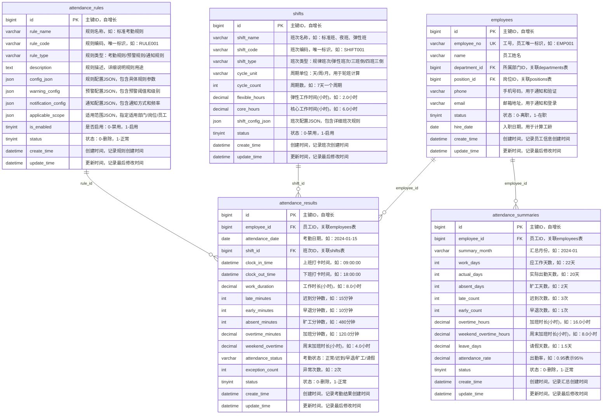
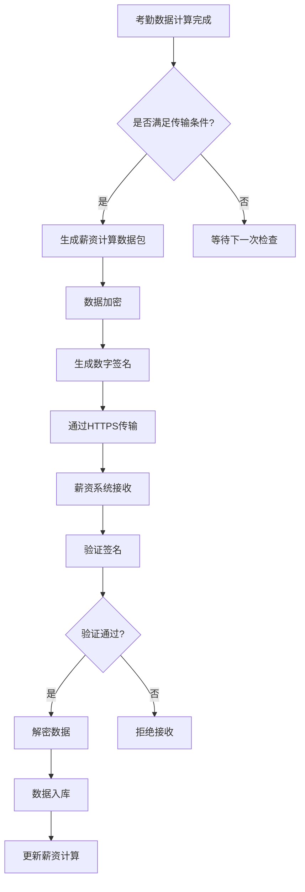
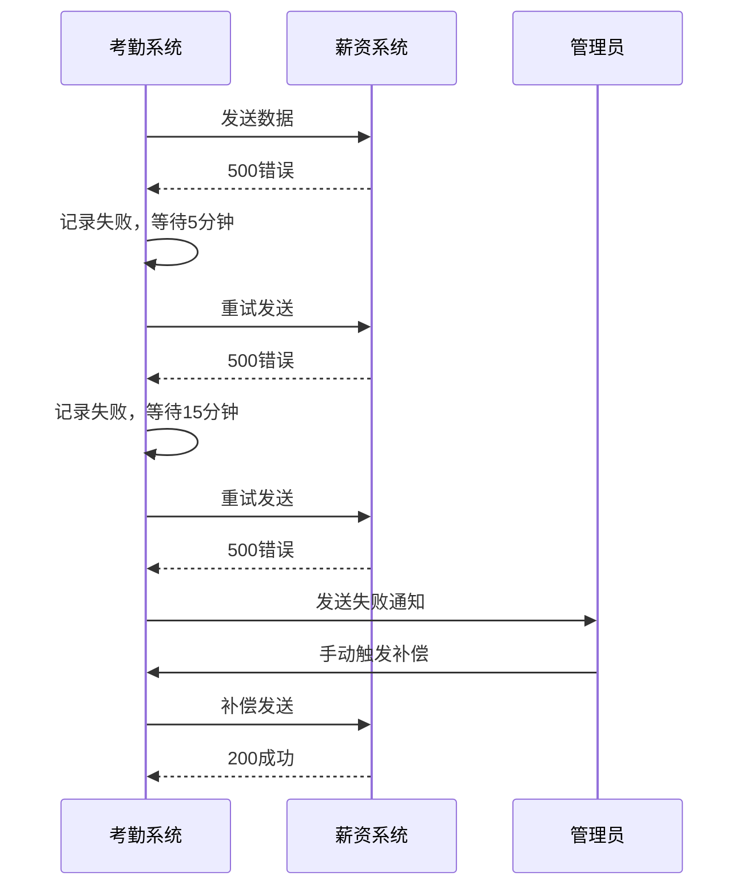
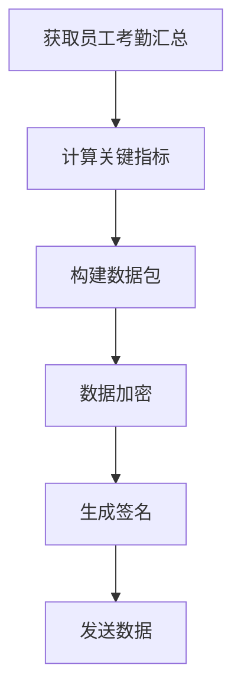

# 与薪资系统集成

<cite>
**本文档引用文件**   
- [考勤系统数据库ER图设计.md](file://documentation\03-业务模块\考勤\考勤系统数据库ER图设计.md)
- [原始记录及考勤计算.md](file://documentation\03-业务模块\考勤\原始记录及考勤计算.md)
- [考勤规则配置.md](file://documentation\03-业务模块\考勤\考勤规则配置.md)
- [班次时间段管理.md](file://documentation\03-业务模块\考勤\班次时间段管理.md)
- [第三方系统集成实现方案.md](file://documentation\03-业务模块\第三方系统集成实现方案.md)
- [spec.md](file://openspec\changes\archive\completed-proposals\implement-third-party-system-integration\specs\third-party-system-integration\spec.md)
</cite>

## 目录
1. [引言](#引言)
2. [考勤与薪资系统集成架构](#考勤与薪资系统集成架构)
3. [关键数据计算逻辑](#关键数据计算逻辑)
4. [数据传输机制](#数据传输机制)
5. [API接口规范](#api接口规范)
6. [异常处理流程](#异常处理流程)
7. [数据完整性与准确性保障](#数据完整性与准确性保障)
8. [集成实现示例](#集成实现示例)
9. [结论](#结论)

## 引言
本集成文档详细说明了考勤系统如何与薪资系统进行数据交互，确保薪资计算的准确性和及时性。文档涵盖了从考勤结果计算、数据传输周期、API接口规范到异常处理机制的完整流程。通过本集成方案，考勤系统能够将员工的加班时长、缺勤天数、迟到早退次数等关键数据准确传输至薪资系统，支持工资计算。系统采用安全的数据传输机制，包括数据加密、签名验证和防重放攻击，确保数据在传输过程中的安全性和完整性。

## 考勤与薪资系统集成架构
考勤系统与薪资系统的集成采用基于微服务架构的第三方系统集成方案，通过统一的集成引擎实现数据同步。系统支持多种HR和ERP系统适配器，包括北森HR、Moka HR、用友U8 ERP等，确保与不同薪资系统的兼容性。



**图示来源**
- [考勤系统数据库ER图设计.md](file://documentation\03-业务模块\考勤\考勤系统数据库ER图设计.md#L470-L596)

**本节来源**
- [考勤系统数据库ER图设计.md](file://documentation\03-业务模块\考勤\考勤系统数据库ER图设计.md)
- [第三方系统集成实现方案.md](file://documentation\03-业务模块\第三方系统集成实现方案.md)

## 关键数据计算逻辑
考勤系统通过一系列算法计算薪资系统所需的关键数据，包括工作时长、加班时长、迟到早退次数等。这些计算基于员工的打卡记录、排班信息和考勤规则。

### 工作时长计算
工作时长的计算考虑了弹性时间、核心时间和休息时间等因素。系统首先计算基础时长，然后减去休息时间，并根据弹性时间规则进行调整。

```python
def calculate_work_duration(clock_in_time, clock_out_time, shift_config):
    """
    计算工作时长
    考虑弹性时间、核心时间、休息时间等因素
    """
    # 基础时长计算
    base_duration = clock_out_time - clock_in_time

    # 减去休息时间
    break_duration = calculate_break_duration(clock_in_time, clock_out_time, shift_config)

    # 弹性时间处理
    flexible_adjustment = calculate_flexible_adjustment(clock_in_time, clock_out_time, shift_config)

    # 最终工作时长
    work_duration = base_duration - break_duration + flexible_adjustment

    return max(work_duration, 0)
```

### 迟到早退判定
系统根据员工的打卡时间和排班时间，结合容忍时间，判定迟到和早退情况。

```python
def determine_late_early(clock_time, schedule_time, tolerance):
    """
    判定迟到早退
    """
    if clock_time > schedule_time + tolerance:
        # 迟到
        late_minutes = (clock_time - schedule_time - tolerance).total_seconds() / 60
        return int(late_minutes), 0
    elif clock_time < schedule_time - tolerance:
        # 早退
        early_minutes = (schedule_time - tolerance - clock_time).total_seconds() / 60
        return 0, int(early_minutes)
    else:
        # 正常
        return 0, 0
```

### 加班时间计算
加班时间的计算基于工作时长和标准工时，同时考虑周末和节假日的倍数规则。

```python
def calculate_overtime(work_duration, standard_hours, overtime_rules):
    """
    计算加班时间
    """
    if work_duration <= standard_hours:
        return 0

    overtime_hours = work_duration - standard_hours

    # 应用不同倍数
    if is_weekend():
        overtime_multiplier = overtime_rules.get('weekend_multiplier', 2.0)
    elif is_holiday():
        overtime_multiplier = overtime_rules.get('holiday_multiplier', 3.0)
    else:
        overtime_multiplier = 1.0

    return overtime_hours * overtime_multiplier
```

**本节来源**
- [原始记录及考勤计算.md](file://documentation\03-业务模块\考勤\原始记录及考勤计算.md#L264-L327)

## 数据传输机制
考勤系统与薪资系统的数据传输采用定时和触发两种模式，确保数据的及时性和准确性。

### 传输周期性
- **每日传输**：每日凌晨2点执行，传输前一天的考勤结果，包括迟到早退次数、加班时长等实时数据。
- **每月传输**：每月1日执行，传输上个月的考勤汇总数据，包括缺勤天数、出勤率等月度统计信息。

### 触发条件
- **排班变更**：当员工的排班计划发生变更时，立即触发数据重新计算和传输。
- **异常修正**：当考勤数据被修正时，触发相关数据的重新计算和传输。
- **手动触发**：管理员可以手动触发数据传输，用于特殊情况下的数据同步。

### 数据传输流程


**图示来源**
- [第三方系统集成实现方案.md](file://documentation\03-业务模块\第三方系统集成实现方案.md#L752-L987)

**本节来源**
- [第三方系统集成实现方案.md](file://documentation\03-业务模块\第三方系统集成实现方案.md)
- [考勤系统数据库ER图设计.md](file://documentation\03-业务模块\考勤\考勤系统数据库ER图设计.md)

## API接口规范
考勤系统提供标准化的API接口，用于与薪资系统进行数据交互。接口设计遵循RESTful规范，确保安全性和可靠性。

### 安全机制
- **数据加密传输**：所有数据通过HTTPS协议传输，使用TLS 1.3加密。
- **签名验证**：每个请求包含数字签名，使用HMAC-SHA256算法生成。
- **防重放攻击**：请求包含时间戳和随机数（nonce），服务器验证时间戳的有效性，防止重放攻击。

### 接口定义
| 接口 | HTTP方法 | 描述 | 请求参数 | 响应状态码 |
|------|---------|------|----------|-----------|
| /api/v1/attendance/salary-data | POST | 传输薪资计算数据 | employeeId, month, data | 200, 400, 401, 500 |
| /api/v1/attendance/sync-status | GET | 获取同步状态 | employeeId, month | 200, 404 |
| /api/v1/attendance/retry | POST | 重试数据传输 | taskId | 200, 400, 404 |

### 请求示例
```json
{
  "employeeId": "EMP001",
  "month": "2024-01",
  "data": {
    "workDays": 22,
    "actualDays": 20,
    "absentDays": 2,
    "lateCount": 3,
    "earlyCount": 1,
    "overtimeHours": 16.0,
    "weekendOvertimeHours": 8.0,
    "leaveDays": 1.5
  },
  "timestamp": "2024-02-01T02:00:00Z",
  "nonce": "abc123xyz",
  "signature": "hmac-sha256-signature-value"
}
```

**本节来源**
- [第三方系统集成实现方案.md](file://documentation\03-业务模块\第三方系统集成实现方案.md)
- [spec.md](file://openspec\changes\archive\completed-proposals\implement-third-party-system-integration\specs\third-party-system-integration\spec.md)

## 异常处理流程
当数据传输失败时，系统会启动重试机制和补偿方案，确保数据最终一致性。

### 重试机制
- **自动重试**：传输失败后，系统会在5分钟、15分钟、30分钟后自动重试，最多重试3次。
- **指数退避**：重试间隔采用指数退避算法，避免对目标系统造成过大压力。
- **失败通知**：连续重试失败后，系统会通过邮件和短信通知管理员。

### 补偿方案
- **数据补偿**：对于未能成功传输的数据，系统会将其标记为"待补偿"状态，并在下一次传输中优先处理。
- **人工干预**：管理员可以通过管理界面手动触发补偿传输，或导出数据进行离线处理。
- **日志记录**：所有传输失败和补偿操作都会被详细记录，便于审计和问题排查。



**图示来源**
- [第三方系统集成实现方案.md](file://documentation\03-业务模块\第三方系统集成实现方案.md#L752-L987)

**本节来源**
- [第三方系统集成实现方案.md](file://documentation\03-业务模块\第三方系统集成实现方案.md)

## 数据完整性与准确性保障
为确保传输数据的完整性和准确性，系统采用多种机制进行验证和校验。

### 数据校验
- **完整性校验**：使用MD5哈希值校验数据完整性，确保数据在传输过程中未被篡改。
- **业务规则校验**：在数据生成和传输前，进行业务规则校验，如加班时长不能超过法定上限。
- **数据一致性校验**：通过SAGA分布式事务确保数据的一致性，每个步骤都有对应的补偿操作。

### 审计日志
所有数据传输操作都会被记录在审计日志中，包括：
- 传输时间
- 数据量
- 操作结果
- 错误信息
- 操作员信息

审计日志支持查询和导出，便于问题追踪和合规审计。

**本节来源**
- [考勤系统数据库ER图设计.md](file://documentation\03-业务模块\考勤\考勤系统数据库ER图设计.md)
- [第三方系统集成实现方案.md](file://documentation\03-业务模块\第三方系统集成实现方案.md)

## 集成实现示例
以下示例展示了AttendanceIntegrationService如何生成薪资计算所需的数据包。

### 数据包生成流程


### 代码示例
```java
@Service
public class AttendanceIntegrationService {
    
    @Autowired
    private AttendanceSummaryService summaryService;
    
    @Autowired
    private SalaryDataService salaryDataService;
    
    public void generateAndSendSalaryData(String employeeId, String month) {
        // 获取考勤汇总数据
        AttendanceSummary summary = summaryService.getSummary(employeeId, month);
        
        // 构建薪资计算数据包
        SalaryDataPackage dataPackage = new SalaryDataPackage();
        dataPackage.setEmployeeId(employeeId);
        dataPackage.setMonth(month);
        dataPackage.setWorkDays(summary.getWorkDays());
        dataPackage.setActualDays(summary.getActualDays());
        dataPackage.setAbsentDays(summary.getAbsentDays());
        dataPackage.setLateCount(summary.getLateCount());
        dataPackage.setEarlyCount(summary.getEarlyCount());
        dataPackage.setOvertimeHours(summary.getOvertimeHours());
        dataPackage.setWeekendOvertimeHours(summary.getWeekendOvertimeHours());
        dataPackage.setLeaveDays(summary.getLeaveDays());
        
        // 数据加密和签名
        EncryptedDataPackage encryptedPackage = encryptAndSign(dataPackage);
        
        // 发送数据
        salaryDataService.sendData(encryptedPackage);
    }
    
    private EncryptedDataPackage encryptAndSign(SalaryDataPackage dataPackage) {
        // 实现数据加密和签名逻辑
        // ...
        return encryptedPackage;
    }
}
```

**本节来源**
- [原始记录及考勤计算.md](file://documentation\03-业务模块\考勤\原始记录及考勤计算.md)
- [考勤系统数据库ER图设计.md](file://documentation\03-业务模块\考勤\考勤系统数据库ER图设计.md)

## 结论
本集成文档详细说明了考勤系统与薪资系统的集成方案，涵盖了数据计算、传输、安全和异常处理等各个方面。通过该集成方案，企业可以实现考勤数据与薪资计算的无缝对接，提高人力资源管理的效率和准确性。系统采用先进的微服务架构和安全机制，确保数据在传输过程中的安全性和完整性。未来，系统还将支持更多类型的HR和ERP系统，进一步提升集成的灵活性和兼容性。