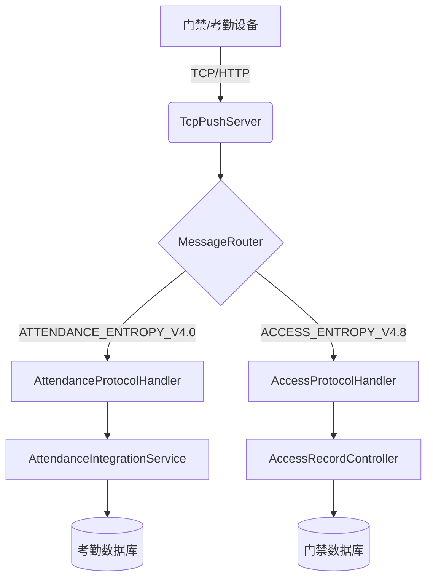
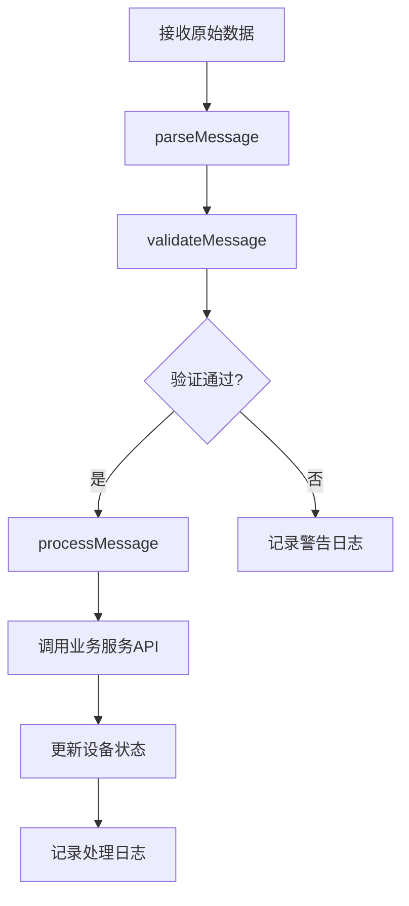
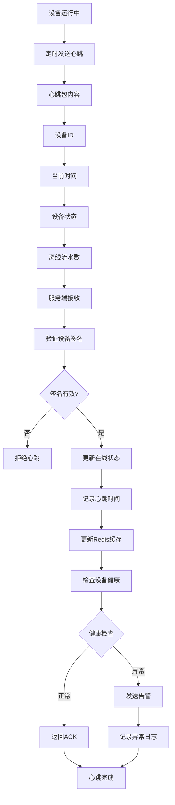

# 与门禁系统集成

<cite>
**本文档引用文件**  
- [AttendanceProtocolHandler.java](file://microservices/ioedream-device-comm-service/src/main/java/net/lab1024/sa/devicecomm/protocol/handler/impl/AttendanceProtocolHandler.java)
- [AttendanceIntegrationService.java](file://microservices/ioedream-attendance-service/src/main/java/net/lab1024/sa/attendance/service/AttendanceIntegrationService.java)
- [AccessProtocolHandler.java](file://microservices/ioedream-device-comm-service/src/main/java/net/lab1024/sa/devicecomm/protocol/handler/impl/AccessProtocolHandler.java)
- [TcpPushServer.java](file://microservices/ioedream-device-comm-service/src/main/java/net/lab1024/sa/devicecomm/protocol/server/TcpPushServer.java)
- [MessageRouter.java](file://microservices/ioedream-device-comm-service/src/main/java/net/lab1024/sa/devicecomm/protocol/router/MessageRouter.java)
- [ProtocolHandler.java](file://microservices/ioedream-device-comm-service/src/main/java/net/lab1024/sa/devicecomm/protocol/handler/ProtocolHandler.java)
- [ProtocolMessage.java](file://microservices/ioedream-device-comm-service/src/main/java/net/lab1024/sa/devicecomm/protocol/message/ProtocolMessage.java)
- [PROTOCOL_IMPLEMENTATION_GUIDE.md](file://microservices/ioedream-device-comm-service/docs/PROTOCOL_IMPLEMENTATION_GUIDE.md)
- [PROTOCOL_ARCHITECTURE.md](file://microservices/ioedream-device-comm-service/docs/PROTOCOL_ARCHITECTURE.md)
- [AccessRecordController.java](file://microservices/ioedream-access-service/src/main/java/net/lab1024/sa/access/controller/AccessRecordController.java)
- [AttendanceController.java](file://restful_refactor_backup_20251202_014224/microservices_ioedream-attendance-service_src_main_java_net_lab1024_sa_attendance_controller_AttendanceController.java)
</cite>

## 目录
1. [引言](#引言)
2. [系统架构概述](#系统架构概述)
3. [实时数据推送机制](#实时数据推送机制)
4. [协议解析流程](#协议解析流程)
5. [设备状态监控实现](#设备状态监控实现)
6. [数据同步API接口规范](#数据同步api接口规范)
7. [异常处理与错误重试策略](#异常处理与错误重试策略)
8. [代码示例分析](#代码示例分析)
9. [数据一致性保障机制](#数据一致性保障机制)
10. [结论](#结论)

## 引言

本集成文档详细阐述了考勤系统如何通过设备通讯服务接收门禁设备的打卡记录，涵盖实时数据推送、协议解析、异常处理、设备状态监控及数据同步等核心功能。文档结合代码示例，深入解析了`AttendanceProtocolHandler`和`AttendanceIntegrationService`在数据处理中的关键作用，并说明了数据一致性保障和错误重试机制，为系统集成提供全面的技术指导。

## 系统架构概述

门禁系统与考勤系统的集成依赖于`ioedream-device-comm-service`（设备通讯服务）作为中间件，负责接收来自门禁和考勤设备的原始数据，进行协议解析和路由，最终将处理后的数据分发至`ioedream-attendance-service`（考勤服务）和`ioedream-access-service`（门禁服务）。



**图示来源**
- [TcpPushServer.java](file://microservices/ioedream-device-comm-service/src/main/java/net/lab1024/sa/devicecomm/protocol/server/TcpPushServer.java)
- [MessageRouter.java](file://microservices/ioedream-device-comm-service/src/main/java/net/lab1024/sa/devicecomm/protocol/router/MessageRouter.java)
- [AttendanceProtocolHandler.java](file://microservices/ioedream-device-comm-service/src/main/java/net/lab1024/sa/devicecomm/protocol/handler/impl/AttendanceProtocolHandler.java)
- [AccessProtocolHandler.java](file://microservices/ioedream-device-comm-service/src/main/java/net/lab1024/sa/devicecomm/protocol/handler/impl/AccessProtocolHandler.java)

## 实时数据推送机制

设备通讯服务通过两种方式接收设备推送的数据：TCP长连接和HTTP短连接。

1.  **TCP服务器推送**：`TcpPushServer`使用NIO非阻塞IO模型，监听指定端口（默认8087），接收设备发送的二进制流。服务器通过协议头（如`0x55, 0xAA`）自动识别协议类型，并将数据交由`MessageRouter`进行路由。
2.  **HTTP接口推送**：设备也可通过HTTP POST请求，将文本格式的数据（如制表符分隔的字符串）推送到`/api/v1/device/protocol/push`或`/api/v1/device/protocol/push/auto`接口。服务端根据`protocolType`参数或`deviceType`与`manufacturer`参数自动选择对应的协议处理器。

无论哪种方式，接收到的数据都会被异步处理，确保高吞吐量和低延迟。

**本节来源**
- [TcpPushServer.java](file://microservices/ioedream-device-comm-service/src/main/java/net/lab1024/sa/devicecomm/protocol/server/TcpPushServer.java)
- [PROTOCOL_ARCHITECTURE.md](file://microservices/ioedream-device-comm-service/docs/PROTOCOL_ARCHITECTURE.md)

## 协议解析流程

协议解析是数据处理的核心环节，由实现了`ProtocolHandler`接口的处理器完成，遵循“解析-验证-处理”的标准流程。



**图示来源**
- [PROTOCOL_IMPLEMENTATION_GUIDE.md](file://microservices/ioedream-device-comm-service/docs/PROTOCOL_IMPLEMENTATION_GUIDE.md)

### 1. 消息解析 (parseMessage)

`AttendanceProtocolHandler`的`parseMessage`方法负责将原始数据转换为`ProtocolMessage`对象。对于考勤设备，数据通常为HTTP文本格式，以制表符`\t`分隔，包含工号(Pin)、时间(Time)、状态(Status)、验证方式(Verify)等字段。该方法会将这些字段解析并存入`ProtocolMessage`的`data`字段中。

### 2. 消息验证 (validateMessage)

此方法确保消息的完整性。它会检查`ProtocolMessage`的关键字段（如`messageType`、`deviceCode`、`data`）是否为空，并根据协议文档验证校验和。如果验证失败，消息将被标记为无效，并记录警告日志，但不会中断整个处理流程。

### 3. 消息处理 (processMessage)

这是业务逻辑的入口。`processMessage`方法根据`messageType`进行路由：
- `ATTENDANCE_RECORD`: 调用`processAttendanceRecord`处理考勤记录。
- `DEVICE_STATUS`: 调用`processDeviceStatus`更新设备状态。

**本节来源**
- [AttendanceProtocolHandler.java](file://microservices/ioedream-device-comm-service/src/main/java/net/lab1024/sa/devicecomm/protocol/handler/impl/AttendanceProtocolHandler.java)
- [ProtocolHandler.java](file://microservices/ioedream-device-comm-service/src/main/java/net/lab1024/sa/devicecomm/protocol/handler/ProtocolHandler.java)
- [ProtocolMessage.java](file://microservices/ioedream-device-comm-service/src/main/java/net/lab1024/sa/devicecomm/protocol/message/ProtocolMessage.java)

## 设备状态监控实现

设备状态监控通过心跳机制和在线状态检测来实现，确保设备的健康运行。

1.  **心跳机制**：设备会定期（如每30秒）向设备通讯服务发送心跳包。心跳包中包含设备ID、当前时间、设备状态、离线流水数等信息。
2.  **在线状态检测**：当`TcpPushServer`成功接收到来自设备的数据包时，即认为该设备在线。服务端会更新设备的最后心跳时间，并在Redis缓存中记录其在线状态。
3.  **故障告警**：如果在预设的超时时间内（如60秒）未收到设备的心跳包，系统会判定设备离线，并触发告警。告警信息会通过消息队列发布，通知监控系统。



**图示来源**
- [TcpPushServer.java](file://microservices/ioedream-device-comm-service/src/main/java/net/lab1024/sa/devicecomm/protocol/server/TcpPushServer.java)
- [PROTOCOL_IMPLEMENTATION_GUIDE.md](file://microservices/ioedream-device-comm-service/docs/PROTOCOL_IMPLEMENTATION_GUIDE.md)

## 数据同步API接口规范

设备通讯服务通过调用业务微服务的API来同步数据。所有API均遵循RESTful风格，使用HTTPS协议，数据格式为JSON。

### 1. 考勤记录创建API

- **请求方法**: `POST`
- **请求路径**: `/api/v1/attendance/record/create`
- **认证方式**: Sa-Token Bearer Token
- **请求体**:
  ```json
  {
    "userId": 1001,
    "deviceId": 1,
    "punchTime": 1706582400,
    "punchType": 0,
    "verifyType": 1
  }
  ```
- **响应体**:
  ```json
  {
    "code": 200,
    "message": "操作成功",
    "data": 12345
  }
  ```

### 2. 门禁记录创建API

- **请求方法**: `POST`
- **请求路径**: `/api/v1/access/record/create`
- **认证方式**: Sa-Token Bearer Token
- **请求体**:
  ```json
  {
    "userId": 1001,
    "deviceId": 1,
    "passTime": 1706582400,
    "passType": 0,
    "accessResult": 1
  }
  ```
- **响应体**:
  ```json
  {
    "code": 200,
    "message": "操作成功",
    "data": 67890
  }
  ```

### 3. 设备状态更新API

- **请求方法**: `PUT`
- **请求路径**: `/api/v1/device/status/update`
- **认证方式**: Sa-Token Bearer Token
- **请求体**:
  ```json
  {
    "deviceId": 1,
    "deviceStatus": "ONLINE",
    "lastOnlineTime": "2025-12-02T10:00:00"
  }
  ```
- **响应体**:
  ```json
  {
    "code": 200,
    "message": "操作成功",
    "data": null
  }
  ```

**本节来源**
- [PROTOCOL_IMPLEMENTATION_GUIDE.md](file://microservices/ioedream-device-comm-service/docs/PROTOCOL_IMPLEMENTATION_GUIDE.md)
- [AccessRecordController.java](file://microservices/ioedream-access-service/src/main/java/net/lab1024/sa/access/controller/AccessRecordController.java)
- [AttendanceController.java](file://restful_refactor_backup_20251202_014224/microservices_ioedream-attendance-service_src_main_java_net_lab1024_sa_attendance_controller_AttendanceController.java)

## 异常处理与错误重试策略

系统设计了多层次的异常处理和错误重试机制，以保证数据的可靠性和系统的稳定性。

1.  **异常捕获与日志记录**：在`parseMessage`、`validateMessage`和`processMessage`等关键方法中，都使用了`try-catch`块捕获异常。解析和验证阶段的异常会抛出`ProtocolParseException`，而处理阶段的异常会抛出`ProtocolProcessException`。所有异常都会被详细记录到日志中，便于问题排查。
2.  **非阻塞式处理**：`MessageRouter`使用`CompletableFuture.supplyAsync`将消息处理异步化，即使单条消息处理失败，也不会阻塞后续消息的处理。
3.  **错误重试策略**：当调用业务服务API失败时，系统不会立即丢弃消息，而是将其发送到RabbitMQ消息队列。消费者服务会从队列中读取消息并进行重试。重试策略包括指数退避（Exponential Backoff），避免对下游服务造成过大压力。

**本节来源**
- [AttendanceProtocolHandler.java](file://microservices/ioedream-device-comm-service/src/main/java/net/lab1024/sa/devicecomm/protocol/handler/impl/AttendanceProtocolHandler.java)
- [MessageRouter.java](file://microservices/ioedream-device-comm-service/src/main/java/net/lab1024/sa/devicecomm/protocol/router/MessageRouter.java)

## 代码示例分析

### AttendanceProtocolHandler 处理流程

`AttendanceProtocolHandler`是处理考勤设备协议的核心类。其`processAttendanceRecord`方法是处理考勤记录的入口。该方法首先从`ProtocolMessage`的`data`字段中提取出工号(Pin)、时间(Time)等信息，然后映射到一个用于调用考勤服务API的请求对象。最后，它将这个请求对象发送到名为`protocol.attendance.record`的RabbitMQ队列中，由专门的消费者服务异步处理，从而实现了业务解耦和流量削峰。

### AttendanceIntegrationService 数据处理

`AttendanceIntegrationService`作为考勤服务的集成层，负责从消息队列中消费数据。它监听`protocol.attendance.record`队列，接收到消息后，会调用`AttendanceService`的`saveAttendanceRecord`方法，将考勤记录持久化到数据库中。该服务还负责处理数据转换、业务规则校验和与其他服务的交互。

**本节来源**
- [AttendanceProtocolHandler.java](file://microservices/ioedream-device-comm-service/src/main/java/net/lab1024/sa/devicecomm/protocol/handler/impl/AttendanceProtocolHandler.java)
- [AttendanceIntegrationService.java](file://microservices/ioedream-attendance-service/src/main/java/net/lab1024/sa/attendance/service/AttendanceIntegrationService.java)

## 数据一致性保障机制

为确保数据在分布式环境下的最终一致性，系统采用了以下机制：

1.  **消息队列 (RabbitMQ)**：作为核心的解耦和缓冲组件，确保了即使下游服务暂时不可用，数据也不会丢失。消息的持久化保证了在服务重启后数据可以恢复。
2.  **幂等性设计**：考勤服务的`saveAttendanceRecord`接口设计为幂等的。这意味着即使同一条考勤记录被重复消费多次，也只会产生一条数据库记录，避免了数据重复。
3.  **事务性消息**：在关键业务场景中，可以采用事务性消息（如RabbitMQ的Publisher Confirms）来确保消息的可靠投递。

**本节来源**
- [AttendanceProtocolHandler.java](file://microservices/ioedream-device-comm-service/src/main/java/net/lab1024/sa/devicecomm/protocol/handler/impl/AttendanceProtocolHandler.java)
- [AttendanceIntegrationService.java](file://microservices/ioedream-attendance-service/src/main/java/net/lab1024/sa/attendance/service/AttendanceIntegrationService.java)

## 结论

本文档全面阐述了门禁系统与考勤系统的集成方案。通过`ioedream-device-comm-service`的协议解析和路由能力，实现了设备数据的实时、可靠接收。系统通过心跳机制和在线状态检测保障了设备的健康运行，并通过消息队列和错误重试策略确保了数据处理的最终一致性。提供的API接口规范清晰，为后续的系统扩展和维护奠定了坚实的基础。