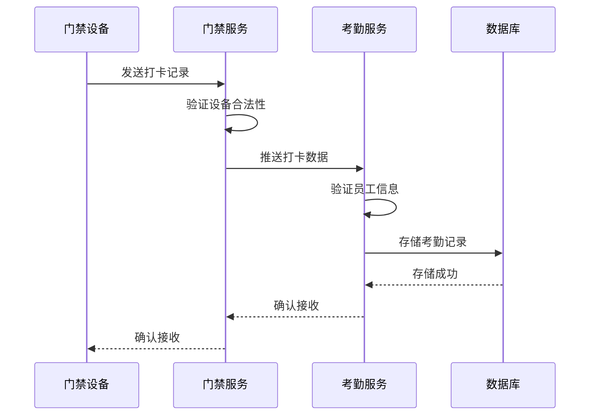

# 系统集成

<cite>
**本文档引用文件**  
- [smart-business-integration.md](file://docs/COMMON_MODULES/smart-business-integration.md)
- [third-party-system-integration\spec.md](file://openspec/changes/archive/completed-proposals/implement-third-party-system-integration/specs/third-party-system-integration/spec.md)
- [考勤模块API接口文档.md](file://documentation/06-模板工具/API文档/考勤模块API接口文档.md)
- [t_employee.sql](file://database-scripts/common-service/18-t_employee.sql)
- [考勤系统数据库ER图设计.md](file://documentation/03-业务模块/考勤/考勤系统数据库ER图设计.md)
- [MinerU_考勤PUSH通讯协议 （熵基科技） V4.0-20210113(水印版)__20251206181117.md](file://docs/各个设备通讯协议/MinerU_考勤PUSH通讯协议 （熵基科技） V4.0-20210113(水印版)__20251206181117.md)
- [smart-access.md](file://documentation/technical/smart-access.md)
</cite>

## 目录
1. [系统集成概述](#系统集成概述)
2. [与门禁系统集成](#与门禁系统集成)
3. [与人事系统集成](#与人事系统集成)
4. [与薪资系统集成](#与薪资系统集成)
5. [API接口规范](#api接口规范)
6. [数据安全传输](#数据安全传输)
7. [错误重试机制](#错误重试机制)

## 系统集成概述

本系统实现了考勤系统与门禁系统、人事系统、薪资系统的深度集成，旨在构建一个统一、高效、安全的企业管理平台。通过标准化的接口和协议，各系统之间实现了数据的实时同步和业务流程的无缝对接，确保了数据的一致性和完整性。

系统集成的核心目标是打破信息孤岛，实现跨系统的数据共享和业务协同。通过与门禁系统的集成，考勤数据能够实时获取员工的进出记录；通过与人事系统的集成，员工信息和组织架构能够自动同步；通过与薪资系统的集成，考勤结果能够准确地传递给薪资计算模块，为薪酬发放提供可靠依据。

**Section sources**
- [smart-business-integration.md](file://docs/COMMON_MODULES/smart-business-integration.md#L1-L800)

## 与门禁系统集成

考勤系统与门禁系统通过标准化的通讯协议实现深度集成，确保了员工考勤数据的准确性和实时性。门禁系统作为考勤数据的源头，负责采集员工的进出记录，并通过实时推送机制将数据传输给考勤系统。

### 数据同步机制

考勤系统与门禁系统的数据同步采用实时推送模式，确保了数据的及时性和准确性。门禁设备在检测到员工进出时，会立即通过TCP协议将打卡记录发送到考勤服务端。考勤系统接收到数据后，会进行数据验证和处理，并更新考勤记录。



**Diagram sources**
- [MinerU_考勤PUSH通讯协议 （熵基科技） V4.0-20210113(水印版)__20251206181117.md](file://docs/各个设备通讯协议/MinerU_考勤PUSH通讯协议 （熵基科技） V4.0-20210113(水印版)__20251206181117.md)
- [smart-access.md](file://documentation/technical/smart-access.md#L1-L26)

### 设备状态监控

考勤系统具备对门禁设备的实时监控能力，能够及时发现设备异常并进行告警。系统通过心跳检测机制，定期与门禁设备进行通信，确认设备的在线状态。当设备离线或出现故障时，系统会自动触发告警，并通知相关人员进行处理。

**Section sources**
- [smart-access.md](file://documentation/technical/smart-access.md#L1-L26)
- [考勤前端原型布局\考勤管理功能布局文档_完整版.md](file://documentation/03-业务模块/考勤/考勤前端原型布局/考勤管理功能布局文档_完整版.md#L1014-L1636)

## 与人事系统集成

考勤系统与人事系统通过API接口实现员工信息的自动同步，确保了员工数据的一致性和准确性。人事系统作为员工信息的权威来源，负责维护员工的基本信息、组织架构和岗位信息。

### 员工信息同步接口

考勤系统通过调用人事系统的API接口，定期同步员工信息。同步内容包括员工工号、姓名、部门、岗位、入职日期等关键信息。当人事系统中的员工信息发生变更时，会通过Webhook回调机制通知考勤系统，触发数据同步。

```mermaid
erDiagram
t_employee {
employee_id "员工ID"
employee_no "员工工号"
employee_name "员工姓名"
department_id "部门ID"
position "职位"
hire_date "入职日期"
status "员工状态"
}
attendance_results {
employee_id "员工ID"
attendance_date "考勤日期"
clock_in_time "上班打卡时间"
clock_out_time "下班打卡时间"
attendance_status "考勤状态"
}
t_employee ||--o{ attendance_results : "employee_id"
```

**Diagram sources**
- [t_employee.sql](file://database-scripts/common-service/18-t_employee.sql#L1-L26)
- [考勤系统数据库ER图设计.md](file://documentation/03-业务模块/考勤/考勤系统数据库ER图设计.md#L470-L1512)

### 组织架构同步

考勤系统支持与人事系统的组织架构同步，能够自动获取部门架构、汇报关系和编制管理信息。当组织架构发生变更时，如部门合并、拆分或人员调动，考勤系统会自动更新相关数据，确保考勤统计和报表的准确性。

**Section sources**
- [third-party-system-integration\spec.md](file://openspec/changes/archive/completed-proposals/implement-third-party-system-integration/specs/third-party-system-integration/spec.md#L337-L360)
- [EMPLOYEE_VS_USER_COMPARISON.md](file://documentation/archive/reports-2025-12-04/EMPLOYEE_VS_USER_COMPARISON.md#L60-L144)

## 与薪资系统集成

考勤系统与薪资系统通过标准化的数据格式和传输频率，实现考勤结果的准确对接。薪资系统根据考勤系统提供的数据，进行薪资计算和发放。

### 考勤结果对接方案

考勤系统每月初生成上月的考勤汇总数据，并通过API接口传输给薪资系统。传输数据包括加班时长、缺勤天数、迟到早退次数等关键指标。薪资系统根据这些数据，结合薪资规则，计算员工的最终薪酬。

| 数据项 | 数据格式 | 传输频率 | 说明 |
|--------|----------|----------|------|
| 加班时长 | decimal(5,2) | 每月1日 | 单位：小时 |
| 缺勤天数 | decimal(3,1) | 每月1日 | 单位：天 |
| 迟到分钟数 | int | 每月1日 | 单位：分钟 |
| 早退分钟数 | int | 每月1日 | 单位：分钟 |
| 出勤率 | decimal(3,2) | 每月1日 | 百分比 |

**Section sources**
- [考勤系统数据库ER图设计.md](file://documentation/03-业务模块/考勤/考勤系统数据库ER图设计.md#L470-L1512)
- [原始记录及考勤计算.md](file://documentation/03-业务模块/各业务模块文档/考勤/原始记录及考勤计算.md#L26-L48)

## API接口规范

系统集成遵循统一的API接口规范，确保了接口的标准化和可维护性。所有API接口均采用RESTful风格，使用JSON格式进行数据交换。

### 接口设计原则

- **统一响应格式**：所有接口返回统一的响应结构，包含code、message和data字段。
- **分页参数规范**：查询接口支持分页参数，包括pageNum和pageSize。
- **认证授权**：所有接口需要JWT Token认证，基于角色的权限控制。

```json
{
  "code": 200,
  "message": "操作成功",
  "data": {}
}
```

**Section sources**
- [GLOBAL_CONSISTENCY_GUIDE.md](file://openspec/changes/archive/completed-proposals/implement-access-control-missing-functions/GLOBAL_CONSISTENCY_GUIDE.md#L117-L173)
- [考勤模块API接口文档.md](file://documentation/06-模板工具/API文档/考勤模块API接口文档.md#L1-L800)

## 数据安全传输

系统集成过程中，数据安全是首要考虑的因素。所有数据传输均采用HTTPS协议，确保数据在传输过程中的机密性和完整性。

### 安全措施

- **数据加密**：敏感数据如身份证号、银行卡号等采用AES加密存储。
- **访问控制**：基于角色的访问控制，不同角色拥有不同的数据访问权限。
- **审计日志**：所有敏感数据的访问操作均记录审计日志，确保操作可追溯。

**Section sources**
- [third-party-system-integration\spec.md](file://openspec/changes/archive/completed-proposals/implement-third-party-system-integration/specs/third-party-system-integration/spec.md#L169-L176)
- [smart-business-integration.md](file://docs/COMMON_MODULES/smart-business-integration.md#L1-L800)

## 错误重试机制

为确保数据同步的可靠性，系统实现了完善的错误重试机制。当数据传输失败时，系统会自动进行重试，直到成功或达到最大重试次数。

### 重试策略

- **指数退避**：重试间隔时间呈指数增长，避免对系统造成过大压力。
- **最大重试次数**：设置最大重试次数，超过次数后记录错误日志并通知管理员。
- **失败队列**：将失败的传输任务放入队列，由后台任务定期处理。

**Section sources**
- [implement-third-party-system-integration\design.md](file://openspec/changes/archive/completed-proposals/implement-third-party-system-integration/design.md#L136-L145)
- [考勤模块API接口文档.md](file://documentation/06-模板工具/API文档/考勤模块API接口文档.md#L1-L800)