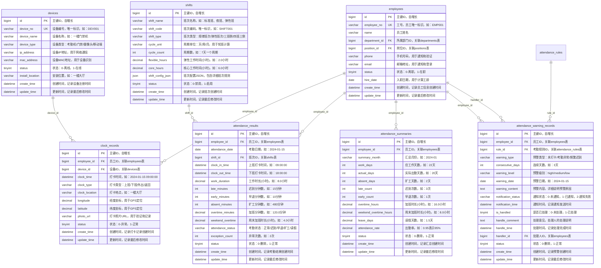
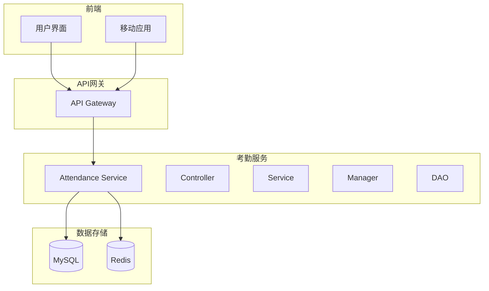
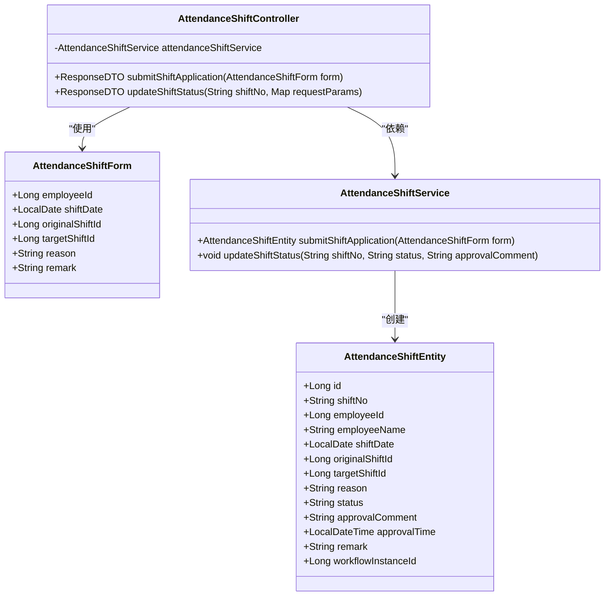
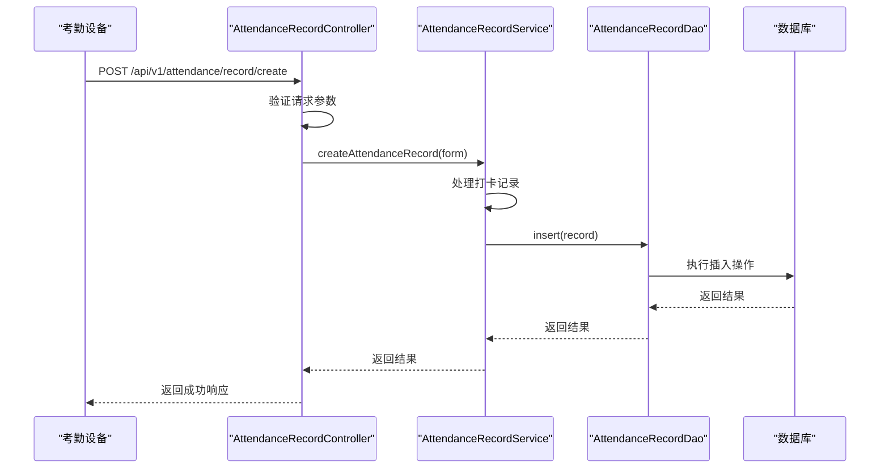
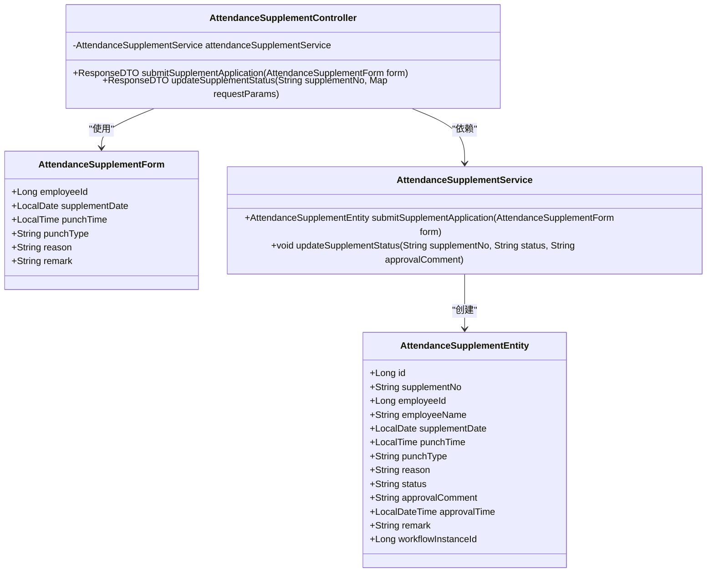
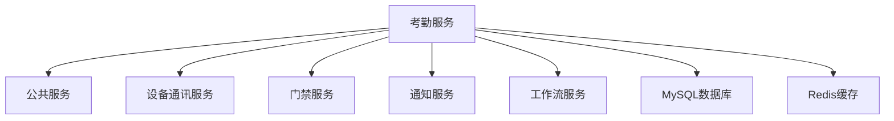

# 考勤系统

<cite>
**本文档引用文件**   
- [考勤系统数据库ER图设计.md](file://documentation\03-业务模块\各业务模块文档\考勤\考勤系统数据库ER图设计.md)
- [考勤规则配置.md](file://documentation\03-业务模块\考勤\考勤规则配置.md)
- [AttendanceRecordController.java](file://microservices\ioedream-attendance-service\src\main\java\net\lab1024\sa\attendance\controller\AttendanceRecordController.java)
- [AttendanceShiftController.java](file://microservices\ioedream-attendance-service\src\main\java\net\lab1024\sa\attendance\controller\AttendanceShiftController.java)
- [AttendanceSupplementController.java](file://microservices\ioedream-attendance-service\src\main\java\net\lab1024\sa\attendance\controller\AttendanceSupplementController.java)
- [AttendanceShiftServiceImpl.java](file://microservices\ioedream-attendance-service\src\main\java\net\lab1024\sa\attendance\service\impl\AttendanceShiftServiceImpl.java)
- [AttendanceShiftEntity.java](file://microservices\ioedream-attendance-service\src\main\java\net\lab1024\sa\attendance\domain\entity\AttendanceShiftEntity.java)
- [AttendanceSupplementEntity.java](file://microservices\ioedream-attendance-service\src\main\java\net\lab1024\sa\attendance\domain\entity\AttendanceSupplementEntity.java)
</cite>

## 目录
1. [简介](#简介)
2. [项目结构](#项目结构)
3. [核心组件](#核心组件)
4. [架构概述](#架构概述)
5. [详细组件分析](#详细组件分析)
6. [依赖分析](#依赖分析)
7. [性能考虑](#性能考虑)
8. [故障排除指南](#故障排除指南)
9. [结论](#结论)
10. [附录](#附录)（如有必要）

## 简介
本文档详细介绍了考勤系统的各项功能，包括排班管理、打卡记录、考勤计算和报表统计等核心功能。文档详细说明了班次、时段、考勤规则的配置方法和计算逻辑，解释了异常考勤（如迟到、早退、缺卡）的处理流程。同时，提供了考勤数据同步、补卡申请和审批流程的使用说明，并包含了考勤系统与门禁系统的集成方式和数据流转机制。

## 项目结构
考勤系统是IOE-DREAM七微服务架构中的一个独立微服务，负责处理所有与考勤相关的业务逻辑。系统采用四层架构模式，包括Controller层、Service层、Manager层和DAO层，严格遵循企业级微服务规范。

**图表来源**
- [考勤系统数据库ER图设计.md](file://documentation\03-业务模块\各业务模块文档\考勤\考勤系统数据库ER图设计.md)

**章节来源**
- [考勤系统数据库ER图设计.md](file://documentation\03-业务模块\各业务模块文档\考勤\考勤系统数据库ER图设计.md)

## 核心组件
考勤系统的核心组件包括排班管理、打卡记录、考勤计算和报表统计等模块。系统通过RESTful API提供服务，支持与门禁系统、移动端应用等外部系统的集成。

**章节来源**
- [考勤系统数据库ER图设计.md](file://documentation\03-业务模块\各业务模块文档\考勤\考勤系统数据库ER图设计.md)
- [考勤规则配置.md](file://documentation\03-业务模块\考勤\考勤规则配置.md)

## 架构概述
考勤系统采用微服务架构，与其他系统通过API网关进行通信。系统内部采用四层架构模式，确保业务逻辑的清晰分离和可维护性。

**图表来源**
- [考勤系统数据库ER图设计.md](file://documentation\03-业务模块\各业务模块文档\考勤\考勤系统数据库ER图设计.md)

## 详细组件分析
### 排班管理分析
排班管理模块负责处理员工的班次安排和调班申请。系统支持多种班次类型，包括规律班次、弹性班次、三班倒和四班三倒等。

#### 排班管理类图

**图表来源**
- [AttendanceShiftEntity.java](file://microservices\ioedream-attendance-service\src\main\java\net\lab1024\sa\attendance\domain\entity\AttendanceShiftEntity.java)
- [AttendanceShiftController.java](file://microservices\ioedream-attendance-service\src\main\java\net\lab1024\sa\attendance\controller\AttendanceShiftController.java)
- [AttendanceShiftServiceImpl.java](file://microservices\ioedream-attendance-service\src\main\java\net\lab1024\sa\attendance\service\impl\AttendanceShiftServiceImpl.java)

**章节来源**
- [AttendanceShiftEntity.java](file://microservices\ioedream-attendance-service\src\main\java\net\lab1024\sa\attendance\domain\entity\AttendanceShiftEntity.java)
- [AttendanceShiftController.java](file://microservices\ioedream-attendance-service\src\main\java\net\lab1024\sa\attendance\controller\AttendanceShiftController.java)
- [AttendanceShiftServiceImpl.java](file://microservices\ioedream-attendance-service\src\main\java\net\lab1024\sa\attendance\service\impl\AttendanceShiftServiceImpl.java)

### 打卡记录分析
打卡记录模块负责处理员工的打卡数据，支持多种打卡方式，包括考勤机、门禁系统和移动端应用。

#### 打卡记录序列图

**图表来源**
- [AttendanceRecordController.java](file://microservices\ioedream-attendance-service\src\main\java\net\lab1024\sa\attendance\controller\AttendanceRecordController.java)

**章节来源**
- [AttendanceRecordController.java](file://microservices\ioedream-attendance-service\src\main\java\net\lab1024\sa\attendance\controller\AttendanceRecordController.java)

### 补卡申请分析
补卡申请模块处理员工的补卡请求，支持完整的审批流程。

#### 补卡申请类图

**图表来源**
- [AttendanceSupplementEntity.java](file://microservices\ioedream-attendance-service\src\main\java\net\lab1024\sa\attendance\domain\entity\AttendanceSupplementEntity.java)
- [AttendanceSupplementController.java](file://microservices\ioedream-attendance-service\src\main\java\net\lab1024\sa\attendance\controller\AttendanceSupplementController.java)

**章节来源**
- [AttendanceSupplementEntity.java](file://microservices\ioedream-attendance-service\src\main\java\net\lab1024\sa\attendance\domain\entity\AttendanceSupplementEntity.java)
- [AttendanceSupplementController.java](file://microservices\ioedream-attendance-service\src\main\java\net\lab1024\sa\attendance\controller\AttendanceSupplementController.java)

## 依赖分析
考勤系统依赖于多个外部系统和内部组件，包括员工信息管理、门禁系统、通知系统等。

**图表来源**
- [考勤系统数据库ER图设计.md](file://documentation\03-业务模块\各业务模块文档\考勤\考勤系统数据库ER图设计.md)

**章节来源**
- [考勤系统数据库ER图设计.md](file://documentation\03-业务模块\各业务模块文档\考勤\考勤系统数据库ER图设计.md)

## 性能考虑
考勤系统在设计时考虑了高性能和高可用性，采用了多种优化策略，包括缓存机制、异步处理和数据库优化等。

## 故障排除指南
当考勤系统出现问题时，可以按照以下步骤进行排查：
1. 检查API网关是否正常运行
2. 检查考勤服务的健康状态
3. 检查数据库连接是否正常
4. 查看系统日志，定位具体问题

**章节来源**
- [AttendanceRecordController.java](file://microservices\ioedream-attendance-service\src\main\java\net\lab1024\sa\attendance\controller\AttendanceRecordController.java)
- [AttendanceShiftController.java](file://microservices\ioedream-attendance-service\src\main\java\net\lab1024\sa\attendance\controller\AttendanceShiftController.java)

## 结论
考勤系统是一个功能完整、架构清晰的微服务，能够满足企业对考勤管理的各种需求。系统通过灵活的规则配置和强大的集成能力，为企业提供了高效的考勤解决方案。