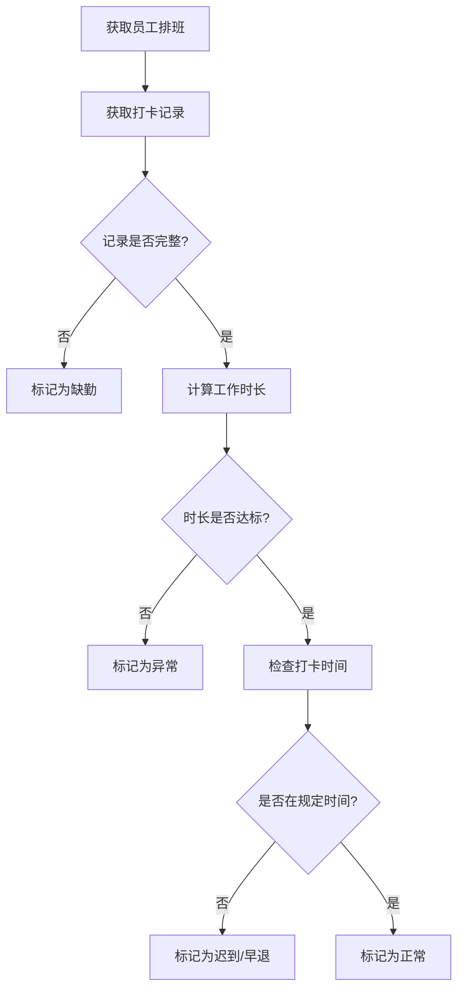
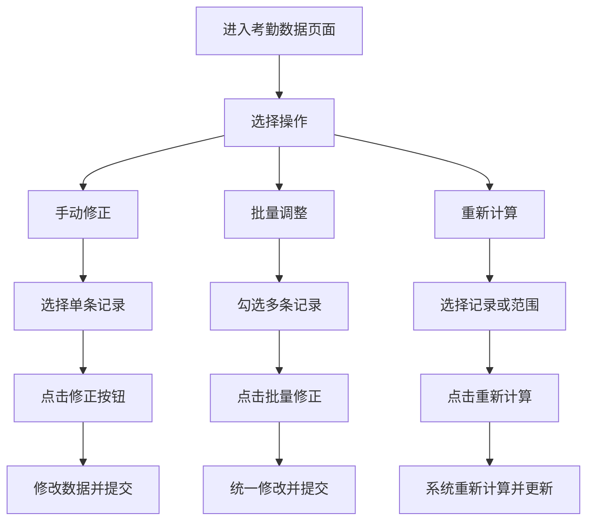
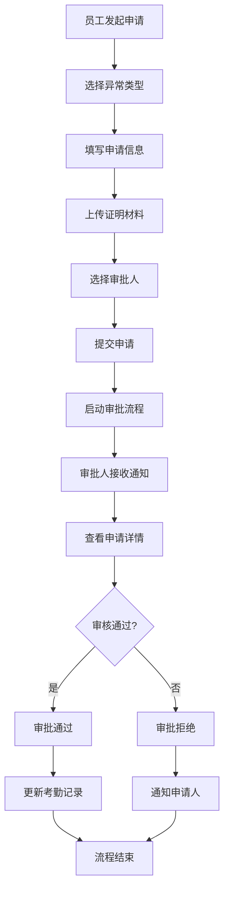
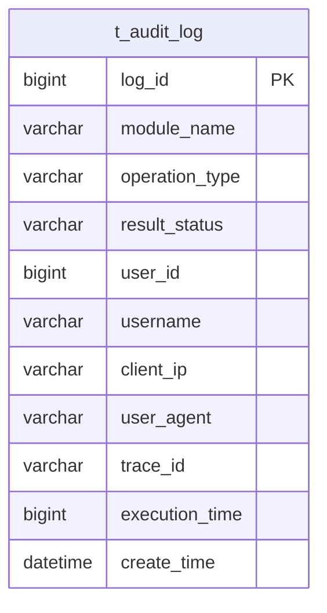

# 考勤数据校正

<cite>
**本文档引用文件**  
- [考勤业务菜单功能流程图.md](file://documentation\03-业务模块\各业务模块文档\考勤\考勤业务菜单功能流程图.md)
- [异常管理.md](file://documentation\03-业务模块\考勤\异常管理.md)
- [考勤前端原型布局\考勤数据功能布局文档_完整版.md](file://documentation\03-业务模块\考勤\考勤前端原型布局\考勤数据功能布局文档_完整版.md)
- [AttendanceRecordServiceImpl.java](file://microservices\ioedream-attendance-service\src\main\java\net\lab1024\sa\attendance\service\impl\AttendanceRecordServiceImpl.java)
- [AttendanceRecordEntity.java](file://microservices\ioedream-attendance-service\src\main\java\net\lab1024\sa\attendance\domain\entity\AttendanceRecordEntity.java)
- [t_audit_log.sql](file://database-scripts\common-service\10-t_audit_log.sql)
- [AttendanceExceptionApplicationController.java](file://restful_refactor_backup_20251202_014224\microservices_ioedream-attendance-service_src_main_java_net_lab1024_sa_attendance_controller_AttendanceExceptionApplicationController.java)
</cite>

## 目录
1. [引言](#引言)
2. [考勤异常识别机制](#考勤异常识别机制)
3. [数据校正流程](#数据校正流程)
4. [异常考勤申请与审批流程](#异常考勤申请与审批流程)
5. [校正操作的审计日志记录](#校正操作的审计日志记录)
6. [数据校正最佳实践与注意事项](#数据校正最佳实践与注意事项)
7. [结论](#结论)

## 引言
考勤数据校正是确保考勤系统数据准确性和合规性的关键环节。本系统通过自动化异常识别、灵活的数据校正方式、规范的申请审批流程以及完整的审计日志记录，构建了一套完整的考勤数据治理体系。本文档详细说明了考勤异常的识别机制、数据校正的各项功能、异常申请的审批流程以及相关的最佳实践，旨在为用户提供全面的操作指导和管理规范。

## 考勤异常识别机制
系统通过预设的考勤规则和实时数据比对，自动识别并标记考勤异常。异常类型主要包括迟到、早退、缺勤、加班、请假等。

### 异常识别规则
系统根据员工的排班信息、打卡时间、工作时长等核心数据，结合企业设定的考勤规则进行比对分析。例如：
- **迟到/早退**：根据班次的上下班时间，判断打卡时间是否超出允许的弹性范围。
- **缺勤**：在应出勤日期内，未找到任何有效打卡记录。
- **加班**：在非工作时间段内有打卡记录，且符合加班申请或规则。
- **状态计算**：系统自动计算每条考勤记录的状态，如“正常”、“迟到”、“早退”、“缺勤”、“请假”等，并在前端界面以不同颜色标签展示。

**Diagram sources**
- [考勤业务菜单功能流程图.md](file://documentation\03-业务模块\各业务模块文档\考勤\考勤业务菜单功能流程图.md)
- [考勤前端原型布局\考勤数据功能布局文档_完整版.md](file://documentation\03-业务模块\考勤\考勤前端原型布局\考勤数据功能布局文档_完整版.md)

**Section sources**
- [考勤业务菜单功能流程图.md](file://documentation\03-业务模块\各业务模块文档\考勤\考勤业务菜单功能流程图.md)
- [考勤前端原型布局\考勤数据功能布局文档_完整版.md](file://documentation\03-业务模块\考勤\考勤前端原型布局\考勤数据功能布局文档_完整版.md)

## 数据校正流程
当考勤数据出现异常或需要调整时，系统提供了手动修正、批量调整和重新计算三种校正方式，以满足不同场景的需求。

### 手动修正
管理员或相关负责人可以在考勤结果列表中，选择单条异常记录进行手动修正。
1.  在考勤数据查询页面，通过筛选条件定位到需要修正的记录。
2.  点击操作列的“修正”按钮，进入修正弹窗。
3.  在弹窗中修改打卡时间、工作时长、状态等关键信息，并填写修正原因。
4.  提交修正，系统将更新该条考勤记录。

### 批量调整
对于需要统一处理的多条记录，系统支持批量修正功能。
1.  在考勤数据查询页面，通过复选框选择多条需要修正的记录。
2.  点击工具栏的“批量修正”按钮。
3.  在弹出的批量修正界面中，对选中的记录进行统一的字段修改（如统一调整状态、修改班次等）。
4.  提交批量操作，系统将批量更新这些记录。

### 重新计算
当考勤规则发生变更，或需要对历史数据进行重新评估时，可以使用重新计算功能。
1.  选择需要重新计算的单条或多条记录（或整个时间段）。
2.  点击“重新计算”按钮。
3.  系统将根据最新的考勤规则和原始打卡数据，重新执行考勤逻辑计算，生成新的考勤结果。
4.  重新计算的结果将覆盖原有数据，确保数据的时效性和准确性。

**Diagram sources**
- [考勤前端原型布局\考勤数据功能布局文档_完整版.md](file://documentation\03-业务模块\考勤\考勤前端原型布局\考勤数据功能布局文档_完整版.md)

**Section sources**
- [考勤前端原型布局\考勤数据功能布局文档_完整版.md](file://documentation\03-业务模块\考勤\考勤前端原型布局\考勤数据功能布局文档_完整版.md)

## 异常考勤申请与审批流程
对于因个人原因导致的考勤异常（如忘记打卡、外出办公等），员工可通过提交异常申请的方式进行补救，该流程需经过审批才能生效。

### 申请流程
1.  **发起申请**：员工进入“异常管理”页面，点击“新增异常申请”。
2.  **选择类型**：选择申请类型，如“补签申请”、“请假申请”、“加班申请”等。
3.  **填写信息**：根据申请类型，填写详细信息。例如，补签申请需选择补签人员、补签类型（上班/下班）、补签时间，并说明原因。
4.  **上传凭证**：可上传相关证明文件（如病假条、外出事由说明等）。
5.  **选择审批人**：系统根据预设规则自动推荐审批人，申请人也可手动选择。
6.  **提交申请**：信息填写完整后，提交申请，进入审批流程。

### 审批流程
1.  **接收通知**：审批人收到系统通知，进入“待审批”列表。
2.  **审核信息**：查看申请详情、申请理由和上传的凭证。
3.  **做出决定**：审批人可选择“通过”、“拒绝”或“部分通过”。
4.  **填写意见**：无论通过与否，审批人都需填写审批意见。
5.  **完成审批**：提交审批结果，系统自动更新申请状态，并通知申请人。

**Diagram sources**
- [考勤业务菜单功能流程图.md](file://documentation\03-业务模块\各业务模块文档\考勤\考勤业务菜单功能流程图.md)
- [异常管理.md](file://documentation\03-业务模块\考勤\异常管理.md)

**Section sources**
- [考勤业务菜单功能流程图.md](file://documentation\03-业务模块\各业务模块文档\考勤\考勤业务菜单功能流程图.md)
- [异常管理.md](file://documentation\03-业务模块\考勤\异常管理.md)

## 校正操作的审计日志记录
为确保所有数据校正操作的可追溯性和安全性，系统对每一次关键操作都进行了详细的审计日志记录。

### 审计日志内容
系统审计日志表（`t_audit_log`）记录了以下关键信息：
- **操作类型**：如“数据修改”、“配置变更”等。
- **操作结果**：成功或失败。
- **操作人**：执行操作的用户ID和用户名。
- **操作时间**：精确到毫秒的创建时间。
- **客户端IP**：操作发起的客户端IP地址。
- **用户代理**：操作发起的浏览器或设备信息。
- **追踪ID**：用于关联同一操作链的唯一ID。
- **执行时间**：该操作在服务器端的执行耗时（毫秒）。

### 审计覆盖范围
根据系统安全规范，以下操作均被纳入审计范围：
- **数据修改**：包括手动修正、批量调整等所有对考勤数据的修改操作。
- **配置变更**：对考勤规则、审批流程等核心配置的修改。
- **权限变更**：用户权限的授予与回收。
- **敏感数据访问**：对包含敏感信息的数据表的访问。

**Diagram sources**
- [t_audit_log.sql](file://database-scripts\common-service\10-t_audit_log.sql)

**Section sources**
- [t_audit_log.sql](file://database-scripts\common-service\10-t_audit_log.sql)
- [PRODUCTION_SECURITY_CHECKLIST.md](file://PRODUCTION_SECURITY_CHECKLIST.md)

## 数据校正最佳实践与注意事项
为确保考勤数据校正的准确、高效和合规，遵循以下最佳实践和注意事项至关重要。

### 最佳实践
1.  **及时处理**：发现考勤异常后，应尽快处理，避免问题累积。
2.  **凭证齐全**：对于补签、请假等申请，务必要求员工提供充分的证明材料，确保申请的真实性。
3.  **批量操作前预览**：在执行批量调整前，应仔细核对选中的记录，避免误操作。
4.  **利用重新计算**：当考勤规则调整后，应使用“重新计算”功能，确保所有历史数据都符合新规则。
5.  **定期审计**：定期检查审计日志，监控异常操作，确保系统安全。

### 注意事项
1.  **权限控制**：严格控制数据校正权限，仅授权给必要的管理人员，防止数据被随意篡改。
2.  **审批流程**：所有影响考勤结果的修正操作，都应通过正式的申请和审批流程，避免直接后台修改。
3.  **数据一致性**：在进行数据校正时，需注意关联数据的一致性。例如，修改了打卡时间，可能需要同步调整工作时长和加班时长。
4.  **避免重复操作**：在重新计算后，无需再进行手动修正，以免覆盖系统计算结果。
5.  **合规性**：所有校正操作必须符合公司的人力资源政策和劳动法规，确保合规性。

**Section sources**
- [考勤前端原型布局\考勤数据功能布局文档_完整版.md](file://documentation\03-业务模块\考勤\考勤前端原型布局\考勤数据功能布局文档_完整版.md)
- [异常管理.md](file://documentation\03-业务模块\考勤\异常管理.md)

## 结论
本考勤数据校正系统通过自动化异常识别、多样化的校正方式、规范的申请审批流程和完整的审计日志，构建了一个闭环的考勤数据治理体系。该体系不仅能够有效处理日常考勤中的各种异常情况，确保数据的准确性，还能通过严格的权限和审计机制，保障数据的合规性和安全性。遵循本文档提供的最佳实践，将有助于企业高效、规范地管理考勤数据，为人力资源管理提供可靠的数据支持。