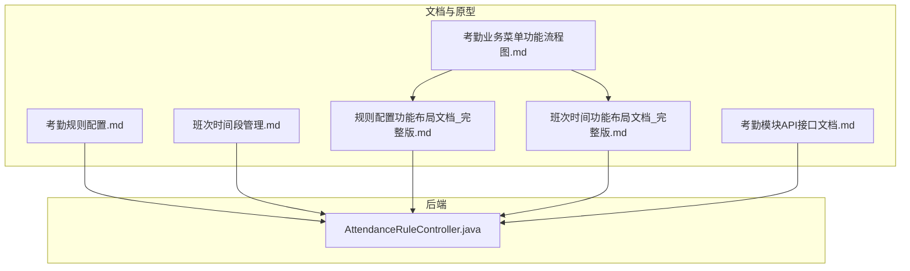
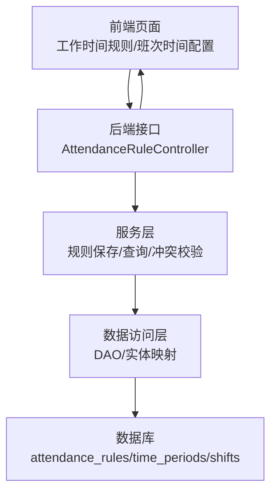
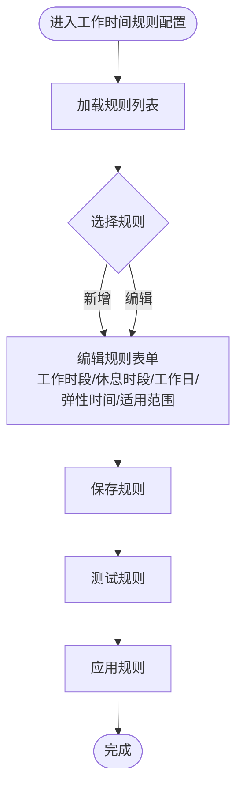
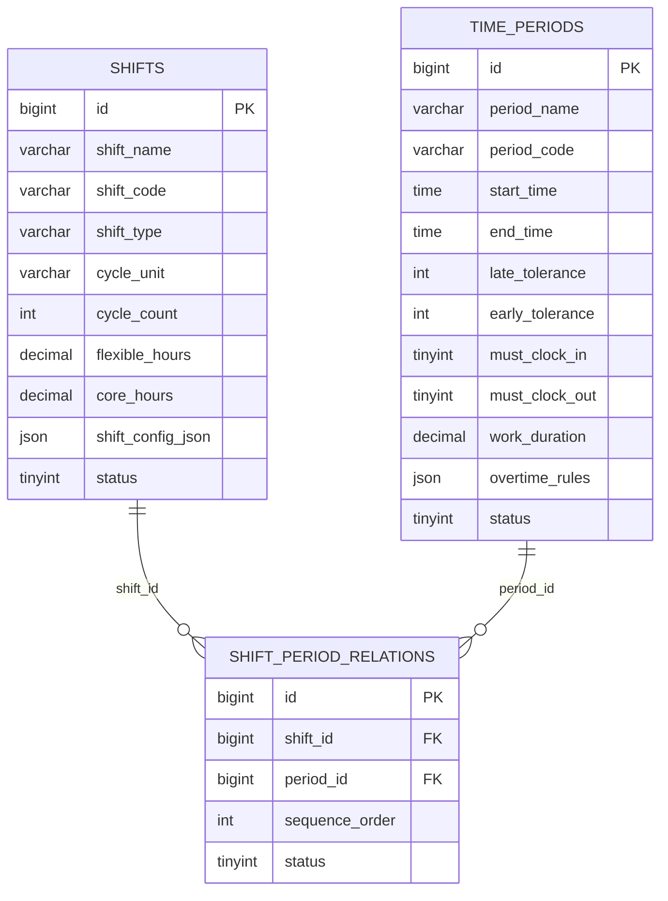

# 考勤规则配置

<cite>
**本文引用的文件**
- [考勤规则配置.md](file://documentation/03-业务模块/各业务模块文档/考勤/考勤规则配置.md)
- [班次时间段管理.md](file://documentation/03-业务模块/考勤/班次时间段管理.md)
- [考勤业务菜单功能流程图.md](file://documentation/03-业务模块/考勤/考勤业务菜单功能流程图.md)
- [考勤前端原型布局/规则配置功能布局文档_完整版.md](file://documentation/03-业务模块/考勤/考勤前端原型布局/规则配置功能布局文档_完整版.md)
- [考勤前端原型布局/班次时间功能布局文档_完整版.md](file://documentation/03-业务模块/考勤/考勤前端原型布局/班次时间功能布局文档_完整版.md)
- [考勤模块API接口文档.md](file://documentation/06-模板工具/API文档/考勤模块API接口文档.md)
- [考勤规则配置.md](file://documentation/03-业务模块/各业务模块文档/考勤/考勤规则配置.md)
- [考勤系统数据库ER图设计.md](file://documentation/03-业务模块/各业务模块文档/考勤/考勤系统数据库ER图设计.md)
- [AttendanceRuleController.java](file://restful_refactor_backup_20251202_014224/microservices_ioedream-attendance-service_src_main_java_net_lab1024_sa_attendance_controller_AttendanceRuleController.java)
</cite>

## 目录
1. [简介](#简介)
2. [项目结构](#项目结构)
3. [核心组件](#核心组件)
4. [架构总览](#架构总览)
5. [详细组件分析](#详细组件分析)
6. [依赖分析](#依赖分析)
7. [性能考量](#性能考量)
8. [故障排查指南](#故障排查指南)
9. [结论](#结论)
10. [附录](#附录)

## 简介
本文件面向考勤规则配置的使用者与开发者，系统性说明工作日设置、节假日设置、弹性时间规则、加班规则等配置方法；解释配置文件结构与参数含义；给出差异化规则配置示例与最佳实践；并说明规则的适用范围、优先级、生效机制与热更新能力。

## 项目结构
围绕考勤规则配置，仓库中与之直接相关的文档与实现分布在以下位置：
- 文档侧：考勤规则配置、班次时间段管理、考勤业务菜单流程图、前端原型布局、考勤模块API接口文档
- 后端侧：考勤规则控制器（AttendanceRuleController），提供规则CRUD、状态变更、适用规则查询、冲突校验等接口
- 前端侧：工作时间规则与班次时间配置的Vue页面与API封装

图表来源
- [考勤规则配置.md](file://documentation/03-业务模块/各业务模块文档/考勤/考勤规则配置.md#L1-L547)
- [班次时间段管理.md](file://documentation/03-业务模块/考勤/班次时间段管理.md#L1-L381)
- [考勤业务菜单功能流程图.md](file://documentation/03-业务模块/考勤/考勤业务菜单功能流程图.md#L358-L393)
- [考勤前端原型布局/规则配置功能布局文档_完整版.md](file://documentation/03-业务模块/考勤/考勤前端原型布局/规则配置功能布局文档_完整版.md#L142-L773)
- [考勤前端原型布局/班次时间功能布局文档_完整版.md](file://documentation/03-业务模块/考勤/考勤前端原型布局/班次时间功能布局文档_完整版.md#L196-L542)
- [考勤模块API接口文档.md](file://documentation/06-模板工具/API文档/考勤模块API接口文档.md#L817-L954)
- [AttendanceRuleController.java](file://restful_refactor_backup_20251202_014224/microservices_ioedream-attendance-service_src_main_java_net_lab1024_sa_attendance_controller_AttendanceRuleController.java#L1-L375)

章节来源
- [考勤规则配置.md](file://documentation/03-业务模块/各业务模块文档/考勤/考勤规则配置.md#L1-L547)
- [班次时间段管理.md](file://documentation/03-业务模块/考勤/班次时间段管理.md#L1-L381)
- [考勤业务菜单功能流程图.md](file://documentation/03-业务模块/考勤/考勤业务菜单功能流程图.md#L358-L393)
- [考勤前端原型布局/规则配置功能布局文档_完整版.md](file://documentation/03-业务模块/考勤/考勤前端原型布局/规则配置功能布局文档_完整版.md#L142-L773)
- [考勤前端原型布局/班次时间功能布局文档_完整版.md](file://documentation/03-业务模块/考勤/考勤前端原型布局/班次时间功能布局文档_完整版.md#L196-L542)
- [考勤模块API接口文档.md](file://documentation/06-模板工具/API文档/考勤模块API接口文档.md#L817-L954)
- [AttendanceRuleController.java](file://restful_refactor_backup_20251202_014224/microservices_ioedream-attendance-service_src_main_java_net_lab1024_sa_attendance_controller_AttendanceRuleController.java#L1-L375)

## 核心组件
- 考勤规则表（attendance_rules）：承载规则元数据、JSON配置、适用范围、启用状态等
- 时间段表（time_periods）：定义工作/休息/加班等时间段的起止、容忍度、打卡要求、加班规则
- 班次表（shifts）：定义班次类型、轮班周期、弹性/核心工作时间、JSON配置
- 班次-时间段关联表（shift_period_relations）：多对多关系与顺序控制
- 前端规则配置页面：工作时间规则、班次时间配置、加班规则、通知规则、预警规则等
- 后端规则控制器：提供规则CRUD、状态变更、适用规则查询、冲突校验等接口

章节来源
- [考勤规则配置.md](file://documentation/03-业务模块/各业务模块文档/考勤/考勤规则配置.md#L1-L26)
- [班次时间段管理.md](file://documentation/03-业务模块/考勤/班次时间段管理.md#L8-L57)
- [考勤前端原型布局/规则配置功能布局文档_完整版.md](file://documentation/03-业务模块/考勤/考勤前端原型布局/规则配置功能布局文档_完整版.md#L142-L773)
- [考勤前端原型布局/班次时间功能布局文档_完整版.md](file://documentation/03-业务模块/考勤/考勤前端原型布局/班次时间功能布局文档_完整版.md#L196-L542)
- [AttendanceRuleController.java](file://restful_refactor_backup_20251202_014224/microservices_ioedream-attendance-service_src_main_java_net_lab1024_sa_attendance_controller_AttendanceRuleController.java#L1-L375)

## 架构总览
考勤规则配置贯穿“文档/原型—后端接口—数据库”的闭环。前端通过API与后端交互，后端通过服务层与DAO层协作，持久化到MySQL；规则JSON字段承载复杂配置，适用范围JSON用于差异化控制。

图表来源
- [AttendanceRuleController.java](file://restful_refactor_backup_20251202_014224/microservices_ioedream-attendance-service_src_main_java_net_lab1024_sa_attendance_controller_AttendanceRuleController.java#L1-L375)
- [考勤规则配置.md](file://documentation/03-业务模块/各业务模块文档/考勤/考勤规则配置.md#L1-L26)
- [班次时间段管理.md](file://documentation/03-业务模块/考勤/班次时间段管理.md#L8-L57)

## 详细组件分析

### 工作日设置与弹性时间规则
- 工作日设置：通过“工作时间规则”页面配置工作时段、休息时段、工作日集合、弹性时间（迟到/早退容忍分钟数）、适用范围（全部/部门/岗位/个人）与状态
- 弹性时间：支持“弹性开始/结束时间”“核心开始/结束时间”，以及休息时段的自动扣除与时长设置
- 适用范围：通过适用范围JSON限定规则生效对象，支持按部门、岗位、个人差异化配置

图表来源
- [考勤前端原型布局/规则配置功能布局文档_完整版.md](file://documentation/03-业务模块/考勤/考勤前端原型布局/规则配置功能布局文档_完整版.md#L142-L773)

章节来源
- [考勤前端原型布局/规则配置功能布局文档_完整版.md](file://documentation/03-业务模块/考勤/考勤前端原型布局/规则配置功能布局文档_完整版.md#L142-L773)
- [考勤规则配置.md](file://documentation/03-业务模块/各业务模块文档/考勤/考勤规则配置.md#L223-L326)

### 节假日设置与特殊规则
- 节假日处理：可在规则JSON中配置节假日处理方式（如双倍工资、调休等）
- 夜班规则：可配置夜班起止时间与补贴比例
- 特殊规则：周末处理方式、夜班补贴、节假日倍数等

章节来源
- [考勤规则配置.md](file://documentation/03-业务模块/各业务模块文档/考勤/考勤规则配置.md#L223-L326)

### 班次时间定义与轮班/弹性班次
- 时间段定义：开始/结束时间、容忍度、打卡要求、加班规则
- 班次类型：规律班次、弹性班次、三班倒、四班三倒
- 轮班周期：按天/周/月轮换；轮换序列与顺序
- 弹性与核心工作时间：分离弹性工作时长与核心工作时长
- 跨日支持：支持跨日工作时间配置

图表来源
- [班次时间段管理.md](file://documentation/03-业务模块/考勤/班次时间段管理.md#L128-L173)

章节来源
- [班次时间段管理.md](file://documentation/03-业务模块/考勤/班次时间段管理.md#L1-L381)
- [考勤业务菜单功能流程图.md](file://documentation/03-业务模块/考勤/考勤业务菜单功能流程图.md#L358-L393)

### 加班规则配置
- 加班计算方式：每日/每周/每月标准工时
- 加班阈值：以分钟为单位的最小加班时长
- 倍数规则：周末/节假日/夜班加班倍数
- 夜班时段：夜班起止时间与夜班加班倍数

章节来源
- [班次时间段管理.md](file://documentation/03-业务模块/考勤/班次时间段管理.md#L225-L240)
- [考勤系统数据库ER图设计.md](file://documentation/03-业务模块/各业务模块文档/考勤/考勤系统数据库ER图设计.md#L1268-L1284)

### 考勤周期与考勤周期设置
- 考勤周期：可通过班次配置JSON中的轮班周期参数设置（天/周/月）
- 轮换顺序：通过轮换序列与顺序号控制班次轮换
- 跨日周期：支持跨日工作时间与周期计算

章节来源
- [班次时间段管理.md](file://documentation/03-业务模块/考勤/班次时间段管理.md#L242-L263)
- [考勤业务菜单功能流程图.md](file://documentation/03-业务模块/考勤/考勤业务菜单功能流程图.md#L358-L393)

### 考勤规则的适用范围与优先级
- 适用范围JSON：支持按部门、岗位、个人设置差异化规则
- 优先级：通过“获取员工适用的考勤规则（考虑优先级）”接口，结合员工ID/部门ID/员工类型返回最适用规则
- 冲突检测：提供规则冲突验证接口，避免规则间相互矛盾

章节来源
- [考勤规则配置.md](file://documentation/03-业务模块/各业务模块文档/考勤/考勤规则配置.md#L1-L26)
- [AttendanceRuleController.java](file://restful_refactor_backup_20251202_014224/microservices_ioedream-attendance-service_src_main_java_net_lab1024_sa_attendance_controller_AttendanceRuleController.java#L314-L346)
- [AttendanceRuleController.java](file://restful_refactor_backup_20251202_014224/microservices_ioedream-attendance-service_src_main_java_net_lab1024_sa_attendance_controller_AttendanceRuleController.java#L348-L375)

### 考勤规则的生效机制与热更新
- 规则状态：通过“启用/禁用”接口即时生效
- 适用规则查询：按员工/部门/类型查询最适用规则，保证规则优先级与适用范围得到体现
- 热更新：后端通过服务层与DAO层协作，规则变更后由调用方重新拉取最新规则；若需全局热更新，建议结合配置中心（如Nacos）与缓存策略（Redis/Caffeine）实现

章节来源
- [AttendanceRuleController.java](file://restful_refactor_backup_20251202_014224/microservices_ioedream-attendance-service_src_main_java_net_lab1024_sa_attendance_controller_AttendanceRuleController.java#L283-L312)
- [AttendanceRuleController.java](file://restful_refactor_backup_20251202_014224/microservices_ioedream-attendance-service_src_main_java_net_lab1024_sa_attendance_controller_AttendanceRuleController.java#L314-L346)
- [考勤规则配置.md](file://documentation/03-业务模块/各业务模块文档/考勤/考勤规则配置.md#L523-L547)

### 前端配置页面与API对接
- 工作时间规则页面：支持新增/编辑/复制/测试/启用/禁用/删除
- 班次时间配置页面：支持时间段类型（工作/休息/加班/弹性）、跨日设置、计薪规则、弹性设置、描述
- API封装：提供工作时间规则、异常判定规则、预警规则、通知规则等API

章节来源
- [考勤前端原型布局/规则配置功能布局文档_完整版.md](file://documentation/03-业务模块/考勤/考勤前端原型布局/规则配置功能布局文档_完整版.md#L68-L135)
- [考勤前端原型布局/规则配置功能布局文档_完整版.md](file://documentation/03-业务模块/考勤/考勤前端原型布局/规则配置功能布局文档_完整版.md#L142-L773)
- [考勤前端原型布局/班次时间功能布局文档_完整版.md](file://documentation/03-业务模块/考勤/考勤前端原型布局/班次时间功能布局文档_完整版.md#L196-L542)

## 依赖分析
- 规则表依赖：通过适用范围JSON与基础信息（部门/岗位/员工）耦合
- 班次与时间段：通过关联表建立多对多关系，并以顺序号控制时间线
- 前端依赖：页面通过API封装调用后端接口
- 后端依赖：Controller依赖Service层，Service层依赖DAO层与实体映射

图表来源
- [AttendanceRuleController.java](file://restful_refactor_backup_20251202_014224/microservices_ioedream-attendance-service_src_main_java_net_lab1024_sa_attendance_controller_AttendanceRuleController.java#L1-L375)
- [考勤规则配置.md](file://documentation/03-业务模块/各业务模块文档/考勤/考勤规则配置.md#L1-L26)
- [班次时间段管理.md](file://documentation/03-业务模块/考勤/班次时间段管理.md#L128-L173)

章节来源
- [AttendanceRuleController.java](file://restful_refactor_backup_20251202_014224/microservices_ioedream-attendance-service_src_main_java_net_lab1024_sa_attendance_controller_AttendanceRuleController.java#L1-L375)
- [考勤规则配置.md](file://documentation/03-业务模块/各业务模块文档/考勤/考勤规则配置.md#L1-L26)
- [班次时间段管理.md](file://documentation/03-业务模块/考勤/班次时间段管理.md#L128-L173)

## 性能考量
- 规则缓存：对常用规则（如员工适用规则）进行缓存，减少重复查询
- 时间计算优化：跨日时间处理与加班算法应尽量避免重复计算
- 批量操作：提供批量删除与批量状态变更接口，降低网络往返
- 配置预加载：启动时预加载关键规则，结合配置中心实现热更新

章节来源
- [考勤规则配置.md](file://documentation/03-业务模块/各业务模块文档/考勤/考勤规则配置.md#L523-L547)
- [班次时间段管理.md](file://documentation/03-业务模块/考勤/班次时间段管理.md#L357-L381)

## 故障排查指南
- 规则冲突：使用冲突校验接口提前发现规则冲突
- 规则状态：通过状态变更接口快速启用/禁用规则
- 适用规则：通过适用规则查询接口核对员工/部门/类型的规则匹配
- 日志与错误码：关注后端日志与通用错误码，定位异常

章节来源
- [AttendanceRuleController.java](file://restful_refactor_backup_20251202_014224/microservices_ioedream-attendance-service_src_main_java_net_lab1024_sa_attendance_controller_AttendanceRuleController.java#L348-L375)
- [AttendanceRuleController.java](file://restful_refactor_backup_20251202_014224/microservices_ioedream-attendance-service_src_main_java_net_lab1024_sa_attendance_controller_AttendanceRuleController.java#L283-L312)
- [考勤模块API接口文档.md](file://documentation/06-模板工具/API文档/考勤模块API接口文档.md#L942-L954)

## 结论
本文件从文档、前端、后端三个维度梳理了考勤规则配置的全貌，明确了工作日与弹性时间、节假日与特殊规则、加班规则、班次与时间段、适用范围与优先级、生效机制与热更新等关键要素。建议在实际落地时，结合适用范围JSON实现差异化配置，并通过冲突校验与缓存策略提升稳定性与性能。

## 附录
- 配置示例与最佳实践
  - 工作日设置：按部门/岗位设定不同的工作日集合，避免跨部门一刀切
  - 弹性时间：核心工作时间与弹性时间分离，兼顾效率与人性化
  - 加班规则：明确周末/节假日/夜班倍数，避免争议
  - 轮班/弹性班次：合理设置轮换周期与顺序，保障员工休息
  - 生效与热更新：通过状态变更与缓存策略实现快速生效与平滑更新
- API参考
  - 规则CRUD、状态变更、适用规则查询、冲突校验等接口详见后端控制器与API文档

章节来源
- [AttendanceRuleController.java](file://restful_refactor_backup_20251202_014224/microservices_ioedream-attendance-service_src_main_java_net_lab1024_sa_attendance_controller_AttendanceRuleController.java#L1-L375)
- [考勤模块API接口文档.md](file://documentation/06-模板工具/API文档/考勤模块API接口文档.md#L817-L954)