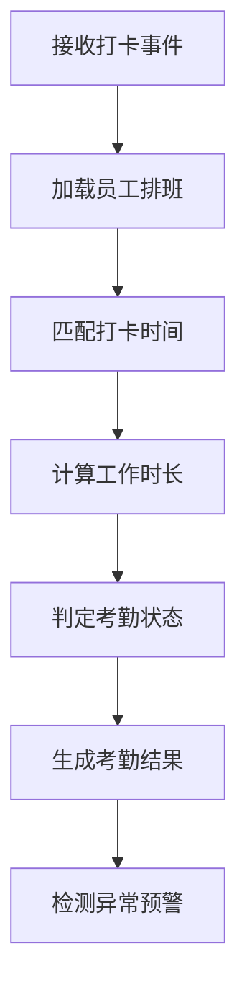
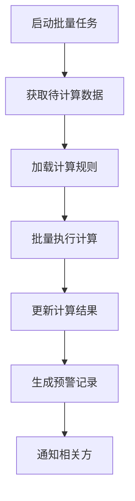

# 考勤计算

<cite>
**本文档引用的文件**   
- [原始记录及考勤计算.md](file://documentation\03-业务模块\各业务模块文档\考勤\原始记录及考勤计算.md)
- [考勤规则配置.md](file://documentation\03-业务模块\各业务模块文档\考勤\考勤规则配置.md)
- [班次时间段管理.md](file://documentation\03-业务模块\各业务模块文档\考勤\班次时间段管理.md)
- [t_scheduled_job.sql](file://database-scripts\common-service\14-t_scheduled_job.sql)
- [考勤前端原型布局\考勤数据功能布局文档_完整版.md](file://documentation\03-业务模块\考勤\考勤前端原型布局\考勤数据功能布局文档_完整版.md)
</cite>

## 目录
1. [引言](#引言)
2. [考勤计算引擎工作原理](#考勤计算引擎工作原理)
3. [考勤结果判定规则](#考勤结果判定规则)
4. [考勤规则配置方法](#考勤规则配置方法)
5. [考勤计算任务调度机制](#考勤计算任务调度机制)
6. [考勤异常识别与数据校正](#考勤异常识别与数据校正)

## 引言

考勤计算系统是企业人力资源管理的核心模块，负责处理员工的打卡数据、计算工作时长、判定考勤异常，并生成考勤结果。本系统通过灵活的规则配置、精确的计算逻辑和高效的调度机制，实现了对迟到、早退、旷工、加班等考勤结果的自动化处理。系统支持多种班次类型和复杂的考勤规则，能够满足不同企业的管理需求。

**本文档引用的文件**  
- [原始记录及考勤计算.md](file://documentation\03-业务模块\各业务模块文档\考勤\原始记录及考勤计算.md#L1-L413)
- [考勤规则配置.md](file://documentation\03-业务模块\各业务模块文档\考勤\考勤规则配置.md#L1-L547)

## 考勤计算引擎工作原理

考勤计算引擎是考勤系统的核心组件，负责处理从数据采集到结果生成的全过程。引擎采用分层架构设计，包括数据采集层、规则引擎层、计算执行层和结果存储层。

### 数据采集与处理流程

考勤计算引擎的数据处理流程包括以下几个关键步骤：

```
员工发起打卡 -> 验证打卡权限 -> 获取位置信息 -> 拍照验证 -> 数据校验 -> 保存打卡记录 -> 触发实时计算
```

当员工完成打卡操作后，系统首先验证其打卡权限，然后获取打卡位置信息和照片，进行数据校验。校验通过后，将打卡记录保存到数据库，并触发实时计算流程。

### 实时计算与批量计算

考勤计算引擎支持两种计算模式：实时计算和批量计算。

#### 实时计算流程


**图表来源**  
- [原始记录及考勤计算.md](file://documentation\03-业务模块\各业务模块文档\考勤\原始记录及考勤计算.md#L180-L183)

实时计算在员工打卡后立即执行，确保考勤结果的及时性。系统接收打卡事件后，加载该员工的排班信息，匹配打卡时间，计算工作时长，判定考勤状态，并生成最终的考勤结果。

#### 批量计算流程


**图表来源**  
- [原始记录及考勤计算.md](file://documentation\03-业务模块\各业务模块文档\考勤\原始记录及考勤计算.md#L185-L188)

批量计算通常在夜间或系统负载较低时执行，用于处理大量数据的重新计算或历史数据的计算。系统启动批量任务后，获取待计算的数据，加载相应的计算规则，批量执行计算，并更新计算结果。

**本文档引用的文件**  
- [原始记录及考勤计算.md](file://documentation\03-业务模块\各业务模块文档\考勤\原始记录及考勤计算.md#L173-L188)

## 考勤结果判定规则

考勤结果的判定基于预设的规则和算法，包括迟到、早退、旷工和加班等结果的计算逻辑。

### 迟到与早退判定

迟到和早退的判定基于员工的实际打卡时间与排班时间的差异，以及预设的容忍时间。

```python
def determine_late_early(clock_time, schedule_time, tolerance):
    """
    判定迟到早退
    """
    if clock_time > schedule_time + tolerance:
        # 迟到
        late_minutes = (clock_time - schedule_time - tolerance).total_seconds() / 60
        return int(late_minutes), 0
    elif clock_time < schedule_time - tolerance:
        # 早退
        early_minutes = (schedule_time - tolerance - clock_time).total_seconds() / 60
        return 0, int(early_minutes)
    else:
        # 正常
        return 0, 0
```

**图表来源**  
- [原始记录及考勤计算.md](file://documentation\03-业务模块\各业务模块文档\考勤\原始记录及考勤计算.md#L224-L241)

### 旷工判定

旷工的判定基于员工在工作日的打卡记录。如果员工在规定的工作时间内没有打卡记录，且未提交请假申请，则判定为旷工。

旷工的计算公式为：
- 当日应工作时长 - 实际工作时长 ≥ 旷工阈值小时数

其中，旷工阈值小时数可在考勤规则中配置，默认为4小时。

### 加班计算

加班时间的计算考虑了工作日、周末和节假日的不同倍数。

```python
def calculate_overtime(work_duration, standard_hours, overtime_rules):
    """
    计算加班时间
    """
    if work_duration <= standard_hours:
        return 0

    overtime_hours = work_duration - standard_hours

    # 应用不同倍数
    if is_weekend():
        overtime_multiplier = overtime_rules.get('weekend_multiplier', 2.0)
    elif is_holiday():
        overtime_multiplier = overtime_rules.get('holiday_multiplier', 3.0)
    else:
        overtime_multiplier = 1.0

    return overtime_hours * overtime_multiplier
```

**图表来源**  
- [原始记录及考勤计算.md](file://documentation\03-业务模块\各业务模块文档\考勤\原始记录及考勤计算.md#L243-L263)

加班计算规则支持以下配置：
- 工作日加班倍数
- 周末加班倍数（默认2.0倍）
- 节假日加班倍数（默认3.0倍）
- 夜班加班倍数

**本文档引用的文件**  
- [原始记录及考勤计算.md](file://documentation\03-业务模块\各业务模块文档\考勤\原始记录及考勤计算.md#L200-L263)

## 考勤规则配置方法

考勤规则配置是考勤系统灵活性的基础，通过JSON格式的配置，支持多种考勤场景的定制。

### 考勤规则JSON结构

考勤规则的核心配置存储在`config_json`字段中，采用JSON格式，包含考勤设置、工作时间规则和特殊规则。

```json
{
  "rule_name": "标准考勤规则",
  "attendance_settings": {
    "late_tolerance_minutes": 10,
    "early_tolerance_minutes": 10,
    "absent_threshold_hours": 4,
    "min_work_hours": 8.0,
    "break_inclusion": false,
    "overtime_calculation_method": "daily",
    "weekend_overtime_multiplier": 2.0,
    "holiday_overtime_multiplier": 3.0
  },
  "work_time_rules": {
    "flexible_start_time": "08:00",
    "flexible_end_time": "20:00",
    "core_start_time": "10:00",
    "core_end_time": "16:00",
    "break_settings": {
      "auto_deduct": true,
      "break_duration": 60,
      "break_start_time": "12:00",
      "break_end_time": "13:00"
    }
  },
  "special_rules": {
    "holiday_handling": "double_pay",
    "weekend_handling": "normal_overtime",
    "night_shift_settings": {
      "night_start": "22:00",
      "night_end": "06:00",
      "night_shift_bonus": 0.2
    }
  }
}
```

**图表来源**  
- [考勤规则配置.md](file://documentation\03-业务模块\各业务模块文档\考勤\考勤规则配置.md#L223-L262)

### 工作日与节假日设置

工作日和节假日的设置通过适用范围配置实现，支持按部门、岗位和员工进行差异化配置。

```json
{
  "departments": [1, 2, 3],
  "positions": [10, 20, 30],
  "employee_levels": ["manager", "staff"],
  "hire_duration_months": 6,
  "exclude_employees": [1001, 1002],
  "conditions": {
    "performance_rating": ">= B",
    "attendance_rate": ">= 0.9",
    "no_disciplinary_records": true
  }
}
```

**图表来源**  
- [考勤规则配置.md](file://documentation\03-业务模块\各业务模块文档\考勤\考勤规则配置.md#L270-L283)

### 弹性时间规则

弹性时间规则允许员工在一定范围内灵活安排工作时间，同时保证核心工作时间的出勤。

- **弹性开始时间**：员工可以开始工作的最早时间
- **弹性结束时间**：员工必须结束工作的最晚时间
- **核心开始时间**：必须出勤的核心工作时间开始点
- **核心结束时间**：必须出勤的核心工作时间结束点

### 加班规则配置

加班规则配置支持多种计算方式和倍数设置。

```json
{
  "overtime_calculation_method": "daily_standard",
  "daily_standard_hours": 8.0,
  "weekly_standard_hours": 40.0,
  "overtime_threshold": 15,
  "weekend_multiplier": 2.0,
  "holiday_multiplier": 3.0,
  "night_shift_start": "22:00",
  "night_shift_end": "06:00",
  "night_shift_multiplier": 1.5
}
```

**图表来源**  
- [班次时间段管理.md](file://documentation\03-业务模块\各业务模块文档\考勤\班次时间段管理.md#L163-L177)

**本文档引用的文件**  
- [考勤规则配置.md](file://documentation\03-业务模块\各业务模块文档\考勤\考勤规则配置.md#L223-L262)
- [班次时间段管理.md](file://documentation\03-业务模块\各业务模块文档\考勤\班次时间段管理.md#L163-L177)

## 考勤计算任务调度机制

考勤计算任务的调度通过定时任务系统实现，确保计算任务的可靠执行。

### 定时任务配置

系统使用`t_scheduled_job`表存储定时任务的配置信息。

| 字段名 | 数据类型 | 说明 |
|--------|----------|------|
| job_id | bigint | 任务ID |
| job_name | varchar | 任务名称 |
| job_group | varchar | 任务分组 |
| job_class | varchar | 任务执行类 |
| cron_expression | varchar | Cron表达式 |
| job_params | text | 任务参数（JSON格式） |
| status | tinyint | 状态：1-启用 2-暂停 3-停止 |
| priority | int | 优先级 |
| max_retry | int | 最大重试次数 |
| retry_interval | int | 重试间隔（秒） |
| timeout | int | 超时时间（秒） |
| concurrent | tinyint | 是否允许并发：0-否 1-是 |
| misfire_policy | tinyint | 错过执行策略 |

**图表来源**  
- [t_scheduled_job.sql](file://database-scripts\common-service\14-t_scheduled_job.sql#L8-L37)

### 执行策略

考勤计算任务的执行策略包括：

- **优先级调度**：根据任务优先级决定执行顺序
- **重试机制**：任务失败后自动重试，最多重试3次
- **超时控制**：设置任务执行超时时间，防止长时间占用资源
- **并发控制**：根据配置决定是否允许任务并发执行
- **错过执行策略**：定义任务错过执行时间后的处理策略

**本文档引用的文件**  
- [t_scheduled_job.sql](file://database-scripts\common-service\14-t_scheduled_job.sql#L1-L39)

## 考勤异常识别与数据校正

考勤异常识别和数据校正是确保考勤数据准确性的关键功能。

### 异常识别规则

系统通过预警规则检测考勤异常模式，包括连续未打卡、频繁迟到等。

```json
{
  "warning_types": [
    {
      "type": "no_clock_in",
      "threshold": 3,
      "level": "high",
      "description": "连续3次未打卡预警",
      "auto_actions": ["notify_manager", "notify_hr"]
    },
    {
      "type": "attendance_abnormal",
      "threshold": 5,
      "level": "high",
      "description": "连续5天考勤异常预警",
      "auto_actions": ["notify_manager", "notify_hr", "escalate"]
    },
    {
      "type": "late_frequent",
      "threshold": 3,
      "time_range_days": 7,
      "level": "medium",
      "description": "频繁迟到预警",
      "auto_actions": ["notify_employee", "notify_manager"]
    }
  ]
}
```

**图表来源**  
- [考勤规则配置.md](file://documentation\03-业务模块\各业务模块文档\考勤\考勤规则配置.md#L263-L303)

### 数据校正与重新计算

当发现考勤数据异常时，系统支持数据校正和重新计算功能。

#### 数据校正流程
```
发现数据异常 -> 确定修正范围 -> 重新计算数据 -> 更新相关记录 -> 生成修正日志 -> 通知影响方
```

#### 核心API接口
```javascript
// 触发考勤计算
POST /api/attendance-calculation/trigger
// 批量重新计算
POST /api/attendance-calculation/recalculate
// 修正考勤结果
PUT /api/attendance-results/{id}/correct
// 获取计算日志
GET /api/attendance-calculation/logs?task_id={id}
```

**图表来源**  
- [原始记录及考勤计算.md](file://documentation\03-业务模块\各业务模块文档\考勤\原始记录及考勤计算.md#L324-L335)
- [考勤数据功能布局文档_完整版.md](file://documentation\03-业务模块\考勤\考勤前端原型布局\考勤数据功能布局文档_完整版.md#L93-L102)

**本文档引用的文件**  
- [原始记录及考勤计算.md](file://documentation\03-业务模块\各业务模块文档\考勤\原始记录及考勤计算.md#L195-L198)
- [考勤规则配置.md](file://documentation\03-业务模块\各业务模块文档\考勤\考勤规则配置.md#L263-L303)
- [考勤数据功能布局文档_完整版.md](file://documentation\03-业务模块\考勤\考勤前端原型布局\考勤数据功能布局文档_完整版.md#L71-L130)