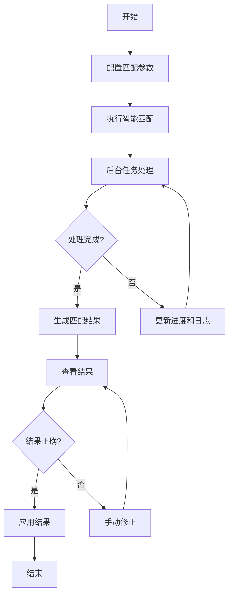
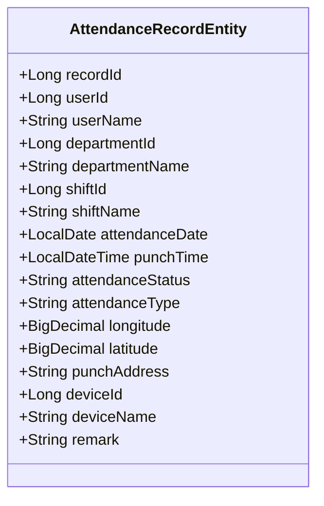

# 考勤计算规则

<cite>
**本文档引用文件**   
- [AttendanceRecordServiceImpl.java](file://microservices\ioedream-attendance-service\src\main\java\net\lab1024\sa\attendance\service\impl\AttendanceRecordServiceImpl.java)
- [AttendanceRecordEntity.java](file://microservices\ioedream-attendance-service\src\main\java\net\lab1024\sa\attendance\domain\entity\AttendanceRecordEntity.java)
- [原始记录及考勤计算.md](file://documentation\03-业务模块\考勤\原始记录及考勤计算.md)
- [考勤规则配置.md](file://documentation\03-业务模块\考勤\考勤规则配置.md)
- [SmartMatching.vue](file://documentation\03-业务模块\考勤\考勤前端原型布局\考勤数据功能布局文档_完整版.md)
</cite>

## 目录
1. [考勤结果判定标准](#考勤结果判定标准)
2. [考勤时间比对算法](#考勤时间比对算法)
3. [异常考勤识别机制](#异常考勤识别机制)
4. [代码实现示例](#代码实现示例)

## 考勤结果判定标准

考勤系统根据员工的打卡记录与预设的班次规则进行比对，生成各类考勤结果。主要的考勤结果包括迟到、早退、旷工和加班，其判定标准如下：

**迟到**：当员工的上班打卡时间晚于班次规定的上班时间加上迟到容忍时间时，系统判定为迟到。迟到分钟数为实际打卡时间与（班次上班时间+容忍时间）的差值。

**早退**：当员工的下班打卡时间早于班次规定的下班时间减去早退容忍时间时，系统判定为早退。早退分钟数为（班次下班时间-容忍时间）与实际打卡时间的差值。

**旷工**：当员工在应出勤的日期内，既没有有效的上班打卡记录也没有有效的下班打卡记录，且未提交有效的请假或外出申请时，系统将根据旷工阈值（如4小时）判定为旷工。

**加班**：当员工的实际工作时长超过标准工作时长时，超出部分被认定为加班。加班时长的计算会根据是否为工作日、周末或节假日应用不同的倍数（如工作日1.0倍，周末2.0倍，节假日3.0倍）。

**Section sources**
- [原始记录及考勤计算.md](file://documentation\03-业务模块\考勤\原始记录及考勤计算.md#L289-L305)
- [考勤规则配置.md](file://documentation\03-业务模块\考勤\考勤规则配置.md#L294-L302)

## 考勤时间比对算法

考勤时间比对是考勤计算的核心环节，系统通过智能匹配算法将原始打卡记录与员工的排班信息进行关联。

### 智能找班匹配流程
系统提供“智能找班匹配”功能，其核心流程如下：
1.  **配置匹配参数**：用户可设置匹配的日期范围、范围（全部员工、指定部门等）、匹配模式（标准、模糊、严格、智能）以及匹配规则（基于时间、地点、设备等）。
2.  **执行匹配**：系统根据配置的参数，启动后台任务对指定范围内的打卡记录进行批量处理。
3.  **进度监控**：系统实时监控匹配进度，提供处理日志，显示当前阶段、已处理记录数和匹配成功率。
4.  **结果应用**：匹配完成后，用户可查看成功和失败的匹配结果，并选择将结果应用到考勤系统中。

### 匹配规则
匹配过程综合考虑多种因素：
-   **基于时间匹配**：以打卡时间为中心，结合班次的弹性时间范围进行匹配。
-   **基于地点匹配**：验证打卡时的GPS坐标是否在预设的考勤点有效半径内。
-   **基于设备匹配**：确认打卡设备是否为员工授权的设备。
-   **员工偏好匹配**：考虑员工的历史打卡习惯和偏好班次。
-   **部门规则匹配**：遵循部门特定的考勤管理规则。



**Diagram sources**
- [SmartMatching.vue](file://documentation\03-业务模块\考勤\考勤前端原型布局\考勤数据功能布局文档_完整版.md#L197-L727)

## 异常考勤识别机制

系统具备完善的异常考勤识别机制，能够自动检测和处理各种异常情况。

### 未打卡处理
当系统检测到员工在应出勤的日期内缺少打卡记录时，会触发“未打卡”预警。系统会根据以下逻辑进行处理：
1.  **自动关联**：尝试通过其他信息（如门禁记录、视频监控）自动关联考勤。
2.  **人工干预**：若自动关联失败，则标记为异常，需要管理员或员工本人进行手动补卡或说明。
3.  **规则判定**：如果未打卡记录持续达到预设的阈值（如连续3天），系统将升级为“旷工”或“频繁缺勤”等更高级别的预警。

### 打卡时间异常
系统会检测打卡时间的合理性，主要异常包括：
-   **时间冲突**：同一员工在短时间内出现多次打卡记录。
-   **时间倒置**：下班打卡时间早于上班打卡时间。
-   **超出范围**：打卡时间超出班次允许的弹性时间范围过多。

对于此类异常，系统会将其标记为“异常”状态，并生成预警记录，通知相关人员进行核查。

### 预警规则
系统支持配置灵活的预警规则，例如：
-   **频繁迟到**：7天内迟到超过3次。
-   **连续缺勤**：连续3天未打卡。
-   **考勤异常**：单日出现多次异常记录。

这些规则通过JSON配置，系统会定时扫描考勤数据，匹配规则并触发相应的通知动作。

**Section sources**
- [原始记录及考勤计算.md](file://documentation\03-业务模块\考勤\原始记录及考勤计算.md#L225-L235)
- [考勤规则配置.md](file://documentation\03-业务模块\考勤\考勤规则配置.md#L330-L352)

## 代码实现示例

本节通过代码片段展示考勤计算逻辑的核心实现。

### 考勤记录实体
`AttendanceRecordEntity` 类定义了考勤记录的核心数据结构，其中 `attendanceStatus` 字段用于存储考勤状态（如NORMAL-正常、LATE-迟到、EARLY-早退、ABSENT-缺勤）。



**Diagram sources**
- [AttendanceRecordEntity.java](file://microservices\ioedream-attendance-service\src\main\java\net\lab1024\sa\attendance\domain\entity\AttendanceRecordEntity.java#L1-L149)

### 迟到早退判定算法
以下是判定迟到和早退的核心算法逻辑，该逻辑在服务层实现，用于计算具体的迟到和早退分钟数。

```python
def determine_late_early(clock_time, schedule_time, tolerance):
    """
    判定迟到早退
    """
    if clock_time > schedule_time + tolerance:
        # 迟到
        late_minutes = (clock_time - schedule_time - tolerance).total_seconds() / 60
        return int(late_minutes), 0
    elif clock_time < schedule_time - tolerance:
        # 早退
        early_minutes = (schedule_time - tolerance - clock_time).total_seconds() / 60
        return 0, int(early_minutes)
    else:
        # 正常
        return 0, 0
```

**Section sources**
- [原始记录及考勤计算.md](file://documentation\03-业务模块\考勤\原始记录及考勤计算.md#L289-L305)
- [AttendanceRecordServiceImpl.java](file://microservices\ioedream-attendance-service\src\main\java\net\lab1024\sa\attendance\service\impl\AttendanceRecordServiceImpl.java#L150-L166)