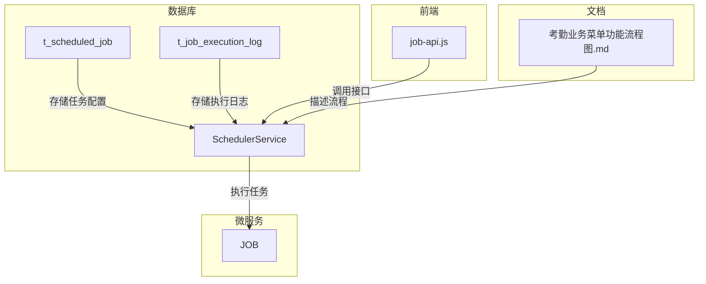
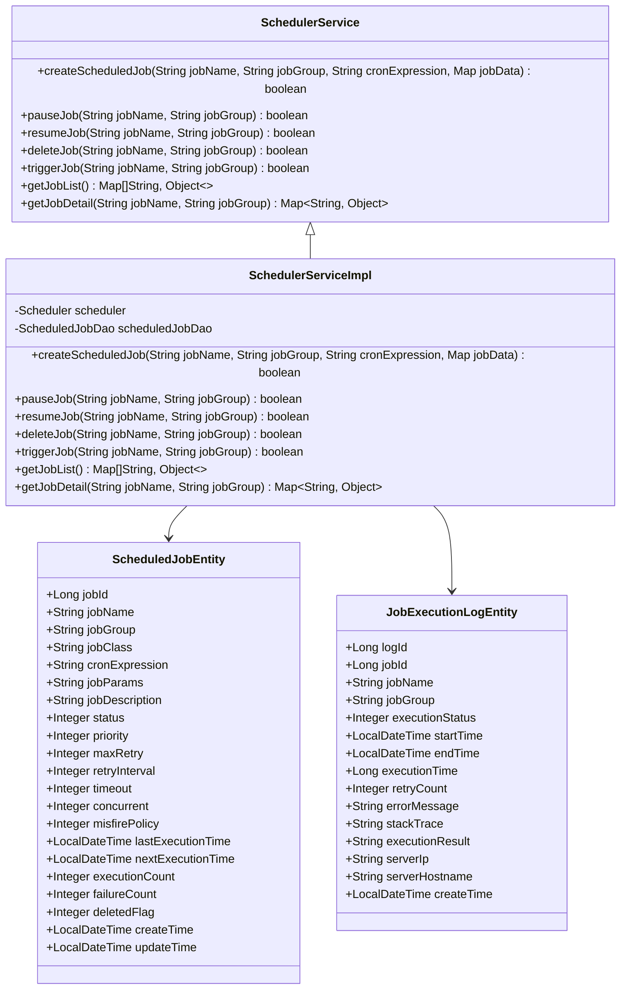
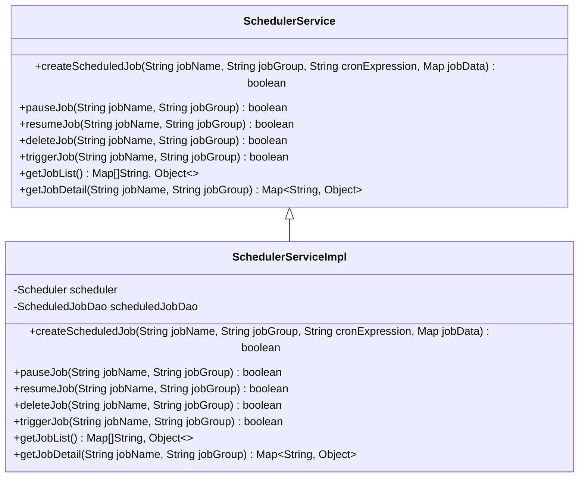
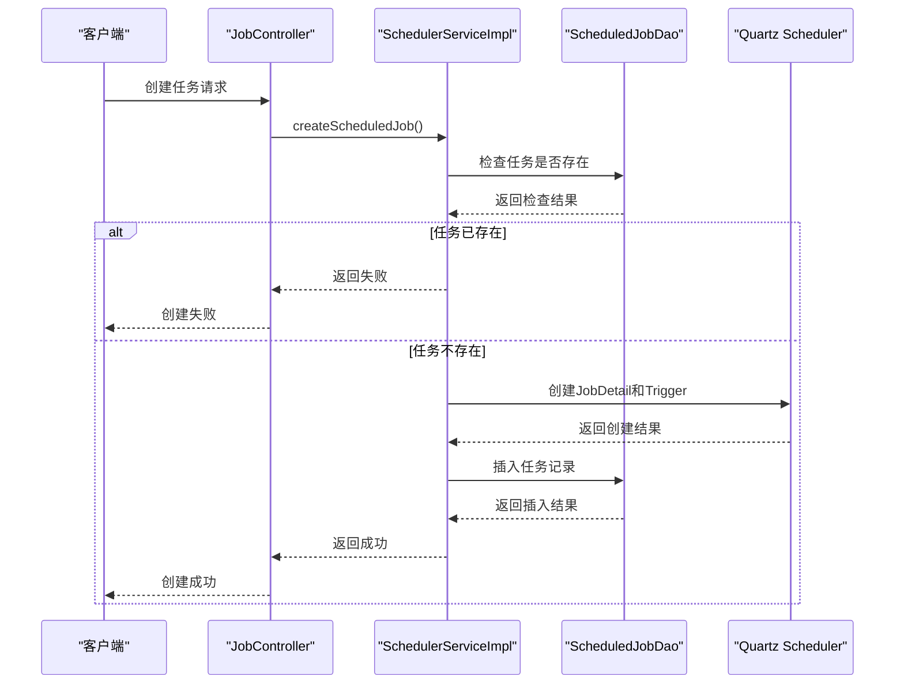
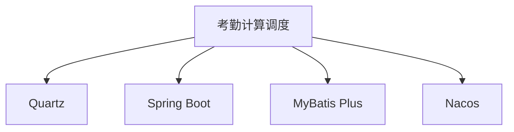

# 考勤计算调度

<cite>
**本文档引用文件**   
- [t_scheduled_job.sql](file://database-scripts/common-service/14-t_scheduled_job.sql)
- [t_job_execution_log.sql](file://database-scripts/common-service/15-t_job_execution_log.sql)
- [SchedulerServiceImpl.java](file://microservices/ioedream-common-service/src/main/java/net/lab1024/sa/common/scheduler/service/impl/SchedulerServiceImpl.java)
- [SchedulerService.java](file://microservices/ioedream-common-service/src/main/java/net/lab1024/sa/common/scheduler/service/SchedulerService.java)
- [job-api.js](file://smart-admin-web-javascript/src/api/support/job-api.js)
- [job-const.js](file://smart-admin-web-javascript/src/constants/support/job-const.js)
- [考勤业务菜单功能流程图.md](file://documentation/03-业务模块/考勤/考勤业务菜单功能流程图.md)
- [原始记录及考勤计算.md](file://documentation/03-业务模块/考勤/原始记录及考勤计算.md)
</cite>

## 目录
1. [引言](#引言)
2. [项目结构](#项目结构)
3. [核心组件](#核心组件)
4. [架构概述](#架构概述)
5. [详细组件分析](#详细组件分析)
6. [依赖分析](#依赖分析)
7. [性能考虑](#性能考虑)
8. [故障排除指南](#故障排除指南)
9. [结论](#结论)

## 引言
本文档详细说明了考勤计算调度机制，包括调度策略、执行计划、配置监控、日志查看以及异常处理和重试机制。通过本指南，用户可以全面了解考勤计算任务的自动化调度流程，确保考勤数据处理的可靠性和准确性。

## 项目结构
考勤计算调度机制主要由以下几个部分组成：
- **数据库脚本**：定义了定时任务表和任务执行日志表。
- **微服务**：`ioedream-common-service` 提供了任务调度服务。
- **前端API**：提供了对定时任务的增删改查及执行记录查询功能。
- **文档**：描述了考勤计算的业务流程和算法。

**图表来源**
- [t_scheduled_job.sql](file://database-scripts/common-service/14-t_scheduled_job.sql)
- [t_job_execution_log.sql](file://database-scripts/common-service/15-t_job_execution_log.sql)
- [SchedulerServiceImpl.java](file://microservices/ioedream-common-service/src/main/java/net/lab1024/sa/common/scheduler/service/impl/SchedulerServiceImpl.java)
- [job-api.js](file://smart-admin-web-javascript/src/api/support/job-api.js)
- [考勤业务菜单功能流程图.md](file://documentation/03-业务模块/考勤/考勤业务菜单功能流程图.md)

**章节来源**
- [t_scheduled_job.sql](file://database-scripts/common-service/14-t_scheduled_job.sql)
- [t_job_execution_log.sql](file://database-scripts/common-service/15-t_job_execution_log.sql)
- [SchedulerServiceImpl.java](file://microservices/ioedream-common-service/src/main/java/net/lab1024/sa/common/scheduler/service/impl/SchedulerServiceImpl.java)
- [job-api.js](file://smart-admin-web-javascript/src/api/support/job-api.js)
- [考勤业务菜单功能流程图.md](file://documentation/03-业务模块/考勤/考勤业务菜单功能流程图.md)

## 核心组件
考勤计算调度的核心组件包括任务调度服务、任务执行日志记录、前端API接口以及相关的业务流程文档。这些组件共同协作，确保考勤计算任务能够按时、准确地执行。

**章节来源**
- [SchedulerServiceImpl.java](file://microservices/ioedream-common-service/src/main/java/net/lab1024/sa/common/scheduler/service/impl/SchedulerServiceImpl.java)
- [t_job_execution_log.sql](file://database-scripts/common-service/15-t_job_execution_log.sql)
- [job-api.js](file://smart-admin-web-javascript/src/api/support/job-api.js)
- [考勤业务菜单功能流程图.md](file://documentation/03-业务模块/考勤/考勤业务菜单功能流程图.md)

## 架构概述
考勤计算调度机制采用Quartz作为任务调度框架，结合Spring Boot实现。系统通过`SchedulerService`接口提供任务管理功能，包括创建、暂停、恢复、删除和立即执行任务。所有任务的配置信息存储在`t_scheduled_job`表中，而任务的执行日志则记录在`t_job_execution_log`表中。

**图表来源**
- [SchedulerServiceImpl.java](file://microservices/ioedream-common-service/src/main/java/net/lab1024/sa/common/scheduler/service/impl/SchedulerServiceImpl.java)
- [SchedulerService.java](file://microservices/ioedream-common-service/src/main/java/net/lab1024/sa/common/scheduler/service/SchedulerService.java)
- [t_scheduled_job.sql](file://database-scripts/common-service/14-t_scheduled_job.sql)
- [t_job_execution_log.sql](file://database-scripts/common-service/15-t_job_execution_log.sql)

**章节来源**
- [SchedulerServiceImpl.java](file://microservices/ioedream-common-service/src/main/java/net/lab1024/sa/common/scheduler/service/impl/SchedulerServiceImpl.java)
- [SchedulerService.java](file://microservices/ioedream-common-service/src/main/java/net/lab1024/sa/common/scheduler/service/SchedulerService.java)
- [t_scheduled_job.sql](file://database-scripts/common-service/14-t_scheduled_job.sql)
- [t_job_execution_log.sql](file://database-scripts/common-service/15-t_job_execution_log.sql)

## 详细组件分析
### 任务调度服务分析
任务调度服务是考勤计算调度机制的核心，负责管理所有定时任务的生命周期。它提供了创建、暂停、恢复、删除和立即执行任务的功能，并通过数据库持久化任务配置和执行日志。

#### 任务调度服务类图

**图表来源**
- [SchedulerServiceImpl.java](file://microservices/ioedream-common-service/src/main/java/net/lab1024/sa/common/scheduler/service/impl/SchedulerServiceImpl.java)
- [SchedulerService.java](file://microservices/ioedream-common-service/src/main/java/net/lab1024/sa/common/scheduler/service/SchedulerService.java)

#### 任务调度服务序列图

**图表来源**
- [SchedulerServiceImpl.java](file://microservices/ioedream-common-service/src/main/java/net/lab1024/sa/common/scheduler/service/impl/SchedulerServiceImpl.java)
- [t_scheduled_job.sql](file://database-scripts/common-service/14-t_scheduled_job.sql)

**章节来源**
- [SchedulerServiceImpl.java](file://microservices/ioedream-common-service/src/main/java/net/lab1024/sa/common/scheduler/service/impl/SchedulerServiceImpl.java)
- [t_scheduled_job.sql](file://database-scripts/common-service/14-t_scheduled_job.sql)

## 依赖分析
考勤计算调度机制依赖于多个组件和服务，主要包括：
- **Quartz**：用于任务调度的核心框架。
- **Spring Boot**：提供依赖注入和事务管理。
- **MyBatis Plus**：用于数据库操作。
- **Nacos**：用于服务发现和配置管理。

**图表来源**
- [SchedulerServiceImpl.java](file://microservices/ioedream-common-service/src/main/java/net/lab1024/sa/common/scheduler/service/impl/SchedulerServiceImpl.java)
- [pom.xml](file://microservices/ioedream-common-service/pom.xml)

**章节来源**
- [SchedulerServiceImpl.java](file://microservices/ioedream-common-service/src/main/java/net/lab1024/sa/common/scheduler/service/impl/SchedulerServiceImpl.java)
- [pom.xml](file://microservices/ioedream-common-service/pom.xml)

## 性能考虑
为了确保考勤计算调度机制的高性能和可靠性，系统采取了以下措施：
- **集群模式**：支持Quartz集群模式，确保高可用性。
- **任务并发控制**：通过`concurrent`字段控制任务是否允许并发执行。
- **重试机制**：通过`max_retry`和`retry_interval`字段配置任务的重试次数和间隔。
- **超时处理**：通过`timeout`字段设置任务的超时时间，防止长时间运行的任务影响系统性能。

## 故障排除指南
当考勤计算任务出现异常时，可以通过以下步骤进行排查：
1. **查看任务执行日志**：检查`t_job_execution_log`表中的执行状态、错误信息和堆栈信息。
2. **检查任务配置**：确认任务的Cron表达式、参数和状态是否正确。
3. **检查服务器资源**：确保执行任务的服务器有足够的CPU和内存资源。
4. **检查网络连接**：确保任务执行过程中所需的网络连接正常。

**章节来源**
- [t_job_execution_log.sql](file://database-scripts/common-service/15-t_job_execution_log.sql)
- [SchedulerServiceImpl.java](file://microservices/ioedream-common-service/src/main/java/net/lab1024/sa/common/scheduler/service/impl/SchedulerServiceImpl.java)

## 结论
本文档详细介绍了考勤计算调度机制的设计和实现，涵盖了任务调度策略、执行计划、配置监控、日志查看以及异常处理和重试机制。通过这些机制，系统能够确保考勤计算任务的可靠性和准确性，为用户提供高效、稳定的考勤管理服务。