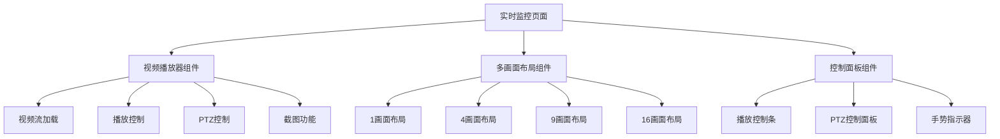
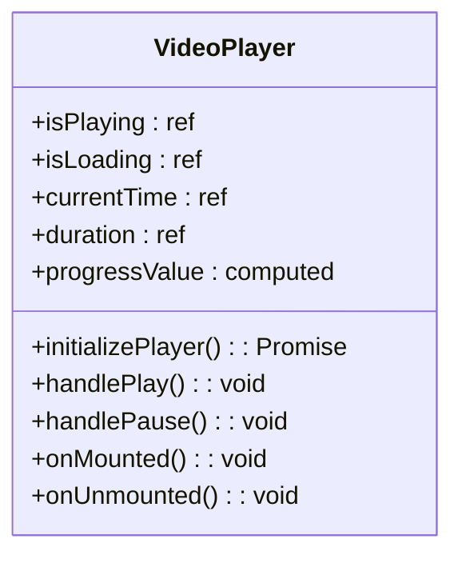
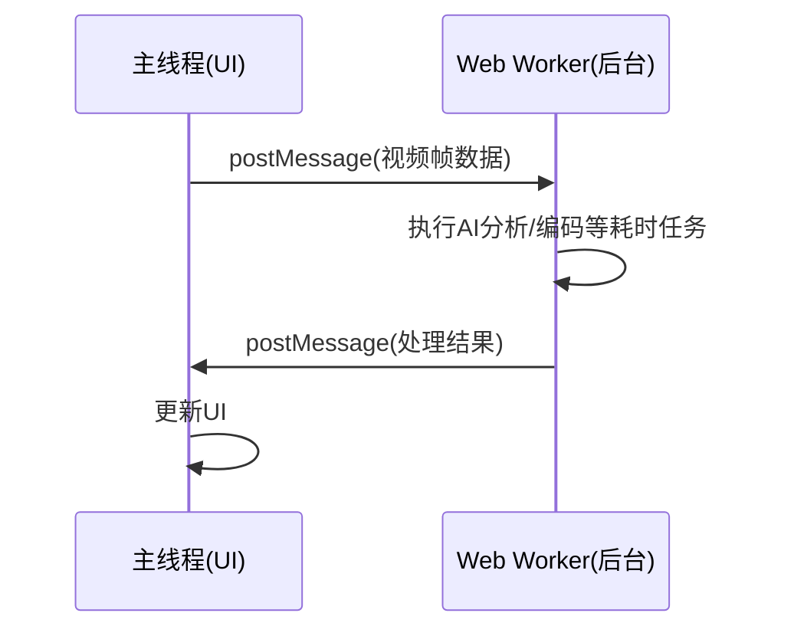
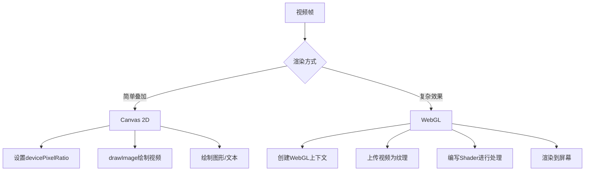
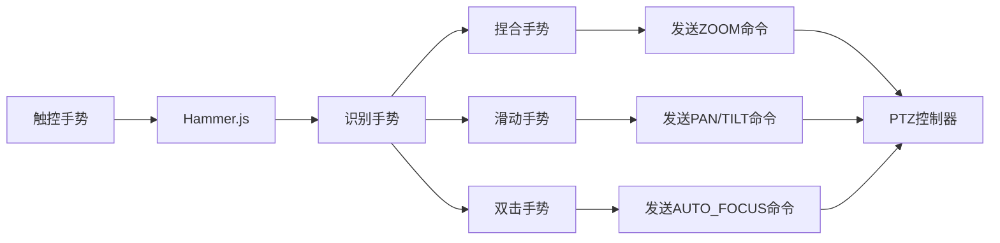

# 前端渲染

<cite>
**本文档引用的文件**
- [VideoPlayer.vue](file://documentation\03-业务模块\视频监控\13-前端移动端组件设计.md)
- [Vue3_Composition_API最佳实践.md](file://documentation\01-核心规范\Vue3_Composition_API最佳实践.md)
- [video-preview.vue](file://smart-admin-web-javascript\AI开发文档\视频预览页面功能布局文档_完善版.md)
- [WallWindowCell.vue](file://smart-admin-web-javascript\AI开发文档\视频上墙页面功能布局文档_完善版.md)
- [monitor-preview.vue](file://smart-admin-web-javascript\src\views\business\smart-video\monitor-preview.vue)
</cite>

## 目录
1. [实时监控页面组件架构](#实时监控页面组件架构)
2. [Vue3 Composition API在状态管理中的应用](#vue3-composition-api在状态管理中的应用)
3. [Web Workers在视频帧处理中的应用](#web-workers在视频帧处理中的应用)
4. [Canvas和WebGL在视频渲染中的性能优化策略](#canvas和webgl在视频渲染中的性能优化策略)
5. [移动端适配方案和触控操作支持](#移动端适配方案和触控操作支持)

## 实时监控页面组件架构

实时监控页面的组件架构主要由视频播放器组件、多画面布局组件和控制面板组件构成。视频播放器组件（VideoPlayer）是核心，负责视频流的加载、播放、暂停、全屏切换等基本功能，并集成了PTZ（云台）控制、截图、质量选择等高级功能。多画面布局组件（如video-preview.vue中的视频网格）通过CSS Grid布局实现1、4、9、16等不同画面的动态切换，每个画面单元（video-item）可独立加载不同的视频流。控制面板组件则集成在视频播放器内部，包含播放控制条、PTZ控制面板和手势指示器，提供用户交互界面。

**Diagram sources**
- [VideoPlayer.vue](file://documentation\03-业务模块\视频监控\13-前端移动端组件设计.md)
- [video-preview.vue](file://smart-admin-web-javascript\AI开发文档\视频预览页面功能布局文档_完善版.md)

**Section sources**
- [VideoPlayer.vue](file://documentation\03-业务模块\视频监控\13-前端移动端组件设计.md)
- [video-preview.vue](file://smart-admin-web-javascript\AI开发文档\视频预览页面功能布局文档_完善版.md)

## Vue3 Composition API在状态管理中的应用

Vue3 Composition API通过`<script setup>`语法糖和响应式API（如ref, reactive, computed, watch）实现了高效的状态管理。在视频播放器组件中，使用`ref`定义了`isPlaying`、`isLoading`、`currentTime`等布尔值和数值状态，使用`reactive`定义了复杂的对象状态。`computed`计算属性用于派生状态，例如`progressValue`计算属性将`currentTime`和`duration`关联起来，实现进度条的双向绑定。`watch`监听器用于响应props的变化，当`streamUrl`或`deviceId`改变时，自动重新加载视频流。`onMounted`和`onUnmounted`生命周期钩子用于在组件挂载时初始化播放器，在卸载时清理定时器、事件监听器和媒体流，防止内存泄漏。

**Diagram sources**
- [VideoPlayer.vue](file://documentation\03-业务模块\视频监控\13-前端移动端组件设计.md)

**Section sources**
- [Vue3_Composition_API最佳实践.md](file://documentation\01-核心规范\Vue3_Composition_API最佳实践.md)
- [VideoPlayer.vue](file://documentation\03-业务模块\视频监控\13-前端移动端组件设计.md)

## Web Workers在视频帧处理中的应用

虽然在提供的代码片段中未直接体现Web Workers的使用，但其在视频帧处理中的应用是避免UI阻塞的关键策略。对于需要大量计算的视频处理任务，如AI行为分析、人脸识别或视频编码转换，可以将这些任务移至Web Worker线程中执行。主线程负责UI渲染和用户交互，而Web Worker在后台处理视频帧数据。处理完成后，通过`postMessage`将结果发送回主线程进行显示。这种方式确保了即使在进行复杂的视频分析时，用户界面依然保持流畅和响应。

**Diagram sources**
- [VideoPlayer.vue](file://documentation\03-业务模块\视频监控\13-前端移动端组件设计.md)

## Canvas和WebGL在视频渲染中的性能优化策略

在视频渲染中，Canvas和WebGL提供了超越原生`<video>`标签的灵活性和性能。Canvas可用于在视频上叠加图形、绘制检测区域或进行简单的像素级处理。为了保证清晰度，必须正确处理设备像素比（devicePixelRatio），通过设置Canvas的`width`和`height`属性为物理像素，而非CSS像素。WebGL则用于更复杂的图形渲染，如3D效果或高性能的视频滤镜。通过将视频帧作为纹理上传到WebGL，可以在GPU上进行高效的并行计算和渲染，显著提升性能。在提供的代码中，`VideoDrawingModal.vue`组件使用Canvas进行视频画线，体现了Canvas在叠加图形方面的应用。

**Diagram sources**
- [VideoDrawingModal.vue](file://smart-admin-web-javascript\AI开发文档\行为分析页面功能布局文档_完善版.md)

## 移动端适配方案和触控操作支持

移动端适配方案主要通过响应式设计和触控操作支持来实现。在布局上，使用`aspect-ratio`属性和`@media`查询来确保视频播放器在不同屏幕尺寸下保持正确的宽高比和控件布局。触控操作支持通过集成`Hammer.js`库实现，该库可以识别捏合（pinch）、滑动（swipe）和双击（doubletap）等手势。在视频播放器中，捏合手势用于变焦（ZOOM），滑动手势用于云台（PTZ）的平移（PAN）和俯仰（TILT）控制，双击手势用于自动聚焦。这些手势操作被转换为相应的PTZ控制命令，并通过`emit`事件传递给父组件，从而实现直观的触控体验。

**Diagram sources**
- [VideoPlayer.vue](file://documentation\03-业务模块\视频监控\13-前端移动端组件设计.md)

**Section sources**
- [VideoPlayer.vue](file://documentation\03-业务模块\视频监控\13-前端移动端组件设计.md)