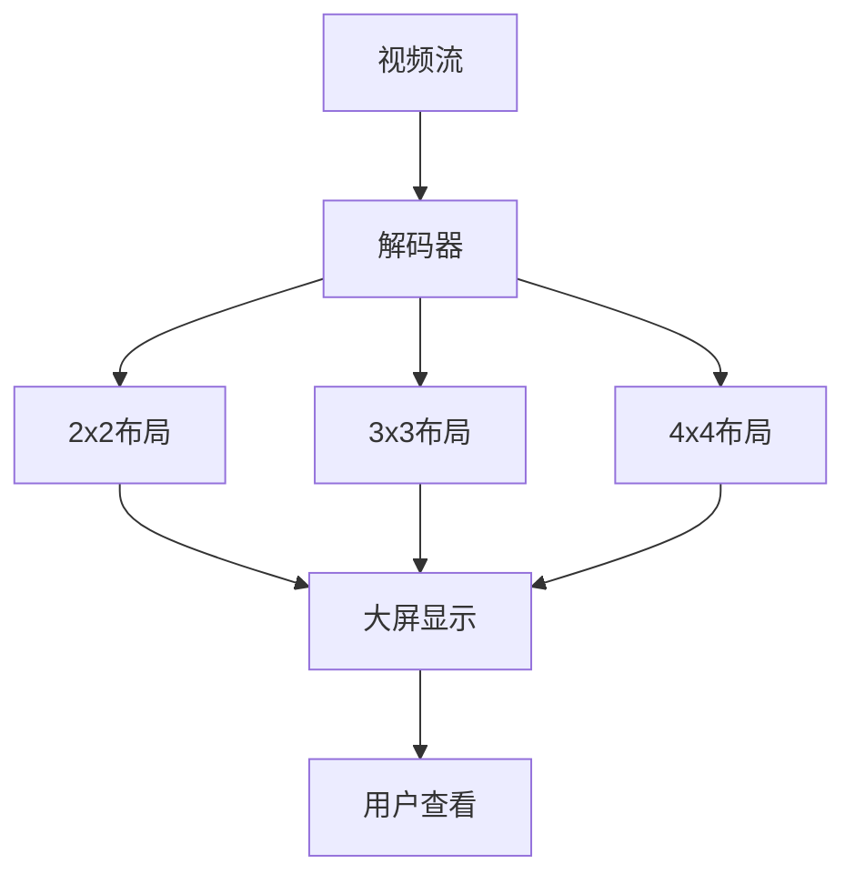
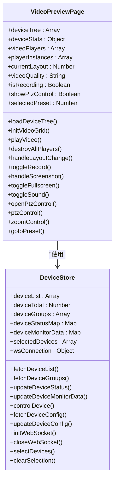
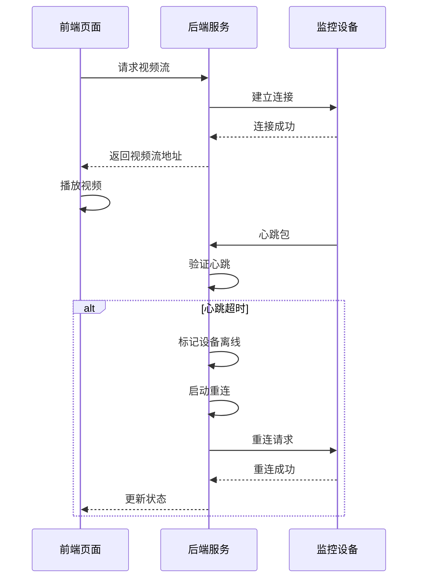
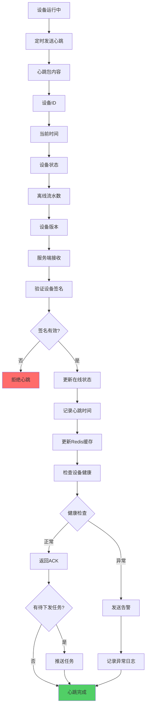
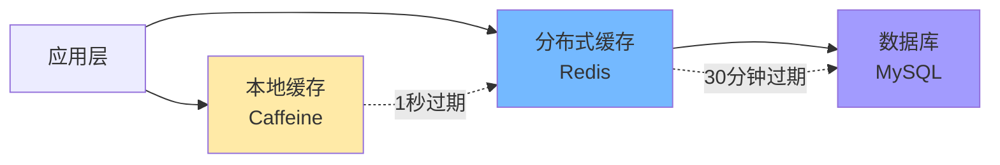

# 实时监控

<cite>
**本文档引用文件**   
- [video-preview.vue](file://smart-admin-web-javascript/src/views/business/smart-video/video-preview.vue)
- [monitor.vue](file://smart-app/src/pages/video/monitor.vue)
- [VideoStreamManager.java](file://documentation/03-业务模块/各业务模块文档/智能视频/03-功能模块详细设计.md)
- [decoder-api.js](file://smart-admin-web-javascript/src/api/business/smart-video/decoder-api.js)
- [device.js](file://smart-admin-web-javascript/src/store/modules/business/decoder.js)
- [smart-device.md](file://documentation/technical/smart-device.md)
- [09-缓存架构设计.md](file://documentation/03-业务模块/各业务模块文档/消费/09-缓存架构设计.md)
- [06-接口设计规范.md](file://documentation/03-业务模块/各业务模块文档/智能视频/06-接口设计规范.md)
- [12-前端API接口设计.md](file://documentation/03-业务模块/视频监控/12-前端API接口设计.md)
- [13-前端移动端组件设计.md](file://documentation/03-业务模块/视频监控/13-前端移动端组件设计.md)
- [performance-optimizer.js](file://smart-app/src/utils/performance-optimizer.js)
</cite>

## 目录
1. [引言](#引言)
2. [视频流协议接入](#视频流协议接入)
3. [视频流解码与多画面布局](#视频流解码与多画面布局)
4. [前端组件结构与状态管理](#前端组件结构与状态管理)
5. [性能优化策略](#性能优化策略)
6. [视频流异常处理与重连](#视频流异常处理与重连)
7. [设备在线状态检测](#设备在线状态检测)
8. [视频质量监控](#视频质量监控)
9. [多级缓存策略](#多级缓存策略)
10. [网络带宽自适应](#网络带宽自适应)
11. [结论](#结论)

## 引言
实时监控功能是智能视频系统的核心组成部分，提供对视频设备的实时预览、控制和管理能力。系统支持多种视频流协议接入，包括RTSP、GB28181等标准协议，通过WebRTC技术实现低延迟的视频传输。前端页面采用Vue3 Composition API构建，实现了灵活的多画面布局和丰富的用户交互功能。系统通过WebSocket实现实时状态推送，确保设备状态和告警信息的及时更新。后端服务采用微服务架构，通过Nacos进行服务发现和配置管理，保证系统的高可用性和可扩展性。

## 视频流协议接入
系统支持多种视频流协议接入，包括RTSP、RTMP、HLS和WebRTC等。视频流管理器根据设备配置的协议类型，动态构建相应的视频流地址。对于RTSP协议，系统通过`buildRtspUrl`方法生成标准的RTSP URL，包含设备IP、端口、通道和流类型等信息。系统还支持GB28181协议接入，通过SIP协议实现设备注册和信令交互。视频流服务通过流媒体服务器进行转发，减少对前端设备的直接压力，支持大规模并发访问。

**Section sources**
- [VideoStreamManager.java](file://documentation/03-业务模块/各业务模块文档/智能视频/03-功能模块详细设计.md#L170-L198)
- [06-接口设计规范.md](file://documentation/03-业务模块/各业务模块文档/智能视频/06-接口设计规范.md#L153-L158)

## 视频流解码与多画面布局
系统通过解码器管理模块实现视频流的解码和上墙显示。解码器负责将视频流解码为可显示的视频画面，并支持多画面布局配置。前端页面提供2x2、3x3、4x4等多种布局方式，用户可以通过拖拽或点击方式将设备画面上墙。系统支持预案管理，可以保存和快速应用常用布局配置。轮巡播放功能支持自动切换设备画面，用户可自定义轮巡间隔时间。

**Diagram sources**
- [decoder-api.js](file://smart-admin-web-javascript/src/api/business/smart-video/decoder-api.js#L66-L77)
- [device.js](file://smart-admin-web-javascript/src/store/modules/business/decoder.js#L320-L327)

## 前端组件结构与状态管理
前端页面采用Vue3 Composition API构建，通过Pinia实现状态管理。视频预览页面包含设备树和视频区两个主要部分，设备树显示所有监控设备的层级结构，视频区显示实时监控画面。系统使用Ant Design Vue组件库，提供了丰富的UI组件和交互功能。状态管理模块负责维护设备列表、设备状态、视频窗口等状态信息，并通过WebSocket接收实时更新。

**Diagram sources**
- [video-preview.vue](file://smart-admin-web-javascript/src/views/business/smart-video/video-preview.vue#L354-L587)
- [device.js](file://smart-admin-web-javascript/src/store/modules/business/decoder.js#L315-L360)

## 性能优化策略
系统采用多种性能优化策略，确保大规模并发访问下的流畅体验。懒加载机制按需加载摄像头画面，避免同时加载过多视频流。虚拟滚动优化设备树大数据渲染，提升页面响应速度。合理设置视频缓冲区，平衡延迟和流畅度。轮巡切换时优雅地销毁旧播放器实例，避免内存泄漏。系统还支持分级联方案，根据设备优先级分组显示，确保关键设备的监控质量。

**Section sources**
- [AI开发文档\大屏监控页面功能布局文档_完善版.md](file://smart-admin-web-javascript/AI开发文档/大屏监控页面功能布局文档_完善版.md#L1483-L1497)
- [performance-optimizer.js](file://smart-app/src/utils/performance-optimizer.js#L12-L49)

## 视频流异常处理与重连
系统实现了完善的视频流异常处理和重连机制。当视频流出现异常时，前端会显示错误状态并提供重试按钮。后端服务通过心跳检测机制监控设备状态，定期发送心跳包验证设备连接。当检测到设备离线时，系统会自动尝试重新连接，并记录重连日志。重连策略采用指数退避算法，避免频繁重连对服务器造成压力。系统还支持故障转移，当主视频流不可用时，自动切换到备用流。

**Diagram sources**
- [13-前端移动端组件设计.md](file://documentation/03-业务模块/视频监控/13-前端移动端组件设计.md#L236-L248)
- [smart-device.md](file://documentation/technical/smart-device.md#L1774-L1789)

## 设备在线状态检测
系统通过心跳机制检测设备在线状态。设备定期发送心跳包，包含设备ID、当前时间、设备状态、离线流水数和设备版本等信息。服务端接收心跳包后，验证设备签名，更新设备在线状态，并记录心跳时间。系统使用Redis缓存设备状态，支持快速查询。设备状态检测还包括健康检查，当设备CPU、内存或磁盘使用率超过阈值时，系统会发送告警。

**Diagram sources**
- [smart-device.md](file://documentation/technical/smart-device.md#L2074-L2187)
- [各业务模块文档\消费\14-设备管理模块重构设计.md](file://documentation/03-业务模块/消费/14-设备管理模块重构设计.md#L162-L202)

## 视频质量监控
系统提供全面的视频质量监控功能，包括CPU使用率、内存使用率、磁盘使用率等监控指标。监控数据通过WebSocket实时推送到前端，用户可以在设备状态卡片中查看实时监控数据。系统支持监控数据的历史查询和趋势分析，帮助管理员了解设备的长期运行状况。当监控指标超过预设阈值时，系统会触发告警，通知相关人员处理。

**Section sources**
- [smart-device.md](file://documentation/technical/smart-device.md#L1646-L1689)
- [AI开发文档\视频预览页面功能布局文档_完善版.md](file://smart-admin-web-javascript/AI开发文档/视频预览页面功能布局文档_完善版.md#L101-L114)

## 多级缓存策略
系统采用多级缓存策略，包括本地缓存（Caffeine）和分布式缓存（Redis）。本地缓存用于存储高频访问的热点数据，过期时间为1分钟。分布式缓存用于存储共享数据，过期时间为30分钟。缓存读取优先级为：首先检查本地缓存，未命中则查询Redis，再未命中则查询数据库。缓存更新采用事件驱动和定时刷新相结合的策略，确保数据一致性。

**Diagram sources**
- [09-缓存架构设计.md](file://documentation/03-业务模块/各业务模块文档/消费/09-缓存架构设计.md#L481-L493)
- [microservices-common\src\main\java\net\lab1024\sa\common\system\cache\controller\CacheController.java](file://microservices/microservices-common/src/main/java/net/lab1024/sa/common/system/cache/controller/CacheController.java#L87-L102)

## 网络带宽自适应
系统支持网络带宽自适应调整，根据网络条件自动调整视频流质量。移动端通过`navigator.connection` API获取网络类型和带宽信息，动态调整视频分辨率和码率。当网络条件较差时，系统自动切换到低质量流，确保视频流畅播放。网络状态指示器实时显示当前网络状态，帮助用户了解网络质量。系统还支持手动选择视频质量，用户可根据需要选择高清、标清或流畅模式。

**Section sources**
- [13-前端移动端组件设计.md](file://documentation/03-业务模块/视频监控/13-前端移动端组件设计.md#L779-L814)
- [Frontend_Backend_Mobile_API_Complete_Analysis.md](file://documentation/technical/Frontend_Backend_Mobile_API_Complete_Analysis.md#L291-L296)

## 结论
实时监控功能通过多种技术手段实现了高效、稳定的视频监控服务。系统支持多种视频流协议接入，采用WebRTC技术实现低延迟传输。前端页面通过Vue3 Composition API和Pinia实现了灵活的组件结构和状态管理。多级缓存策略和网络带宽自适应调整确保了系统在大规模并发访问下的性能表现。完善的异常处理和重连机制保证了服务的高可用性。设备在线状态检测和视频质量监控功能为系统运维提供了有力支持。整体架构设计合理，具备良好的可扩展性和维护性。