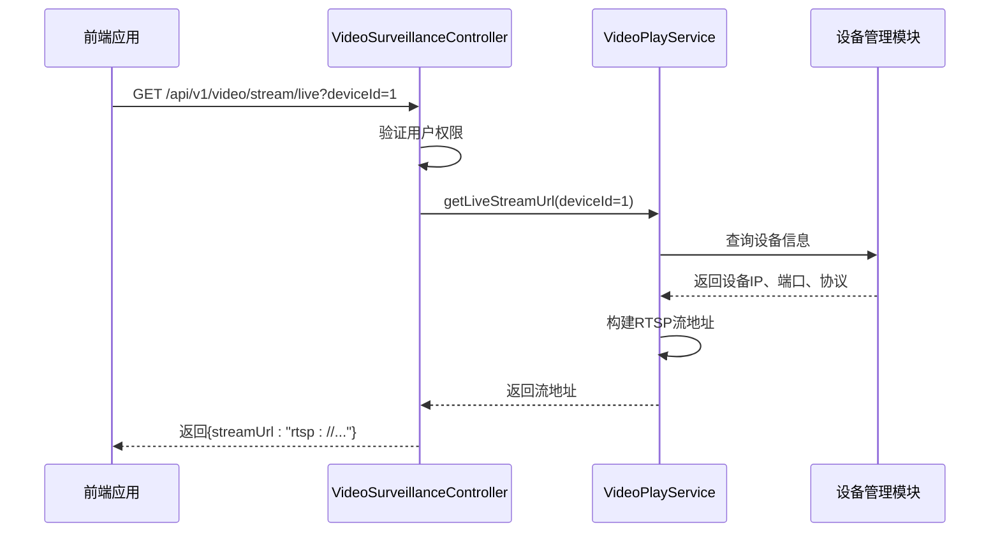
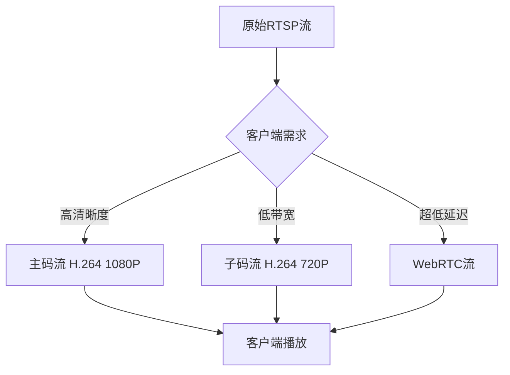
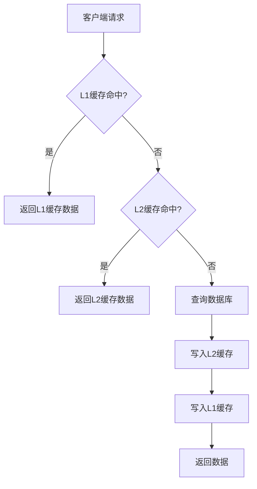

# 视频流处理

<cite>
**本文档引用文件**   
- [VideoStreamProtocol.java](file://documentation\03-业务模块\各业务模块文档\智能视频\03-功能模块详细设计.md)
- [CameraProtocol.java](file://documentation\technical\smart-device.md)
- [VideoSurveillanceController.java](file://restful_refactor_backup_20251202_014224\microservices_ioedream-video-service_src_main_java_net_lab1024_sa_video_controller_VideoSurveillanceController.java)
- [VideoPlayServiceImpl.java](file://microservices\ioedream-video-service\src\main\java\net\lab1024\sa\video\service\impl\VideoPlayServiceImpl.java)
- [decoder-api.js](file://smart-admin-web-javascript\src\api\business\smart-video\decoder-api.js)
- [decoder.js](file://smart-admin-web-javascript\src\store\modules\business\decoder.js)
- [decoder-mock-data.js](file://smart-admin-web-javascript\src\views\business\smart-video\mock\decoder-mock-data.js)
- [VideoDeviceController.java](file://microservices\ioedream-video-service\src\main\java\net\lab1024\sa\video\controller\VideoDeviceController.java)
- [VideoDeviceServiceImpl.java](file://microservices\ioedream-video-service\src\main\java\net\lab1024\sa\video\service\impl\VideoDeviceServiceImpl.java)
- [ProtocolController.java](file://microservices\ioedream-device-comm-service\src\main\java\net\lab1024\sa\devicecomm\controller\ProtocolController.java)
- [ProtocolHandler.java](file://microservices\ioedream-device-comm-service\src\main\java\net\lab1024\sa\devicecomm\protocol\handler\ProtocolHandler.java)
- [VideoPlayer.vue](file://documentation\03-业务模块\视频监控\13-前端移动端组件设计.md)
- [cache-api.js](file://smart-admin-web-javascript\src\api\support\cache-api.js)
- [CacheController.java](file://microservices\microservices-common\src\main\java\net\lab1024\sa\common\system\cache\controller\CacheController.java)
- [缓存架构设计.md](file://documentation\03-业务模块\消费\09-缓存架构设计.md)
</cite>

## 目录
1. [引言](#引言)
2. [RTSP/GB28181协议接入实现](#rtspgb28181协议接入实现)
3. [视频流解码与转码策略](#视频流解码与转码策略)
4. [多级缓存机制](#多级缓存机制)
5. [网络带宽自适应调整算法](#网络带宽自适应调整算法)
6. [视频流异常检测与自动重连](#视频流异常检测与自动重连)
7. [结论](#结论)

## 引言
本文档详细阐述了智能视频监控系统中视频流处理的核心技术实现。系统基于微服务架构，通过`ioedream-video-service`和`ioedream-device-comm-service`两个核心服务，实现了从设备接入、视频流获取、解码播放到异常处理的完整闭环。系统支持RTSP、RTMP、HLS、WebRTC等多种视频流协议，并集成了多级缓存、网络自适应和自动重连等高级功能，确保了监控的稳定性和连续性。

## RTSP/GB28181协议接入实现

### 设备注册与信令交互
视频流处理的起点是设备的注册与管理。系统通过`VideoDeviceController`提供RESTful API来管理视频设备。当一个新设备（如摄像头）需要接入系统时，会通过`POST /api/v1/video/device`接口提交设备信息，包括IP地址、端口、协议类型（RTSP/GB28181）、用户名和密码等。

设备注册成功后，系统会通过`CameraProtocol`组件与设备建立连接。该组件实现了`DeviceProtocol`接口，负责具体的信令交互：
1.  **连接建立**：`connect`方法使用`CameraClientFactory`创建客户端，并调用`client.connect()`发起连接。
2.  **心跳检测**：`heartbeat`方法定期调用`client.isAlive()`来检测设备的在线状态。
3.  **状态获取**：`getDeviceStatus`方法获取设备的实时状态，如是否正在录像。
4.  **事件处理**：`handleDeviceEvent`方法监听设备事件，如“连接丢失”或“移动检测”，并触发相应的业务逻辑，如更新设备状态或发送告警。

对于GB28181协议，系统通过`ProtocolHandler`在`ioedream-device-comm-service`中处理SIP信令，实现设备的注册、保活和流媒体会话控制。

### 媒体流获取过程
媒体流的获取是一个按需触发的过程。当用户在前端请求预览某个摄像头时，后端会执行以下流程：

1.  **权限验证**：`VideoSurveillanceController`首先验证用户是否有权限访问该设备。
2.  **流地址生成**：调用`VideoPlayService`的`getLiveStreamUrl`方法。该服务会查询设备信息，并根据设备配置的协议（如RTSP）构建流地址。
3.  **返回流信息**：将生成的流地址（如`rtsp://192.168.1.101:554/Streaming/Channels/101`）返回给前端。



**Diagram sources**
- [VideoSurveillanceController.java](file://restful_refactor_backup_20251202_014224\microservices_ioedream-video-service_src_main_java_net_lab1024_sa_video_controller_VideoSurveillanceController.java)
- [VideoPlayServiceImpl.java](file://microservices\ioedream-video-service\src\main\java\net\lab1024\sa\video\service\impl\VideoPlayServiceImpl.java)
- [CameraProtocol.java](file://documentation\technical\smart-device.md)

**Section sources**
- [VideoSurveillanceController.java](file://restful_refactor_backup_20251202_014224\microservices_ioedream-video-service_src_main_java_net_lab1024_sa_video_controller_VideoSurveillanceController.java)
- [VideoPlayServiceImpl.java](file://microservices\ioedream-video-service\src\main\java\net\lab1024\sa\video\service\impl\VideoPlayServiceImpl.java)
- [CameraProtocol.java](file://documentation\technical\smart-device.md)

## 视频流解码与转码策略

### 解码技术选型
系统前端采用基于Web的播放器，因此解码工作主要在客户端完成。系统支持多种协议，其解码方式也有所不同：
- **RTSP/RTMP**: 通常需要借助`ffmpeg`或`VLC`等本地播放器插件，或通过服务端转码为HLS/WebRTC。
- **HLS (HTTP Live Streaming)**: 基于HTTP的流媒体协议，由浏览器原生支持，通过`<video>`标签直接播放`.m3u8`文件。
- **WebRTC**: 用于低延迟实时通信，通过`WebRTC API`在浏览器中直接建立P2P连接进行音视频传输和解码。

系统通过`VideoPlayer.vue`组件统一管理不同协议的播放逻辑，根据后端返回的协议类型选择相应的播放器实例。

### 转码策略
为了适应不同网络环境和客户端能力，系统采用了服务端转码策略：
1.  **协议转换**：对于不支持RTSP的浏览器，系统会将RTSP流通过`ffmpeg`转码为HLS或WebRTC流。
2.  **分辨率与码率调整**：系统支持多码流（主码流、子码流）。前端可以根据网络状况请求不同清晰度的流（如`streamType=MAIN`或`SUB`），从而实现带宽的优化。



**Diagram sources**
- [VideoPlayer.vue](file://documentation\03-业务模块\视频监控\13-前端移动端组件设计.md)
- [VideoPlayServiceImpl.java](file://microservices\ioedream-video-service\src\main\java\net\lab1024\sa\video\service\impl\VideoPlayServiceImpl.java)

**Section sources**
- [VideoPlayer.vue](file://documentation\03-业务模块\视频监控\13-前端移动端组件设计.md)
- [VideoPlayServiceImpl.java](file://microservices\ioedream-video-service\src\main\java\net\lab1024\sa\video\service\impl\VideoPlayServiceImpl.java)

## 多级缓存机制

### 内存缓存与Redis缓存
系统采用了Caffeine + Redis的多级缓存架构，以提升性能和降低数据库压力。

1.  **L1缓存 (Caffeine)**：位于应用服务器内存中，用于缓存热点数据，如设备配置、用户权限等。访问速度为毫秒级，是性能最高的缓存层。
2.  **L2缓存 (Redis)**：分布式缓存，用于在多个应用实例间共享缓存数据。当L1缓存未命中时，会查询Redis。Redis还用于存储会话、分布式锁和临时数据。

**应用场景**：
- **设备信息缓存**：频繁查询的设备列表和详情被缓存，避免每次请求都访问数据库。
- **权限信息缓存**：用户的权限数据在登录后被缓存，加速后续的权限校验。
- **配置信息缓存**：系统配置、区域信息等静态或半静态数据被长期缓存。

### 缓存管理
系统提供了完善的缓存管理接口：
- **查看缓存**：`/support/cache/names` 获取所有缓存命名空间，`/support/cache/keys/{cacheName}` 查看指定缓存的所有key。
- **清除缓存**：`/support/cache/remove/{cacheName}` 可以手动清除指定缓存，用于在数据变更后强制刷新。



**Diagram sources**
- [cache-api.js](file://smart-admin-web-javascript\src\api\support\cache-api.js)
- [CacheController.java](file://microservices\microservices-common\src\main\java\net\lab1024\sa\common\system\cache\controller\CacheController.java)
- [缓存架构设计.md](file://documentation\03-业务模块\消费\09-缓存架构设计.md)

**Section sources**
- [cache-api.js](file://smart-admin-web-javascript\src\api\support\cache-api.js)
- [CacheController.java](file://microservices\microservices-common\src\main\java\net\lab1024\sa\common\system\cache\controller\CacheController.java)
- [缓存架构设计.md](file://documentation\03-业务模块\消费\09-缓存架构设计.md)

## 网络带宽自适应调整算法

### 动态清晰度切换
系统前端实现了智能的网络带宽自适应算法，以确保在不同网络条件下都能提供流畅的观看体验。

1.  **网络状况检测**：前端通过`navigator.connection` API获取网络类型（如WiFi、4G、3G）和下行带宽（downlink）。
2.  **质量决策**：根据检测到的网络条件，自动选择合适的视频质量：
    - **4G/高带宽**：选择“高清”(HD)或“超清”(4K)。
    - **3G/中等带宽**：选择“标清”(SD)。
    - **2G/低带宽**：选择“流畅”(LD)或“低清”(LD)。
3.  **动态切换**：当网络状况发生变化时（如从WiFi切换到4G），播放器会无缝切换到相应质量的视频流。

```javascript
// 伪代码示例
function checkNetworkCondition() {
  const downlink = navigator.connection.downlink; // Mbps
  let targetQuality = 'HD';

  if (downlink < 0.5) {
    targetQuality = 'LD';
  } else if (downlink < 2) {
    targetQuality = 'SD';
  } else if (downlink >= 10) {
    targetQuality = 'HD';
  }

  if (targetQuality !== currentQuality) {
    switchStreamQuality(targetQuality); // 切换到新质量的流
  }
}
```

**Section sources**
- [VideoPlayer.vue](file://documentation\03-业务模块\视频监控\13-前端移动端组件设计.md)

## 视频流异常检测和自动重连机制

### 异常检测
系统在多个层面实施了异常检测：
1.  **设备层**：`CameraProtocol`的`heartbeat`方法定期检测设备连接状态。如果连续多次心跳失败，则判定设备离线。
2.  **流媒体层**：前端播放器会监听`video`元素的`error`事件。当出现网络中断、流中断等错误时，会触发错误处理流程。
3.  **业务层**：`VideoPlayService`在获取流地址时，会验证设备是否存在且在线。

### 自动重连机制
一旦检测到视频流中断，系统会启动自动重连机制，确保监控的连续性：
1.  **前端重连**：播放器在捕获到`error`事件后，会自动尝试重新加载流地址。
2.  **后端重连**：如果设备被标记为离线，`CameraProtocol`会启动一个后台任务，定期尝试重新连接设备。一旦连接成功，设备状态会更新为“在线”，并通知前端恢复播放。

该机制通过`handleLostConnection`事件处理和前端的`retryPlay`功能实现，最大限度地减少了因网络波动导致的监控中断。

**Section sources**
- [CameraProtocol.java](file://documentation\technical\smart-device.md)
- [VideoPlayer.vue](file://documentation\03-业务模块\视频监控\13-前端移动端组件设计.md)

## 结论
本系统通过一套完整的视频流处理方案，实现了高效、稳定、智能的视频监控。在协议接入方面，通过标准化的`DeviceProtocol`接口，灵活支持RTSP、GB28181等多种协议。在性能和体验方面，结合Caffeine+Redis的多级缓存和前端的网络自适应算法，有效应对了高并发和复杂网络环境的挑战。同时，完善的异常检测和自动重连机制，保障了监控业务的连续性和可靠性。整体架构设计合理，具备良好的可扩展性和维护性。