# 设备管理

<cite>
**本文档引用文件**   
- [smart-device.md](file://documentation/technical/smart-device.md)
- [PHASE2_DEVICE_ENTITY_OPTIMIZATION_PLAN.md](file://documentation/archive/reports-2025-12-04/PHASE2_DEVICE_ENTITY_OPTIMIZATION_PLAN.md)
- [PHASE2_REDUNDANCY_ANALYSIS.md](file://documentation/archive/reports-2025-12-04/PHASE2_REDUNDANCY_ANALYSIS.md)
- [PHASE2_STEP2_DEVICE_ENTITY_EVALUATION.md](file://documentation/archive/reports-2025-12-04/PHASE2_STEP2_DEVICE_ENTITY_EVALUATION.md)
- [device-const.js](file://smart-admin-web-javascript/src/constants/business/smart-video/device-const.js)
- [mock-data.js](file://smart-admin-web-javascript/src/views/business/smart-video/mock-data.js)
- [decoder-mock-data.js](file://smart-admin-web-javascript/src/views/business/smart-video/mock/decoder-mock-data.js)
- [linkage-mock-data.js](file://smart-admin-web-javascript/AI开发文档/联动配置页面功能布局文档_完善版.md)
- [video-player.vue](file://smart-app/src/pages/video/monitor.vue)
- [device-group.html](file://smart-admin-web-javascript/ivs/device-group.html)
</cite>

## 目录
1. [引言](#引言)
2. [设备全生命周期管理](#设备全生命周期管理)
3. [设备在线状态检测机制](#设备在线状态检测机制)
4. [设备能力集探测流程](#设备能力集探测流程)
5. [设备分组管理功能](#设备分组管理功能)
6. [设备故障告警与维护模式](#设备故障告警与维护模式)
7. [结论](#结论)

## 引言
设备管理是智能视频系统的核心功能之一，涵盖了视频设备的全生命周期管理。本系统通过统一的设备管理模块，实现了设备的添加、配置、状态监控和删除等操作，确保设备的高效运行和维护。系统支持多种设备类型，包括摄像头、门禁控制器、考勤机等，并通过心跳包和TCP连接状态判断设备的可用性。此外，系统还具备设备能力集探测功能，能够自动识别设备支持的分辨率和编码格式。设备分组管理功能支持按区域、类型等维度组织设备，方便管理和维护。本文档详细描述了设备管理的各项功能和实现方案。

## 设备全生命周期管理

设备全生命周期管理包括设备的添加、配置、状态监控和删除操作。系统通过统一的设备管理模块，实现了设备的全生命周期管理，确保设备的高效运行和维护。

### 设备添加
设备添加是设备全生命周期管理的第一步。管理员可以通过系统界面或API接口添加新设备。添加设备时，需要提供设备的基本信息，如设备编码、设备名称、设备类型、IP地址、端口号等。系统会验证设备编码的唯一性，并根据设备类型初始化默认配置。设备添加成功后，系统会启动设备监控，并发布设备创建事件。

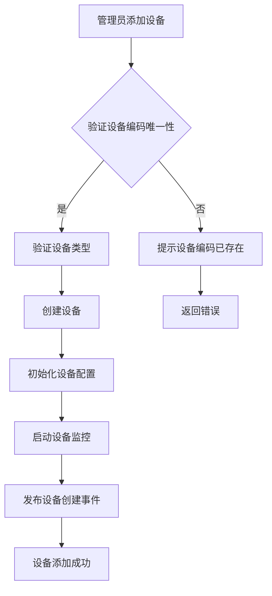

**Diagram sources**
- [smart-device.md](file://documentation/technical/smart-device.md#L473-L495)

### 设备配置
设备配置是设备全生命周期管理的重要环节。管理员可以通过系统界面或API接口对设备进行配置。配置内容包括设备的基本信息、网络参数、安全配置等。系统支持批量配置，可以同时对多个设备进行配置。配置完成后，系统会更新设备配置，并发布配置更新事件。

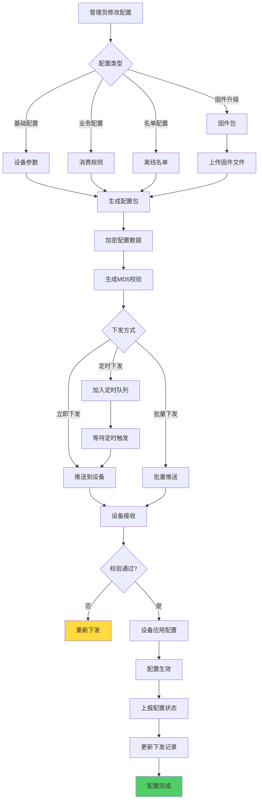

**Diagram sources**
- [14-设备管理模块重构设计.md](file://documentation/03-业务模块/消费/14-设备管理模块重构设计.md#L202-L241)

### 状态监控
状态监控是设备全生命周期管理的关键环节。系统通过心跳包和TCP连接状态判断设备的可用性。设备连接成功后，系统会定期发送心跳包，检测设备的在线状态。如果设备在规定时间内没有响应心跳包，系统会认为设备离线，并更新设备状态。此外，系统还会监控设备的运行状态，如CPU使用率、内存使用率、磁盘使用率等，及时发现设备故障。

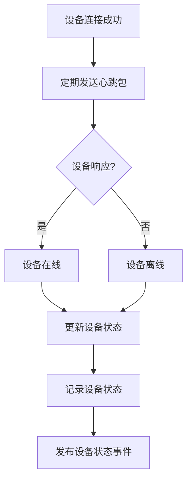

**Diagram sources**
- [smart-device.md](file://documentation/technical/smart-device.md#L1691-L1704)

### 设备删除
设备删除是设备全生命周期管理的最后一步。管理员可以通过系统界面或API接口删除设备。删除设备时，系统会停止设备监控，软删除设备，并发布设备删除事件。软删除意味着设备信息不会从数据库中彻底删除，而是标记为已删除，以便后续恢复。

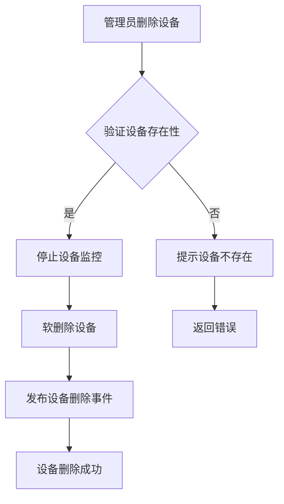

**Diagram sources**
- [smart-device.md](file://documentation/technical/smart-device.md#L518-L534)

**Section sources**
- [smart-device.md](file://documentation/technical/smart-device.md#L473-L534)

## 设备在线状态检测机制

设备在线状态检测机制通过心跳包和TCP连接状态判断设备的可用性。设备连接成功后，系统会定期发送心跳包，检测设备的在线状态。如果设备在规定时间内没有响应心跳包，系统会认为设备离线，并更新设备状态。

### 心跳包检测
心跳包检测是设备在线状态检测的主要方式。系统会定期向设备发送心跳包，设备收到心跳包后会立即响应。如果设备在规定时间内没有响应心跳包，系统会认为设备离线。心跳包的发送频率可以根据设备类型和网络状况进行调整，以确保检测的准确性和及时性。

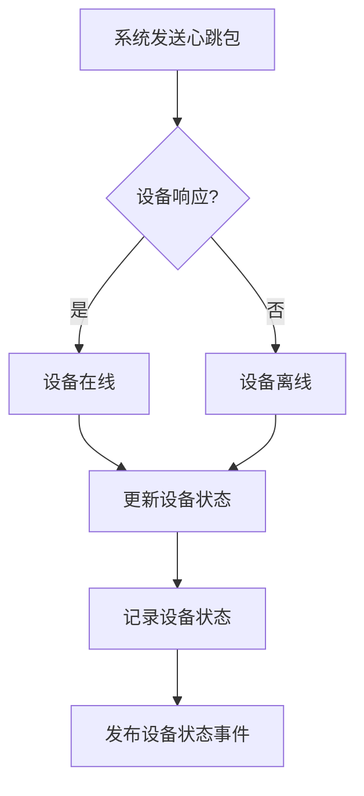

**Diagram sources**
- [smart-device.md](file://documentation/technical/smart-device.md#L1691-L1704)

### TCP连接状态检测
TCP连接状态检测是设备在线状态检测的辅助方式。系统会监控设备的TCP连接状态，如果连接断开，系统会认为设备离线。TCP连接状态检测可以快速发现设备的网络问题，但不能完全替代心跳包检测，因为设备可能在网络正常的情况下仍然无法响应心跳包。

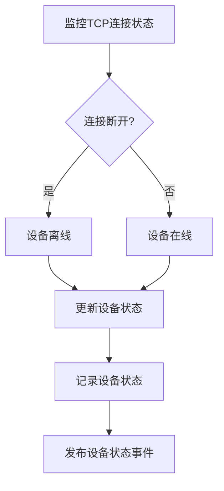

**Diagram sources**
- [smart-device.md](file://documentation/technical/smart-device.md#L1691-L1704)

**Section sources**
- [smart-device.md](file://documentation/technical/smart-device.md#L1691-L1704)

## 设备能力集探测流程

设备能力集探测流程通过设备协议接口获取设备支持的分辨率和编码格式。系统支持多种设备类型，每种设备类型都有对应的协议处理器。协议处理器会根据设备类型初始化默认配置，并通过设备连接获取设备的能力集信息。

### 协议处理器
协议处理器是设备能力集探测的核心组件。每种设备类型都有对应的协议处理器，协议处理器实现了设备协议接口，提供了获取设备能力集的方法。系统通过协议工厂获取对应的协议处理器，并调用其方法获取设备能力集。

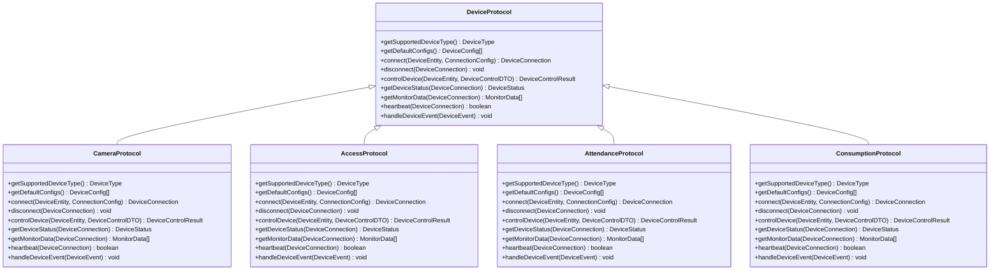

**Diagram sources**
- [smart-device.md](file://documentation/technical/smart-device.md#L1459-L1507)

### 能力集获取
能力集获取是设备能力集探测的具体实现。系统通过协议处理器的`getMonitorData`方法获取设备的监控数据，包括CPU使用率、内存使用率、磁盘使用率等。这些数据反映了设备的运行状态和性能指标。系统还会通过`getDeviceStatus`方法获取设备的状态信息，如设备是否在线、设备的运行状态等。

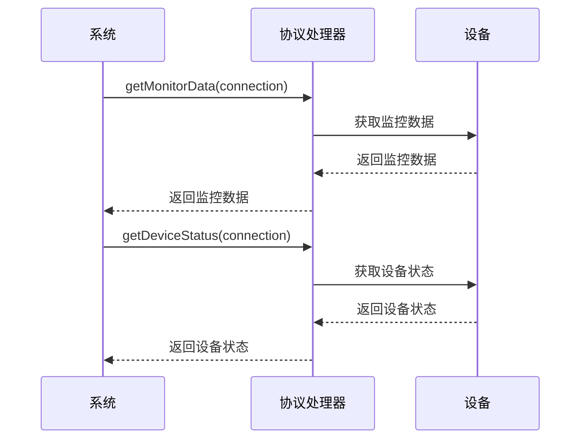

**Diagram sources**
- [smart-device.md](file://documentation/technical/smart-device.md#L1647-L1689)

**Section sources**
- [smart-device.md](file://documentation/technical/smart-device.md#L1459-L1689)

## 设备分组管理功能

设备分组管理功能支持按区域、类型等维度组织设备，方便管理和维护。系统通过设备分组表存储设备分组信息，包括分组编码、分组名称、父分组ID、分组类型等。管理员可以通过系统界面或API接口创建、修改、删除设备分组，并将设备分配到相应的分组中。

### 分组创建
分组创建是设备分组管理的第一步。管理员可以通过系统界面或API接口创建新的设备分组。创建分组时，需要提供分组的基本信息，如分组编码、分组名称、父分组ID、分组类型等。系统会验证分组编码的唯一性，并根据分组类型初始化分组配置。

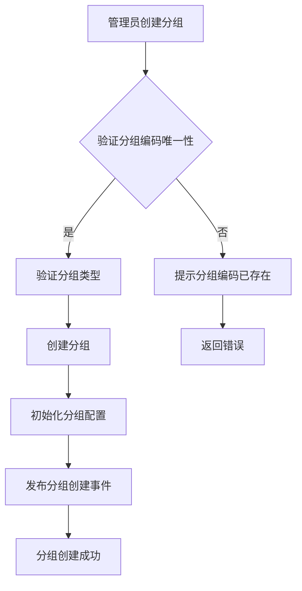

**Diagram sources**
- [smart-device.md](file://documentation/technical/smart-device.md#L249-L272)

### 分组修改
分组修改是设备分组管理的重要环节。管理员可以通过系统界面或API接口修改设备分组的信息。修改内容包括分组名称、父分组ID、分组类型等。系统会验证分组编码的唯一性，并根据分组类型更新分组配置。

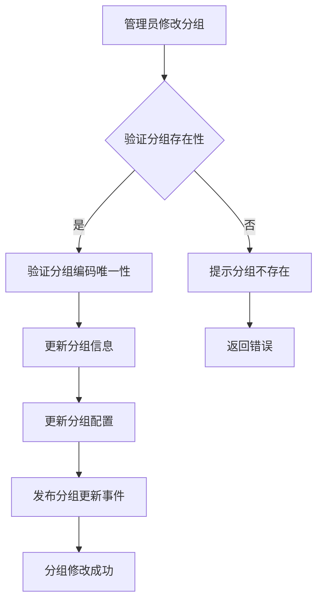

**Diagram sources**
- [smart-device.md](file://documentation/technical/smart-device.md#L249-L272)

### 分组删除
分组删除是设备分组管理的最后一步。管理员可以通过系统界面或API接口删除设备分组。删除分组时，系统会检查分组中是否有设备，如果有设备，需要先将设备移出分组。系统会软删除分组，并发布分组删除事件。

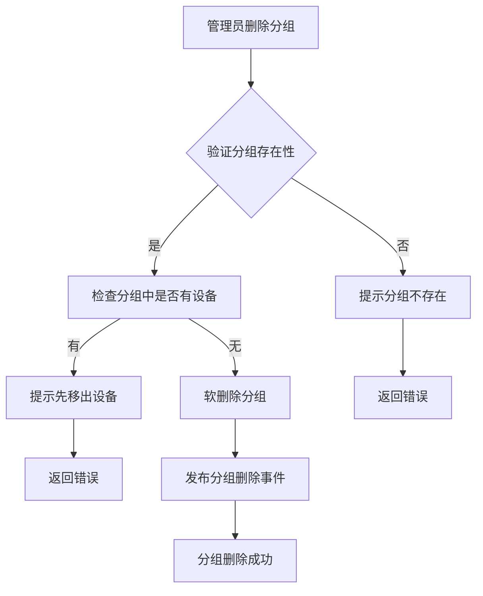

**Diagram sources**
- [smart-device.md](file://documentation/technical/smart-device.md#L249-L272)

**Section sources**
- [smart-device.md](file://documentation/technical/smart-device.md#L249-L272)

## 设备故障告警与维护模式

设备故障告警与维护模式是设备管理的重要功能。系统通过监控设备的运行状态，及时发现设备故障，并通过告警通知管理员。维护模式允许管理员在设备维护期间暂停设备的监控和告警，避免误报。

### 故障告警
故障告警是设备故障检测的主要方式。系统会监控设备的运行状态，如CPU使用率、内存使用率、磁盘使用率等，当这些指标超过预设阈值时，系统会触发告警。告警信息包括告警级别、告警类型、告警描述等。系统支持多种告警方式，如邮件、短信、推送通知等。

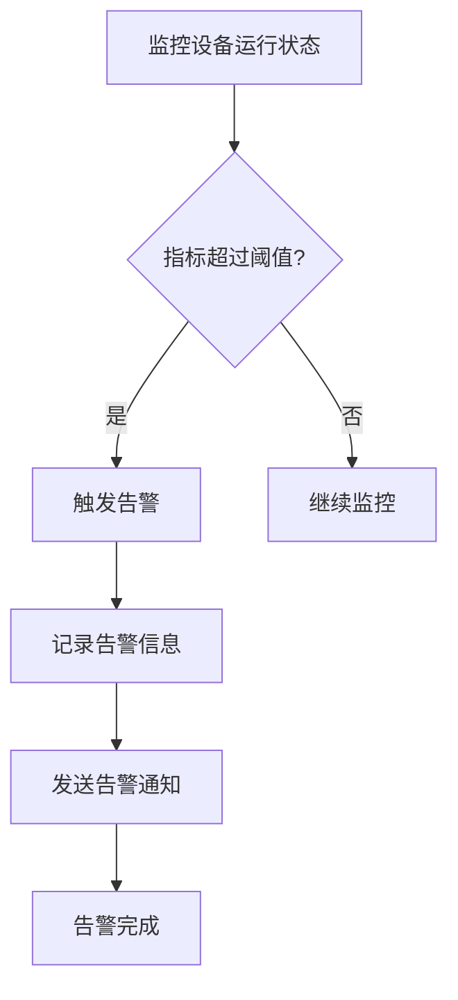

**Diagram sources**
- [smart-device.md](file://documentation/technical/smart-device.md#L324-L347)

### 维护模式
维护模式是设备维护期间的重要功能。管理员可以通过系统界面或API接口将设备设置为维护模式。在维护模式下，系统会暂停设备的监控和告警，避免误报。维护模式结束后，系统会恢复设备的监控和告警。

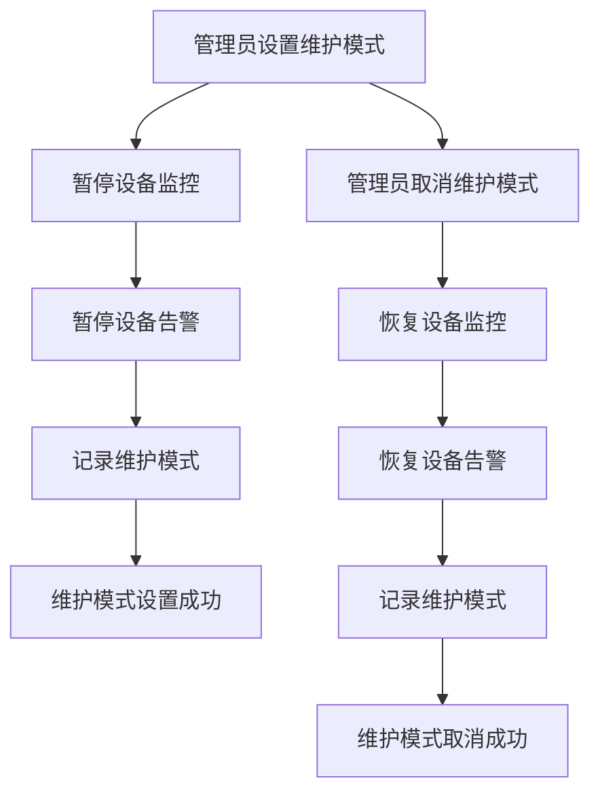

**Diagram sources**
- [smart-device.md](file://documentation/technical/smart-device.md#L324-L347)

**Section sources**
- [smart-device.md](file://documentation/technical/smart-device.md#L324-L347)

## 结论
设备管理是智能视频系统的核心功能之一，涵盖了设备的全生命周期管理。通过统一的设备管理模块，系统实现了设备的添加、配置、状态监控和删除等操作，确保设备的高效运行和维护。设备在线状态检测机制通过心跳包和TCP连接状态判断设备的可用性，及时发现设备故障。设备能力集探测流程通过设备协议接口获取设备支持的分辨率和编码格式，确保设备的兼容性。设备分组管理功能支持按区域、类型等维度组织设备，方便管理和维护。设备故障告警与维护模式提供了完善的故障检测和维护方案，确保系统的稳定运行。未来，系统将进一步优化设备管理功能，提升设备的智能化管理水平。