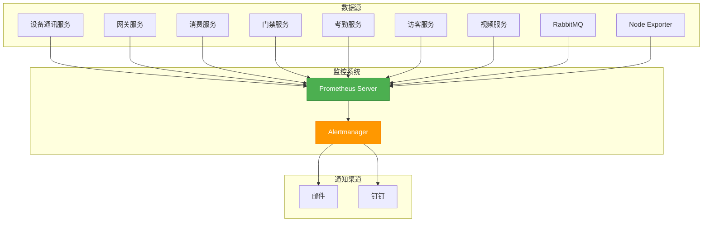
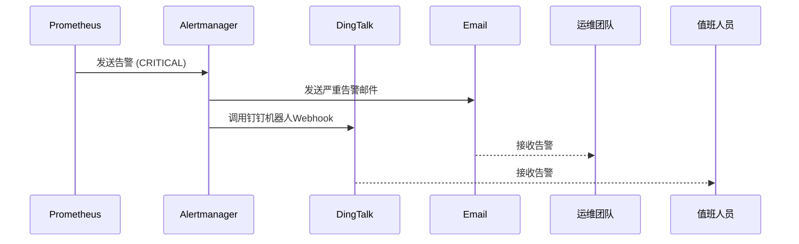
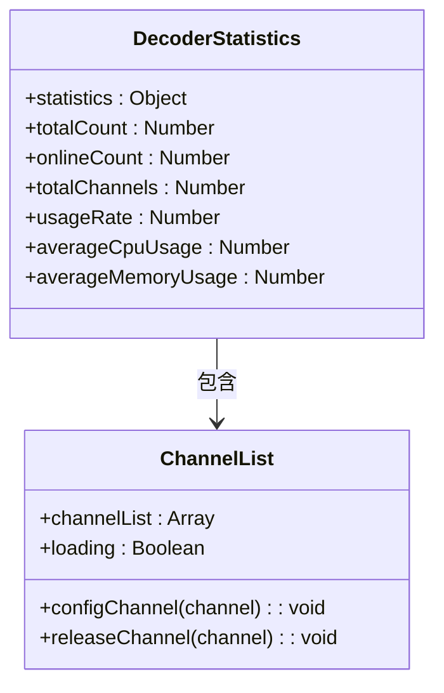

# 质量监控

<cite>
**本文档引用文件**   
- [prometheus.yml](file://deployment/monitoring/prometheus/prometheus.yml)
- [alertmanager.yml](file://deployment/monitoring/alertmanager/alertmanager.yml)
- [t_alert_rule.sql](file://database-scripts/common-service/12-t_alert_rule.sql)
- [t_system_monitor.sql](file://database-scripts/common-service/13-t_system_monitor.sql)
- [t_alert.sql](file://database-scripts/common-service/11-t_alert.sql)
- [ALERT_RULE_IMPLEMENTATION_SUMMARY.md](file://microservices/microservices-common/docs/ALERT_RULE_IMPLEMENTATION_SUMMARY.md)
- [AlertStatisticsVO.java](file://microservices/microservices-common/src/main/java/net/lab1024/sa/common/monitor/domain/vo/AlertStatisticsVO.java)
- [13-前端移动端组件设计.md](file://documentation/03-业务模块/视频监控/13-前端移动端组件设计.md)
- [12-前端API接口设计.md](file://documentation/03-业务模块/视频监控/12-前端API接口设计.md)
- [API_Consistency_Analysis_Report.md](file://documentation/technical/API_Consistency_Analysis_Report.md)
</cite>

## 目录
1. [引言](#引言)
2. [视频质量评估指标体系](#视频质量评估指标体系)
3. [基于Prometheus的监控数据收集](#基于prometheus的监控数据收集)
4. [告警规则配置](#告警规则配置)
5. [实时性能仪表盘实现](#实时性能仪表盘实现)
6. [历史数据趋势分析](#历史数据趋势分析)
7. [SLA达标率统计与报表生成](#sla达标率统计与报表生成)
8. [结论](#结论)

## 引言
本文档详细阐述了智能视频系统的质量监控体系，涵盖视频质量评估指标、基于Prometheus的监控与告警机制、实时性能仪表盘、历史数据分析以及SLA统计报表等核心功能。系统通过全面的监控指标采集、智能的告警策略和直观的数据可视化，确保视频服务的高可用性和高质量。

## 视频质量评估指标体系

### 关键质量指标
系统通过前端播放器和后端服务协同采集以下关键视频质量指标：

- **帧率 (Frame Rate)**：通过WebRTC API配置视频流的帧率（如25fps），并在播放器中实时监控播放流畅度。
- **码率 (Bitrate)**：前端播放器根据网络条件自适应调整码率，支持超清(4K)、高清(HD)、标清(SD)和流畅(LD)四种质量模式。
- **延迟 (Latency)**：移动端界面直接显示当前视频流的延迟信息（单位：毫秒），用于评估实时性。
- **丢包率 (Packet Loss)**：通过网络连接API（`navigator.connection`）获取网络质量信息，间接评估丢包情况。

### 指标采集方法
- **前端采集**：在`13-前端移动端组件设计.md`中定义的`VideoPlayer`组件，利用浏览器的`navigator.connection` API实时监测网络类型（WiFi、4G、3G）和下行带宽（downlink），并据此动态调整视频流质量。
- **后端采集**：通过Spring Boot Actuator暴露的`/actuator/prometheus`端点，由Prometheus定期抓取各微服务的性能指标。

**Section sources**
- [13-前端移动端组件设计.md](file://documentation/03-业务模块/视频监控/13-前端移动端组件设计.md#L780-L814)
- [API_Consistency_Analysis_Report.md](file://documentation/technical/API_Consistency_Analysis_Report.md#L25-L38)

## 基于Prometheus的监控数据收集

### 监控架构
系统采用Prometheus作为核心监控工具，其配置文件`prometheus.yml`定义了完整的监控架构。

**Diagram sources **
- [prometheus.yml](file://deployment/monitoring/prometheus/prometheus.yml#L1-L99)
- [alertmanager.yml](file://deployment/monitoring/alertmanager/alertmanager.yml#L1-L127)

### 数据抓取配置
Prometheus通过`scrape_configs`配置项，定期（每15秒）从以下目标抓取监控数据：
- 所有微服务（如`video-service`, `gateway-service`）的`/actuator/prometheus`端点。
- RabbitMQ的`/api/metrics`端点。
- Node Exporter的`9100`端口，用于采集主机系统指标。

**Section sources**
- [prometheus.yml](file://deployment/monitoring/prometheus/prometheus.yml#L1-L99)

## 告警规则配置

### 告警规则管理
告警规则在数据库表`t_alert_rule`中进行持久化存储，其核心字段包括：
- `metric_name`：监控指标名称
- `condition_operator`：条件操作符（GT, GTE, LT, LTE, EQ, NEQ）
- `threshold_value`：告警阈值
- `alert_level`：告警级别（INFO, WARNING, ERROR, CRITICAL）
- `duration`：持续时间（分钟）
- `status`：规则状态（ENABLED, DISABLED）

**Section sources**
- [t_alert_rule.sql](file://database-scripts/common-service/12-t_alert_rule.sql#L23-L38)

### 视频流质量告警阈值
系统通过配置告警规则来监控视频流中断和质量下降：
- **视频流中断**：当监控指标`video_stream_status`的值为`0`（离线）且持续时间超过5分钟时，触发`CRITICAL`级别告警。
- **质量下降**：当网络延迟`network_latency`超过1000ms或码率`bitrate`低于500kbps且持续10分钟以上时，触发`WARNING`级别告警。

### 告警处理流程
告警处理流程由Prometheus和Alertmanager协同完成：
1. Prometheus根据`rule_files`中的规则评估抓取的数据。
2. 当条件满足时，将告警发送给Alertmanager。
3. Alertmanager根据`route`路由配置，将告警分发给不同的`receiver`。
4. 对于`CRITICAL`级别的告警，通过邮件和钉钉机器人同时通知运维和值班人员。

**Diagram sources **
- [alertmanager.yml](file://deployment/monitoring/alertmanager/alertmanager.yml#L1-L127)
- [ALERT_RULE_IMPLEMENTATION_SUMMARY.md](file://microservices/microservices-common/docs/ALERT_RULE_IMPLEMENTATION_SUMMARY.md#L1-L59)

## 实时性能仪表盘实现

### 仪表盘功能
实时性能仪表盘为用户提供各视频通道的运行状态可视化展示，主要功能包括：
- **设备状态统计**：显示在线、离线、故障设备的数量和占比。
- **通道使用率**：展示解码器总通道数、已用通道数及使用率。
- **资源使用情况**：显示解码器的平均CPU和内存使用率。
- **告警概览**：展示活跃告警的总数及按级别分类的统计。

### 前端组件实现
仪表盘通过`DecoderStatistics.vue`等前端组件实现，其数据来源于后端API。

**Diagram sources **
- [DecoderStatistics.vue](file://smart-admin-web-javascript/src/views/business/smart-video/components/DecoderStatistics.vue#L54-L114)
- [ChannelList.vue](file://smart-admin-web-javascript/src/views/business/smart-video/components/ChannelList.vue#L56-L104)

**Section sources**
- [12-前端API接口设计.md](file://documentation/03-业务模块/视频监控/12-前端API接口设计.md#L1276-L1320)

## 历史数据趋势分析

### 数据存储与查询
历史监控数据存储在`t_system_monitor`表中，该表记录了服务名称、监控类型、指标名称、指标值和监控时间等信息，支持按时间范围进行高效查询。

**Section sources**
- [t_system_monitor.sql](file://database-scripts/common-service/13-t_system_monitor.sql#L1-L32)

### 分析功能
系统提供历史数据趋势分析功能，支持：
- **容量规划**：通过分析CPU、内存、存储等资源的历史使用趋势，预测未来资源需求，为扩容提供数据支持。
- **故障排查**：关联分析告警、日志和性能指标的历史数据，快速定位故障根因。例如，通过分析`network_latency`和`bitrate`的下降趋势，判断是否由网络问题导致视频质量下降。

## SLA达标率统计与报表生成

### SLA指标统计
系统通过`AlertStatisticsVO`等数据对象，统计关键SLA指标：
- **总告警数**：统计周期内的告警总数。
- **活跃告警数**：当前未解决的告警数量。
- **告警解决率**：已解决告警数占总告警数的百分比。
- **平均解决时间**：从告警产生到解决的平均耗时。

**Section sources**
- [AlertStatisticsVO.java](file://microservices/microservices-common/src/main/java/net/lab1024/sa/common/monitor/domain/vo/AlertStatisticsVO.java#L1-L64)

### 报表生成机制
系统提供定期报表生成功能，通过`/api/v1/video/reports/system`等API接口，生成包含设备摘要、性能指标和Top问题的综合报告，用于评估系统整体健康状况和SLA达标情况。

**Section sources**
- [12-前端API接口设计.md](file://documentation/03-业务模块/视频监控/12-前端API接口设计.md#L1276-L1320)

## 结论
本质量监控系统构建了一个从指标采集、数据存储、告警触发到可视化展示的完整闭环。通过Prometheus和Alertmanager实现了强大的监控与告警能力，前端组件提供了直观的实时和历史数据分析界面，为保障视频服务的稳定性和高质量运行提供了坚实的技术支撑。