```mermaid
flowchart TD
A([创建考勤记录]) --> B["验证请求参数"]
B --> C{"参数有效?"}
C --> |否| D["返回参数错误"]
C --> |是| E["记录日志[考勤记录] 创建考勤记录"]
E --> F["调用attendanceRecordService.createAttendanceRecord()"]
F --> G{"创建成功?"}
G --> |否| H["记录错误日志"]
G --> |是| I["返回创建的记录ID"]
D --> J([结束])
H --> K["返回创建失败"]
I --> J
K --> J
```

# 事件联动回放

<cite>
**本文档引用文件**  
- [VideoPlayController.java](file://microservices\ioedream-video-service\src\main\java\net\lab1024\sa\video\controller\VideoPlayController.java)
- [VideoPlayService.java](file://microservices\ioedream-video-service\src\main\java\net\lab1024\sa\video\service\VideoPlayService.java)
- [AccessRecordController.java](file://microservices\ioedream-access-service\src\main\java\net\lab1024\sa\access\controller\AccessRecordController.java)
- [AttendanceRecordController.java](file://microservices\ioedream-attendance-service\src\main\java\net\lab1024\sa\attendance\controller\AttendanceRecordController.java)
- [AlertController.java](file://microservices\ioedream-common-service\src\main\java\net\lab1024\sa\common\monitor\controller\AlertController.java)
- [t_alert.sql](file://database-scripts\common-service\11-t_alert.sql)
- [t_access_record.sql](file://database-scripts\access\11-t_access_record.sql)
- [t_attendance_record.sql](file://database-scripts\attendance\11-t_attendance_record.sql)
- [event-subscription-page.md](file://smart-admin-web-javascript\AI开发文档\事件订阅页面功能布局文档_完善版.md)
- [real-time-monitoring-enhancement.md](file://openspec\changes\archive\completed-proposals\implement-access-control-missing-functions\specs\real-time-monitoring-enhancement\spec.md)
</cite>

## 目录
1. [引言](#引言)
2. [项目结构](#项目结构)
3. [核心组件](#核心组件)
4. [架构概述](#架构概述)
5. [详细组件分析](#详细组件分析)
6. [依赖分析](#依赖分析)
7. [性能考虑](#性能考虑)
8. [故障排除指南](#故障排除指南)
9. [结论](#结论)
10. [附录](#附录)（如有必要）

## 引言
事件联动回放功能是智能视频监控系统中的核心功能之一，旨在实现报警事件、门禁记录、考勤打卡等业务事件与对应时间段录像的智能关联。通过该功能，用户可以点击任意业务事件，系统将自动定位并播放相关录像片段，实现事件与视频的无缝联动。本功能支持多设备同步回放，允许用户查看同一事件在不同摄像头下的录像，提供全面的事件还原能力。同时，系统实现了事件过滤和优先级排序机制，确保重要事件能够被及时发现和处理。

## 项目结构
事件联动回放功能涉及多个微服务模块的协同工作，主要包括视频服务、门禁服务、考勤服务和告警服务。这些服务通过统一的API网关进行集成，前端应用通过WebSocket实现实时事件推送。系统采用模块化设计，各服务职责明确，通过事件驱动架构实现松耦合的交互模式。

**图表来源**
- [VideoPlayController.java](file://microservices\ioedream-video-service\src\main\java\net\lab1024\sa\video\controller\VideoPlayController.java)
- [AccessRecordController.java](file://microservices\ioedream-access-service\src\main\java\net\lab1024\sa\access\controller\AccessRecordController.java)
- [AttendanceRecordController.java](file://microservices\ioedream-attendance-service\src\main\java\net\lab1024\sa\attendance\controller\AttendanceRecordController.java)

**章节来源**
- [VideoPlayController.java](file://microservices\ioedream-video-service\src\main\java\net\lab1024\sa\video\controller\VideoPlayController.java)
- [AccessRecordController.java](file://microservices\ioedream-access-service\src\main\java\net\lab1024\sa\access\controller\AccessRecordController.java)

## 核心组件
事件联动回放功能的核心组件包括视频播放服务、门禁记录服务、考勤记录服务和告警服务。视频播放服务负责提供视频流地址和截图功能，门禁和考勤服务负责记录和查询业务事件，告警服务负责管理各类报警事件。这些服务通过统一的数据模型和API规范进行交互，确保数据的一致性和系统的稳定性。

**章节来源**
- [VideoPlayService.java](file://microservices\ioedream-video-service\src\main\java\net\lab1024\sa\video\service\VideoPlayService.java)
- [AccessRecordController.java](file://microservices\ioedream-access-service\src\main\java\net\lab1024\sa\access\controller\AccessRecordController.java)
- [AttendanceRecordController.java](file://microservices\ioedream-attendance-service\src\main\java\net\lab1024\sa\attendance\controller\AttendanceRecordController.java)

## 架构概述
事件联动回放功能采用分层架构设计，包括前端展示层、API网关层、业务服务层和数据存储层。前端展示层负责用户界面和交互逻辑，API网关层负责请求路由和安全认证，业务服务层负责核心业务逻辑处理，数据存储层负责数据持久化。系统采用事件驱动架构，当业务事件发生时，通过消息队列通知相关服务，实现事件的实时处理和联动。

**图表来源**
- [VideoPlayController.java](file://microservices\ioedream-video-service\src\main\java\net\lab1024\sa\video\controller\VideoPlayController.java)
- [AccessRecordController.java](file://microservices\ioedream-access-service\src\main\java\net\lab1024\sa\access\controller\AccessRecordController.java)
- [AttendanceRecordController.java](file://microservices\ioedream-attendance-service\src\main\java\net\lab1024\sa\attendance\controller\AttendanceRecordController.java)

## 详细组件分析
事件联动回放功能的详细组件分析包括视频播放组件、门禁记录组件、考勤记录组件和告警组件。每个组件都有明确的职责和接口定义，通过标准化的API进行交互。系统采用微服务架构，各组件可以独立部署和扩展，提高了系统的灵活性和可维护性。

### 视频播放组件分析
视频播放组件负责提供视频流地址和截图功能，支持实时视频流播放和录像回放。组件通过RESTful API提供服务，支持多种流类型和分辨率。系统采用分布式架构，可以支持大规模并发访问。

#### 对于面向对象组件：

**图表来源**
- [VideoPlayController.java](file://microservices\ioedream-video-service\src\main\java\net\lab1024\sa\video\controller\VideoPlayController.java)
- [VideoPlayService.java](file://microservices\ioedream-video-service\src\main\java\net\lab1024\sa\video\service\VideoPlayService.java)

#### 对于API/服务组件：

**图表来源**
- [VideoPlayController.java](file://microservices\ioedream-video-service\src\main\java\net\lab1024\sa\video\controller\VideoPlayController.java)
- [VideoPlayService.java](file://microservices\ioedream-video-service\src\main\java\net\lab1024\sa\video\service\VideoPlayService.java)

### 门禁记录组件分析
门禁记录组件负责处理门禁事件的创建、查询和统计。当门禁设备检测到通行事件时，通过API接口创建门禁记录，并与视频系统联动，实现事件与录像的关联。系统支持分页查询和多条件筛选，满足不同场景下的查询需求。

#### 对于复杂逻辑组件：

**图表来源**
- [AccessRecordController.java](file://microservices\ioedream-access-service\src\main\java\net\lab1024\sa\access\controller\AccessRecordController.java)
- [AccessEventService.java](file://microservices\ioedream-access-service\src\main\java\net\lab1024\sa\access\service\AccessEventService.java)

**章节来源**
- [AccessRecordController.java](file://microservices\ioedream-access-service\src\main\java\net\lab1024\sa\access\controller\AccessRecordController.java)
- [AccessEventService.java](file://microservices\ioedream-access-service\src\main\java\net\lab1024\sa\access\service\AccessEventService.java)

### 考勤记录组件分析
考勤记录组件负责处理考勤打卡事件的创建、查询和统计。系统支持多种考勤方式，包括人脸识别、指纹识别和刷卡等。当员工进行考勤打卡时，系统记录打卡时间、地点和设备信息，并与视频系统联动，实现考勤事件与录像的关联。

#### 对于复杂逻辑组件：

**图表来源**
- [AttendanceRecordController.java](file://microservices\ioedream-attendance-service\src\main\java\net\lab1024\sa\attendance\controller\AttendanceRecordController.java)
- [AttendanceRecordService.java](file://microservices\ioedream-attendance-service\src\main\java\net\lab1024\sa\attendance\service\AttendanceRecordService.java)

**章节来源**
- [AttendanceRecordController.java](file://microservices\ioedream-attendance-service\src\main\java\net\lab1024\sa\attendance\controller\AttendanceRecordController.java)
- [AttendanceRecordService.java](file://microservices\ioedream-attendance-service\src\main\java\net\lab1024\sa\attendance\service\AttendanceRecordService.java)

### 告警组件分析
告警组件负责管理各类报警事件，包括安全告警、设备告警和系统告警。当系统检测到异常情况时，触发告警事件，并通过多种渠道通知相关人员。告警事件与视频系统联动，实现报警与录像的自动关联。

#### 对于API/服务组件：

**图表来源**
- [AlertController.java](file://microservices\ioedream-common-service\src\main\java\net\lab1024\sa\common\monitor\controller\AlertController.java)
- [AlertService.java](file://microservices\microservices-common\src\main\java\net\lab1024\sa\common\monitor\service\AlertService.java)

**章节来源**
- [AlertController.java](file://microservices\ioedream-common-service\src\main\java\net\lab1024\sa\common\monitor\controller\AlertController.java)
- [AlertService.java](file://microservices\microservices-common\src\main\java\net\lab1024\sa\common\monitor\service\AlertService.java)

## 依赖分析
事件联动回放功能依赖于多个外部系统和服务，包括视频流系统、门禁设备、考勤设备和通知系统。系统通过标准化的API接口与这些外部系统进行集成，确保数据的可靠传输和系统的稳定运行。各微服务之间通过API网关进行通信，实现了松耦合的架构设计。

**图表来源**
- [t_alert.sql](file://database-scripts\common-service\11-t_alert.sql)
- [t_access_record.sql](file://database-scripts\access\11-t_access_record.sql)
- [t_attendance_record.sql](file://database-scripts\attendance\11-t_attendance_record.sql)

**章节来源**
- [t_alert.sql](file://database-scripts\common-service\11-t_alert.sql)
- [t_access_record.sql](file://database-scripts\access\11-t_access_record.sql)
- [t_attendance_record.sql](file://database-scripts\attendance\11-t_attendance_record.sql)

## 性能考虑
事件联动回放功能在设计时充分考虑了性能因素，采用多种优化策略确保系统的高效运行。系统采用数据库分区技术，将大量录像数据按时间分区存储，提高了查询效率。同时，系统实现了缓存机制，对频繁访问的数据进行缓存，减少了数据库访问压力。对于视频流传输，系统采用流媒体服务器进行转发，支持H.264/H.265编码，确保视频传输的流畅性。

## 故障排除指南
当事件联动回放功能出现异常时，可以按照以下步骤进行排查：首先检查API网关是否正常运行，确保请求能够正确路由；其次检查各微服务的运行状态，确认服务是否正常启动；然后检查数据库连接是否正常，确保数据能够正常读写；最后检查外部系统连接，确认视频流系统、门禁设备等外部系统是否正常工作。系统提供了详细的日志记录，可以通过日志分析具体的问题原因。

**章节来源**
- [VideoPlayController.java](file://microservices\ioedream-video-service\src\main\java\net\lab1024\sa\video\controller\VideoPlayController.java)
- [AccessRecordController.java](file://microservices\ioedream-access-service\src\main\java\net\lab1024\sa\access\controller\AccessRecordController.java)
- [AttendanceRecordController.java](file://microservices\ioedream-attendance-service\src\main\java\net\lab1024\sa\attendance\controller\AttendanceRecordController.java)

## 结论
事件联动回放功能通过将报警事件、门禁记录、考勤打卡等业务事件与对应时间段的录像进行智能关联，实现了事件驱动的自动跳转播放机制。用户点击事件即可自动定位并播放相关录像片段，大大提高了事件处理的效率。系统支持多设备同步回放，允许用户查看同一事件在不同摄像头下的录像，提供了全面的事件还原能力。通过事件过滤和优先级排序机制，确保重要事件能够被及时发现和处理。该功能的实现采用了微服务架构和事件驱动设计，具有良好的可扩展性和可维护性，为智能视频监控系统提供了强大的支持。