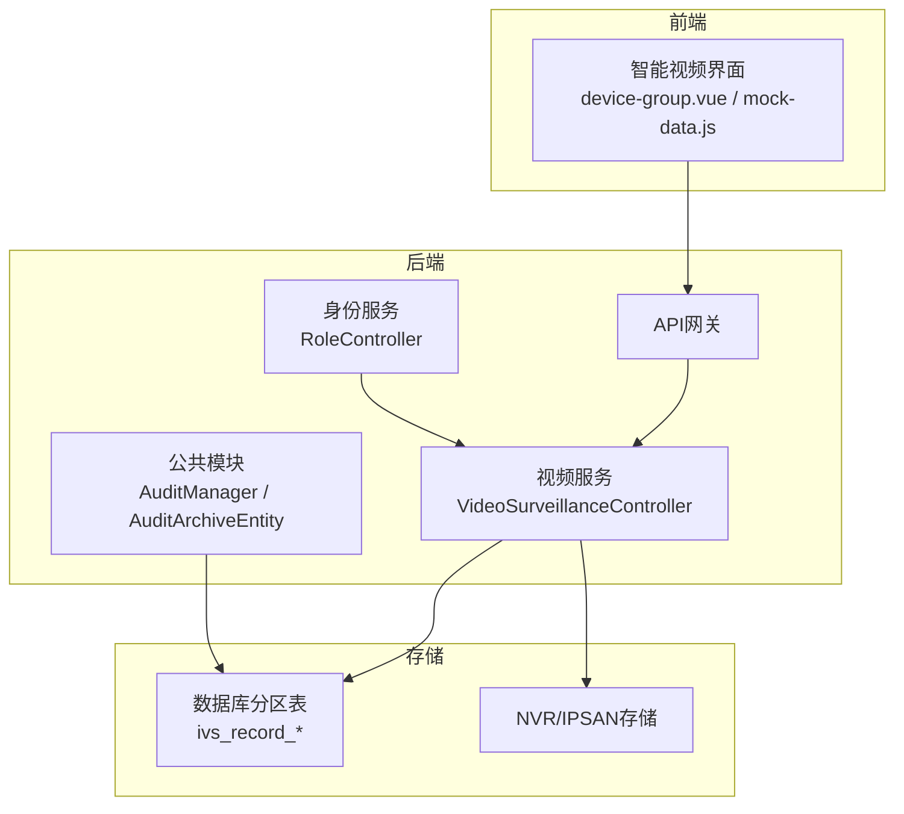
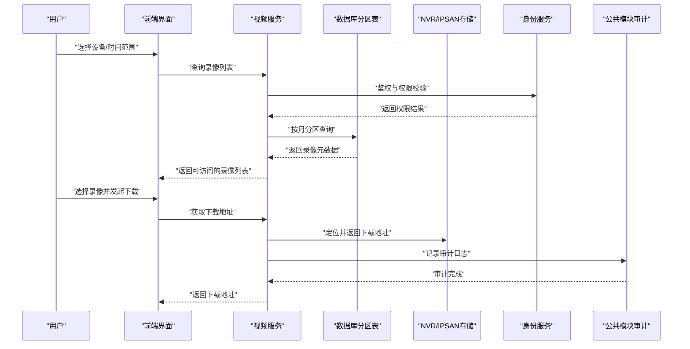
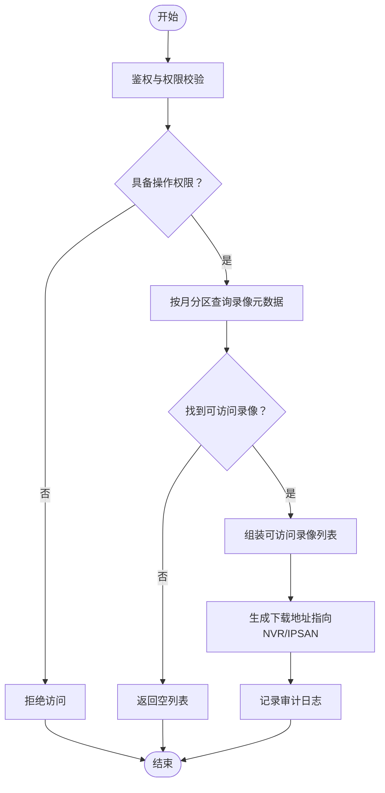
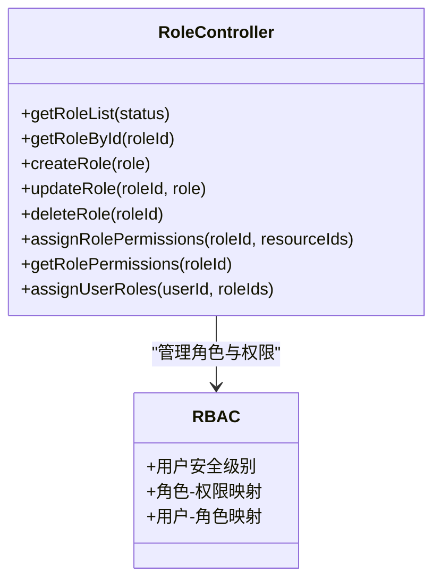
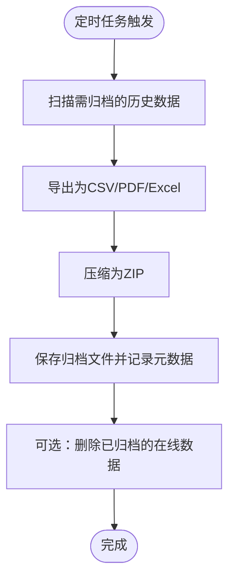
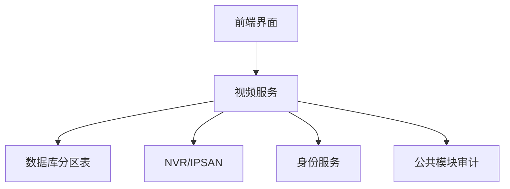

# 安全与存储

<cite>
**本文引用的文件**
- [07-项目总结.md](file://documentation/03-业务模块/智能视频/07-项目总结.md)
- [02-安全级别详细设计.md](file://documentation/03-业务模块/智能视频/02-安全级别详细设计.md)
- [05-数据库设计与ER图.md](file://documentation/03-业务模块/智能视频/05-数据库设计与ER图.md)
- [VideoSurveillanceController.java](file://restful_refactor_backup_20251202_014224/microservices_ioedream-video-service_src_main_java_net_lab1024_sa_video_controller_VideoSurveillanceController.java)
- [RoleController.java](file://restful_refactor_backup_20251202_014224/microservices_ioedream-identity-service_src_main_java_net_lab1024_sa_identity_module_rbac_controller_RoleController.java)
- [AuditManager.java](file://microservices/microservices-common/src/main/java/net/lab1024/sa/common/audit/manager/AuditManager.java)
- [AuditArchiveEntity.java](file://microservices/microservices-common/src/main/java/net/lab1024/sa/common/audit/entity/AuditArchiveEntity.java)
- [device-group.vue](file://smart-admin-web-javascript/src/views/business/smart-video/device-group.vue)
- [mock-data.js](file://smart-admin-web-javascript/src/views/business/smart-video/mock-data.js)
- [PRODUCTION_SECURITY_CHECKLIST.md](file://PRODUCTION_SECURITY_CHECKLIST.md)
</cite>

## 目录
1. [引言](#引言)
2. [项目结构](#项目结构)
3. [核心组件](#核心组件)
4. [架构总览](#架构总览)
5. [详细组件分析](#详细组件分析)
6. [依赖分析](#依赖分析)
7. [性能考虑](#性能考虑)
8. [故障排查指南](#故障排查指南)
9. [结论](#结论)
10. [附录](#附录)

## 引言
本文件围绕“录像安全与存储”主题，结合仓库现有设计文档与代码实现，系统阐述智能视频模块在NVR/IPSAN中的存储架构、访问权限控制机制、加密与完整性校验方案、基于角色的录像访问权限管理，以及录像保留策略与自动归档能力。旨在帮助开发者与运维人员快速理解并落地安全与存储相关功能。

## 项目结构
- 智能视频模块采用七微服务架构，其中视频服务提供录像查询、下载、录制等能力；身份服务提供RBAC角色与权限管理；公共模块提供审计与归档能力；前端提供设备与录像管理界面。
- 录像存储采用数据库分区表与外部存储（NVR/IPSAN）相结合的方式，结合权限控制与归档策略，形成完整的安全与存储闭环。

图表来源
- [VideoSurveillanceController.java](file://restful_refactor_backup_20251202_014224/microservices_ioedream-video-service_src_main_java_net_lab1024_sa_video_controller_VideoSurveillanceController.java#L1-L265)
- [RoleController.java](file://restful_refactor_backup_20251202_014224/microservices_ioedream-identity-service_src_main_java_net_lab1024_sa_identity_module_rbac_controller_RoleController.java#L1-L187)
- [AuditManager.java](file://microservices/microservices-common/src/main/java/net/lab1024/sa/common/audit/manager/AuditManager.java#L1-L677)
- [AuditArchiveEntity.java](file://microservices/microservices-common/src/main/java/net/lab1024/sa/common/audit/entity/AuditArchiveEntity.java#L1-L130)
- [05-数据库设计与ER图.md](file://documentation/03-业务模块/智能视频/05-数据库设计与ER图.md#L534-L641)

章节来源
- [07-项目总结.md](file://documentation/03-业务模块/智能视频/07-项目总结.md#L1-L120)
- [05-数据库设计与ER图.md](file://documentation/03-业务模块/智能视频/05-数据库设计与ER图.md#L534-L641)

## 核心组件
- 录像存储与访问
  - 录像主表按月分区，便于历史数据管理与查询优化。
  - 录像文件路径与元数据存储于数据库，实际视频文件落盘至NVR/IPSAN。
- 权限控制
  - 基于五级安全级别与RBAC的角色权限矩阵，严格限制录像的查询、下载、删除等操作。
- 审计与归档
  - 审计日志导出与归档，支持CSV/PDF/Excel格式，并生成压缩包与归档记录，满足合规与追溯要求。
- 前端设备与存储展示
  - 前端界面展示NVR设备与通道信息，支撑录像存储位置与容量的可视化管理。

章节来源
- [05-数据库设计与ER图.md](file://documentation/03-业务模块/智能视频/05-数据库设计与ER图.md#L534-L641)
- [VideoSurveillanceController.java](file://restful_refactor_backup_20251202_014224/microservices_ioedream-video-service_src_main_java_net_lab1024_sa_video_controller_VideoSurveillanceController.java#L1-L265)
- [RoleController.java](file://restful_refactor_backup_20251202_014224/microservices_ioedream-identity-service_src_main_java_net_lab1024_sa_identity_module_rbac_controller_RoleController.java#L1-L187)
- [AuditManager.java](file://microservices/microservices-common/src/main/java/net/lab1024/sa/common/audit/manager/AuditManager.java#L483-L677)
- [AuditArchiveEntity.java](file://microservices/microservices-common/src/main/java/net/lab1024/sa/common/audit/entity/AuditArchiveEntity.java#L1-L130)
- [device-group.vue](file://smart-admin-web-javascript/src/views/business/smart-video/device-group.vue#L440-L472)
- [mock-data.js](file://smart-admin-web-javascript/src/views/business/smart-video/mock-data.js#L161-L209)

## 架构总览
下图展示录像从采集到存储、权限控制与归档的整体流程。

图表来源
- [VideoSurveillanceController.java](file://restful_refactor_backup_20251202_014224/microservices_ioedream-video-service_src_main_java_net_lab1024_sa_video_controller_VideoSurveillanceController.java#L105-L161)
- [RoleController.java](file://restful_refactor_backup_20251202_014224/microservices_ioedream-identity-service_src_main_java_net_lab1024_sa_identity_module_rbac_controller_RoleController.java#L1-L187)
- [AuditManager.java](file://microservices/microservices-common/src/main/java/net/lab1024/sa/common/audit/manager/AuditManager.java#L483-L677)

## 详细组件分析

### 录像存储架构与访问控制
- 存储架构
  - 录像主表按月分区，便于历史数据管理与查询优化，同时支持自动归档策略。
  - 录像文件路径与元数据存储于数据库，实际视频文件落盘至NVR/IPSAN，前端通过下载地址访问。
- 访问控制
  - 控制器接口对关键操作（如录像下载、停止录制）进行权限校验，确保只有具备相应权限的用户可执行。
  - 前端设备列表展示NVR设备与通道信息，支撑存储位置与容量的可视化管理。

图表来源
- [VideoSurveillanceController.java](file://restful_refactor_backup_20251202_014224/microservices_ioedream-video-service_src_main_java_net_lab1024_sa_video_controller_VideoSurveillanceController.java#L105-L161)
- [05-数据库设计与ER图.md](file://documentation/03-业务模块/智能视频/05-数据库设计与ER图.md#L534-L641)

章节来源
- [05-数据库设计与ER图.md](file://documentation/03-业务模块/智能视频/05-数据库设计与ER图.md#L534-L641)
- [VideoSurveillanceController.java](file://restful_refactor_backup_20251202_014224/microservices_ioedream-video-service_src_main_java_net_lab1024_sa_video_controller_VideoSurveillanceController.java#L105-L161)
- [device-group.vue](file://smart-admin-web-javascript/src/views/business/smart-video/device-group.vue#L440-L472)
- [mock-data.js](file://smart-admin-web-javascript/src/views/business/smart-video/mock-data.js#L161-L209)

### 基于角色的录像访问权限管理
- 五级安全级别与RBAC
  - 通过角色与权限矩阵，严格控制录像的查询、下载、删除等操作。不同安全级别对录像的访问范围与操作权限差异明显。
  - 角色控制器提供角色创建、权限分配、用户角色分配等能力，支撑录像访问权限的集中管理。
- 前端权限控制
  - 前端根据用户安全级别动态渲染菜单与按钮，避免越权操作。

图表来源
- [RoleController.java](file://restful_refactor_backup_20251202_014224/microservices_ioedream-identity-service_src_main_java_net_lab1024_sa_identity_module_rbac_controller_RoleController.java#L1-L187)
- [02-安全级别详细设计.md](file://documentation/03-业务模块/智能视频/02-安全级别详细设计.md#L1-L188)

章节来源
- [02-安全级别详细设计.md](file://documentation/03-业务模块/智能视频/02-安全级别详细设计.md#L1-L188)
- [RoleController.java](file://restful_refactor_backup_20251202_014224/microservices_ioedream-identity-service_src_main_java_net_lab1024_sa_identity_module_rbac_controller_RoleController.java#L1-L187)

### 录像加密存储与完整性校验
- 加密与脱敏
  - 生产安全检查清单明确了敏感字段的加密策略（如身份证号、手机号、银行卡号），采用AES-256等算法，并结合BCrypt进行密码加密。
- 完整性校验
  - 建议在录像文件层面引入哈希校验（例如SHA-256）以防止篡改；在入库时记录文件哈希值与元数据，支持离线比对与完整性审计。
- 建议实践
  - 在视频服务中增加“文件完整性校验”接口，对下载的录像进行哈希比对；在归档时附加完整性摘要，确保长期存储可追溯。

章节来源
- [PRODUCTION_SECURITY_CHECKLIST.md](file://PRODUCTION_SECURITY_CHECKLIST.md#L139-L191)

### 录像保留策略与自动归档
- 归档流程
  - 审计模块提供归档能力，支持将历史数据导出为CSV/PDF/Excel，并压缩为ZIP归档，同时记录归档元数据，满足合规与追溯要求。
- 保留策略
  - 建议在数据库层面对录像表启用自动分区与清理策略（例如保留6个月），结合归档任务定期归档过期数据，降低在线存储压力。
- 自动化
  - 可通过定时任务触发归档与清理流程，前端提供归档记录查询与统计，便于运维审计。

图表来源
- [AuditManager.java](file://microservices/microservices-common/src/main/java/net/lab1024/sa/common/audit/manager/AuditManager.java#L483-L677)
- [AuditArchiveEntity.java](file://microservices/microservices-common/src/main/java/net/lab1024/sa/common/audit/entity/AuditArchiveEntity.java#L1-L130)
- [07-项目总结.md](file://documentation/03-业务模块/智能视频/07-项目总结.md#L140-L158)

章节来源
- [AuditManager.java](file://microservices/microservices-common/src/main/java/net/lab1024/sa/common/audit/manager/AuditManager.java#L483-L677)
- [AuditArchiveEntity.java](file://microservices/microservices-common/src/main/java/net/lab1024/sa/common/audit/entity/AuditArchiveEntity.java#L1-L130)
- [07-项目总结.md](file://documentation/03-业务模块/智能视频/07-项目总结.md#L140-L158)

## 依赖分析
- 组件耦合
  - 视频服务依赖数据库分区表与NVR/IPSAN存储；权限控制由身份服务提供；审计归档由公共模块提供。
- 外部依赖
  - 前端界面依赖设备与存储信息，支撑可视化管理。

图表来源
- [VideoSurveillanceController.java](file://restful_refactor_backup_20251202_014224/microservices_ioedream-video-service_src_main_java_net_lab1024_sa_video_controller_VideoSurveillanceController.java#L1-L265)
- [RoleController.java](file://restful_refactor_backup_20251202_014224/microservices_ioedream-identity-service_src_main_java_net_lab1024_sa_identity_module_rbac_controller_RoleController.java#L1-L187)
- [AuditManager.java](file://microservices/microservices-common/src/main/java/net/lab1024/sa/common/audit/manager/AuditManager.java#L1-L677)

章节来源
- [VideoSurveillanceController.java](file://restful_refactor_backup_20251202_014224/microservices_ioedream-video-service_src_main_java_net_lab1024_sa_video_controller_VideoSurveillanceController.java#L1-L265)
- [RoleController.java](file://restful_refactor_backup_20251202_014224/microservices_ioedream-identity-service_src_main_java_net_lab1024_sa_identity_module_rbac_controller_RoleController.java#L1-L187)
- [AuditManager.java](file://microservices/microservices-common/src/main/java/net/lab1024/sa/common/audit/manager/AuditManager.java#L1-L677)

## 性能考虑
- 数据库分区与索引
  - 录像表按月分区并建立复合索引，有助于提升查询性能与维护效率。
- 缓存与归档
  - 对热点设备与近期录像可引入缓存策略；对历史数据采用归档压缩，降低在线存储成本。
- 并发与扩展
  - 采用微服务架构与水平扩展，结合负载均衡与CDN，提升视频流与下载的并发处理能力。

章节来源
- [07-项目总结.md](file://documentation/03-业务模块/智能视频/07-项目总结.md#L413-L456)
- [05-数据库设计与ER图.md](file://documentation/03-业务模块/智能视频/05-数据库设计与ER图.md#L534-L641)

## 故障排查指南
- 权限相关
  - 若出现“无权限”或“越权访问”，检查用户安全级别与角色权限配置，确认RBAC映射是否正确。
- 录像下载失败
  - 检查NVR/IPSAN存储状态与文件路径有效性；核对下载地址生成逻辑与权限校验。
- 归档异常
  - 查看审计归档记录与日志，确认导出格式、压缩过程与数据库归档记录是否成功。

章节来源
- [RoleController.java](file://restful_refactor_backup_20251202_014224/microservices_ioedream-identity-service_src_main_java_net_lab1024_sa_identity_module_rbac_controller_RoleController.java#L1-L187)
- [VideoSurveillanceController.java](file://restful_refactor_backup_20251202_014224/microservices_ioedream-video-service_src_main_java_net_lab1024_sa_video_controller_VideoSurveillanceController.java#L105-L161)
- [AuditManager.java](file://microservices/microservices-common/src/main/java/net/lab1024/sa/common/audit/manager/AuditManager.java#L483-L677)

## 结论
本项目在智能视频模块中已具备完善的存储架构、严格的权限控制与成熟的审计归档能力。通过五级安全级别与RBAC的结合，配合数据库分区与归档策略，能够有效保障录像数据的安全性与合规性。建议进一步在录像文件层面引入完整性校验与加密策略，以应对更严苛的安全挑战。

## 附录
- 术语与参考标准
  - IVS、NVR、IPC、RTSP、PTZ、AI、JWT等术语与参考标准详见项目总结文档附录。

章节来源
- [07-项目总结.md](file://documentation/03-业务模块/智能视频/07-项目总结.md#L611-L704)