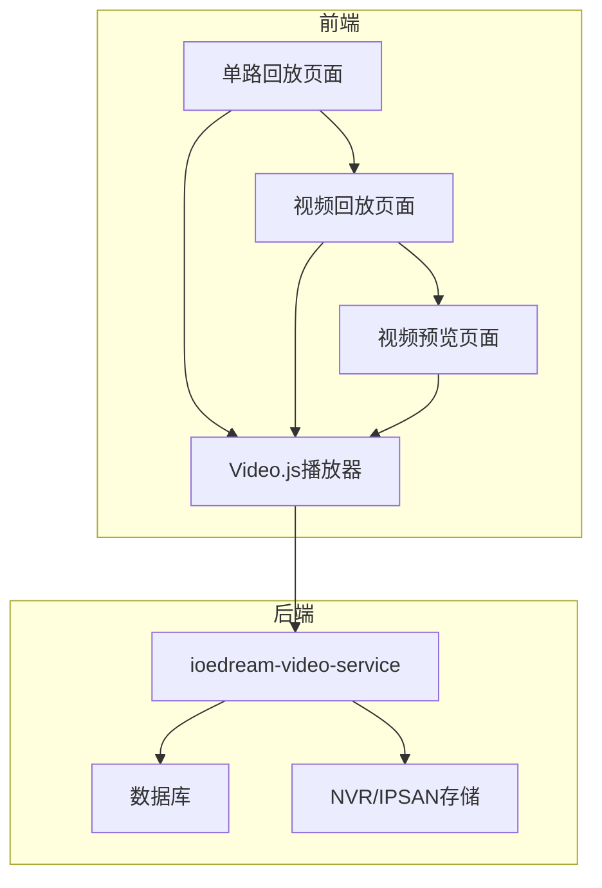
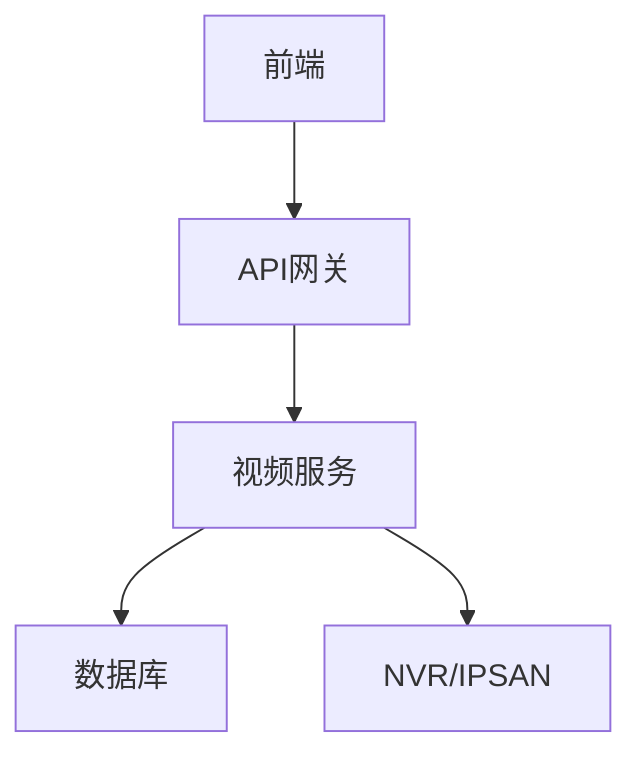
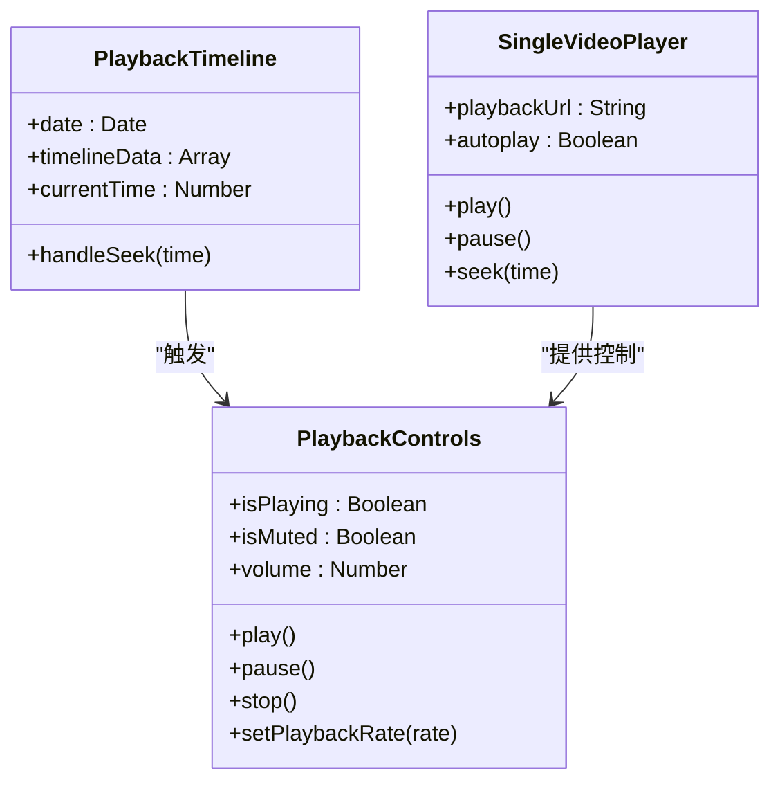
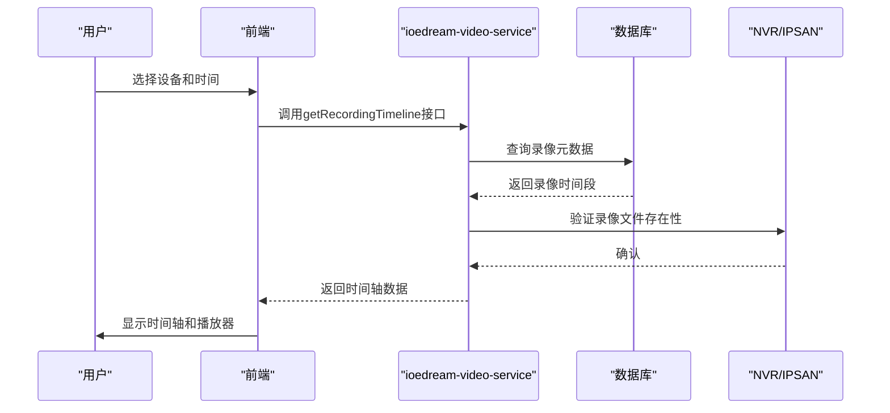
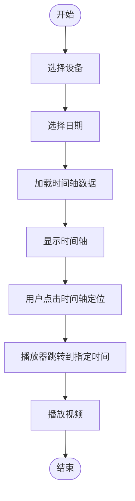
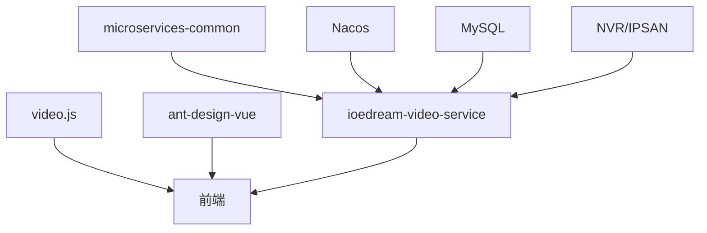

# 录像回放

<cite>
**本文档引用文件**   
- [单路回放页面功能布局文档_完善版.md](file://smart-admin-web-javascript\AI开发文档\单路回放页面功能布局文档_完善版.md)
- [视频回放页面功能布局文档_完善版.md](file://smart-admin-web-javascript\AI开发文档\视频回放页面功能布局文档_完善版.md)
- [视频预览页面功能布局文档_完善版.md](file://smart-admin-web-javascript\AI开发文档\视频预览页面功能布局文档_完善版.md)
- [07-项目总结.md](file://documentation\03-业务模块\智能视频\07-项目总结.md)
- [13-前端移动端组件设计.md](file://documentation\03-业务模块\视频监控\13-前端移动端组件设计.md)
</cite>

## 目录
1. [引言](#引言)
2. [项目结构](#项目结构)
3. [核心组件](#核心组件)
4. [架构概述](#架构概述)
5. [详细组件分析](#详细组件分析)
6. [依赖分析](#依赖分析)
7. [性能考虑](#性能考虑)
8. [故障排除指南](#故障排除指南)
9. [结论](#结论)
10. [附录](#附录) (如有必要)

## 引言
录像回放功能是智能视频监控系统的核心组成部分，旨在为用户提供高效、安全、便捷的历史视频检索与播放服务。本系统基于微服务架构，采用Vue 3与Ant Design Vue构建前端界面，后端服务由Spring Boot驱动，实现了从设备管理、实时监控到录像回放、智能分析的完整安防解决方案。录像回放模块支持多维度查询、时间轴定位、倍速播放、关键帧跳转等高级功能，并通过Video.js播放器提供流畅的用户体验。系统还集成了NVR/IPSAN存储架构，确保录像文件的高可用性与完整性，同时通过AES-256加密和BCrypt哈希等技术保障数据安全。

## 项目结构
项目采用前后端分离的微服务架构，前端位于`smart-admin-web-javascript`目录，后端微服务位于`microservices`目录。录像回放功能的前端代码主要集中在`smart-admin-web-javascript/AI开发文档`下的多个功能布局文档中，包括单路回放、视频回放和视频预览页面。这些页面基于Vue 3的Composition API，使用Ant Design Vue组件库构建用户界面，并通过Axios与后端API进行通信。后端服务`ioedream-video-service`负责处理录像相关的业务逻辑，包括录像查询、播放地址生成和下载任务管理。数据库设计遵循分库分表策略，录像数据按月分区存储，以优化查询性能。

**Diagram sources**
- [单路回放页面功能布局文档_完善版.md](file://smart-admin-web-javascript\AI开发文档\单路回放页面功能布局文档_完善版.md)
- [视频回放页面功能布局文档_完善版.md](file://smart-admin-web-javascript\AI开发文档\视频回放页面功能布局文档_完善版.md)
- [07-项目总结.md](file://documentation\03-业务模块\智能视频\07-项目总结.md)

**Section sources**
- [单路回放页面功能布局文档_完善版.md](file://smart-admin-web-javascript\AI开发文档\单路回放页面功能布局文档_完善版.md)
- [视频回放页面功能布局文档_完善版.md](file://smart-admin-web-javascript\AI开发文档\视频回放页面功能布局文档_完善版.md)

## 核心组件
录像回放功能的核心组件包括前端的播放器、时间轴和搜索面板，以及后端的录像服务和存储系统。前端组件采用模块化设计，如`PlaybackTimeline`用于展示录像的时间分布，`PlaybackControls`提供播放、暂停、倍速等控制功能。后端`ioedream-video-service`微服务通过RESTful API暴露录像查询和播放接口，与数据库和NVR/IPSAN存储系统交互。系统通过`playbackApi`等API接口实现前后端的数据交换，确保功能的完整性和一致性。

**Section sources**
- [单路回放页面功能布局文档_完善版.md](file://smart-admin-web-javascript\AI开发文档\单路回放页面功能布局文档_完善版.md)
- [视频回放页面功能布局文档_完善版.md](file://smart-admin-web-javascript\AI开发文档\视频回放页面功能布局文档_完善版.md)

## 架构概述
系统采用四层微服务架构，从前端到后端依次为：前端展示层、API网关层、业务服务层和数据存储层。前端展示层使用Vue 3框架，通过Video.js播放器实现HLS流媒体的播放。API网关层由`ioedream-gateway-service`统一管理所有API请求。业务服务层的`ioedream-video-service`负责处理录像回放的核心逻辑。数据存储层采用MySQL数据库存储元数据，录像文件则存储在NVR/IPSAN设备中，通过RTSP协议进行访问。整个架构支持高并发、高可用，并通过Nacos实现服务注册与配置管理。

**Diagram sources**
- [07-项目总结.md](file://documentation\03-业务模块\智能视频\07-项目总结.md)

## 详细组件分析
### 单路回放页面分析
单路回放页面是用户进行历史录像查询和播放的主要界面。页面采用上中下三栏布局，顶部为设备选择和时间查询工具栏，中部左侧为24小时时间轴，右侧为视频播放器。时间轴组件`PlaybackTimeline`以可视化的方式展示录像的分布情况，不同颜色的条形代表定时录像、移动侦测、告警录像等不同类型。用户可以通过点击时间轴上的录像段或使用进度条来快速定位到特定时间点。

#### 对于对象导向组件：

**Diagram sources**
- [单路回放页面功能布局文档_完善版.md](file://smart-admin-web-javascript\AI开发文档\单路回放页面功能布局文档_完善版.md)

#### 对于API/服务组件：

**Diagram sources**
- [单路回放页面功能布局文档_完善版.md](file://smart-admin-web-javascript\AI开发文档\单路回放页面功能布局文档_完善版.md)
- [07-项目总结.md](file://documentation\03-业务模块\智能视频\07-项目总结.md)

#### 对于复杂逻辑组件：

**Diagram sources**
- [单路回放页面功能布局文档_完善版.md](file://smart-admin-web-javascript\AI开发文档\单路回放页面功能布局文档_完善版.md)

**Section sources**
- [单路回放页面功能布局文档_完善版.md](file://smart-admin-web-javascript\AI开发文档\单路回放页面功能布局文档_完善版.md)

### 视频回放页面分析
视频回放页面提供了更全面的录像管理功能，包括录像搜索、列表展示和批量操作。搜索面板允许用户通过设备、时间范围等条件精确查找录像文件。搜索结果以列表形式展示，包含设备名称、录像时间段、时长和文件大小等信息。用户点击列表项后，视频播放器会加载对应的录像流进行播放。该页面还支持录像下载和剪辑功能，用户可以将特定时间段的录像保存到本地或创建剪辑任务。

**Section sources**
- [视频回放页面功能布局文档_完善版.md](file://smart-admin-web-javascript\AI开发文档\视频回放页面功能布局文档_完善版.md)

## 依赖分析
录像回放功能依赖于多个前后端组件和外部系统。前端依赖`video.js`库来实现视频播放功能，依赖`ant-design-vue`提供UI组件。后端`ioedream-video-service`微服务依赖于`microservices-common`提供的公共组件，并通过Nacos进行服务发现和配置管理。数据库方面，系统依赖MySQL存储录像的元数据，如设备信息、录像时间段等。存储系统依赖NVR/IPSAN设备来保存实际的录像文件。此外，系统还依赖RTSP协议与前端播放器进行流媒体传输。

**Diagram sources**
- [07-项目总结.md](file://documentation\03-业务模块\智能视频\07-项目总结.md)

**Section sources**
- [07-项目总结.md](file://documentation\03-业务模块\智能视频\07-项目总结.md)

## 性能考虑
为了确保录像回放功能的高性能，系统在多个层面进行了优化。数据库层面，采用分库分表策略，录像表按月分区，显著提升了查询效率。缓存层面，使用Redis和Caffeine实现多级缓存，热点数据如设备列表和用户信息被缓存以减少数据库访问。前端层面，Video.js播放器支持HLS流媒体，能够根据网络状况动态调整画质，保证播放流畅性。后端服务通过集群部署和负载均衡，支持高并发访问。此外，系统还实现了数据归档机制，自动将6个月前的历史数据归档，以减轻主库压力。

## 故障排除指南
当录像回放功能出现问题时，应首先检查前端播放器是否正常加载。如果播放器无法显示，检查`videoUrl`是否正确生成，以及HLS流地址是否可访问。其次，检查后端API接口`getRecordingTimeline`和`getPlaybackUrl`的返回状态，确保服务正常运行。数据库层面，验证`ivs_record`表中是否存在对应时间段的录像记录。存储系统方面，确认NVR/IPSAN设备在线且录像文件未被删除。对于权限问题，检查用户的安全级别是否满足录像回放的权限要求（Level 1以上）。

**Section sources**
- [07-项目总结.md](file://documentation\03-业务模块\智能视频\07-项目总结.md)

## 结论
录像回放功能通过前后端的紧密协作，为用户提供了一个强大而易用的历史视频管理工具。系统采用先进的微服务架构和前端技术，确保了功能的可扩展性和用户体验的流畅性。通过对NVR/IPSAN存储架构的集成，实现了录像文件的高可靠存储。前端播放器的自定义扩展和后端服务的精细化设计，共同构成了一个完整的智能视频监控解决方案。未来，系统可进一步集成AI算法，实现基于内容的智能检索和事件联动回放，提升安防监控的智能化水平。

## 附录
### 附录A：术语表
| 术语 | 说明 |
|------|------|
| IVS | 智能视频监控 |
| NVR | 网络录像机 |
| IPC | 网络摄像头 |
| RTSP | 实时流传输协议 |
| PTZ | 云台控制 |
| HLS | HTTP Live Streaming |

### 附录B：参考标准
- GB/T 28181 - 公共安全视频监控联网系统
- ONVIF - 开放网络视频接口论坛
- RTSP/RTP/RTCP - 实时传输协议标准