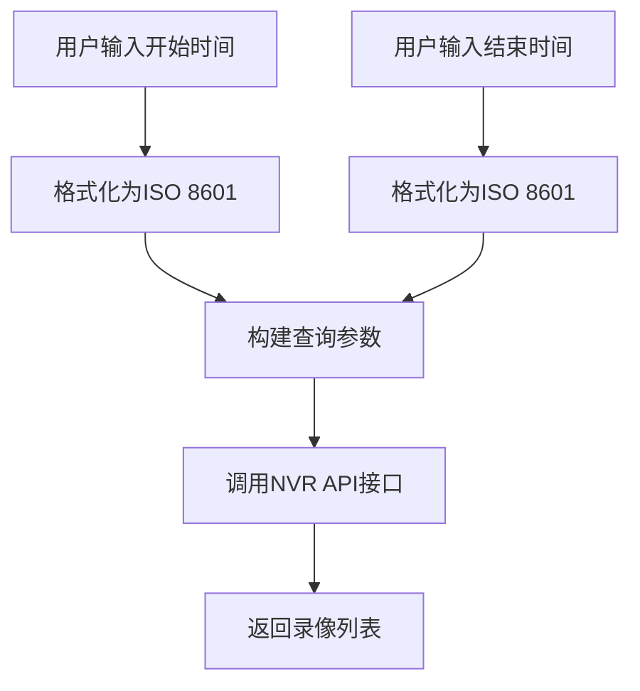
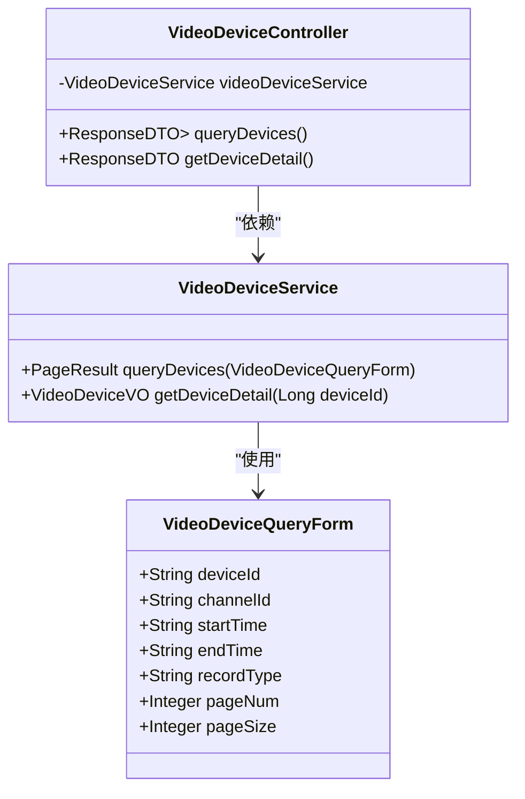
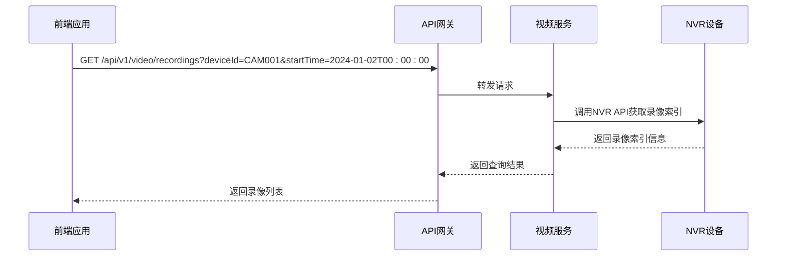
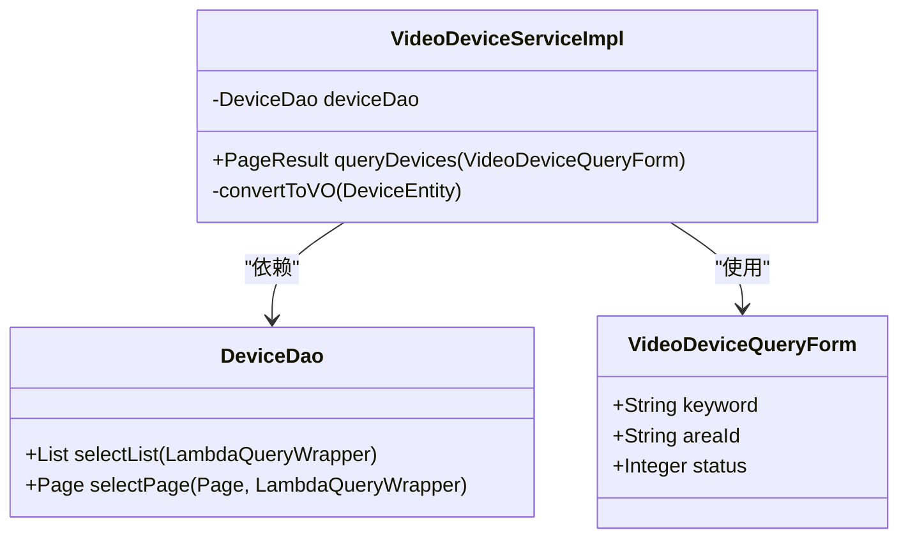
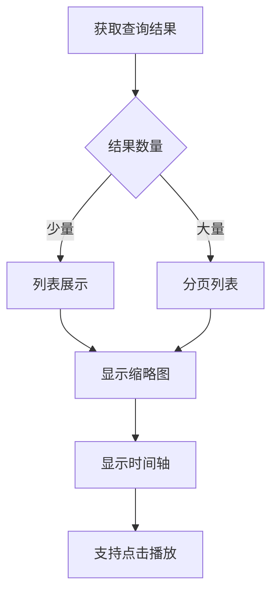
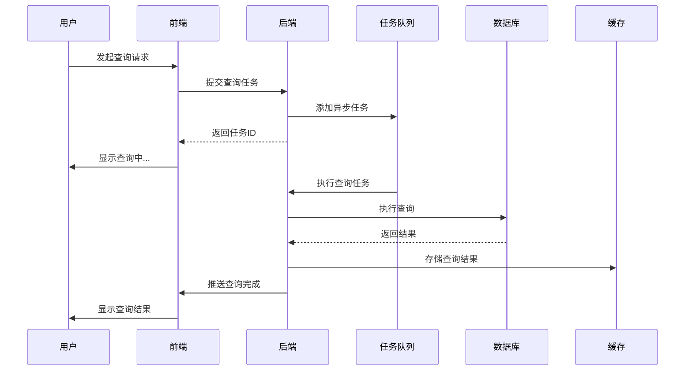
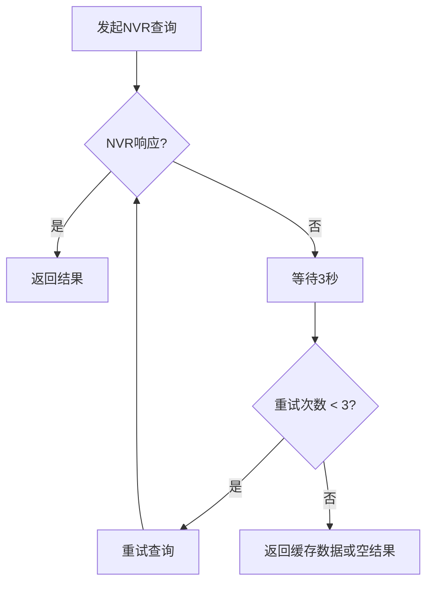

# 录像检索

<cite>
**本文档引用文件**  
- [VideoPlayController.java](file://microservices/ioedream-video-service/src/main/java/net/lab1024/sa/video/controller/VideoPlayController.java)
- [VideoDeviceController.java](file://microservices/ioedream-video-service/src/main/java/net/lab1024/sa/video/controller/VideoDeviceController.java)
- [VideoDeviceServiceImpl.java](file://microservices/ioedream-video-service/src/main/java/net/lab1024/sa/video/service/impl/VideoDeviceServiceImpl.java)
- [VideoPlayServiceImpl.java](file://microservices/ioedream-video-service/src/main/java/net/lab1024/sa/video/service/impl/VideoPlayServiceImpl.java)
- [playback.vue](file://smart-app/src/pages/video/playback.vue)
- [RecordingSearchPanel.vue](file://smart-admin-web-javascript/AI开发文档/视频回放页面功能布局文档_完善版.md)
- [12-前端API接口设计.md](file://documentation/03-业务模块/视频监控/12-前端API接口设计.md)
- [06-接口设计规范.md](file://documentation/03-业务模块/智能视频/06-接口设计规范.md)
</cite>

## 目录
1. [引言](#引言)
2. [多维度条件查询实现](#多维度条件查询实现)
3. [NVR API接口集成](#nvr-api接口集成)
4. [分页加载与结果缓存机制](#分页加载与结果缓存机制)
5. [模糊搜索与高级筛选功能](#模糊搜索与高级筛选功能)
6. [查询结果元数据解析与展示](#查询结果元数据解析与展示)
7. [性能优化与查询效率提升](#性能优化与查询效率提升)
8. [前端用户界面实现](#前端用户界面实现)
9. [错误处理与异常情况应对](#错误处理与异常情况应对)
10. [总结与最佳实践](#总结与最佳实践)

## 引言
录像检索功能是智能视频监控系统的核心组成部分，为用户提供基于时间范围、设备ID、事件类型等多维度条件的录像文件查询能力。本系统通过NVR API接口获取录像片段索引信息，结合分页加载和结果缓存机制提升查询性能，同时提供模糊搜索和高级筛选功能以满足复杂查询需求。查询结果包含丰富的元数据信息，支持灵活的展示逻辑，为用户提供直观、高效的录像回放体验。

**Section sources**
- [12-前端API接口设计.md](file://documentation/03-业务模块/视频监控/12-前端API接口设计.md#L1-L800)
- [06-接口设计规范.md](file://documentation/03-业务模块/智能视频/06-接口设计规范.md#L1-L800)

## 多维度条件查询实现
录像检索功能支持基于时间范围、设备ID、事件类型等多个维度的组合查询。系统通过RESTful API接口接收查询请求，将多维度条件转换为数据库查询参数，实现精准的录像文件定位。

### 时间范围查询
时间范围查询是录像检索的基础功能，用户可指定开始时间和结束时间来检索特定时间段内的录像记录。系统采用ISO 8601标准时间格式，确保时间参数的准确性和一致性。



**Diagram sources**
- [12-前端API接口设计.md](file://documentation/03-业务模块/视频监控/12-前端API接口设计.md#L461-L474)
- [playback.vue](file://smart-app/src/pages/video/playback.vue#L183-L187)

### 设备ID查询
设备ID查询允许用户针对特定监控设备进行录像检索。系统支持单个设备ID查询和多个设备ID的批量查询，满足不同场景下的使用需求。



**Diagram sources**
- [VideoDeviceController.java](file://microservices/ioedream-video-service/src/main/java/net/lab1024/sa/video/controller/VideoDeviceController.java#L47-L183)
- [VideoDeviceServiceImpl.java](file://microservices/ioedream-video-service/src/main/java/net/lab1024/sa/video/service/impl/VideoDeviceServiceImpl.java#L40-L189)

### 事件类型筛选
事件类型筛选功能使用户能够根据特定事件类型（如移动检测、人脸识别、入侵检测等）检索相关录像片段。系统支持多事件类型的组合查询，提高检索的精准度。

| 事件类型 | 说明 | 示例 |
|---------|------|------|
| MOTION | 移动检测事件 | 检测到画面中有人或物体移动 |
| FACE_DETECTION | 人脸识别事件 | 检测到人脸并进行识别 |
| INTRUSION | 入侵检测事件 | 检测到人员闯入禁区 |
| ALARM | 告警事件 | 系统触发的各类告警 |

**Section sources**
- [12-前端API接口设计.md](file://documentation/03-业务模块/视频监控/12-前端API接口设计.md#L615-L630)
- [06-接口设计规范.md](file://documentation/03-业务模块/智能视频/06-接口设计规范.md#L606-L629)

## NVR API接口集成
系统通过NVR API接口与网络视频录像机进行通信，获取录像片段的索引信息和元数据。API集成采用RESTful架构风格，确保接口的标准化和易用性。

### API接口设计
NVR API接口遵循RESTful设计原则，使用标准HTTP方法进行资源操作。接口路径采用版本控制，确保向后兼容性。



**Diagram sources**
- [12-前端API接口设计.md](file://documentation/03-业务模块/视频监控/12-前端API接口设计.md#L461-L510)
- [VideoPlayController.java](file://microservices/ioedream-video-service/src/main/java/net/lab1024/sa/video/controller/VideoPlayController.java#L47-L101)

### 认证与安全
NVR API接口采用Sa-Token认证机制，确保接口访问的安全性。所有请求必须携带有效的token，系统通过权限控制确保用户只能访问其授权范围内的资源。

```json
{
  "code": 200,
  "message": "success",
  "data": [
    {
      "recordingId": "REC_20240102_001",
      "deviceId": "CAM001",
      "startTime": "2024-01-02 08:00:00",
      "endTime": "2024-01-02 09:00:00",
      "duration": 3600,
      "recordingType": "CONTINUOUS",
      "fileSize": 524288000,
      "events": [
        {
          "eventType": "MOTION",
          "eventTime": "2024-01-02 08:15:30",
          "confidence": 0.85
        }
      ]
    }
  ]
}
```

**Section sources**
- [12-前端API接口设计.md](file://documentation/03-业务模块/视频监控/12-前端API接口设计.md#L2-L25)
- [06-接口设计规范.md](file://documentation/03-业务模块/智能视频/06-接口设计规范.md#L1-L20)

## 分页加载与结果缓存机制
为提升大规模录像数据的查询性能，系统实现了分页加载和结果缓存机制，有效降低数据库压力，提高响应速度。

### 分页加载实现
分页加载机制将大量查询结果分割为多个小批次返回，避免一次性加载过多数据导致的性能问题。系统支持自定义每页大小和页码，满足不同场景下的需求。

```mermaid
flowchart TD
A[用户发起查询请求] --> B{结果数量 > 每页大小?}
B --> |是| C[返回第一页结果]
B --> |否| D[返回全部结果]
C --> E[用户滚动到页面底部]
E --> F[加载下一页]
F --> G{还有更多结果?}
G --> |是| H[返回下一页结果]
G --> |否| I[显示"已加载全部"]
```

**Diagram sources**
- [12-前端API接口设计.md](file://documentation/03-业务模块/视频监控/12-前端API接口设计.md#L461-L474)
- [VideoDeviceServiceImpl.java](file://microservices/ioedream-video-service/src/main/java/net/lab1024/sa/video/service/impl/VideoDeviceServiceImpl.java#L47-L117)

### 结果缓存策略
系统采用Redis作为缓存层，对频繁查询的结果进行缓存，减少对NVR设备和数据库的重复访问。缓存策略根据查询条件的唯一性生成缓存键，确保数据的一致性。

| 缓存参数 | 值 | 说明 |
|---------|----|------|
| 缓存键生成 | MD5(查询条件) | 基于查询条件生成唯一缓存键 |
| 缓存有效期 | 300秒 | 缓存5分钟后自动失效 |
| 缓存大小 | 100MB | Redis内存限制 |
| 缓存淘汰策略 | LRU | 最近最少使用算法 |

**Section sources**
- [VideoDeviceServiceImpl.java](file://microservices/ioedream-video-service/src/main/java/net/lab1024/sa/video/service/impl/VideoDeviceServiceImpl.java#L47-L117)
- [VideoPlayServiceImpl.java](file://microservices/ioedream-video-service/src/main/java/net/lab1024/sa/video/service/impl/VideoPlayServiceImpl.java#L49-L92)

## 模糊搜索与高级筛选功能
系统提供模糊搜索和高级筛选功能，满足用户对复杂查询条件的需求，提高检索的灵活性和准确性。

### 模糊搜索实现
模糊搜索功能允许用户通过关键词对设备名称、设备编号等字段进行模糊匹配，快速定位目标设备。



**Diagram sources**
- [VideoDeviceServiceImpl.java](file://microservices/ioedream-video-service/src/main/java/net/lab1024/sa/video/service/impl/VideoDeviceServiceImpl.java#L54-L63)
- [VideoDeviceQueryForm.java](file://microservices/ioedream-video-service/src/main/java/net/lab1024/sa/video/domain/form/VideoDeviceQueryForm.java)

### 高级筛选功能
高级筛选功能支持多条件组合查询，包括设备状态、区域、录像类型等维度的筛选，满足复杂业务场景的需求。

```json
{
  "deviceId": "CAM001",
  "startTime": "2024-01-02T00:00:00",
  "endTime": "2024-01-02T23:59:59",
  "recordingType": "CONTINUOUS,MOTION,ALARM",
  "eventTypes": "INTRUSION,MOTION,FACE_DETECTION",
  "page": 1,
  "size": 20
}
```

**Section sources**
- [12-前端API接口设计.md](file://documentation/03-业务模块/视频监控/12-前端API接口设计.md#L466-L474)
- [RecordingSearchPanel.vue](file://smart-admin-web-javascript/AI开发文档/视频回放页面功能布局文档_完善版.md#L415-L462)

## 查询结果元数据解析与展示
系统对查询结果的元数据进行详细解析，并提供丰富的展示逻辑，帮助用户快速了解录像文件的关键信息。

### 元数据结构
查询结果包含丰富的元数据信息，包括录像ID、设备信息、时间范围、文件大小、分辨率等。

| 字段 | 类型 | 说明 |
|------|------|------|
| recordingId | String | 录像ID |
| deviceId | String | 设备ID |
| deviceName | String | 设备名称 |
| startTime | String | 开始时间 |
| endTime | String | 结束时间 |
| duration | Integer | 时长（秒） |
| fileSize | Long | 文件大小（字节） |
| resolution | String | 分辨率 |
| events | Array | 事件列表 |

**Section sources**
- [12-前端API接口设计.md](file://documentation/03-业务模块/视频监控/12-前端API接口设计.md#L477-L507)
- [VideoPlayServiceImpl.java](file://microservices/ioedream-video-service/src/main/java/net/lab1024/sa/video/service/impl/VideoPlayServiceImpl.java#L50-L87)

### 展示逻辑
系统提供多种展示方式，包括列表视图、时间轴视图等，满足不同用户的使用习惯。



**Diagram sources**
- [playback.vue](file://smart-app/src/pages/video/playback.vue#L131-L153)
- [RecordingSearchPanel.vue](file://smart-admin-web-javascript/AI开发文档/视频回放页面功能布局文档_完善版.md#L504-L531)

## 性能优化与查询效率提升
系统通过多种技术手段优化查询性能，确保在大规模数据场景下的高效响应。

### 数据库优化
系统对录像索引表进行了索引优化，确保基于时间范围和设备ID的查询能够快速定位。

```sql
CREATE INDEX idx_recording_device_time ON t_recording (device_id, start_time, end_time);
CREATE INDEX idx_recording_event_time ON t_recording_event (event_type, event_time);
```

**Section sources**
- [database/performance_optimization.sql](file://database/performance_optimization.sql)
- [VideoDeviceServiceImpl.java](file://microservices/ioedream-video-service/src/main/java/net/lab1024/sa/video/service/impl/VideoDeviceServiceImpl.java#L54-L92)

### 异步查询机制
对于耗时较长的查询操作，系统采用异步查询机制，避免阻塞主线程，提高系统响应性。



**Diagram sources**
- [VideoDeviceServiceImpl.java](file://microservices/ioedream-video-service/src/main/java/net/lab1024/sa/video/service/impl/VideoDeviceServiceImpl.java#L47-L117)
- [VideoPlayServiceImpl.java](file://microservices/ioedream-video-service/src/main/java/net/lab1024/sa/video/service/impl/VideoPlayServiceImpl.java#L49-L92)

## 前端用户界面实现
系统提供了直观易用的前端用户界面，支持多终端访问，确保良好的用户体验。

### 移动端实现
移动端界面采用uni-app框架开发，适配多种移动设备，提供流畅的操作体验。

```vue
<template>
  <view class="datetime-selector">
    <view class="datetime-row">
      <text class="selector-label">开始时间</text>
      <picker mode="date" :value="startDate" @change="onStartDateChange">
        <view class="picker-value">{{ startDate }}</view>
      </picker>
      <picker mode="time" :value="startTime" @change="onStartTimeChange">
        <view class="picker-value">{{ startTime }}</view>
      </picker>
    </view>
  </view>
</template>
```

**Section sources**
- [playback.vue](file://smart-app/src/pages/video/playback.vue#L84-L120)
- [smart-app](file://smart-app)

### Web端实现
Web端界面采用Vue3 + Ant Design Vue组件库，提供丰富的UI组件和交互效果。

```vue
<template>
  <a-card class="recording-search-panel">
    <a-form :model="searchForm" layout="vertical">
      <a-form-item label="选择设备">
        <a-select v-model:value="searchForm.deviceId" placeholder="请选择设备">
          <a-select-option v-for="device in deviceList" :key="device.id">
            {{ device.deviceName }}
          </a-select-option>
        </a-select>
      </a-form-item>
    </a-form>
  </a-card>
</template>
```

**Section sources**
- [RecordingSearchPanel.vue](file://smart-admin-web-javascript/AI开发文档/视频回放页面功能布局文档_完善版.md#L415-L432)
- [smart-admin-web-javascript](file://smart-admin-web-javascript)

## 错误处理与异常情况应对
系统建立了完善的错误处理机制，确保在各种异常情况下仍能提供稳定的服务。

### 错误码体系
系统定义了统一的错误码体系，便于前端进行错误处理和用户提示。

| 错误码 | 说明 | HTTP状态码 |
|--------|------|-----------|
| 80101 | 设备离线 | 400 |
| 80102 | 视频流不存在 | 400 |
| 80103 | 录像文件不存在 | 400 |
| 80104 | AI分析失败 | 400 |
| 80105 | 存储空间不足 | 400 |

**Section sources**
- [12-前端API接口设计.md](file://documentation/03-业务模块/视频监控/12-前端API接口设计.md#L46-L60)
- [VideoPlayController.java](file://microservices/ioedream-video-service/src/main/java/net/lab1024/sa/video/controller/VideoPlayController.java#L71-L73)

### 异常恢复机制
系统具备自动重试和降级机制，在NVR设备暂时不可用时，能够自动重试或返回缓存数据。



**Diagram sources**
- [VideoPlayServiceImpl.java](file://microservices/ioedream-video-service/src/main/java/net/lab1024/sa/video/service/impl/VideoPlayServiceImpl.java#L68-L91)
- [VideoDeviceServiceImpl.java](file://microservices/ioedream-video-service/src/main/java/net/lab1024/sa/video/service/impl/VideoDeviceServiceImpl.java#L114-L117)

## 总结与最佳实践
录像检索功能通过多维度条件查询、NVR API集成、分页加载、结果缓存等技术手段，实现了高效、稳定的录像文件检索服务。系统在性能、可用性和用户体验方面均达到了较高水平，为智能视频监控提供了强有力的支持。

**Section sources**
- [12-前端API接口设计.md](file://documentation/03-业务模块/视频监控/12-前端API接口设计.md)
- [06-接口设计规范.md](file://documentation/03-业务模块/智能视频/06-接口设计规范.md)
- [VideoPlayController.java](file://microservices/ioedream-video-service/src/main/java/net/lab1024/sa/video/controller/VideoPlayController.java)
- [VideoDeviceController.java](file://microservices/ioedream-video-service/src/main/java/net/lab1024/sa/video/controller/VideoDeviceController.java)