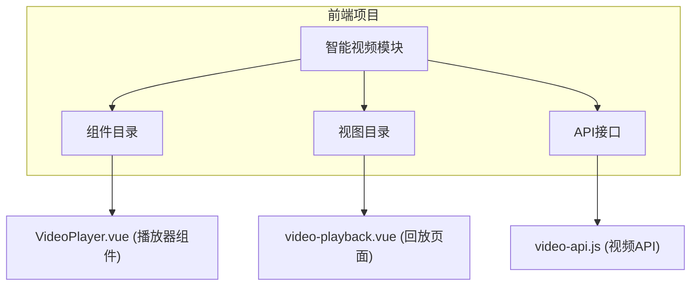
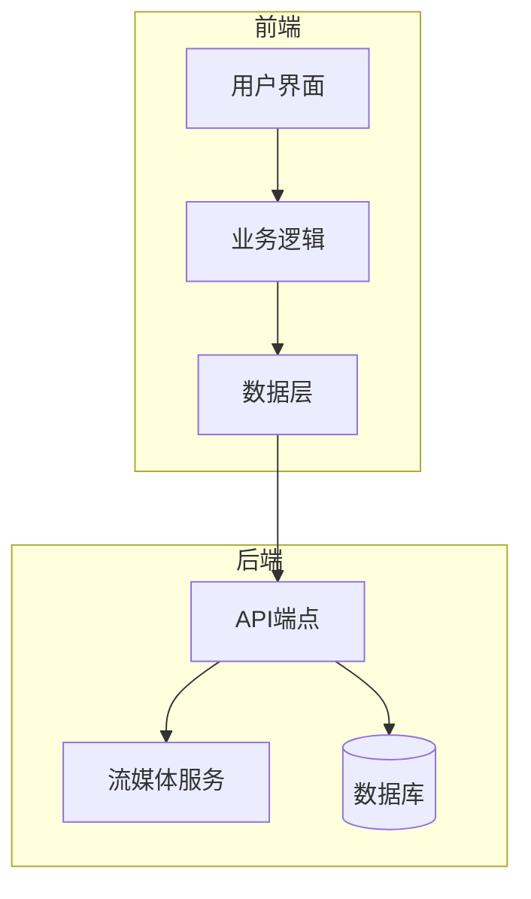
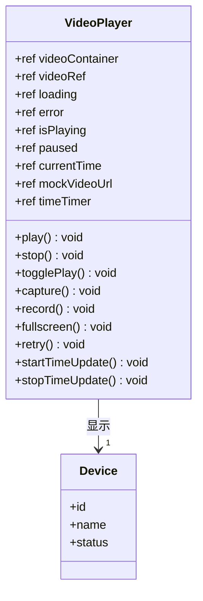
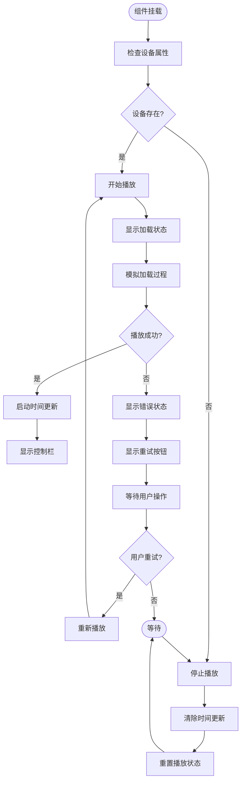
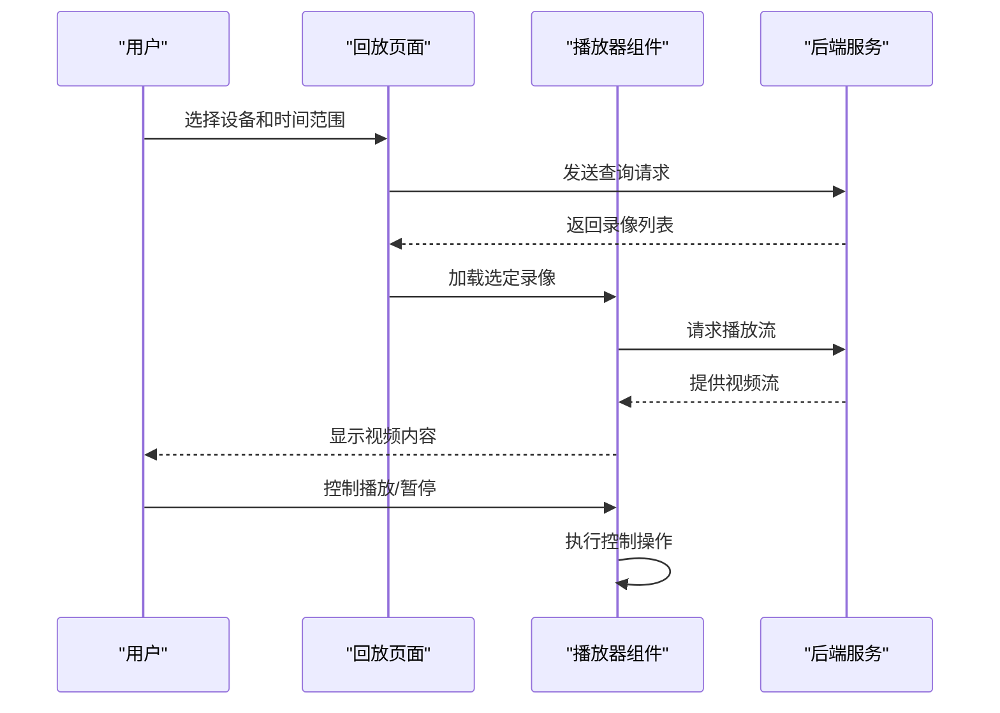
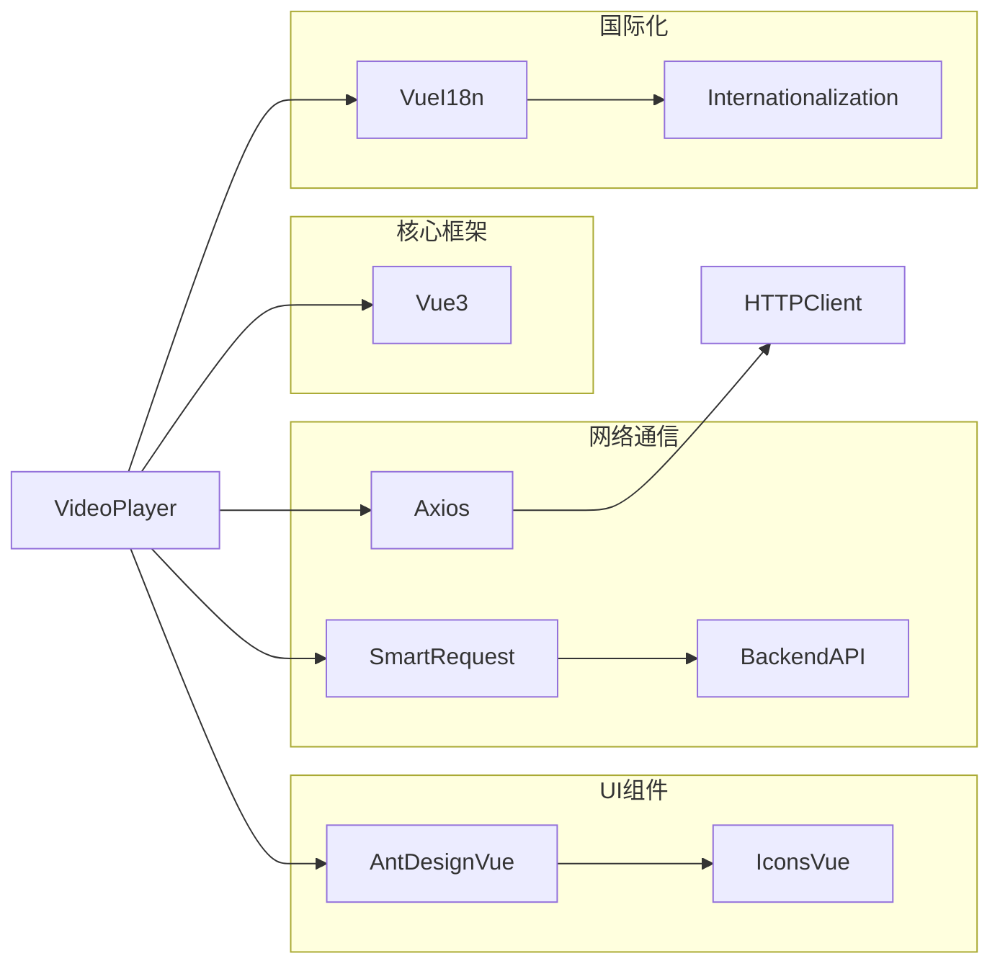

# 播放器功能

<cite>
**本文档引用的文件**
- [VideoPlayer.vue](file://smart-admin-web-javascript/src/views/business/smart-video/components/VideoPlayer.vue)
- [video-api.js](file://smart-app/src/api/business/video/video-api.js)
- [video-playback.vue](file://smart-admin-web-javascript/src/views/business/smart-video/video-playback.vue)
- [package.json](file://smart-admin-web-javascript/package.json)
- [main.js](file://smart-admin-web-javascript/src/main.js)
- [i18n/index.js](file://smart-admin-web-javascript/src/i18n/index.js)
- [zh-CN/index.js](file://smart-admin-web-javascript/src/i18n/lang/zh-CN/index.js)
- [en-US/index.js](file://smart-admin-web-javascript/src/i18n/lang/en-US/index.js)
</cite>

## 目录
1. [简介](#简介)
2. [项目结构](#项目结构)
3. [核心组件](#核心组件)
4. [架构概述](#架构概述)
5. [详细组件分析](#详细组件分析)
6. [依赖分析](#依赖分析)
7. [性能考虑](#性能考虑)
8. [故障排除指南](#故障排除指南)
9. [结论](#结论)

## 简介
本文档详细说明了基于Vue 3的智能视频系统中播放器功能的实现。重点介绍使用原生HTML5视频元素构建的播放器组件，涵盖了播放控制、错误处理、用户体验优化等功能。文档还涵盖了播放器与后端服务的交互、国际化支持以及整体架构设计。

## 项目结构
智能视频系统的播放器功能主要位于前端项目的特定目录中。该结构遵循模块化设计原则，将视频相关的组件、API和服务分离。

**图源**
- [VideoPlayer.vue](file://smart-admin-web-javascript/src/views/business/smart-video/components/VideoPlayer.vue)
- [video-playback.vue](file://smart-admin-web-javascript/src/views/business/smart-video/video-playback.vue)
- [video-api.js](file://smart-app/src/api/business/video/video-api.js)

**本节来源**
- [VideoPlayer.vue](file://smart-admin-web-javascript/src/views/business/smart-video/components/VideoPlayer.vue)
- [video-playback.vue](file://smart-admin-web-javascript/src/views/business/smart-video/video-playback.vue)

## 核心组件
播放器功能的核心是`VideoPlayer.vue`组件，它实现了基本的视频播放控制和状态管理。该组件使用Vue 3的Composition API，提供了播放、暂停、停止、全屏等基础功能，并包含错误处理和加载状态显示。

**本节来源**
- [VideoPlayer.vue](file://smart-admin-web-javascript/src/views/business/smart-video/components/VideoPlayer.vue)

## 架构概述
播放器功能的架构采用分层设计，前端组件通过API服务与后端进行通信。整体架构包括用户界面层、业务逻辑层和数据访问层。

**图源**
- [VideoPlayer.vue](file://smart-admin-web-javascript/src/views/business/smart-video/components/VideoPlayer.vue)
- [video-api.js](file://smart-app/src/api/business/video/video-api.js)

## 详细组件分析

### 播放器组件分析
`VideoPlayer.vue`组件实现了完整的播放器功能，包括基础控制、状态管理和用户交互。

#### 基础控制功能
播放器提供了标准的媒体控制功能，包括播放/暂停、停止、截图、录像和全屏切换。这些功能通过响应式状态管理实现，确保用户界面与播放状态同步。

**图源**
- [VideoPlayer.vue](file://smart-admin-web-javascript/src/views/business/smart-video/components/VideoPlayer.vue#L123-L250)

#### 用户体验优化
播放器组件包含了多项用户体验优化功能，如加载状态指示、错误处理、设备信息显示和时间更新。这些功能提升了用户的操作体验和系统的可用性。

**图源**
- [VideoPlayer.vue](file://smart-admin-web-javascript/src/views/business/smart-video/components/VideoPlayer.vue#L138-L250)

**本节来源**
- [VideoPlayer.vue](file://smart-admin-web-javascript/src/views/business/smart-video/components/VideoPlayer.vue)

### 回放功能分析
录像回放功能通过`video-playback.vue`页面实现，提供了设备选择、时间范围查询和播放控制等功能。

**图源**
- [video-playback.vue](file://smart-admin-web-javascript/src/views/business/smart-video/video-playback.vue)
- [VideoPlayer.vue](file://smart-admin-web-javascript/src/views/business/smart-video/components/VideoPlayer.vue)

**本节来源**
- [video-playback.vue](file://smart-admin-web-javascript/src/views/business/smart-video/video-playback.vue)

## 依赖分析
播放器功能依赖于多个前端库和后端服务，这些依赖关系确保了功能的完整性和可维护性。

**图源**
- [package.json](file://smart-admin-web-javascript/package.json)
- [main.js](file://smart-admin-web-javascript/src/main.js)
- [VideoPlayer.vue](file://smart-admin-web-javascript/src/views/business/smart-video/components/VideoPlayer.vue)

**本节来源**
- [package.json](file://smart-admin-web-javascript/package.json)
- [main.js](file://smart-admin-web-javascript/src/main.js)

## 性能考虑
播放器功能在设计时考虑了性能优化，包括资源管理、内存泄漏预防和网络适应性。

- **资源管理**：在组件卸载时停止播放并清除定时器，防止内存泄漏
- **懒加载**：仅在需要时加载视频资源，减少初始加载时间
- **错误处理**：优雅地处理播放失败情况，提供重试机制
- **响应式设计**：适配不同屏幕尺寸和设备类型

**本节来源**
- [VideoPlayer.vue](file://smart-admin-web-javascript/src/views/business/smart-video/components/VideoPlayer.vue)

## 故障排除指南
以下是播放器功能常见问题的解决方案：

1. **播放失败**：检查设备连接状态，确认设备在线且可访问
2. **加载缓慢**：检查网络连接质量，考虑使用子码流降低带宽需求
3. **控制无响应**：确认组件状态是否正确更新，检查事件绑定
4. **全屏失效**：确保浏览器支持全屏API，检查权限设置

**本节来源**
- [VideoPlayer.vue](file://smart-admin-web-javascript/src/views/business/smart-video/components/VideoPlayer.vue)
- [video-api.js](file://smart-app/src/api/business/video/video-api.js)

## 结论
本文档详细介绍了智能视频系统中播放器功能的实现。通过分析`VideoPlayer.vue`组件，我们了解了基于Vue 3的播放器架构和实现细节。播放器功能提供了完整的媒体控制、错误处理和用户体验优化，通过清晰的分层架构与后端服务进行交互。未来可以考虑集成Video.js等专业播放器库来增强功能，如支持更多视频格式、提供更丰富的控制选项和改善跨浏览器兼容性。