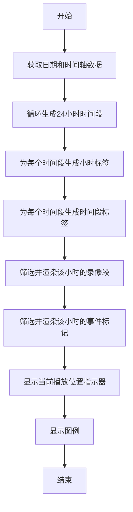
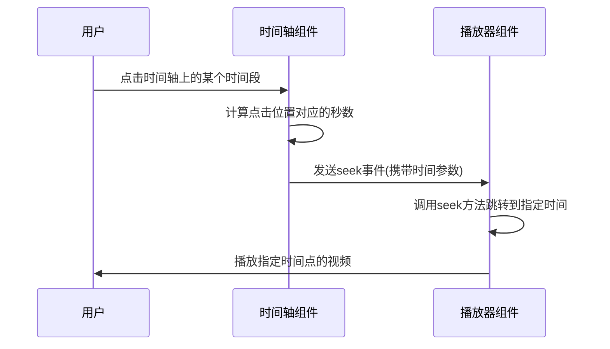
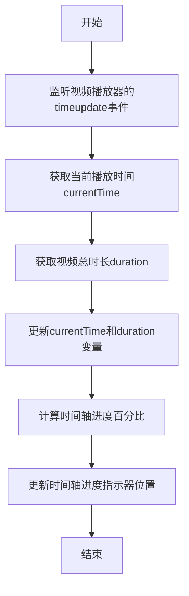
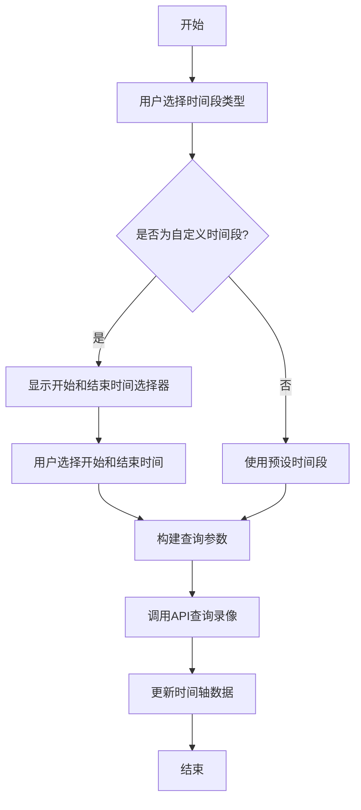

# 时间轴与定位

<cite>
**本文档引用的文件**   
- [PlaybackTimeline.vue](file://smart-admin-web-javascript\AI开发文档\单路回放页面功能布局文档_完善版.md)
- [playback.vue](file://smart-app\src\pages\video\playback.vue)
- [video-playback.vue](file://smart-admin-web-javascript\src\views\business\smart-video\video-playback.vue)
- [04-界面原型图设计.md](file://documentation\03-业务模块\智能视频\04-界面原型图设计.md)
</cite>

## 目录
1. [时间轴渲染机制](#时间轴渲染机制)
2. [用户定位与跳转逻辑](#用户定位与跳转逻辑)
3. [时间同步机制](#时间同步机制)
4. [时间轴缩放与范围选择](#时间轴缩放与范围选择)

## 时间轴渲染机制

录像时间轴是视频回放功能的核心组件，用于可视化展示指定日期内24小时的录像记录和事件标记。时间轴的渲染机制主要包括时间刻度生成、关键帧标记和事件标注三个部分。

时间轴以24小时为单位进行划分，每小时作为一个独立的时间段进行渲染。时间刻度通过循环生成24个时间段，每个时间段包含小时标签和时间段标签。小时标签显示具体时间点（如"00:00"、"03:00"等），而时间段标签则根据时间段划分显示相应的时段描述（如"深夜"、"上午"、"下午"、"晚上"）。

**图表来源**
- [PlaybackTimeline.vue](file://smart-admin-web-javascript\AI开发文档\单路回放页面功能布局文档_完善版.md)

**章节来源**
- [PlaybackTimeline.vue](file://smart-admin-web-javascript\AI开发文档\单路回放页面功能布局文档_完善版.md)

## 用户定位与跳转逻辑

用户通过点击时间轴上的任意位置，可以快速定位到指定的时间点进行播放。这一功能的实现逻辑主要通过`handleHourClick`方法完成。当用户点击某个时间段时，系统会计算该时间段对应的秒数，并通过`emit('seek', seekTime)`事件将定位时间传递给父组件。

具体实现中，`handleHourClick`方法接收点击的小时数作为参数，将其乘以3600（每小时的秒数）得到从午夜开始的总秒数，然后通过事件发射机制通知播放器组件进行时间跳转。播放器组件接收到`seek`事件后，会调用`playerRef.value?.seek(time)`方法，将视频播放进度跳转到指定时间点。

**图表来源**
- [PlaybackTimeline.vue](file://smart-admin-web-javascript\AI开发文档\单路回放页面功能布局文档_完善版.md)
- [video-playback.vue](file://smart-admin-web-javascript\src\views\business\smart-video\video-playback.vue)

**章节来源**
- [PlaybackTimeline.vue](file://smart-admin-web-javascript\AI开发文档\单路回放页面功能布局文档_完善版.md)

## 时间同步机制

时间同步机制确保了播放进度与实际时间的一致性。系统通过监听视频播放器的`timeupdate`事件来实时获取当前播放时间，并将其与总时长进行比较，计算出当前播放进度的百分比。

在移动端实现中，`handleTimeUpdate`方法监听视频组件的`timeupdate`事件，获取当前播放时间和总时长，并更新`currentTime`和`duration`变量。同时，系统通过计算`currentTime / duration * 100`得到时间轴进度百分比，用于更新时间轴上的进度指示器位置。

**图表来源**
- [playback.vue](file://smart-app\src\pages\video\playback.vue)

**章节来源**
- [playback.vue](file://smart-app\src\pages\video\playback.vue)

## 时间轴缩放与范围选择

时间轴支持缩放和范围选择功能，允许用户查看不同粒度的时间段。在Web端实现中，用户可以通过选择不同的时间段（如"全天"、"上午"、"下午"、"晚上"、"深夜"或"自定义"）来调整时间轴的显示范围。

当用户选择"自定义"时间段时，系统会显示开始时间和结束时间的选择器，允许用户精确指定查看的时间范围。移动端实现中，用户通过日期和时间选择器组合来选择开始和结束时间，然后点击"查询录像"按钮加载指定时间段的录像记录。

**图表来源**
- [04-界面原型图设计.md](file://documentation\03-业务模块\智能视频\04-界面原型图设计.md)
- [playback.vue](file://smart-app\src\pages\video\playback.vue)

**章节来源**
- [04-界面原型图设计.md](file://documentation\03-业务模块\智能视频\04-界面原型图设计.md)
- [playback.vue](file://smart-app\src\pages\video\playback.vue)