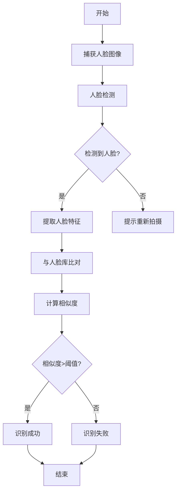
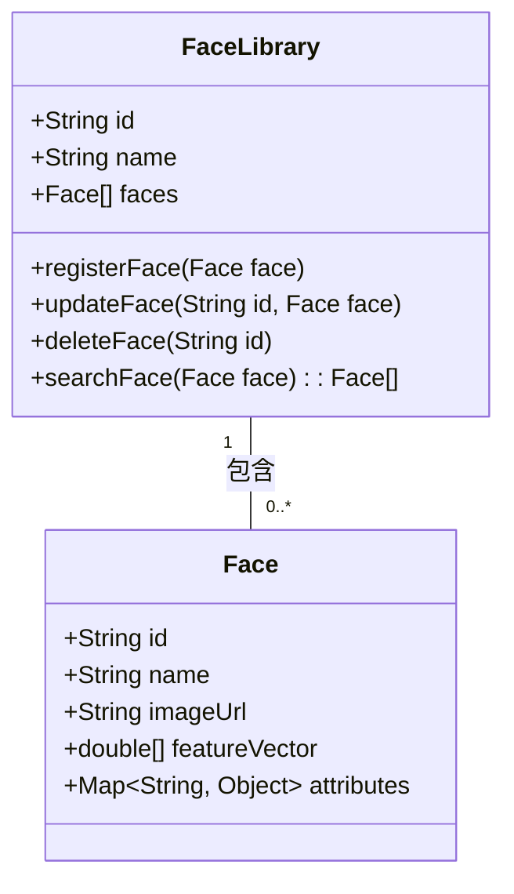
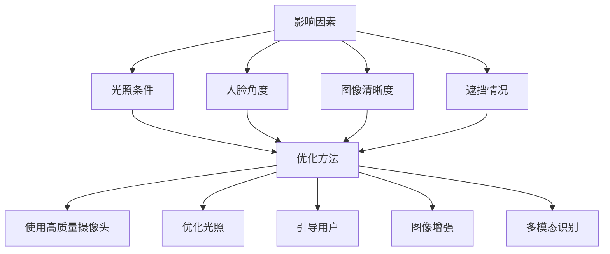
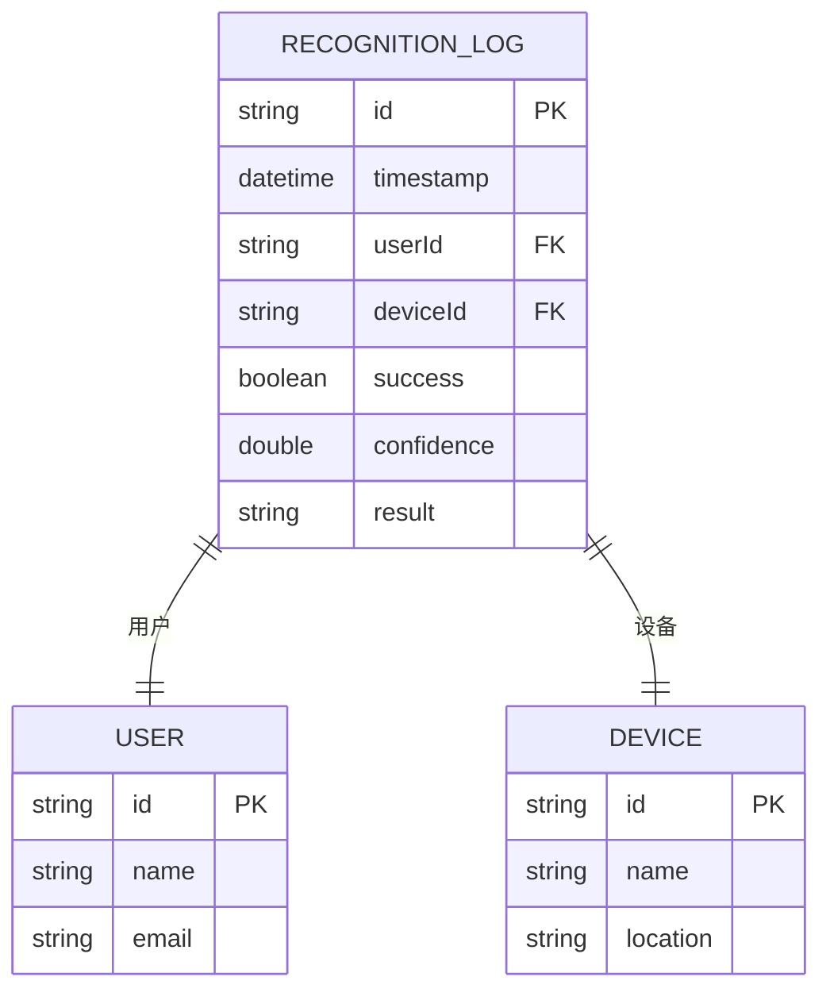
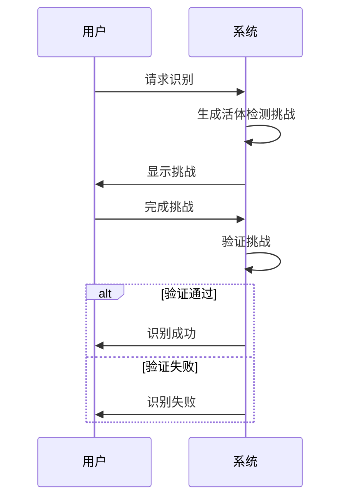
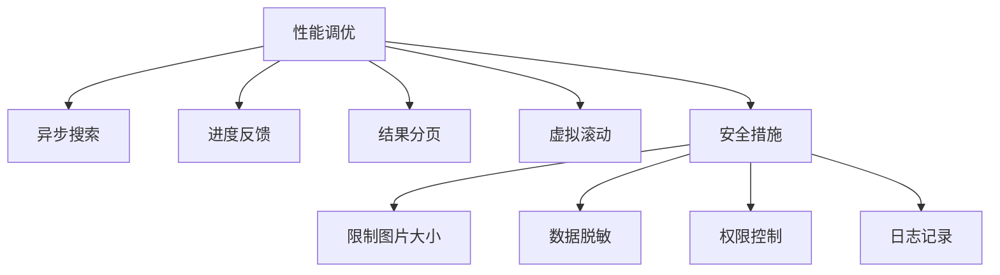

# 人脸识别

<cite>
**本文档引用的文件**
- [BiometricMobileController.java](file://restful_refactor_backup_20251202_014224\microservices_ioedream-access-service_src_main_java_net_lab1024_sa_access_controller_BiometricMobileController.java)
- [face-search-api.js](file://smart-admin-web-javascript\AI开发文档\人脸搜索页面功能布局文档_完善版.md)
- [face-search-store.js](file://smart-admin-web-javascript\AI开发文档\人脸搜索页面功能布局文档_完善版.md)
- [face-search-mock.js](file://smart-admin-web-javascript\AI开发文档\人脸搜索页面功能布局文档_完善版.md)
- [biometric.service.ts](file://documentation\03-业务模块\考勤\13-前端移动端组件设计.md)
- [BiometricMonitorController.java](file://restful_refactor_backup_20251202_014224\microservices_ioedream-access-service_src_main_java_net_lab1024_sa_access_controller_BiometricMonitorController.java)
</cite>

## 目录
1. [引言](#引言)
2. [核心组件](#核心组件)
3. [算法实现流程](#算法实现流程)
4. [人脸库管理机制](#人脸库管理机制)
5. [识别准确率影响因素及优化方法](#识别准确率影响因素及优化方法)
6. [识别日志存储与查询](#识别日志存储与查询)
7. [活体检测与防伪攻击安全策略](#活体检测与防伪攻击安全策略)
8. [性能调优建议](#性能调优建议)
9. [结论](#结论)

## 引言
本技术文档详细阐述了人脸识别功能的实现，涵盖了从人脸检测、特征提取到比对匹配的完整算法流程。文档详细描述了人脸库的管理机制，包括注册、更新和删除操作。同时，文档解释了影响识别准确率的关键因素及相应的优化方法，提供了识别日志的存储结构和查询接口。此外，文档还包含了活体检测和防伪攻击的安全策略，并给出了性能调优建议，如并发处理能力和响应时间优化。

## 核心组件

本系统的核心组件主要包括移动端生物识别控制器、人脸识别搜索API、人脸识别搜索状态管理、人脸识别搜索模拟数据以及生物识别服务。这些组件共同协作，实现了完整的人脸识别功能。

**Section sources**
- [BiometricMobileController.java](file://restful_refactor_backup_20251202_014224\microservices_ioedream-access-service_src_main_java_net_lab1024_sa_access_controller_BiometricMobileController.java)
- [face-search-api.js](file://smart-admin-web-javascript\AI开发文档\人脸搜索页面功能布局文档_完善版.md)
- [face-search-store.js](file://smart-admin-web-javascript\AI开发文档\人脸搜索页面功能布局文档_完善版.md)
- [face-search-mock.js](file://smart-admin-web-javascript\AI开发文档\人脸搜索页面功能布局文档_完善版.md)
- [biometric.service.ts](file://documentation\03-业务模块\考勤\13-前端移动端组件设计.md)

## 算法实现流程

人脸识别的算法实现流程主要包括人脸检测、特征提取和比对匹配三个步骤。首先，通过摄像头捕获人脸图像，并进行人脸检测。然后，提取人脸特征向量。最后，将提取的特征与人脸库中的特征进行比对，计算相似度，从而完成身份验证。

**Diagram sources**
- [BiometricMobileController.java](file://restful_refactor_backup_20251202_014224\microservices_ioedream-access-service_src_main_java_net_lab1024_sa_access_controller_BiometricMobileController.java)
- [face-search-api.js](file://smart-admin-web-javascript\AI开发文档\人脸搜索页面功能布局文档_完善版.md)

## 人脸库管理机制

人脸库管理机制包括注册、更新和删除操作。用户可以通过上传人脸图片来注册新的人脸信息。系统会自动提取人脸特征并存储到人脸库中。对于已注册的人脸信息，可以进行更新操作，如更新人脸图片或相关信息。同时，也支持删除不再需要的人脸信息。

**Diagram sources**
- [face-search-api.js](file://smart-admin-web-javascript\AI开发文档\人脸搜索页面功能布局文档_完善版.md)
- [face-search-store.js](file://smart-admin-web-javascript\AI开发文档\人脸搜索页面功能布局文档_完善版.md)

## 识别准确率影响因素及优化方法

影响识别准确率的因素主要包括光照条件、人脸角度、图像清晰度和遮挡情况。为了提高识别准确率，可以采取以下优化方法：使用高质量的摄像头、优化光照条件、引导用户正对摄像头、使用图像增强技术以及采用多模态生物识别。

**Diagram sources**
- [face-search-mock.js](file://smart-admin-web-javascript\AI开发文档\人脸搜索页面功能布局文档_完善版.md)
- [biometric.service.ts](file://documentation\03-业务模块\考勤\13-前端移动端组件设计.md)

## 识别日志存储与查询

识别日志的存储结构包括识别时间、用户ID、设备ID、识别结果和置信度等信息。系统提供了查询接口，可以根据时间范围、用户ID、设备ID等条件查询识别日志。

**Diagram sources**
- [BiometricMonitorController.java](file://restful_refactor_backup_20251202_014224\microservices_ioedream-access-service_src_main_java_net_lab1024_sa_access_controller_BiometricMonitorController.java)

## 活体检测与防伪攻击安全策略

活体检测通过生成随机挑战（如眨眼、点头、微笑等）来验证用户是否为真实活体。防伪攻击安全策略包括检测照片、视频和面具等攻击方式，确保人脸识别的安全性。

**Diagram sources**
- [biometric.service.ts](file://documentation\03-业务模块\考勤\13-前端移动端组件设计.md)
- [face-search-mock.js](file://smart-admin-web-javascript\AI开发文档\人脸搜索页面功能布局文档_完善版.md)

## 性能调优建议

性能调优建议包括使用异步搜索避免阻塞UI、实现搜索进度实时反馈、对搜索结果进行分页避免一次加载过多数据、使用虚拟滚动优化大量结果的渲染性能。此外，还可以通过限制上传图片的大小和格式、对人脸数据进行脱敏处理、实现访问权限控制和记录搜索日志来提高系统性能和安全性。

**Diagram sources**
- [face-search-mock.js](file://smart-admin-web-javascript\AI开发文档\人脸搜索页面功能布局文档_完善版.md)

## 结论
本文档详细介绍了人脸识别功能的技术实现，涵盖了算法流程、人脸库管理、准确率优化、日志存储与查询、安全策略和性能调优等方面。通过本文档，开发人员可以全面了解人脸识别系统的架构和实现细节，为系统的开发和维护提供指导。