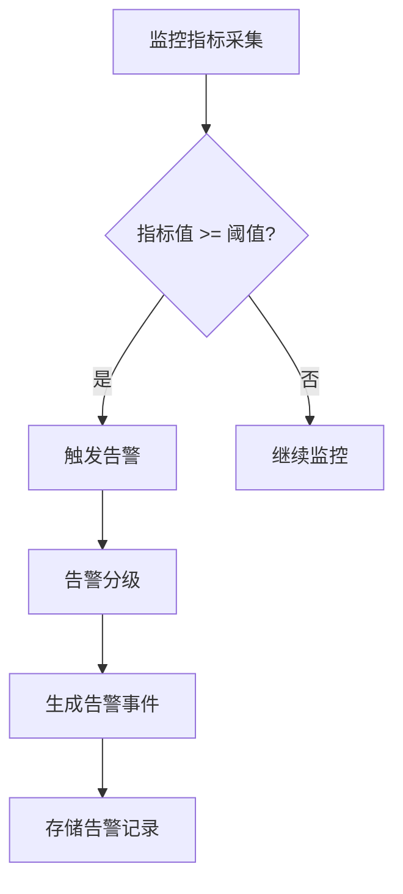
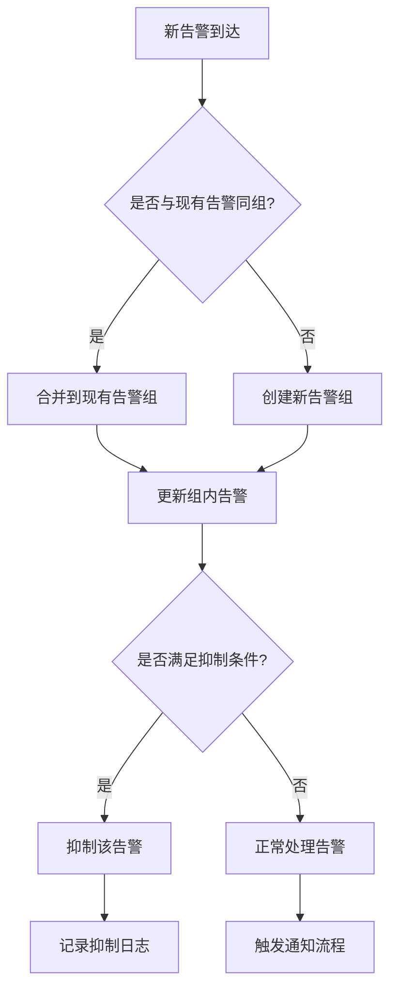
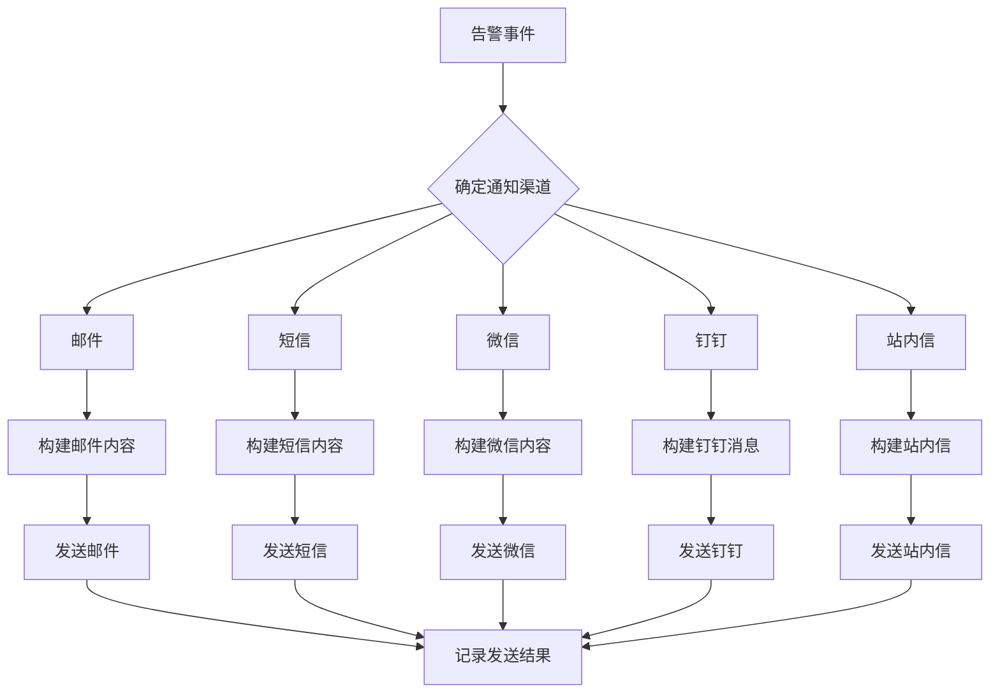
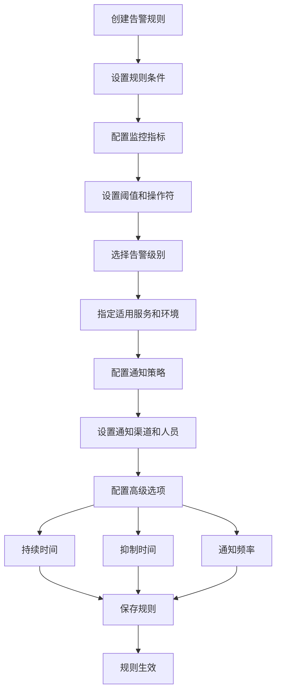
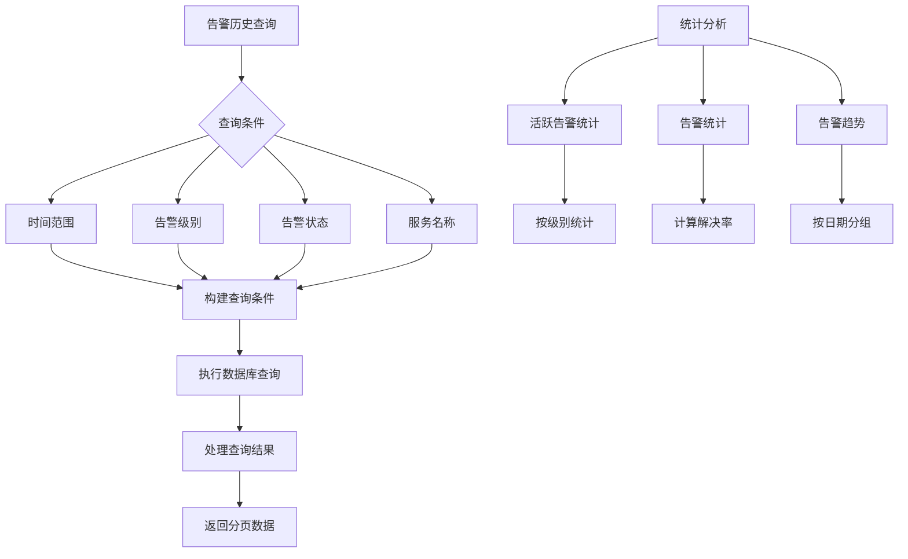
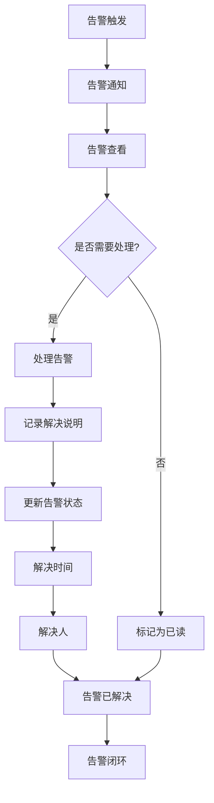
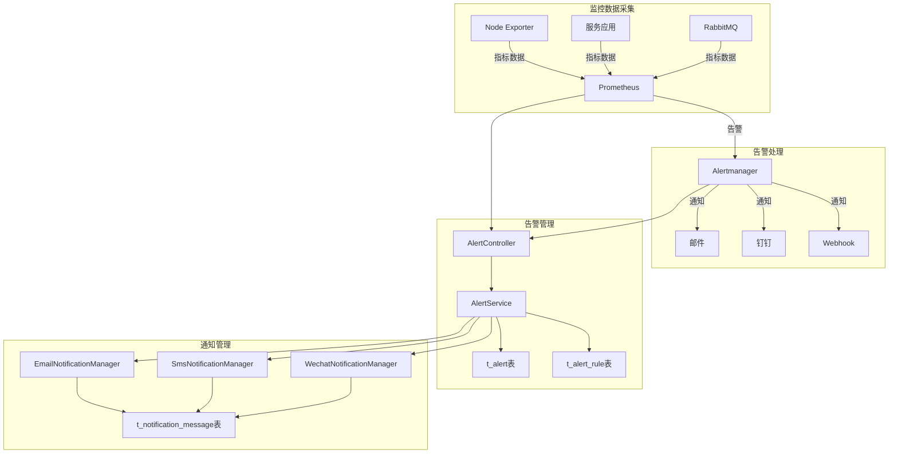

# 分析告警机制

<cite>
**本文档引用文件**  
- [11-t_alert.sql](file://database-scripts/common-service/11-t_alert.sql)
- [12-t_alert_rule.sql](file://database-scripts/common-service/12-t_alert_rule.sql)
- [07-t_notification_message.sql](file://database-scripts/common-service/07-t_notification_message.sql)
- [08-t_notification_template.sql](file://database-scripts/common-service/08-t_notification_template.sql)
- [09-t_notification_config.sql](file://database-scripts/common-service/09-t_notification_config.sql)
- [docker-compose-monitoring.yml](file://deployment/monitoring/docker-compose-monitoring.yml)
- [prometheus.yml](file://deployment/monitoring/prometheus/prometheus.yml)
- [alertmanager.yml](file://deployment/monitoring/alertmanager/alertmanager.yml)
- [AlertController.java](file://microservices/ioedream-common-service/src/main/java/net/lab1024/sa/common/monitor/controller/AlertController.java)
- [AlertService.java](file://microservices/microservices-common/src/main/java/net/lab1024/sa/common/monitor/service/AlertService.java)
- [AlertServiceImpl.java](file://microservices/microservices-common/src/main/java/net/lab1024/sa/common/monitor/service/impl/AlertServiceImpl.java)
- [EmailNotificationManager.java](file://microservices/ioedream-common-service/src/main/java/net/lab1024/sa/common/notification/manager/EmailNotificationManager.java)
</cite>

## 目录
1. [引言](#引言)
2. [告警事件生成与分级](#告警事件生成与分级)
3. [告警去重与抑制策略](#告警去重与抑制策略)
4. [告警消息推送渠道](#告警消息推送渠道)
5. [告警配置规则引擎](#告警配置规则引擎)
6. [告警历史查询与统计分析](#告警历史查询与统计分析)
7. [告警响应流程与闭环管理](#告警响应流程与闭环管理)
8. [系统架构与集成](#系统架构与集成)
9. [结论](#结论)

## 引言

本系统构建了一套完整的智能分析告警机制，旨在实现对各类监控指标的实时监测、智能告警和闭环管理。该机制覆盖了从告警生成、分级、去重、抑制到通知推送、历史查询、统计分析和处置记录的完整生命周期。系统采用Prometheus+Alertmanager作为核心监控告警引擎，结合自研的告警服务和通知管理模块，实现了灵活的规则配置、多渠道通知推送和全面的告警管理功能。通过这套机制，系统能够及时发现并响应潜在问题，保障业务稳定运行。

## 告警事件生成与分级

告警事件的生成基于预定义的监控规则，当监控指标达到或超过设定阈值时触发。系统通过Prometheus采集各类监控数据，包括服务性能指标、系统资源使用率、业务关键指标等，并根据配置的告警规则进行评估。

告警级别分为四个等级，定义在`t_alert`表的`alert_level`字段中：
- **INFO**：信息级别，用于记录一般性事件
- **WARNING**：警告级别，表示潜在问题需要关注
- **ERROR**：错误级别，表示已发生错误需要处理
- **CRITICAL**：严重级别，表示严重故障需要立即处理

告警事件的生成流程如下：
1. Prometheus根据配置的规则文件定期评估监控指标
2. 当规则条件满足时，Prometheus将告警发送给Alertmanager
3. Alertmanager根据路由规则确定接收器，并触发通知
4. 系统通过`AlertController`接收告警记录，存储到`t_alert`表中



**图示来源**  
- [11-t_alert.sql](file://database-scripts/common-service/11-t_alert.sql#L10)
- [prometheus.yml](file://deployment/monitoring/prometheus/prometheus.yml#L16)
- [alertmanager.yml](file://deployment/monitoring/alertmanager/alertmanager.yml#L11)

**本节来源**  
- [11-t_alert.sql](file://database-scripts/common-service/11-t_alert.sql#L1-L36)
- [AlertController.java](file://microservices/ioedream-common-service/src/main/java/net/lab1024/sa/common/monitor/controller/AlertController.java#L47-L104)

## 告警去重与抑制策略

系统实现了完善的告警去重与抑制机制，避免告警风暴和重复通知，确保告警信息的有效性和可操作性。

### 告警去重

告警去重主要通过Alertmanager的分组（grouping）机制实现。在`alertmanager.yml`配置文件中，设置了`group_by`参数，将相同类型的告警按`alertname`、`cluster`和`service`进行分组：

```yaml
route:
  group_by: ['alertname', 'cluster', 'service']
  group_wait: 10s
  group_interval: 10s
  repeat_interval: 12h
```

- **group_wait**：初始通知延迟，等待10秒以聚合同一事件的多个告警
- **group_interval**：组内告警更新间隔，每10秒更新一次组内告警
- **repeat_interval**：重复通知间隔，相同告警每12小时重复通知一次

### 告警抑制

告警抑制通过抑制规则（inhibit_rules）实现，避免在严重告警发生时产生大量低级别告警。在`alertmanager.yml`中配置了抑制规则：

```yaml
inhibit_rules:
  - source_match:
      severity: 'critical'
    target_match:
      severity: 'warning'
    equal: ['alertname', 'service']
```

该规则表示：当某个服务产生严重级别（critical）告警时，抑制同一服务的警告级别（warning）告警，避免告警信息过载。



**图示来源**  
- [alertmanager.yml](file://deployment/monitoring/alertmanager/alertmanager.yml#L12-L42)
- [11-t_alert.sql](file://database-scripts/common-service/11-t_alert.sql#L18)

**本节来源**  
- [alertmanager.yml](file://deployment/monitoring/alertmanager/alertmanager.yml#L1-L127)
- [11-t_alert.sql](file://database-scripts/common-service/11-t_alert.sql#L18)

## 告警消息推送渠道

系统支持多种告警消息推送渠道，确保告警信息能够及时送达相关人员。推送渠道配置在`t_notification_config`表中，支持邮件、短信、微信、Webhook等多种方式。

### 推送渠道配置

在`docker-compose-monitoring.yml`中配置了Alertmanager的接收器，支持邮件和钉钉通知：

```yaml
receivers:
  - name: 'default-receiver'
    email_configs:
      - to: 'devops@ioedream.com'
  - name: 'critical-receiver'
    email_configs:
      - to: 'devops@ioedream.com,oncall@ioedream.com'
    webhook_configs:
      - url: 'https://oapi.dingtalk.com/robot/send?access_token=your-dingtalk-token'
```

### 通知管理实现

系统通过`EmailNotificationManager`等通知管理器实现多渠道通知。通知流程如下：

1. 根据告警级别和类型确定通知渠道
2. 查询接收人列表（支持指定用户、角色、部门）
3. 构建通知内容（支持模板变量替换）
4. 通过相应渠道发送通知
5. 记录通知结果和指标



**图示来源**  
- [09-t_notification_config.sql](file://database-scripts/common-service/09-t_notification_config.sql#L12)
- [alertmanager.yml](file://deployment/monitoring/alertmanager/alertmanager.yml#L44-L127)
- [EmailNotificationManager.java](file://microservices/ioedream-common-service/src/main/java/net/lab1024/sa/common/notification/manager/EmailNotificationManager.java#L48)

**本节来源**  
- [09-t_notification_config.sql](file://database-scripts/common-service/09-t_notification_config.sql#L1-L28)
- [alertmanager.yml](file://deployment/monitoring/alertmanager/alertmanager.yml#L44-L127)
- [EmailNotificationManager.java](file://microservices/ioedream-common-service/src/main/java/net/lab1024/sa/common/notification/manager/EmailNotificationManager.java#L1-L547)

## 告警配置规则引擎

系统提供了灵活的告警配置规则引擎，支持基于时间、区域、服务对象等多维度条件的复杂规则设置。规则配置存储在`t_alert_rule`表中，支持动态添加、修改和删除。

### 规则配置字段

`t_alert_rule`表包含以下关键字段：
- **rule_name**：规则名称
- **metric_name**：监控指标名称
- **condition_operator**：条件操作符（GT/GTE/LT/LTE/EQ/NEQ）
- **threshold_value**：告警阈值
- **alert_level**：告警级别
- **applicable_services**：适用服务列表
- **applicable_environments**：适用环境列表
- **duration_minutes**：持续时间（分钟）
- **notification_channels**：通知渠道
- **notification_users**：通知人员
- **suppression_duration**：抑制时间
- **rule_expression**：规则表达式（支持复杂逻辑）

### 规则管理API

系统提供了完整的规则管理API，通过`AlertService`接口实现：

```java
public interface AlertService {
    Long addAlertRule(AlertRuleAddDTO addDTO);
    PageResult<AlertRuleVO> queryAlertRulePage(AlertRuleQueryDTO queryDTO);
    AlertRuleVO getAlertRuleDetail(Long ruleId);
    void enableAlertRule(Long ruleId);
    void disableAlertRule(Long ruleId);
    void deleteAlertRule(Long ruleId);
}
```

### 规则引擎工作流程



**图示来源**  
- [12-t_alert_rule.sql](file://database-scripts/common-service/12-t_alert_rule.sql#L1-L40)
- [AlertService.java](file://microservices/microservices-common/src/main/java/net/lab1024/sa/common/monitor/service/AlertService.java#L25-L71)

**本节来源**  
- [12-t_alert_rule.sql](file://database-scripts/common-service/12-t_alert_rule.sql#L1-L40)
- [AlertServiceImpl.java](file://microservices/microservices-common/src/main/java/net/lab1024/sa/common/monitor/service/impl/AlertServiceImpl.java#L58-L206)

## 告警历史查询与统计分析

系统提供了完善的告警历史查询和统计分析功能，支持按时间、级别、状态等多维度查询和分析告警数据。

### 告警历史查询

通过`AlertService`的`getAlertHistory`方法实现告警历史查询，支持以下查询条件：
- **pageNum/pageSize**：分页参数
- **severity**：告警级别
- **status**：告警状态（ACTIVE/RESOLVED/SUPPRESSED）
- **startTime/endTime**：时间范围

查询结果返回分页的告警记录列表，包含告警ID、级别、标题、消息、状态和创建时间等信息。

### 统计分析功能

系统提供多种统计分析功能，帮助用户了解告警趋势和系统健康状况：

1. **活跃告警统计**：统计当前活跃告警数量，按级别分类
2. **告警统计**：统计指定时间范围内的告警总数、已解决告警数和解决率
3. **告警趋势**：获取指定时间范围内的告警趋势数据，用于绘制趋势图



**图示来源**  
- [11-t_alert.sql](file://database-scripts/common-service/11-t_alert.sql#L1-L36)
- [AlertService.java](file://microservices/microservices-common/src/main/java/net/lab1024/sa/common/monitor/service/AlertService.java#L83-L99)

**本节来源**  
- [11-t_alert.sql](file://database-scripts/common-service/11-t_alert.sql#L1-L36)
- [AlertServiceImpl.java](file://microservices/microservices-common/src/main/java/net/lab1024/sa/common/monitor/service/impl/AlertServiceImpl.java#L208-L321)

## 告警响应流程与闭环管理

系统实现了完整的告警响应流程和闭环管理机制，确保每个告警都能得到及时处理和跟踪。

### 告警状态管理

告警记录在`t_alert`表中通过`status`字段管理状态，包含以下状态：
- **ACTIVE**：激活状态，告警已触发但未处理
- **RESOLVED**：已解决状态，告警已被处理
- **SUPPRESSED**：被抑制状态，告警被其他规则抑制

### 处置记录功能

当告警被解决时，系统记录以下处置信息：
- **resolution_notes**：解决说明
- **resolved_time**：解决时间
- **resolved_user_id**：解决人ID

这些信息存储在`t_alert`表中，实现了告警处理的可追溯性。

### 批量处理功能

系统支持批量解决告警，通过`batchResolveAlerts`方法实现：

```java
Map<String, Integer> batchResolveAlerts(List<Long> alertIds, String resolution);
```

该功能允许用户一次性处理多个告警，提高处理效率。

### 闭环管理流程



**图示来源**  
- [11-t_alert.sql](file://database-scripts/common-service/11-t_alert.sql#L18-L22)
- [AlertServiceImpl.java](file://microservices/microservices-common/src/main/java/net/lab1024/sa/common/monitor/service/impl/AlertServiceImpl.java#L387-L419)

**本节来源**  
- [11-t_alert.sql](file://database-scripts/common-service/11-t_alert.sql#L18-L22)
- [AlertServiceImpl.java](file://microservices/microservices-common/src/main/java/net/lab1024/sa/common/monitor/service/impl/AlertServiceImpl.java#L387-L419)

## 系统架构与集成

系统采用微服务架构，集成了Prometheus、Alertmanager等开源监控组件，构建了完整的监控告警体系。

### 整体架构



### 组件集成

- **Prometheus**：负责监控数据的采集和存储，根据规则评估告警条件
- **Alertmanager**：负责告警的去重、分组、抑制和通知
- **自研告警服务**：负责告警记录的持久化、查询和管理
- **通知管理模块**：负责多渠道通知的发送和管理

**图示来源**  
- [docker-compose-monitoring.yml](file://deployment/monitoring/docker-compose-monitoring.yml#L1-L109)
- [prometheus.yml](file://deployment/monitoring/prometheus/prometheus.yml#L1-L99)
- [alertmanager.yml](file://deployment/monitoring/alertmanager/alertmanager.yml#L1-L127)

**本节来源**  
- [docker-compose-monitoring.yml](file://deployment/monitoring/docker-compose-monitoring.yml#L1-L109)
- [prometheus.yml](file://deployment/monitoring/prometheus/prometheus.yml#L1-L99)
- [alertmanager.yml](file://deployment/monitoring/alertmanager/alertmanager.yml#L1-L127)

## 结论

本智能分析告警机制通过集成Prometheus和Alertmanager等成熟组件，结合自研的告警管理和通知服务，构建了一套完整、灵活、可靠的告警系统。系统实现了告警的全生命周期管理，包括生成、分级、去重、抑制、通知、查询、统计和闭环处理。通过灵活的规则引擎，支持多维度条件设置，满足不同场景的监控需求。多渠道通知机制确保告警信息能够及时送达相关人员。完善的统计分析功能帮助用户了解系统健康状况和告警趋势。整个系统设计合理，架构清晰，为业务稳定运行提供了有力保障。