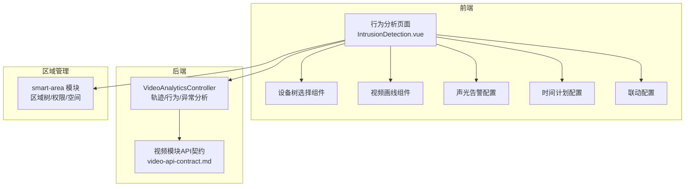
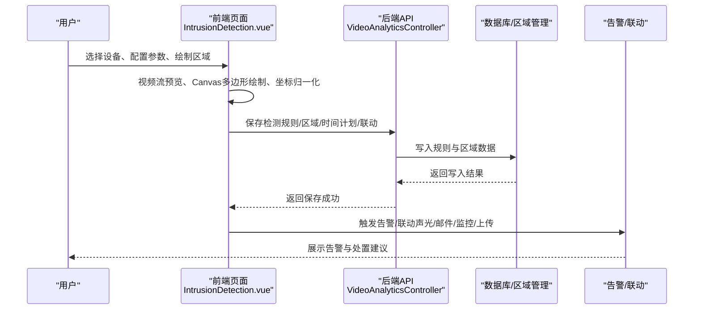
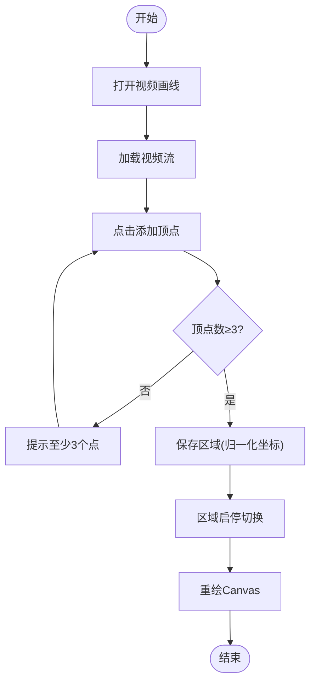
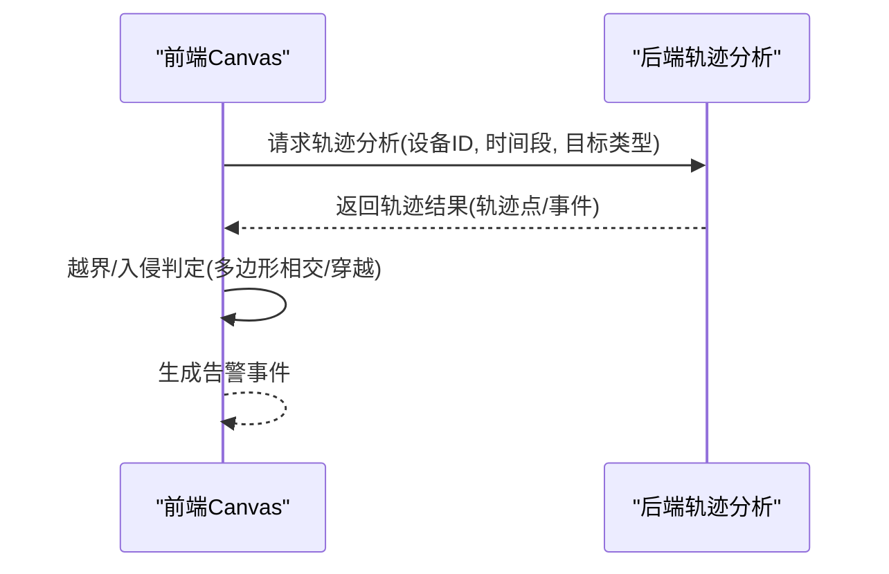
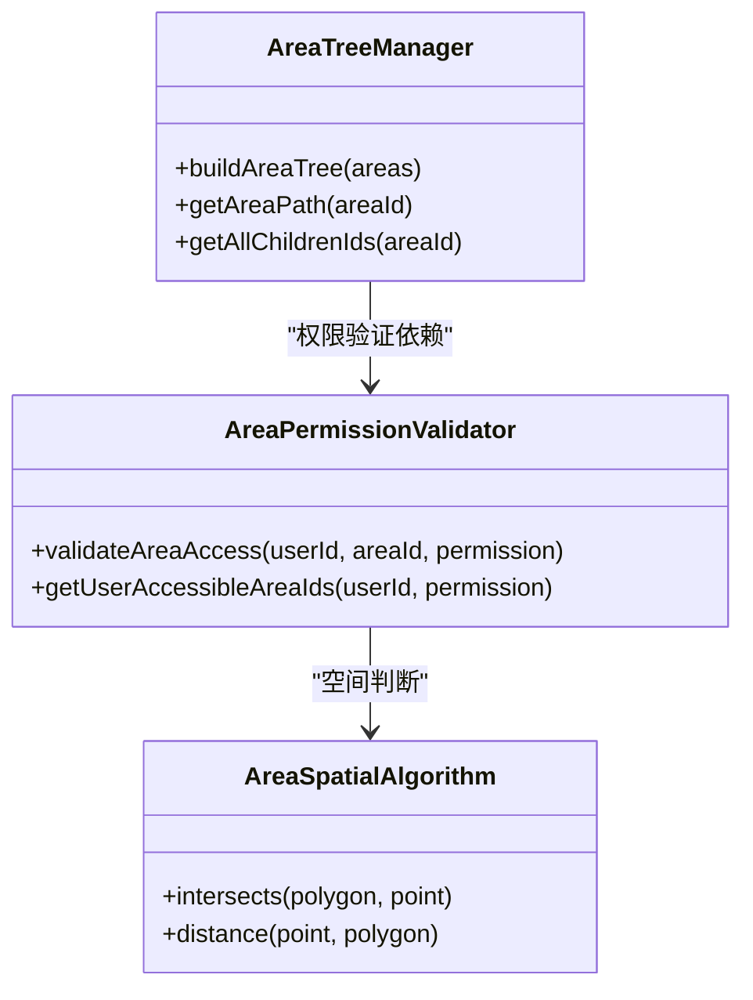
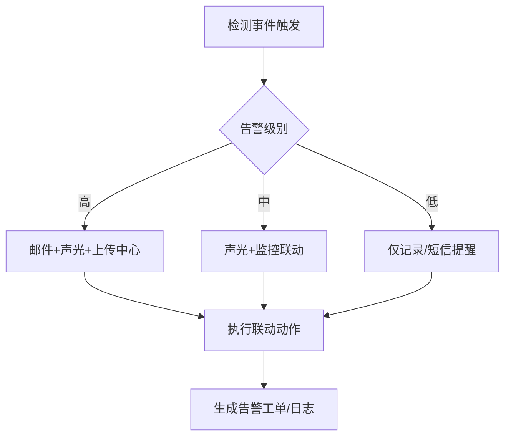
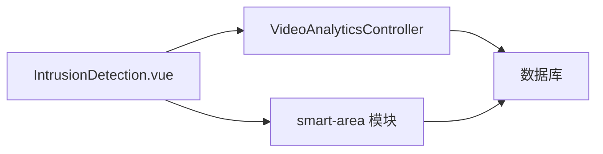

# 区域入侵检测

<cite>
**本文引用的文件**
- [行为分析页面功能布局文档_完善版.md](file://smart-admin-web-javascript/AI开发文档/行为分析页面功能布局文档_完善版.md)
- [IntrusionDetection.vue](file://smart-admin-web-javascript/AI开发文档/行为分析页面功能布局文档_完善版.md)
- [联动配置页面功能布局文档_完善版.md](file://smart-admin-web-javascript/AI开发文档/联动配置页面功能布局文档_完善版.md)
- [VideoAnalyticsController.java](file://restful_refactor_backup_20251202_014224/microservices_ioedream-video-service_src_main_java_net_lab1024_sa_video_controller_VideoAnalyticsController.java)
- [video-api-contract.md](file://documentation/api/video/video-api-contract.md)
- [smart-area.md](file://documentation/technical/smart-area.md)
- [smart-area.md](file://docs/COMMON_MODULES/smart-area.md)
</cite>

## 目录
1. [简介](#简介)
2. [项目结构](#项目结构)
3. [核心组件](#核心组件)
4. [架构总览](#架构总览)
5. [详细组件分析](#详细组件分析)
6. [依赖分析](#依赖分析)
7. [性能考量](#性能考量)
8. [故障排查指南](#故障排查指南)
9. [结论](#结论)
10. [附录](#附录)

## 简介
本文件面向“区域入侵检测”能力，围绕电子围栏绘制与配置、运动目标检测、轨迹跟踪、越界判断、多边形区域与禁止/敏感区域管理、告警级别与联动响应、复杂环境抗干扰策略以及检测灵敏度调节最佳实践进行系统化说明。文档以仓库现有前端页面与后端接口契约为基础，结合区域管理模块，形成从“配置—检测—联动—优化”的闭环说明。

## 项目结构
- 前端智能视频行为分析页面提供区域入侵检测的可视化配置界面，支持：
  - 设备树选择、视频流预览、多边形区域绘制、检测参数配置、声光告警、时间计划、联动配置、区域启停与管理。
- 后端视频分析控制器提供轨迹分析、行为分析、异常检测等接口，支撑入侵检测的算法与联动。
- 区域管理模块提供区域树、权限、空间数据等能力，为“区域入侵”提供空间语义与权限边界。

图表来源
- [行为分析页面功能布局文档_完善版.md](file://smart-admin-web-javascript/AI开发文档/行为分析页面功能布局文档_完善版.md)
- [VideoAnalyticsController.java](file://restful_refactor_backup_20251202_014224/microservices_ioedream-video-service_src_main_java_net_lab1024_sa_video_controller_VideoAnalyticsController.java)
- [video-api-contract.md](file://documentation/api/video/video-api-contract.md)
- [smart-area.md](file://documentation/technical/smart-area.md)

章节来源
- [行为分析页面功能布局文档_完善版.md](file://smart-admin-web-javascript/AI开发文档/行为分析页面功能布局文档_完善版.md)
- [VideoAnalyticsController.java](file://restful_refactor_backup_20251202_014224/microservices_ioedream-video-service_src_main_java_net_lab1024_sa_video_controller_VideoAnalyticsController.java)
- [video-api-contract.md](file://documentation/api/video/video-api-contract.md)
- [smart-area.md](file://documentation/technical/smart-area.md)

## 核心组件
- 区域入侵检测页面组件（IntrusionDetection.vue）
  - 功能：检测参数配置（目标类型、告警间隔、识别模式、灵敏度、容忍时间）、声光告警、检测区域设置（视频画线、区域列表、启停）、时间计划、联动配置、保存/重置。
  - 关键交互：视频流预览、Canvas多边形绘制、区域坐标归一化、区域启停重绘。
- 设备树选择组件
  - 功能：按区域/类型分组、搜索、单选设备并传递给检测页面。
- 视频画线组件
  - 功能：实时视频预览、多边形区域绘制、撤销/清除、最多支持多个区域、命名与管理。
- 联动配置组件
  - 功能：选择触发条件（入侵检测、越线检测、区域进入/离开、行为分析等），支持树形选择与确认。
- 后端视频分析控制器
  - 功能：轨迹分析、行为分析、异常检测、AI分析配置查询。
- 区域管理模块
  - 功能：区域树构建、路径获取、权限策略、空间数据（几何索引）。

章节来源
- [行为分析页面功能布局文档_完善版.md](file://smart-admin-web-javascript/AI开发文档/行为分析页面功能布局文档_完善版.md)
- [联动配置页面功能布局文档_完善版.md](file://smart-admin-web-javascript/AI开发文档/联动配置页面功能布局文档_完善版.md)
- [VideoAnalyticsController.java](file://restful_refactor_backup_20251202_014224/microservices_ioedream-video-service_src_main_java_net_lab1024_sa_video_controller_VideoAnalyticsController.java)
- [smart-area.md](file://documentation/technical/smart-area.md)

## 架构总览
区域入侵检测从前端配置到后端分析再到区域语义与权限的全链路如下：

图表来源
- [行为分析页面功能布局文档_完善版.md](file://smart-admin-web-javascript/AI开发文档/行为分析页面功能布局文档_完善版.md)
- [VideoAnalyticsController.java](file://restful_refactor_backup_20251202_014224/microservices_ioedream-video-service_src_main_java_net_lab1024_sa_video_controller_VideoAnalyticsController.java)
- [video-api-contract.md](file://documentation/api/video/video-api-contract.md)

## 详细组件分析

### 电子围栏绘制与配置
- 绘制流程
  - 打开“视频画线”，加载设备视频流；在Canvas上点击添加顶点，完成绘制后保存区域。
  - 坐标采用归一化（0-1），便于跨分辨率一致展示与存储。
- 区域管理
  - 支持添加/编辑/删除区域，区域启停状态影响Canvas渲染颜色与填充透明度。
  - 区域列表支持批量启停与删除。
- 参数配置
  - 检测目标类型（行人/车辆/非机动车）、告警检测间隔、识别模式（中心点/底部点/顶部点）、灵敏度、容忍时间（遗留/徘徊检测专用）。
- 时间计划与联动
  - 支持按时间段启用/禁用规则；联动类型包括邮件、声音、监控联动、上传中心等。

图表来源
- [行为分析页面功能布局文档_完善版.md](file://smart-admin-web-javascript/AI开发文档/行为分析页面功能布局文档_完善版.md)

章节来源
- [行为分析页面功能布局文档_完善版.md](file://smart-admin-web-javascript/AI开发文档/行为分析页面功能布局文档_完善版.md)

### 运动目标检测、轨迹跟踪与越界判断
- 运动目标检测
  - 前端通过视频流预览与Canvas叠加区域，实现“区域内运动目标”的可视化监测。
  - 后端提供轨迹分析接口，可用于进一步分析目标运动路径与越界事件。
- 轨迹跟踪
  - 后端提供轨迹分析接口，支持按设备、时间窗口与目标类型进行轨迹分析。
- 越界判断
  - 前端通过Canvas多边形区域与目标位置关系进行越界判定；后端提供行为分析接口，可用于检测越线/入侵等行为事件。

图表来源
- [VideoAnalyticsController.java](file://restful_refactor_backup_20251202_014224/microservices_ioedream-video-service_src_main_java_net_lab1024_sa_video_controller_VideoAnalyticsController.java)

章节来源
- [VideoAnalyticsController.java](file://restful_refactor_backup_20251202_014224/microservices_ioedream-video-service_src_main_java_net_lab1024_sa_video_controller_VideoAnalyticsController.java)

### 多边形区域、禁止区域、敏感区域的定义与管理
- 多边形区域
  - 由前端Canvas绘制，保存为归一化坐标集合；支持多个区域叠加。
- 禁止区域
  - 可通过区域启停或在规则中限制特定区域启用，从而达到“禁止”效果。
- 敏感区域
  - 可通过区域权限与告警级别差异化配置，实现对敏感区域的更严格告警策略。
- 区域树与权限
  - 区域管理模块提供区域树构建、路径获取、权限策略与空间数据（几何索引），为区域入侵提供空间语义与权限边界。

图表来源
- [smart-area.md](file://documentation/technical/smart-area.md)
- [smart-area.md](file://docs/COMMON_MODULES/smart-area.md)

章节来源
- [smart-area.md](file://documentation/technical/smart-area.md)
- [smart-area.md](file://docs/COMMON_MODULES/smart-area.md)

### 告警级别设置与联动响应机制
- 告警级别
  - 前端提供灵敏度与容忍时间等参数，间接影响告警频率与误报率；可结合区域启停与时间计划实现分级告警。
- 联动响应
  - 支持邮件、声音、监控联动、上传中心等联动类型；联动条件可从“触发条件树”中选择（如区域入侵、越线检测、行为分析等）。

图表来源
- [联动配置页面功能布局文档_完善版.md](file://smart-admin-web-javascript/AI开发文档/联动配置页面功能布局文档_完善版.md)
- [行为分析页面功能布局文档_完善版.md](file://smart-admin-web-javascript/AI开发文档/行为分析页面功能布局文档_完善版.md)

章节来源
- [联动配置页面功能布局文档_完善版.md](file://smart-admin-web-javascript/AI开发文档/联动配置页面功能布局文档_完善版.md)
- [行为分析页面功能布局文档_完善版.md](file://smart-admin-web-javascript/AI开发文档/行为分析页面功能布局文档_完善版.md)

### 复杂环境下的抗干扰策略
- 光影变化
  - 降低灵敏度、增加告警检测间隔、启用容忍时间（遗留/徘徊），减少因光照变化导致的误报。
- 小动物/树叶等小目标干扰
  - 限制检测目标类型（优先行人/车辆），提高目标尺寸阈值，必要时启用“底部点/中心点”识别模式以提升鲁棒性。
- 多区域叠加与启停
  - 对易受干扰区域临时禁用或调整启停时间，避免误报放大。

章节来源
- [行为分析页面功能布局文档_完善版.md](file://smart-admin-web-javascript/AI开发文档/行为分析页面功能布局文档_完善版.md)

### 检测灵敏度调节最佳实践
- 初始配置
  - 以中等灵敏度起步，观察误报与漏报情况，逐步微调。
- 参数联动
  - 灵敏度与告警检测间隔、容忍时间共同作用；高灵敏度需配合较长检测间隔与合理容忍时间。
- 区域差异化
  - 对不同区域设定差异化灵敏度与启停时间，兼顾准确性与及时性。
- 证据留存
  - 启用上传中心联动，保留事件截图/视频片段，辅助后续优化参数。

章节来源
- [行为分析页面功能布局文档_完善版.md](file://smart-admin-web-javascript/AI开发文档/行为分析页面功能布局文档_完善版.md)

## 依赖分析
- 前端依赖
  - IntrusionDetection.vue 依赖设备树、视频画线、声光告警、时间计划、联动配置等组件。
  - Canvas绘图依赖坐标归一化与区域启停状态。
- 后端依赖
  - VideoAnalyticsController 提供轨迹/行为/异常分析接口，作为入侵检测的算法与事件来源。
- 区域管理依赖
  - smart-area 模块提供区域树、权限策略与空间算法，支撑区域入侵的空间语义与权限控制。

图表来源
- [行为分析页面功能布局文档_完善版.md](file://smart-admin-web-javascript/AI开发文档/行为分析页面功能布局文档_完善版.md)
- [VideoAnalyticsController.java](file://restful_refactor_backup_20251202_014224/microservices_ioedream-video-service_src_main_java_net_lab1024_sa_video_controller_VideoAnalyticsController.java)
- [smart-area.md](file://documentation/technical/smart-area.md)

章节来源
- [行为分析页面功能布局文档_完善版.md](file://smart-admin-web-javascript/AI开发文档/行为分析页面功能布局文档_完善版.md)
- [VideoAnalyticsController.java](file://restful_refactor_backup_20251202_014224/microservices_ioedream-video-service_src_main_java_net_lab1024_sa_video_controller_VideoAnalyticsController.java)
- [smart-area.md](file://documentation/technical/smart-area.md)

## 性能考量
- 前端
  - Canvas绘制与重绘需在视频元数据加载完成后进行，避免尺寸未知导致的重绘抖动。
  - 归一化坐标减少跨分辨率差异带来的计算误差与重绘成本。
- 后端
  - 轨迹/行为分析接口按设备与时间窗口查询，建议在高并发场景下引入缓存与限流策略。
- 区域管理
  - 区域树构建与权限验证应避免深层递归与重复查询，必要时引入缓存与索引优化。

[本节为通用指导，不直接分析具体文件]

## 故障排查指南
- 视频流无法加载
  - 检查设备状态与流地址获取接口；确认前端视频预览与Canvas初始化时机。
- 区域绘制无效
  - 确认顶点数≥3；检查归一化坐标保存与Canvas重绘逻辑。
- 告警未触发
  - 检查灵敏度、容忍时间、区域启停与时间计划；核对联动配置与触发条件树。
- 轨迹/行为分析无结果
  - 确认设备ID、时间窗口与目标类型参数；检查后端接口返回与日志。

章节来源
- [行为分析页面功能布局文档_完善版.md](file://smart-admin-web-javascript/AI开发文档/行为分析页面功能布局文档_完善版.md)
- [VideoAnalyticsController.java](file://restful_refactor_backup_20251202_014224/microservices_ioedream-video-service_src_main_java_net_lab1024_sa_video_controller_VideoAnalyticsController.java)

## 结论
区域入侵检测以“前端可视化配置 + 后端算法分析 + 区域语义与权限”为核心，形成从“围栏绘制—目标检测—轨迹跟踪—越界判断—告警联动—抗干扰优化”的完整闭环。通过合理的参数调节与差异化策略，可在复杂环境下取得更高的准确率与更低的误报率。

[本节为总结性内容，不直接分析具体文件]

## 附录
- API契约参考
  - 视频模块API契约文档（移动端/PC端/设备管理/视频播放/录像回放/AI分析接口）为后续后端接口实现提供依据。
- 区域管理参考
  - 区域表、区域设备关联表、区域人员关联表与区域配置表，支撑区域入侵的权限与配置管理。

章节来源
- [video-api-contract.md](file://documentation/api/video/video-api-contract.md)
- [smart-area.md](file://documentation/technical/smart-area.md)
- [smart-area.md](file://docs/COMMON_MODULES/smart-area.md)