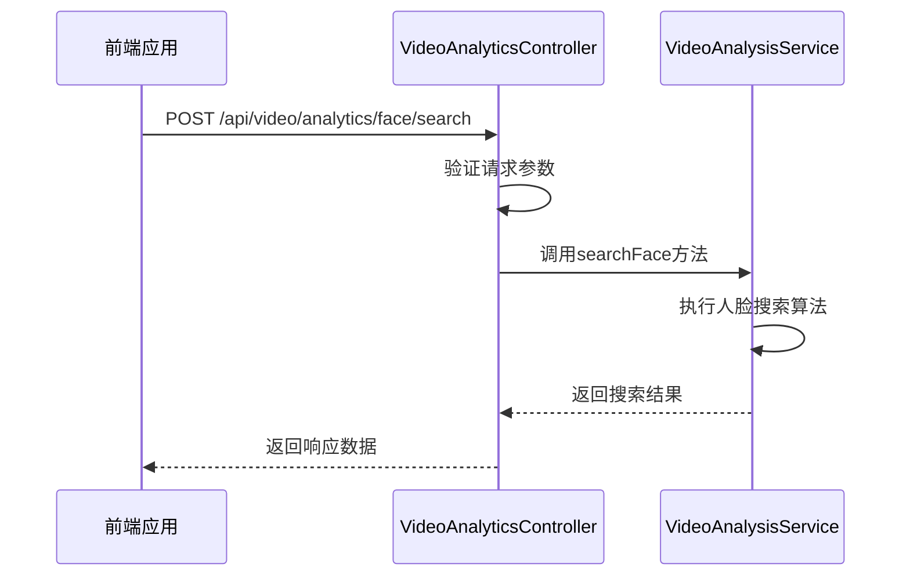
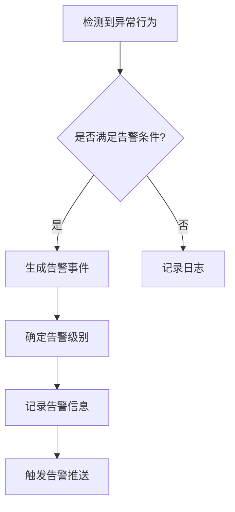
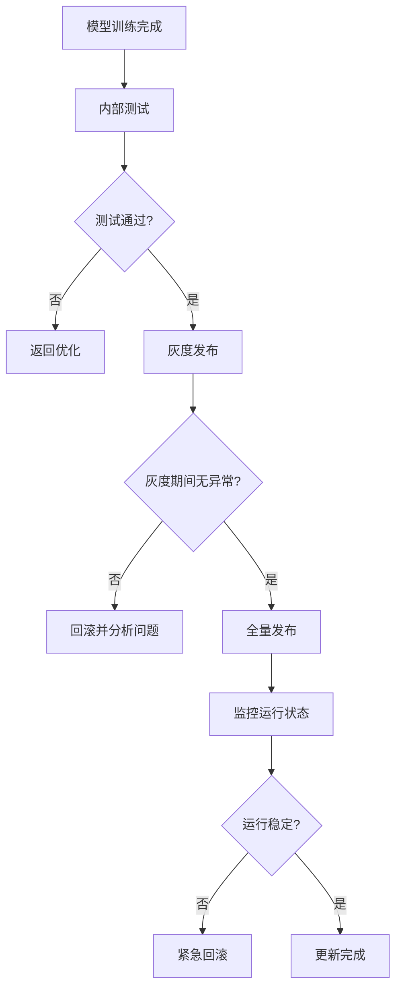
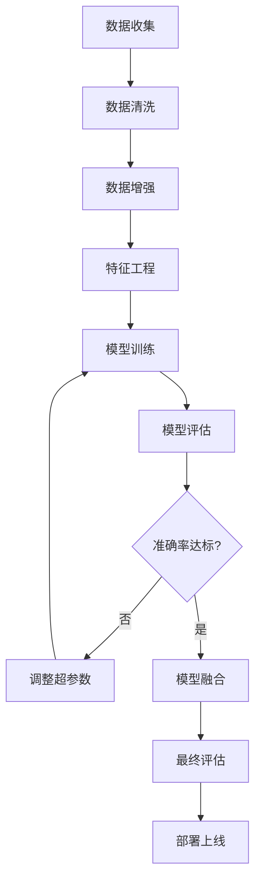

# 智能分析

<cite>
**本文档引用文件**   
- [VideoAnalyticsController.java](file://restful_refactor_backup_20251202_014224\microservices_ioedream-video-service_src_main_java_net_lab1024_sa_video_controller_VideoAnalyticsController.java)
- [11-t_alert.sql](file://database-scripts\common-service\11-t_alert.sql)
- [07-t_notification_message.sql](file://database-scripts\common-service\07-t_notification_message.sql)
- [12-t_alert_rule.sql](file://database-scripts\common-service\12-t_alert_rule.sql)
- [performance_optimization.sql](file://database\performance_optimization.sql)
- [NotificationManager.java](file://microservices\microservices-common\src\main\java\net\lab1024\sa\common\monitor\manager\NotificationManager.java)
- [12-前端API接口设计.md](file://documentation\03-业务模块\视频监控\12-前端API接口设计.md)
- [考勤前端原型布局\规则配置功能布局文档_完整版.md](file://documentation\03-业务模块\各业务模块文档\考勤\考勤前端原型布局\规则配置功能布局文档_完整版.md)
</cite>

## 目录
1. [智能分析功能概述](#智能分析功能概述)
2. [AI算法集成与调用接口](#ai算法集成与调用接口)
3. [分析结果存储结构](#分析结果存储结构)
4. [查询优化策略](#查询优化策略)
5. [告警事件机制](#告警事件机制)
6. [算法模型更新与版本管理](#算法模型更新与版本管理)
7. [性能优化实践](#性能优化实践)

## 智能分析功能概述

智能分析功能是系统的核心组成部分，集成了人脸识别、行为分析、区域入侵检测等AI算法，为视频监控、门禁管理、考勤系统等业务模块提供智能化支持。该功能通过微服务架构实现，主要由`ioedream-video-service`提供视频AI分析能力，与其他服务通过API进行交互。

系统采用Spring Boot和Spring Cloud技术栈，实现了高可用、可扩展的智能分析平台。通过RESTful API提供标准化接口，支持多种AI算法的集成和调用。同时，系统具备完善的告警机制、性能优化策略和模型管理方案，确保智能分析功能的稳定性和准确性。

**Section sources**
- [VideoAnalyticsController.java](file://restful_refactor_backup_20251202_014224\microservices_ioedream-video-service_src_main_java_net_lab1024_sa_video_controller_VideoAnalyticsController.java)

## AI算法集成与调用接口

智能分析功能提供了丰富的人脸识别、行为分析和区域入侵检测等AI算法接口。这些接口通过`VideoAnalyticsController`统一管理，采用RESTful风格设计，支持JSON格式的数据交互。

### 人脸识别接口

人脸识别功能支持人脸搜索和批量人脸搜索，能够根据上传的人脸图像在数据库中搜索相似人员。



**Diagram sources**
- [VideoAnalyticsController.java](file://restful_refactor_backup_20251202_014224\microservices_ioedream-video-service_src_main_java_net_lab1024_sa_video_controller_VideoAnalyticsController.java)

### 行为分析接口

行为分析功能支持对视频流进行智能分析，检测入侵、徘徊、暴力、跌倒等异常行为。

```http
POST /api/v1/video/ai/behavior-analysis
```

**请求参数:**
```json
{
  "deviceId": "CAM001",
  "videoSegment": {
    "startTime": "2024-01-02 14:00:00",
    "endTime": "2024-01-02 14:05:00",
    "streamUrl": "rtmp://192.168.1.101/live/stream1"
  },
  "analysisTypes": ["INTRUSION", "LOITERING", "VIOLENCE", "FALL_DETECTION"],
  "sensitivity": "MEDIUM",
  "regionOfInterest": {
    "points": [
      { "x": 100, "y": 100 },
      { "x": 500, "y": 100 },
      { "x": 500, "y": 400 },
      { "x": 100, "y": 400 }
    ]
  }
}
```

**响应数据:**
```json
{
  "code": 200,
  "data": {
    "analysisId": "AI_BEHAVIOR_20240102_001",
    "deviceId": "CAM001",
    "analysisPeriod": {
      "startTime": "2024-01-02 14:00:00",
      "endTime": "2024-01-02 14:05:00"
    },
    "events": [
      {
        "eventId": "EVENT_001",
        "eventType": "INTRUSION",
        "eventTime": "2024-01-02 14:02:15",
        "confidence": 0.88,
        "description": "检测到人员闯入禁区",
        "objects": [
          {
            "objectId": "OBJ_001",
            "objectType": "PERSON",
            "position": { "x": 250, "y": 200 },
            "boundingBox": { "x": 230, "y": 180, "width": 40, "height": 80 },
            "trackId": "TRACK_001"
          }
        ],
        "trajectory": [
          { "x": 200, "y": 150, "time": "14:02:10" },
          { "x": 250, "y": 200, "time": "14:02:15" }
        ],
        "evidence": {
          "snapshotUrl": "/events/20240102/140215.jpg",
          "videoClip": {
            "startTime": "14:02:10",
            "endTime": "14:02:20",
            "clipUrl": "/clips/20240102/140215.mp4"
          }
        }
      }
    ],
    "statistics": {
      "totalEvents": 1,
      "eventTypes": {
        "INTRUSION": 1,
        "LOITERING": 0,
        "VIOLENCE": 0,
        "FALL_DETECTION": 0
      },
      "processingTime": 2500
    }
  }
}
```

### 区域入侵检测接口

区域入侵检测功能允许用户定义感兴趣区域（ROI），并检测是否有人员或物体进入该区域。

```http
POST /api/v1/video/ai/intrusion-detection
```

**请求参数:**
```json
{
  "deviceId": "CAM001",
  "regionOfInterest": {
    "points": [
      { "x": 100, "y": 100 },
      { "x": 500, "y": 100 },
      { "x": 500, "y": 400 },
      { "x": 100, "y": 400 }
    ]
  },
  "detectionTypes": ["PERSON", "VEHICLE"],
  "startTime": "2024-01-02 14:00:00",
  "endTime": "2024-01-02 14:05:00"
}
```

**Section sources**
- [12-前端API接口设计.md](file://documentation\03-业务模块\视频监控\12-前端API接口设计.md)
- [VideoAnalyticsController.java](file://restful_refactor_backup_20251202_014224\microservices_ioedream-video-service_src_main_java_net_lab1024_sa_video_controller_VideoAnalyticsController.java)

## 分析结果存储结构

智能分析的结果通过数据库表进行存储和管理，主要涉及告警表、通知消息表和告警规则表等。

### 告警表 (t_alert)

告警表用于存储AI分析产生的告警记录，包含告警级别、标题、消息、状态等信息。

```sql
CREATE TABLE IF NOT EXISTS `t_alert` (
    `alert_id` BIGINT NOT NULL AUTO_INCREMENT COMMENT '告警ID',
    `alert_level` VARCHAR(20) NOT NULL COMMENT '告警级别：INFO/WARNING/ERROR/CRITICAL',
    `alert_title` VARCHAR(200) NOT NULL COMMENT '告警标题',
    `alert_message` TEXT NOT NULL COMMENT '告警消息',
    `service_name` VARCHAR(100) COMMENT '服务名称',
    `instance_id` VARCHAR(100) COMMENT '实例ID',
    `metric_name` VARCHAR(100) COMMENT '监控指标名称',
    `metric_value` DOUBLE COMMENT '指标值',
    `threshold_value` DOUBLE COMMENT '阈值',
    `status` VARCHAR(20) NOT NULL DEFAULT 'ACTIVE' COMMENT '状态：ACTIVE/RESOLVED/SUPPRESSED',
    `resolution_notes` TEXT COMMENT '解决说明',
    `resolved_time` DATETIME COMMENT '解决时间',
    `resolved_user_id` BIGINT COMMENT '解决人ID',
    `rule_id` BIGINT COMMENT '关联告警规则ID',
    `tags` VARCHAR(500) COMMENT '标签',
    `create_time` DATETIME NOT NULL DEFAULT CURRENT_TIMESTAMP COMMENT '创建时间',
    `update_time` DATETIME NOT NULL DEFAULT CURRENT_TIMESTAMP ON UPDATE CURRENT_TIMESTAMP COMMENT '更新时间',
    `deleted_flag` TINYINT NOT NULL DEFAULT 0 COMMENT '删除标记：0-未删除 1-已删除',
    PRIMARY KEY (`alert_id`),
    KEY `idx_alert_level` (`alert_level`),
    KEY `idx_service_name` (`service_name`),
    KEY `idx_status` (`status`),
    KEY `idx_rule_id` (`rule_id`),
    KEY `idx_create_time` (`create_time`),
    KEY `idx_deleted_flag` (`deleted_flag`)
) ENGINE=InnoDB DEFAULT CHARSET=utf8mb4 COLLATE=utf8mb4_unicode_ci COMMENT='告警表';
```

### 通知消息表 (t_notification_message)

通知消息表用于存储系统发送的各种通知，包括告警通知、系统通知和业务通知。

```sql
CREATE TABLE IF NOT EXISTS `t_notification_message` (
    `message_id` BIGINT NOT NULL AUTO_INCREMENT COMMENT '消息ID',
    `message_type` TINYINT NOT NULL COMMENT '消息类型：1-系统通知 2-业务通知 3-告警通知',
    `title` VARCHAR(200) NOT NULL COMMENT '消息标题',
    `content` TEXT NOT NULL COMMENT '消息内容',
    `sender_id` BIGINT COMMENT '发送人ID',
    `sender_name` VARCHAR(100) COMMENT '发送人姓名',
    `recipient_type` TINYINT NOT NULL COMMENT '接收人类型：1-指定用户 2-角色 3-部门 4-全体',
    `recipient_ids` TEXT COMMENT '接收人ID列表（JSON数组）',
    `channel` TINYINT NOT NULL COMMENT '发送渠道：1-站内信 2-邮件 3-短信 4-微信 5-推送',
    `priority` TINYINT NOT NULL DEFAULT 2 COMMENT '优先级：1-低 2-普通 3-高 4-紧急',
    `status` TINYINT NOT NULL DEFAULT 1 COMMENT '状态：1-待发送 2-发送中 3-已发送 4-发送失败',
    `send_time` DATETIME COMMENT '发送时间',
    `read_count` INT NOT NULL DEFAULT 0 COMMENT '已读数量',
    `total_count` INT NOT NULL DEFAULT 0 COMMENT '总接收数量',
    `business_type` VARCHAR(50) COMMENT '业务类型',
    `business_id` VARCHAR(100) COMMENT '业务ID',
    `template_id` VARCHAR(50) COMMENT '模板ID',
    `template_params` TEXT COMMENT '模板参数（JSON格式）',
    `create_time` DATETIME NOT NULL DEFAULT CURRENT_TIMESTAMP COMMENT '创建时间',
    `update_time` DATETIME NOT NULL DEFAULT CURRENT_TIMESTAMP ON UPDATE CURRENT_TIMESTAMP COMMENT '更新时间',
    `create_user_id` BIGINT COMMENT '创建人ID',
    `update_user_id` BIGINT COMMENT '更新人ID',
    `deleted_flag` TINYINT NOT NULL DEFAULT 0 COMMENT '删除标记：0-未删除 1-已删除',
    PRIMARY KEY (`message_id`),
    KEY `idx_message_type` (`message_type`),
    KEY `idx_sender_id` (`sender_id`),
    KEY `idx_status` (`status`),
    KEY `idx_send_time` (`send_time`),
    KEY `idx_business` (`business_type`, `business_id`),
    KEY `idx_create_time` (`create_time`),
    KEY `idx_deleted_flag` (`deleted_flag`)
) ENGINE=InnoDB DEFAULT CHARSET=utf8mb4 COLLATE=utf8mb4_unicode_ci COMMENT='通知消息表';
```

### 告警规则表 (t_alert_rule)

告警规则表用于配置各种告警规则，包括监控指标、阈值、告警级别、通知方式等。

```sql
CREATE TABLE IF NOT EXISTS `t_alert_rule` (
    `rule_id` BIGINT NOT NULL AUTO_INCREMENT COMMENT '规则ID',
    `rule_name` VARCHAR(100) NOT NULL COMMENT '规则名称',
    `rule_description` VARCHAR(500) COMMENT '规则描述',
    `metric_name` VARCHAR(100) NOT NULL COMMENT '监控指标',
    `monitor_type` VARCHAR(50) COMMENT '监控类型',
    `condition_operator` VARCHAR(20) NOT NULL COMMENT '告警条件：GT/GTE/LT/LTE/EQ/NEQ',
    `threshold_value` DOUBLE NOT NULL COMMENT '告警阈值',
    `alert_level` VARCHAR(20) NOT NULL COMMENT '告警级别：INFO/WARNING/ERROR/CRITICAL',
    `applicable_services` VARCHAR(500) COMMENT '适用服务（逗号分隔）',
    `applicable_environments` VARCHAR(200) COMMENT '适用环境（逗号分隔）',
    `status` VARCHAR(20) NOT NULL DEFAULT 'ENABLED' COMMENT '规则状态：ENABLED/DISABLED',
    `duration_minutes` INT COMMENT '持续时间（分钟）',
    `notification_channels` VARCHAR(200) COMMENT '通知方式（逗号分隔）',
    `notification_users` VARCHAR(500) COMMENT '通知人员（逗号分隔）',
    `notification_interval` INT COMMENT '通知频率（分钟）',
    `suppression_duration` INT COMMENT '抑制时间（分钟）',
    `rule_expression` TEXT COMMENT '规则表达式',
    `priority` INT NOT NULL DEFAULT 0 COMMENT '规则优先级',
    `tags` VARCHAR(500) COMMENT '标签',
    `create_time` DATETIME NOT NULL DEFAULT CURRENT_TIMESTAMP COMMENT '创建时间',
    `update_time` DATETIME NOT NULL DEFAULT CURRENT_TIMESTAMP ON UPDATE CURRENT_TIMESTAMP COMMENT '更新时间',
    `create_user_id` BIGINT COMMENT '创建人ID',
    `update_user_id` BIGINT COMMENT '更新人ID',
    `deleted_flag` TINYINT NOT NULL DEFAULT 0 COMMENT '删除标记：0-未删除 1-已删除',
    PRIMARY KEY (`rule_id`),
    KEY `idx_metric_name` (`metric_name`),
    KEY `idx_status` (`status`),
    KEY `idx_alert_level` (`alert_level`),
    KEY `idx_deleted_flag` (`deleted_flag`)
) ENGINE=InnoDB DEFAULT CHARSET=utf8mb4 COLLATE=utf8mb4_unicode_ci COMMENT='告警规则表';
```

**Section sources**
- [11-t_alert.sql](file://database-scripts\common-service\11-t_alert.sql)
- [07-t_notification_message.sql](file://database-scripts\common-service\07-t_notification_message.sql)
- [12-t_alert_rule.sql](file://database-scripts\common-service\12-t_alert_rule.sql)

## 查询优化策略

为提高智能分析功能的查询性能，系统实施了多种优化策略，包括索引优化、缓存机制和查询引擎优化。

### 索引优化

系统针对主要业务表创建了复合索引，以提高查询效率。例如，在门禁记录表上创建了设备时间复合索引：

```sql
CREATE INDEX IF NOT EXISTS idx_access_record_device_time ON t_access_record(
    device_id,
    access_time DESC,
    deleted_flag
);
```

在考勤记录表上创建了用户日期索引：

```sql
CREATE INDEX IF NOT EXISTS idx_attendance_user_date ON t_attendance_record(
    user_id,
    record_date DESC,
    record_time DESC,
    deleted_flag
);
```

### 游标分页优化

为解决深度分页性能问题，系统采用游标分页替代传统的LIMIT OFFSET分页方式：

```sql
-- 优化查询（高性能）：
SELECT * FROM t_common_device
WHERE deleted_flag = 0 AND create_time < #{lastCreateTime}
ORDER BY create_time DESC LIMIT 20;
```

### 统计查询优化

系统创建了多个视图来优化统计查询性能：

```sql
CREATE OR REPLACE VIEW v_device_statistics AS
SELECT
    device_type,
    device_status,
    COUNT(*) AS device_count,
    SUM(CASE WHEN deleted_flag = 0 THEN 1 ELSE 0 END) AS active_count
FROM t_common_device
GROUP BY device_type, device_status;
```

```sql
CREATE OR REPLACE VIEW v_access_daily_statistics AS
SELECT
    DATE(access_time) AS access_date,
    device_id,
    COUNT(*) AS access_count,
    SUM(CASE WHEN access_status = 'SUCCESS' THEN 1 ELSE 0 END) AS success_count
FROM t_access_record
WHERE deleted_flag = 0
GROUP BY DATE(access_time), device_id;
```

**Section sources**
- [performance_optimization.sql](file://database\performance_optimization.sql)

## 告警事件机制

智能分析功能具备完善的告警事件生成、分级和推送机制，确保异常情况能够及时通知相关人员。

### 告警生成与分级

告警事件根据严重程度分为不同级别：INFO（信息）、WARNING（警告）、ERROR（错误）和CRITICAL（严重）。系统根据预设的告警规则生成告警，并自动确定告警级别。



### 告警推送机制

系统通过`NotificationManager`实现告警推送，支持多种渠道和优先级设置。

```java
/**
 * 创建通知记录
 * <p>
 * 根据告警规则创建通知，支持多渠道和多接收人
 * 企业级实现：
 * - 查询告警规则配置
 * - 解析通知渠道和接收人
 * - 为每个渠道和接收人创建通知记录
 * - 支持优先级设置
 * </p>
 *
 * @param alert 告警信息
 * @return 通知记录列表
 */
private List<NotificationEntity> createNotifications(AlertEntity alert) {
    List<NotificationEntity> notifications = new ArrayList<>();

    try {
        // 1. 查询告警规则
        AlertRuleEntity alertRule = getAlertRule(alert);
        if (alertRule == null) {
            log.warn("告警规则不存在，使用默认配置，告警ID：{}", alert.getAlertId());
            // 使用默认配置创建通知
            NotificationEntity defaultNotification = createDefaultNotification(alert);
            notificationDao.insert(defaultNotification);
            notifications.add(defaultNotification);
            return notifications;
        }

        // 2. 解析通知渠道
        List<Integer> channels = parseNotificationChannels(alertRule.getNotificationChannels());
        if (CollectionUtils.isEmpty(channels)) {
            channels = Arrays.asList(1); // 默认站内信
        }

        // 3. 解析接收人
        List<String> receiverIds = parseNotificationUsers(alertRule.getNotificationUsers());
        if (CollectionUtils.isEmpty(receiverIds)) {
            receiverIds = getDefaultReceivers(alert);
        }

        // 4. 计算通知优先级
        Integer priority = calculatePriority(alert.getAlertLevel(), alertRule.getAlertLevel());

        // 5. 为每个渠道和接收人创建通知记录
        for (Integer channel : channels) {
            for (String receiverId : receiverIds) {
                NotificationEntity notification = new NotificationEntity();
                notification.setTitle(alert.getAlertTitle());
                notification.setContent(buildNotificationContent(alert, alertRule));
                notification.setNotificationType(1); // 1-告警通知
                notification.setReceiverType(1); // 1-指定用户
                notification.setReceiverIds(receiverId);
                notification.setChannel(channel);
                notification.setStatus(0); // 0-待发送
                notification.setPriority(priority);
                notification.setMaxRetryCount(3); // 默认最大重试3次

                notificationDao.insert(notification);
                notifications.add(notification);

                log.debug("创建通知记录成功，通知ID：{}，渠道：{}，接收人：{}",
                        notification.getNotificationId(), channel, receiverId);
            }
        }

        log.info("根据告警规则创建通知完成，告警ID：{}，规则ID：{}，通知数量：{}",
                alert.getAlertId(), alertRule.getRuleId(), notifications.size());

    } catch (Exception e) {
        log.error("根据告警规则创建通知失败，告警ID：{}", alert.getAlertId(), e);
        // 异常情况下创建默认通知
        try {
            NotificationEntity defaultNotification = createDefaultNotification(alert);
            notificationDao.insert(defaultNotification);
            notifications.add(defaultNotification);
        } catch (Exception ex) {
            log.error("创建默认通知失败", ex);
        }
    }

    return notifications;
}
```

### 通知模板配置

系统支持灵活的通知模板配置，允许用户自定义通知内容和变量。

```json
{
  "templateId": "ATTENDANCE_ALERT_001",
  "name": "考勤异常提醒",
  "title": "考勤异常通知",
  "content": "考勤异常提醒：${employeeName}，您已连续${days}天未打卡，请及时处理。",
  "channels": ["sms", "wechat", "email"],
  "variables": [
    { "key": "${employeeName}", "description": "员工姓名" },
    { "key": "${employeeNo}", "description": "员工工号" },
    { "key": "${department}", "description": "部门名称" },
    { "key": "${position}", "description": "岗位名称" },
    { "key": "${date}", "description": "日期" },
    { "key": "${time}", "description": "时间" },
    { "key": "${rule}", "description": "规则名称" },
    { "key": "${reason}", "description": "异常原因" },
    { "key": "${location}", "description": "打卡地点" },
    { "key": "${device}", "description": "设备名称" }
  ]
}
```

**Section sources**
- [NotificationManager.java](file://microservices\microservices-common\src\main\java\net\lab1024\sa\common\monitor\manager\NotificationManager.java)
- [考勤前端原型布局\规则配置功能布局文档_完整版.md](file://documentation\03-业务模块\各业务模块文档\考勤\考勤前端原型布局\规则配置功能布局文档_完整版.md)

## 算法模型更新与版本管理

为确保AI算法的持续优化和稳定运行，系统实施了完善的模型更新和版本管理方案。

### 模型版本管理

系统采用语义化版本控制（Semantic Versioning）管理AI模型，版本号格式为MAJOR.MINOR.PATCH。每次模型更新都会生成新的版本号，并记录变更日志。

```json
{
  "modelId": "FACE_RECOGNITION_V1",
  "version": "2.3.1",
  "name": "人脸识别模型",
  "description": "基于深度学习的人脸识别算法",
  "accuracy": 0.985,
  "f1Score": 0.978,
  "trainingDataSize": 1000000,
  "trainingDate": "2024-01-15",
  "status": "ACTIVE",
  "deploymentDate": "2024-01-16",
  "changelog": [
    {
      "version": "2.3.1",
      "date": "2024-01-15",
      "changes": [
        "优化了小尺寸人脸的识别准确率",
        "减少了模型推理时间20%",
        "修复了特定光照条件下识别率下降的问题"
      ]
    },
    {
      "version": "2.2.0",
      "date": "2023-11-20",
      "changes": [
        "增加了对戴口罩人脸的识别支持",
        "提升了模型的鲁棒性"
      ]
    }
  ]
}
```

### 模型更新流程

模型更新遵循严格的发布流程，包括测试、灰度发布和全量发布三个阶段。



### 回滚机制

系统具备快速回滚能力，当新模型出现问题时，可以在几分钟内回滚到之前的稳定版本。

```java
public class ModelVersionManager {
    
    /**
     * 切换模型版本
     * @param modelId 模型ID
     * @param version 目标版本
     * @return 是否切换成功
     */
    public boolean switchModelVersion(String modelId, String version) {
        try {
            // 1. 验证版本是否存在
            ModelVersion targetVersion = modelVersionDao.selectByModelIdAndVersion(modelId, version);
            if (targetVersion == null) {
                log.error("目标版本不存在，modelId：{}，version：{}", modelId, version);
                return false;
            }
            
            // 2. 检查版本状态
            if (!"ACTIVE".equals(targetVersion.getStatus())) {
                log.error("目标版本不可用，状态：{}", targetVersion.getStatus());
                return false;
            }
            
            // 3. 执行版本切换
            ModelVersion currentVersion = getCurrentVersion(modelId);
            if (currentVersion != null) {
                // 记录切换日志
                log.info("开始切换模型版本，modelId：{}，从{}切换到{}", 
                        modelId, currentVersion.getVersion(), version);
            }
            
            // 更新当前版本
            updateCurrentVersion(modelId, version);
            
            // 通知相关服务重新加载模型
            notifyServicesReloadModel(modelId);
            
            log.info("模型版本切换成功，modelId：{}，version：{}", modelId, version);
            return true;
            
        } catch (Exception e) {
            log.error("切换模型版本失败，modelId：{}，version：{}", modelId, version, e);
            return false;
        }
    }
}
```

## 性能优化实践

为提高智能分析功能的准确率和性能，系统实施了多项优化措施。

### 准确率优化

通过数据增强、模型融合和超参数调优等方法提高AI算法的准确率。



### 误报过滤

实施多级误报过滤机制，减少不必要的告警。

```java
public class FalseAlarmFilter {
    
    /**
     * 过滤误报
     * @param event 原始事件
     * @return 是否为误报
     */
    public boolean isFalseAlarm(AnalysisEvent event) {
        // 1. 基于规则的过滤
        if (isRuleBasedFalseAlarm(event)) {
            return true;
        }
        
        // 2. 基于上下文的过滤
        if (isContextBasedFalseAlarm(event)) {
            return true;
        }
        
        // 3. 基于机器学习的过滤
        if (isMLBasedFalseAlarm(event)) {
            return true;
        }
        
        return false;
    }
    
    /**
     * 基于规则的误报过滤
     */
    private boolean isRuleBasedFalseAlarm(AnalysisEvent event) {
        // 检查是否在排除时间段内
        if (isInExclusionPeriod(event.getEventTime())) {
            return true;
        }
        
        // 检查是否在排除区域
        if (isInExclusionArea(event.getDeviceId(), event.getPosition())) {
            return true;
        }
        
        // 检查是否为已知的误报模式
        if (isKnownFalseAlarmPattern(event)) {
            return true;
        }
        
        return false;
    }
}
```

### 性能调优

通过并行处理、缓存和资源优化等方法提高系统性能。

```sql
-- 性能监控查询
SELECT
    TABLE_NAME,
    INDEX_NAME,
    CARDINALITY,
    INDEX_LENGTH,
    INDEX_TYPE
FROM information_schema.STATISTICS
WHERE TABLE_SCHEMA = DATABASE()
AND TABLE_NAME IN (
    't_common_device', 't_access_record', 't_attendance_record',
    't_consume_record', 't_visitor_record'
)
ORDER BY TABLE_NAME, CARDINALITY DESC;
```

**Section sources**
- [performance_optimization.sql](file://database\performance_optimization.sql)
- [NotificationManager.java](file://microservices\microservices-common\src\main\java\net\lab1024\sa\common\monitor\manager\NotificationManager.java)