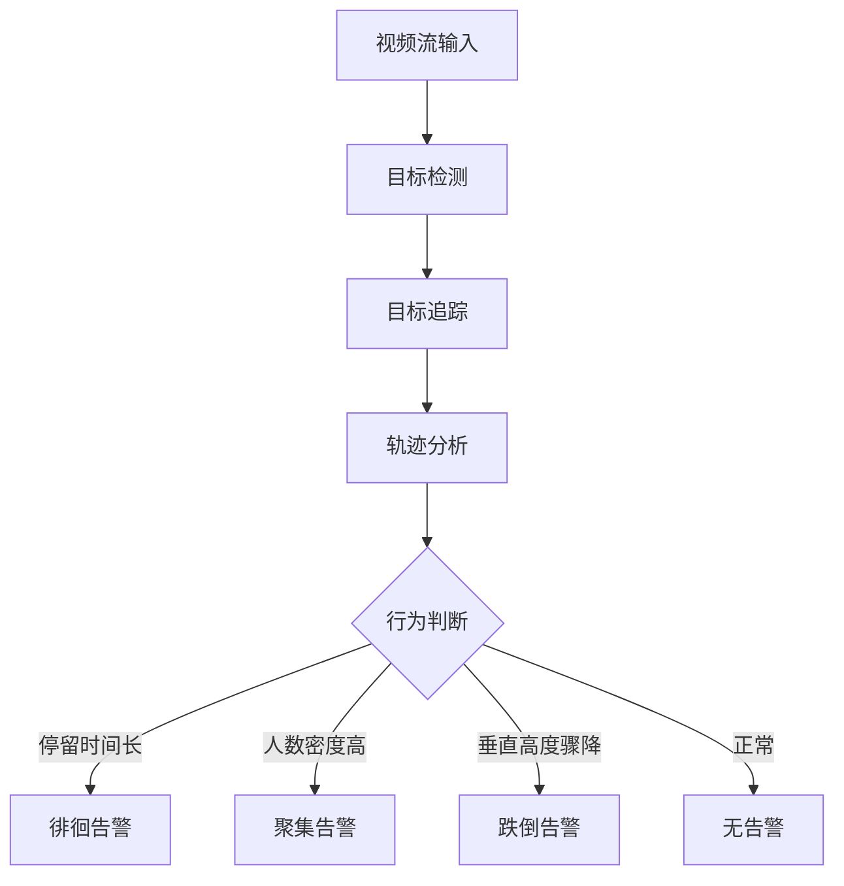
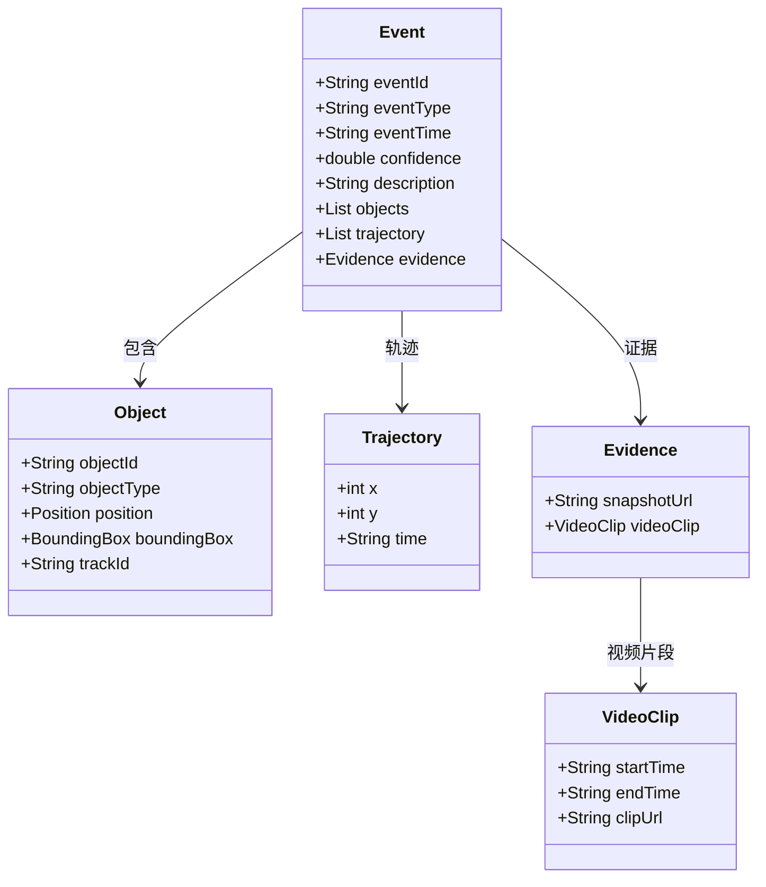
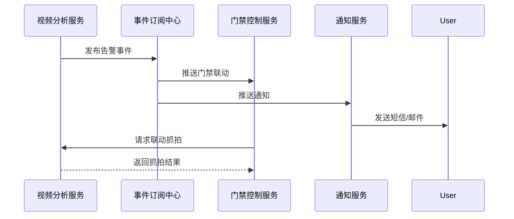
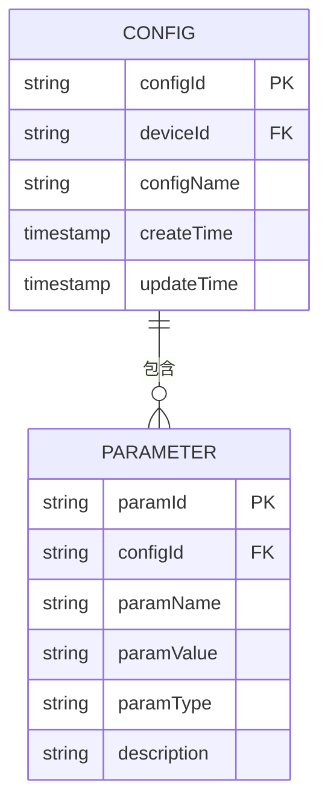
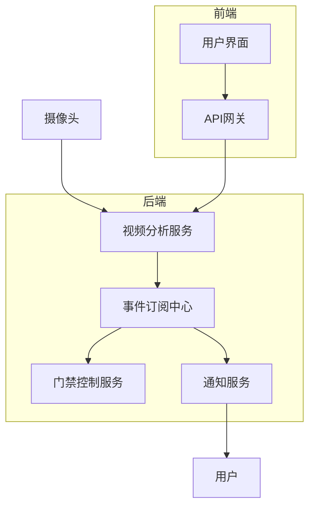

# 行为分析

<cite>
**本文档引用文件**   
- [VideoAnalyticsController.java](file://restful_refactor_backup_20251202_014224/microservices_ioedream-video-service_src_main_java_net_lab1024_sa_video_controller_VideoAnalyticsController.java)
- [behavior-api.js](file://smart-admin-web-javascript/AI开发文档/行为分析页面功能布局文档_完善版.md)
- [algorithm-api.js](file://smart-admin-web-javascript/AI开发文档/算法模式配置页面功能布局文档_完善版.md)
- [behavior-analysis.md](file://documentation/03-业务模块/视频监控/12-前端API接口设计.md)
- [smart-video.md](file://documentation/03-业务模块/各业务模块文档/智能视频/01-项目概述与系统架构.md)
- [GlobalConfig.vue](file://smart-admin-web-javascript/AI开发文档/行为分析页面功能布局文档_完善版.md)
- [AlgorithmConfigForm.vue](file://smart-admin-web-javascript/AI开发文档/算法模式配置页面功能布局文档_完善版.md)
- [AlgorithmStatusPanel.vue](file://smart-admin-web-javascript/AI开发文档/算法模式配置页面功能布局文档_完善版.md)
- [subscription-const.js](file://smart-admin-web-javascript/AI开发文档/事件订阅页面功能布局文档_完善版.md)
- [linkageRule.js](file://smart-admin-web-javascript/AI开发文档/联动配置页面功能布局文档_完善版.md)
</cite>

## 目录
1. [引言](#引言)
2. [行为分析算法原理](#行为分析算法原理)
3. [模型训练与更新机制](#模型训练与更新机制)
4. [事件分类与置信度体系](#事件分类与置信度体系)
5. [实时告警触发与推送](#实时告警触发与推送)
6. [误报过滤与准确率评估](#误报过滤与准确率评估)
7. [多场景配置参数](#多场景配置参数)
8. [系统架构与数据流](#系统架构与数据流)
9. [结论](#结论)

## 引言
行为分析功能是智能视频监控系统的核心组成部分，旨在通过AI算法自动检测人员的异常行为，如徘徊、聚集、跌倒等，以提升安防水平。本系统采用Spring Boot微服务架构，通过事件订阅中心与其他模块（如门禁、告警）进行数据交互，实现高效、可扩展的智能分析。行为分析服务作为独立微服务，具备高可用性和高性能，支持大规模摄像头并发处理和低延时联动抓拍。

**Section sources**
- [smart-video.md](file://documentation/03-业务模块/各业务模块文档/智能视频/01-项目概述与系统架构.md)

## 行为分析算法原理
行为分析算法基于深度学习和计算机视觉技术，通过视频流分析人员的运动轨迹和姿态变化来识别异常行为。系统首先对视频帧进行目标检测，识别出人员位置和边界框，然后通过目标追踪算法（如SORT或DeepSORT）建立人员的运动轨迹。对于徘徊行为，算法计算人员在特定区域内的停留时间，当超过预设阈值时触发告警；对于聚集行为，算法统计区域内的人数密度，当达到高密度阈值时判定为聚集；对于跌倒行为，算法分析人员的垂直高度变化和姿态角，当检测到突然的垂直下降和特定姿态时判定为跌倒。

**Diagram sources**
- [VideoAnalyticsController.java](file://restful_refactor_backup_20251202_014224/microservices_ioedream-video-service_src_main_java_net_lab1024_sa_video_controller_VideoAnalyticsController.java)

**Section sources**
- [VideoAnalyticsController.java](file://restful_refactor_backup_20251202_014224/microservices_ioedream-video-service_src_main_java_net_lab1024_sa_video_controller_VideoAnalyticsController.java)

## 模型训练与更新机制
行为分析模型的训练数据来源于历史视频监控数据，包括正常行为和各种异常行为的标注样本。数据来源包括公司大门、停车场、大厅等不同场景的监控视频，确保模型的泛化能力。训练过程采用监督学习方法，使用标注的视频片段进行模型训练，优化损失函数以提高检测准确率。模型更新机制为定期更新和事件驱动更新相结合：定期更新（如每月一次）使用新收集的数据重新训练模型；事件驱动更新在检测到大量误报或漏报时触发，通过增量学习快速调整模型参数。

**Section sources**
- [smart-video.md](file://documentation/03-业务模块/各业务模块文档/智能视频/01-项目概述与系统架构.md)

## 事件分类与置信度体系
行为分析结果的事件类型分为入侵（INTRUSION）、徘徊（LOITERING）、暴力（VIOLENCE）和跌倒检测（FALL_DETECTION）。每种事件类型都有详细的描述和对应的处理流程。置信度评分体系基于模型的输出概率，范围为0到1，表示检测结果的可靠性。置信度越高，表示检测结果越可靠。系统根据置信度阈值（如0.8）决定是否触发告警，高置信度事件直接告警，低置信度事件标记为可疑，供人工复核。

**Diagram sources**
- [behavior-analysis.md](file://documentation/03-业务模块/视频监控/12-前端API接口设计.md)

**Section sources**
- [behavior-analysis.md](file://documentation/03-业务模块/视频监控/12-前端API接口设计.md)

## 实时告警触发与推送
实时告警的触发条件包括检测到异常行为且置信度超过阈值、设备离线、存储空间不足等。告警推送流程如下：行为分析服务检测到异常事件后，生成告警信息并通过事件订阅中心发布；事件订阅中心根据订阅规则将告警推送给相关模块，如门禁控制模块、短信通知模块等；接收模块处理告警，执行联动动作，如弹窗提醒、发送短信、启动录像等。推送方式支持邮件、短信、弹窗、微信和Webhook等多种渠道。

**Diagram sources**
- [subscription-const.js](file://smart-admin-web-javascript/AI开发文档/事件订阅页面功能布局文档_完善版.md)
- [linkageRule.js](file://smart-admin-web-javascript/AI开发文档/联动配置页面功能布局文档_完善版.md)

**Section sources**
- [subscription-const.js](file://smart-admin-web-javascript/AI开发文档/事件订阅页面功能布局文档_完善版.md)
- [linkageRule.js](file://smart-admin-web-javascript/AI开发文档/联动配置页面功能布局文档_完善版.md)

## 误报过滤与准确率评估
误报过滤策略包括多级过滤和上下文分析。多级过滤通过设置置信度阈值和时间阈值减少误报，例如，只有当检测结果持续超过5秒且置信度高于0.8时才触发告警。上下文分析结合环境信息（如光照、天气）和设备状态（如摄像头角度）进行综合判断，避免因环境变化导致的误报。分析准确率的评估方法采用混淆矩阵和F1分数，通过测试集计算精确率、召回率和F1分数，定期评估模型性能并进行优化。

**Section sources**
- [AlgorithmStatusPanel.vue](file://smart-admin-web-javascript/AI开发文档/算法模式配置页面功能布局文档_完善版.md)

## 多场景适配的配置参数说明
行为分析功能支持多场景适配，通过配置参数调整算法行为以适应不同环境。主要配置参数包括：
- **检测灵敏度**：分为低、中、高三个级别，控制检测的严格程度。
- **检测间隔**：设置检测的频率，单位为秒，建议值为1-3秒。
- **最小/最大目标尺寸**：定义检测目标的最小和最大像素尺寸，避免检测到过小或过大的物体。
- **置信度阈值**：设置触发告警的最低置信度，范围为50%-95%。
- **检测区域**：可配置多个检测区域，每个区域可独立设置参数。
- **阴影移除模式**：分为弱阴影、普通阴影、强阴影，用于减少阴影对检测的影响。

**Diagram sources**
- [GlobalConfig.vue](file://smart-admin-web-javascript/AI开发文档/行为分析页面功能布局文档_完善版.md)
- [AlgorithmConfigForm.vue](file://smart-admin-web-javascript/AI开发文档/算法模式配置页面功能布局文档_完善版.md)

**Section sources**
- [GlobalConfig.vue](file://smart-admin-web-javascript/AI开发文档/行为分析页面功能布局文档_完善版.md)
- [AlgorithmConfigForm.vue](file://smart-admin-web-javascript/AI开发文档/算法模式配置页面功能布局文档_完善版.md)

## 系统架构与数据流
行为分析系统采用微服务架构，核心组件包括视频分析服务、事件订阅中心、门禁控制服务和通知服务。数据流从摄像头获取视频流，经过视频分析服务处理，生成行为分析结果和告警事件，通过事件订阅中心推送给其他服务。系统支持大规模并发处理，通过流媒体转发和懒加载机制优化性能，确保高可用性和低延迟。

**Diagram sources**
- [smart-video.md](file://documentation/03-业务模块/各业务模块文档/智能视频/01-项目概述与系统架构.md)

**Section sources**
- [smart-video.md](file://documentation/03-业务模块/各业务模块文档/智能视频/01-项目概述与系统架构.md)

## 结论
行为分析功能通过先进的AI算法实现了对人员异常行为的自动检测，提升了安防系统的智能化水平。系统具备高准确率、低误报率和多场景适配能力，通过灵活的配置参数和高效的告警推送机制，满足了不同场景下的安防需求。未来可通过引入更多AI模型和优化算法，进一步提升系统的性能和可靠性。