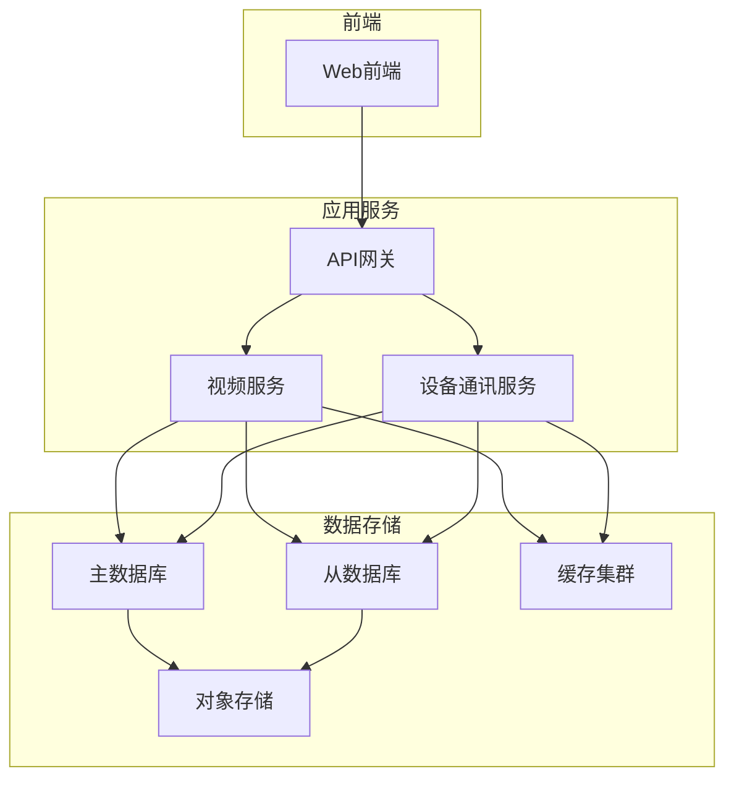
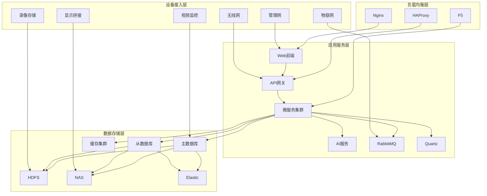
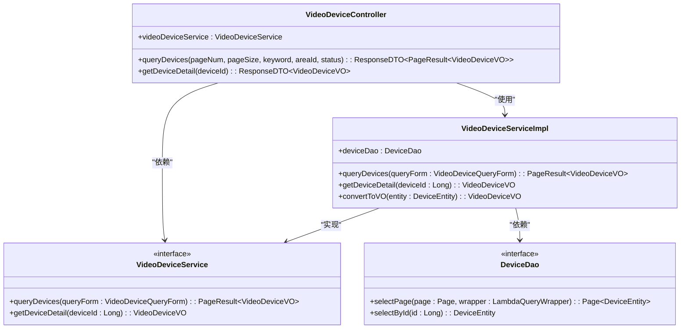
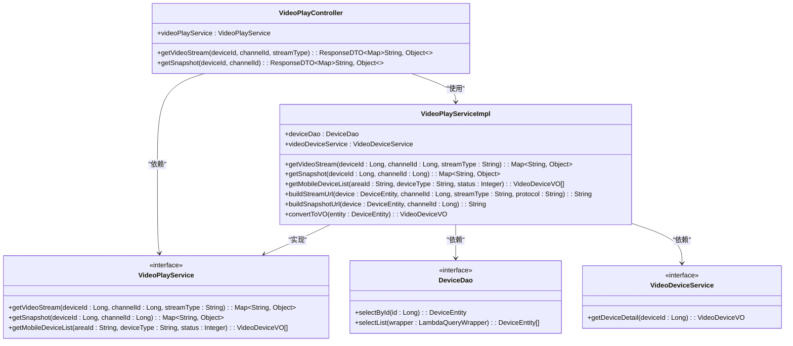
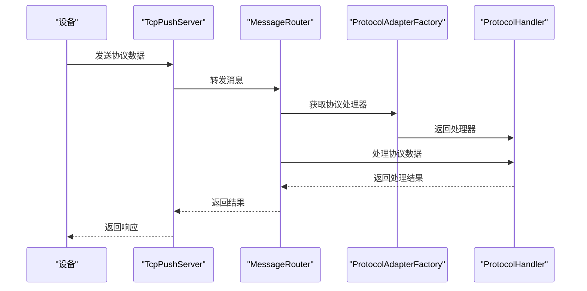
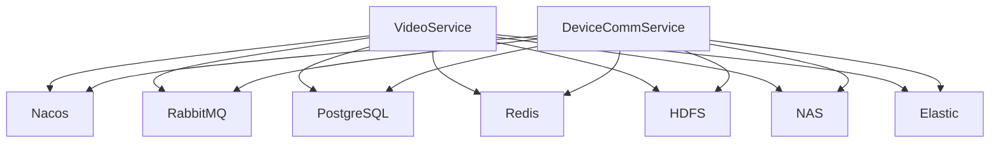

# 存储架构设计

<cite>
**本文档引用文件**   
- [VideoDeviceController.java](file://microservices\ioedream-video-service\src\main\java\net\lab1024\sa\video\controller\VideoDeviceController.java)
- [VideoDeviceServiceImpl.java](file://microservices\ioedream-video-service\src\main\java\net\lab1024\sa\video\service\impl\VideoDeviceServiceImpl.java)
- [VideoPlayController.java](file://microservices\ioedream-video-service\src\main\java\net\lab1024\sa\video\controller\VideoPlayController.java)
- [VideoPlayServiceImpl.java](file://microservices\ioedream-video-service\src\main\java\net\lab1024\sa\video\service\impl\VideoPlayServiceImpl.java)
- [application.yml](file://microservices\ioedream-video-service\src\main\resources\application.yml)
- [video_index_optimization.sql](file://microservices\ioedream-video-service\src\main\resources\sql\video_index_optimization.sql)
- [01-项目概述与系统架构.md](file://documentation\03-业务模块\智能视频\01-项目概述与系统架构.md)
- [PROTOCOL_ARCHITECTURE.md](file://microservices\ioedream-device-comm-service\docs\PROTOCOL_ARCHITECTURE.md)
</cite>

## 目录
1. [引言](#引言)
2. [项目结构](#项目结构)
3. [核心组件](#核心组件)
4. [架构概述](#架构概述)
5. [详细组件分析](#详细组件分析)
6. [依赖分析](#依赖分析)
7. [性能考虑](#性能考虑)
8. [故障排除指南](#故障排除指南)
9. [结论](#结论)

## 引言
本文档详细描述了视频存储架构的设计，包括分布式存储集群的拓扑结构、主从节点配置、数据分片策略、多副本冗余机制、高可用设计、故障转移流程、元数据管理方案、索引结构、存储容量规划计算公式、扩展策略以及与视频编码和传输协议的集成设计。

## 项目结构
项目结构包括多个微服务，其中`ioedream-video-service`负责视频监控和录像回放等业务API，`ioedream-device-comm-service`负责设备通讯和协议处理。

**图表来源**
- [01-项目概述与系统架构.md](file://documentation\03-业务模块\智能视频\01-项目概述与系统架构.md)

**章节来源**
- [01-项目概述与系统架构.md](file://documentation\03-业务模块\智能视频\01-项目概述与系统架构.md)

## 核心组件
核心组件包括视频设备管理、视频播放管理、设备通讯服务等。视频设备管理提供设备的CRUD操作、状态管理和查询统计，视频播放管理提供实时视频流播放、录像回放和视频截图，设备通讯服务处理设备协议和连接管理。

**章节来源**
- [VideoDeviceController.java](file://microservices\ioedream-video-service\src\main\java\net\lab1024\sa\video\controller\VideoDeviceController.java)
- [VideoPlayController.java](file://microservices\ioedream-video-service\src\main\java\net\lab1024\sa\video\controller\VideoPlayController.java)
- [PROTOCOL_ARCHITECTURE.md](file://microservices\ioedream-device-comm-service\docs\PROTOCOL_ARCHITECTURE.md)

## 架构概述
系统采用微服务架构，视频服务和设备通讯服务通过Nacos进行服务发现和配置管理。视频服务提供视频监控和录像回放API，设备通讯服务处理设备协议和连接管理。数据存储层采用主从数据库架构，支持读写分离和故障转移。

**图表来源**
- [01-项目概述与系统架构.md](file://documentation\03-业务模块\智能视频\01-项目概述与系统架构.md)

## 详细组件分析
### 视频设备管理分析
视频设备管理组件负责设备的CRUD操作、状态管理和查询统计。通过`VideoDeviceController`提供API接口，`VideoDeviceServiceImpl`实现业务逻辑。

#### 类图

**图表来源**
- [VideoDeviceController.java](file://microservices\ioedream-video-service\src\main\java\net\lab1024\sa\video\controller\VideoDeviceController.java)
- [VideoDeviceServiceImpl.java](file://microservices\ioedream-video-service\src\main\java\net\lab1024\sa\video\service\impl\VideoDeviceServiceImpl.java)

**章节来源**
- [VideoDeviceController.java](file://microservices\ioedream-video-service\src\main\java\net\lab1024\sa\video\controller\VideoDeviceController.java)
- [VideoDeviceServiceImpl.java](file://microservices\ioedream-video-service\src\main\java\net\lab1024\sa\video\service\impl\VideoDeviceServiceImpl.java)

### 视频播放管理分析
视频播放管理组件负责实时视频流播放、录像回放和视频截图。通过`VideoPlayController`提供API接口，`VideoPlayServiceImpl`实现业务逻辑。

#### 类图

**图表来源**
- [VideoPlayController.java](file://microservices\ioedream-video-service\src\main\java\net\lab1024\sa\video\controller\VideoPlayController.java)
- [VideoPlayServiceImpl.java](file://microservices\ioedream-video-service\src\main\java\net\lab1024\sa\video\service\impl\VideoPlayServiceImpl.java)

**章节来源**
- [VideoPlayController.java](file://microservices\ioedream-video-service\src\main\java\net\lab1024\sa\video\controller\VideoPlayController.java)
- [VideoPlayServiceImpl.java](file://microservices\ioedream-video-service\src\main\java\net\lab1024\sa\video\service\impl\VideoPlayServiceImpl.java)

### 设备通讯服务分析
设备通讯服务处理设备协议和连接管理，支持多种设备厂商的PUSH协议，包括考勤、门禁和消费协议。

#### 序列图

**图表来源**
- [PROTOCOL_ARCHITECTURE.md](file://microservices\ioedream-device-comm-service\docs\PROTOCOL_ARCHITECTURE.md)

**章节来源**
- [PROTOCOL_ARCHITECTURE.md](file://microservices\ioedream-device-comm-service\docs\PROTOCOL_ARCHITECTURE.md)

## 依赖分析
系统依赖于Nacos进行服务发现和配置管理，RabbitMQ进行消息队列处理，PostgreSQL作为主从数据库，Redis作为缓存集群，HDFS作为对象存储，NAS作为文件系统，Elastic作为搜索引擎。

**图表来源**
- [application.yml](file://microservices\ioedream-video-service\src\main\resources\application.yml)
- [01-项目概述与系统架构.md](file://documentation\03-业务模块\智能视频\01-项目概述与系统架构.md)

**章节来源**
- [application.yml](file://microservices\ioedream-video-service\src\main\resources\application.yml)

## 性能考虑
系统通过多级缓存、读写分离、分库分表、异步处理等策略提升性能。多级缓存包括本地缓存、分布式缓存和数据库缓存，读写分离采用主从架构，分库分表支持海量数据，异步处理使用消息队列处理耗时任务。

**章节来源**
- [01-项目概述与系统架构.md](file://documentation\03-业务模块\智能视频\01-项目概述与系统架构.md)

## 故障排除指南
故障排除包括服务启动失败、数据库连接失败、缓存失效、消息队列阻塞等问题。通过日志分析、监控告警、服务熔断等机制进行故障排查和恢复。

**章节来源**
- [01-项目概述与系统架构.md](file://documentation\03-业务模块\智能视频\01-项目概述与系统架构.md)

## 结论
本文档详细描述了视频存储架构的设计，包括分布式存储集群的拓扑结构、主从节点配置、数据分片策略、多副本冗余机制、高可用设计、故障转移流程、元数据管理方案、索引结构、存储容量规划计算公式、扩展策略以及与视频编码和传输协议的集成设计。系统采用微服务架构，通过Nacos进行服务发现和配置管理，RabbitMQ进行消息队列处理，PostgreSQL作为主从数据库，Redis作为缓存集群，HDFS作为对象存储，NAS作为文件系统，Elastic作为搜索引擎，实现了高可用、高性能、可扩展的视频存储系统。