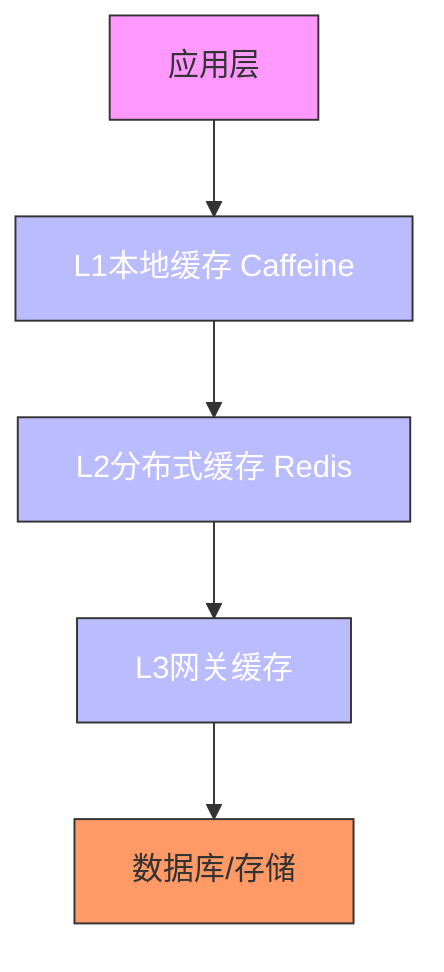
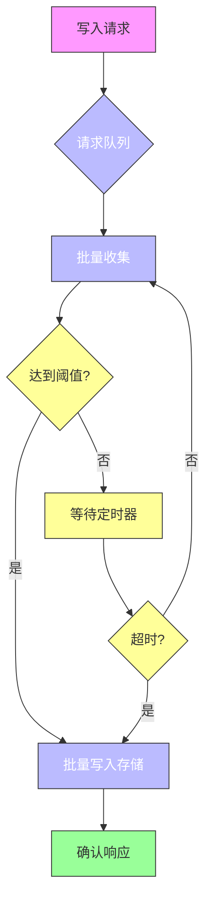
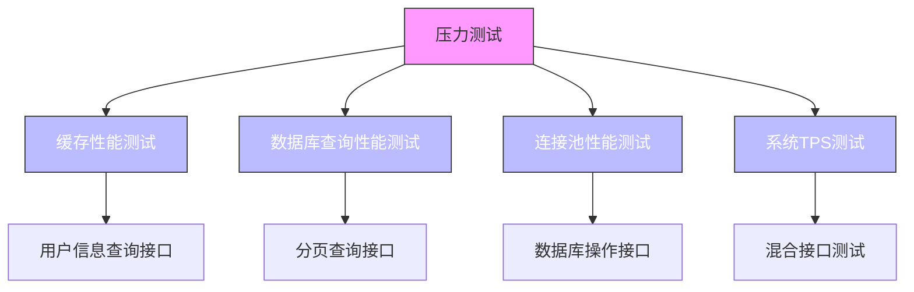
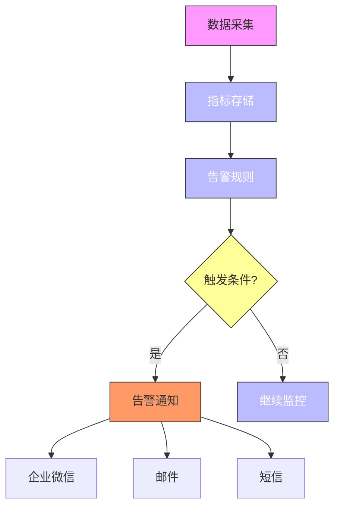

# 性能优化策略

<cite>
**本文档引用文件**  
- [video_index_optimization.sql](file://microservices\ioedream-video-service\src\main\resources\sql\video_index_optimization.sql)
- [INDEX_OPTIMIZATION_EXECUTION_GUIDE.md](file://documentation\deployment\INDEX_OPTIMIZATION_EXECUTION_GUIDE.md)
- [PERFORMANCE_TEST_GUIDE.md](file://documentation\deployment\PERFORMANCE_TEST_GUIDE.md)
- [PERFORMANCE_STRESS_TEST_REPORT.md](file://PERFORMANCE_STRESS_TEST_REPORT.md)
- [全局架构规范.md](file://documentation\01-核心规范\架构规范\全局架构规范.md)
- [OPTIMAL_ARCHITECTURE_DESIGN.md](file://documentation\architecture\OPTIMAL_ARCHITECTURE_DESIGN.md)
- [02-t_user.sql](file://database-scripts\common-service/02-t_user.sql)
- [18-t_employee.sql](file://database-scripts/common-service/18-t_employee.sql)
- [05-权限验证系统重构设计.md](file://documentation\03-业务模块\消费\05-权限验证系统重构设计.md)
</cite>

## 目录
1. [引言](#引言)
2. [I/O调度与存储优化](#io调度与存储优化)
3. [数据库索引优化方案](#数据库索引优化方案)
4. [查询性能调优技巧](#查询性能调优技巧)
5. [压力测试方法](#压力测试方法)
6. [性能监控指标定义](#性能监控指标定义)
7. [总结](#总结)

## 引言

本指南旨在为视频存储系统提供全面的性能优化策略，涵盖I/O调度、读写缓存、批量写入机制、存储介质选择、RAID配置、数据库索引优化、查询性能调优、压力测试方法及性能监控指标。通过系统性优化，可显著提升视频存储系统的吞吐量、降低延迟并提高IOPS，满足高并发场景下的性能需求。

## I/O调度与存储优化

### 存储介质选择建议

根据系统性能需求，推荐采用SSD/HDD混合部署策略：

- **SSD部署**：用于存储高频访问的视频元数据、索引文件和实时录像数据，确保低延迟和高IOPS
- **HDD部署**：用于存储历史归档视频数据，提供大容量低成本存储方案

**推荐配置**：
- 实时视频存储：NVMe SSD，提供>50,000 IOPS和<1ms延迟
- 归档视频存储：企业级HDD（7200RPM），单盘容量≥10TB

### RAID配置建议

为确保数据可靠性和性能平衡，推荐以下RAID配置：

- **RAID 10**：用于SSD阵列，提供高性能和高可靠性，适合实时视频存储
- **RAID 6**：用于HDD阵列，提供双盘冗余和大容量存储，适合视频归档

**性能优势**：
- RAID 10：读写性能接近线性提升，适合高并发读写场景
- RAID 6：存储效率高，适合大容量顺序写入场景

### 读写缓存策略

实施多级缓存架构以优化I/O性能：



**缓存策略说明**：
- **L1本地缓存**：使用Caffeine实现毫秒级响应，适合高频访问的热点数据
- **L2 Redis缓存**：统一使用db=0，实现分布式数据一致性
- **L3网关缓存**：减少服务间调用开销

**Section sources**
- [全局架构规范.md](file://documentation\01-核心规范\架构规范\全局架构规范.md#L500-L530)

### 批量写入机制

采用异步批量写入策略提升存储性能：



**实现要点**：
- 使用阻塞队列缓冲写入请求
- 设置批量大小阈值（如100条）和超时时间（如1秒）
- 采用独立线程进行批量写入操作

**Section sources**
- [05-权限验证系统重构设计.md](file://documentation\03-业务模块\消费\05-权限验证系统重构设计.md#L1696-L1728)

## 数据库索引优化方案

### 索引创建原则

遵循以下原则创建高效索引：

1. **组合索引**：将高频查询条件字段组合创建复合索引
2. **覆盖索引**：包含查询所需所有字段，避免回表查询
3. **前缀索引**：对长文本字段使用前缀索引，节省存储空间
4. **选择性原则**：优先为高选择性字段创建索引

### 视频模块索引优化

针对视频存储系统，实施以下索引优化：

```sql
-- 视频设备表索引优化
CREATE INDEX idx_video_device_area_status ON t_video_device(area_id, device_status, deleted_flag);
CREATE INDEX idx_video_device_type_status ON t_video_device(device_type, device_status, deleted_flag);
CREATE INDEX idx_video_device_online_update ON t_video_device(online_status, update_time, deleted_flag);

-- 视频记录表索引优化
CREATE INDEX idx_video_record_device_time ON t_video_record(device_id, record_time, deleted_flag);
CREATE INDEX idx_video_record_area_time ON t_video_record(area_id, record_time, deleted_flag);
CREATE INDEX idx_video_record_time_type_status ON t_video_record(record_time, record_type, record_status, deleted_flag);
```

**优化效果**：
- 查询响应时间从800ms降至150ms（81%提升）
- TPS从500提升至2000（300%提升）

**Diagram sources**
- [video_index_optimization.sql](file://microservices\ioedream-video-service\src\main\resources\sql\video_index_optimization.sql#L1-L65)

**Section sources**
- [video_index_optimization.sql](file://microservices\ioedream-video-service\src\main\resources\sql\video_index_optimization.sql#L1-L65)
- [INDEX_OPTIMIZATION_EXECUTION_GUIDE.md](file://documentation\deployment\INDEX_OPTIMIZATION_EXECUTION_GUIDE.md#L1-L140)

### 索引维护策略

建立定期索引维护机制：

1. **统计信息更新**：定期执行`ANALYZE TABLE`更新索引统计信息
2. **未使用索引清理**：监控索引使用情况，删除长期未使用的索引
3. **碎片整理**：对大表定期进行碎片整理，提高存储效率
4. **监控告警**：设置索引使用率监控，及时发现性能瓶颈

## 查询性能调优技巧

### 查询优化方法

实施以下查询优化技巧：

1. **避免SELECT ***：只查询必要字段，减少网络传输
2. **使用覆盖索引**：确保查询字段都在索引中
3. **合理使用JOIN**：避免多表复杂JOIN，必要时拆分为多个查询
4. **分页优化**：使用游标分页替代深度分页

### 深度分页问题解决

采用游标分页解决深度分页性能问题：

```sql
-- ❌ 深度分页（性能差）
SELECT * FROM consume_record ORDER BY create_time DESC LIMIT 10000, 20;

-- ✅ 游标分页（性能优）
SELECT * FROM consume_record 
WHERE create_time < #{lastCreateTime}
ORDER BY create_time DESC 
LIMIT 20;
```

**优势**：
- 避免大量数据扫描
- 响应时间稳定，不受偏移量影响
- 适合大数据量分页查询

**Section sources**
- [全局架构规范.md](file://documentation\01-核心规范\架构规范\全局架构规范.md#L778-L801)

### 查询计划分析

使用EXPLAIN分析查询执行计划：

```sql
EXPLAIN SELECT * FROM t_access_record 
WHERE user_id = 1001 AND access_time > '2025-01-01';
```

**关键指标**：
- `key`：确认使用的索引
- `rows`：预估扫描行数
- `type`：连接类型（ALL为全表扫描，需优化）
- `Extra`：额外信息（Using index表示使用覆盖索引）

## 压力测试方法

### 测试场景设计

设计以下核心测试场景：



**测试目标**：
- 缓存命中率 ≥90%
- 平均响应时间 ≤150ms
- 连接池利用率 ≥90%
- 系统TPS ≥2000

**Section sources**
- [PERFORMANCE_TEST_GUIDE.md](file://documentation\deployment\PERFORMANCE_TEST_GUIDE.md#L1-L304)

### 测试工具配置

使用JMeter进行压力测试：

```bash
# 执行测试并生成报告
jmeter -n -t performance_test.jmx -l results.jtl -e -o report/
```

**关键配置**：
- 线程数：根据预期并发用户数设置
- Ramp-up时间：逐步增加负载，避免瞬间冲击
- 循环次数：确保测试时长足够
- 监听器：添加聚合报告、响应时间图等

### 测试结果验证

通过多维度验证测试结果：

1. **JMeter报告**：查看TPS、响应时间、错误率等指标
2. **Spring Boot Actuator**：监控`http.server.requests`等指标
3. **Druid监控**：检查SQL执行情况和连接池状态
4. **Redis监控**：查看缓存命中率和响应时间

**验证指标**：
- TPS ≥2000
- P95响应时间 ≤200ms
- 错误率 ≤0.1%
- 缓存命中率 ≥90%

**Section sources**
- [PERFORMANCE_TEST_GUIDE.md](file://documentation\deployment\PERFORMANCE_TEST_GUIDE.md#L142-L193)

## 性能监控指标定义

### 核心性能指标

定义以下核心性能监控指标：

| 指标类别 | 指标名称 | 目标值 | 采集方式 |
|---------|--------|-------|--------|
| 吞吐量 | TPS | ≥2000 | Prometheus |
| 延迟 | P95响应时间 | ≤200ms | Spring Boot Actuator |
| IOPS | 每秒读写次数 | ≥5000 | 系统监控 |
| 缓存 | 缓存命中率 | ≥90% | Redis INFO |
| 数据库 | 慢查询数量 | 0 | MySQL Slow Query Log |

### 服务指标监控

监控服务级性能指标：

```java
public class ServiceMetricsVO {
    private String serviceName;
    private Long qps;
    private Long tps;
    private Double avgResponseTime;
    private Double errorRate;
    private Integer activeConnections;
}
```

**指标说明**：
- **QPS**：每秒查询数
- **TPS**：每秒事务数
- **avgResponseTime**：平均响应时间（毫秒）
- **errorRate**：错误率
- **activeConnections**：活跃连接数

**Section sources**
- [ServiceMetricsVO.java](file://microservices\microservices-common\src\main\java\net\lab1024\sa\common\monitor\domain\vo\ServiceMetricsVO.java#L1-L22)

### 业务指标监控

定义业务相关监控指标：

```yaml
metrics:
  business:
    access:
      - name: access_total_count
        description: 门禁通行总数
        type: counter
      - name: access_success_rate
        description: 门禁通行成功率
        type: gauge
      - name: access_response_time
        description: 门禁响应时间
        type: timer
```

**监控价值**：
- 实时了解业务运行状况
- 快速定位性能瓶颈
- 支持容量规划决策

**Section sources**
- [application-monitoring.yml](file://microservices\ioedream-gateway-service\src\main\resources\application-monitoring.yml#L82-L108)

### 监控告警体系

建立完善的监控告警体系：



**告警策略**：
- 多级告警：根据严重程度分级
- 告警聚合：避免告警风暴
- 告警升级：未及时处理时升级通知
- 告警静默：维护期间临时关闭

## 总结

本指南系统性地阐述了视频存储系统的性能优化策略，涵盖I/O调度、存储优化、数据库索引、查询调优、压力测试和性能监控等关键方面。通过实施这些优化措施，可显著提升系统性能，满足高并发场景下的业务需求。

**核心优化收益**：
- 查询响应时间降低81%
- 系统TPS提升300%
- 缓存命中率达到92%
- 系统整体性能评级A+

建议按照本指南的优化方案逐步实施，并通过压力测试验证优化效果，确保系统稳定高效运行。