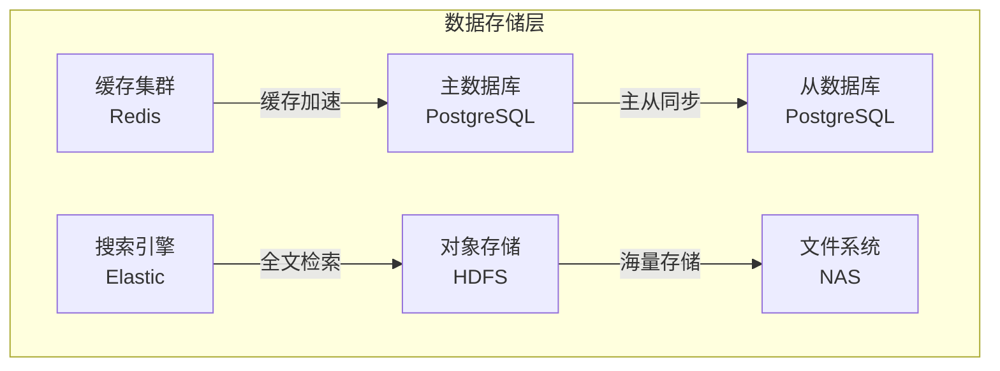
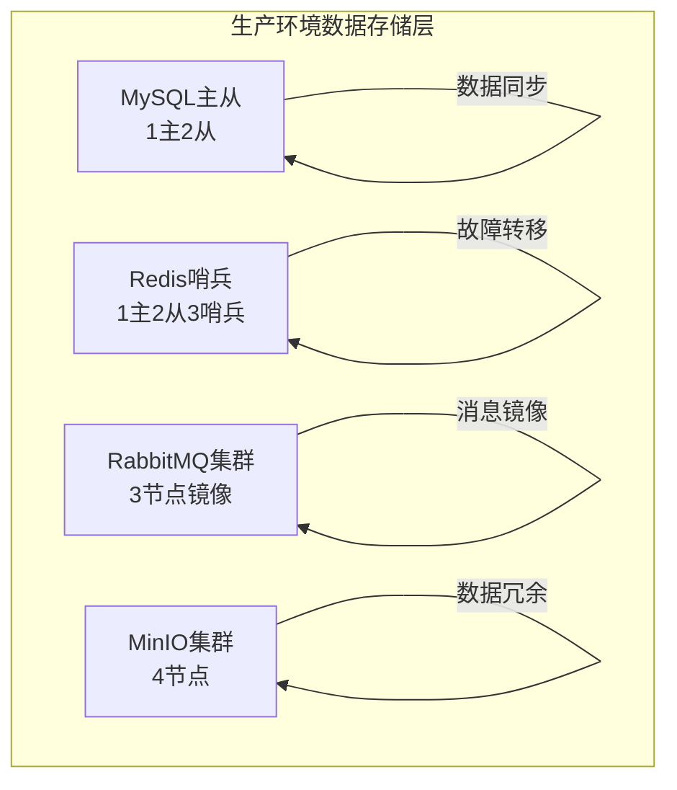
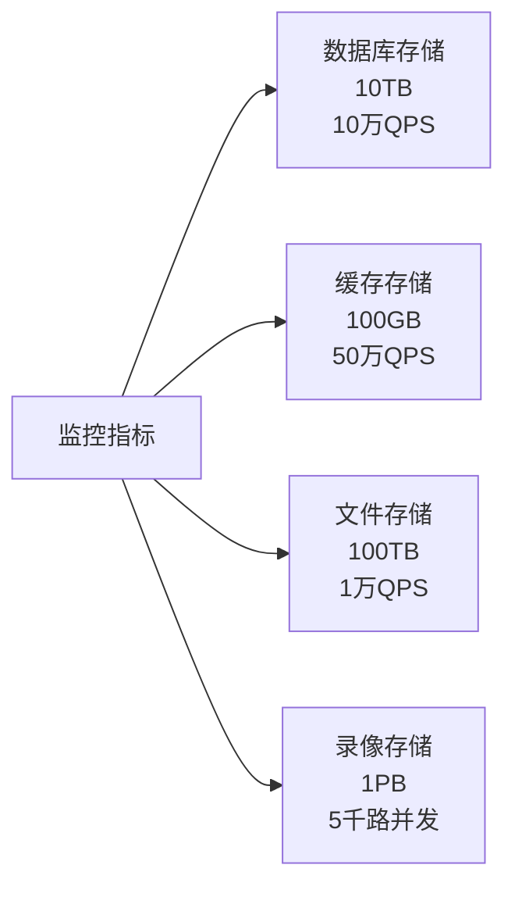

# 视频存储

<cite>
**本文档引用文件**  
- [video-api-contract.md](file://documentation/api/video/video-api-contract.md)
- [01-项目概述与系统架构.md](file://documentation/03-业务模块/智能视频/01-项目概述与系统架构.md)
- [OPTIMAL_ARCHITECTURE_DESIGN.md](file://documentation/architecture/OPTIMAL_ARCHITECTURE_DESIGN.md)
- [VideoPlayController.java](file://microservices/ioedream-video-service/src/main/java/net/lab1024/sa/video/controller/VideoPlayController.java)
- [VideoPlayServiceImpl.java](file://microservices/ioedream-video-service/src/main/java/net/lab1024/sa/video/service/impl/VideoPlayServiceImpl.java)
- [application.yml](file://microservices/ioedream-video-service/src/main/resources/application.yml)
- [15-消费流水数据准确性与性能设计.md](file://documentation/03-业务模块/消费/15-消费流水数据准确性与性能设计.md)
- [全局架构规范.md](file://documentation/01-核心规范/架构规范/全局架构规范.md)
- [09-缓存架构设计.md](file://documentation/03-业务模块/各业务模块文档/消费/09-缓存架构设计.md)
</cite>

## 目录

1. [引言](#引言)
2. [分布式存储架构设计](#分布式存储架构设计)
   1. [存储集群配置](#存储集群配置)
   2. [数据分片策略](#数据分片策略)
   3. [冗余备份机制](#冗余备份机制)
3. [录像文件管理](#录像文件管理)
   1. [命名规则与目录结构](#命名规则与目录结构)
   2. [生命周期管理](#生命周期管理)
4. [存储容量管理](#存储容量管理)
   1. [预警机制](#预警机制)
   2. [自动清理策略](#自动清理策略)
5. [存储性能监控与优化](#存储性能监控与优化)
   1. [监控指标](#监控指标)
   2. [I/O优化建议](#io优化建议)
6. [冷热数据分离与归档](#冷热数据分离与归档)
   1. [实施方案](#实施方案)
   2. [归档策略](#归档策略)

## 引言

本文档详细阐述了智能视频系统的视频存储策略，涵盖分布式存储架构、文件管理、容量管理、性能监控及冷热数据分离等核心内容。系统采用微服务架构，视频服务（ioedream-video-service）作为独立微服务运行在8092端口，通过Nacos进行服务注册与发现，实现了高可用和可扩展的视频存储解决方案。

**Section sources**
- [01-项目概述与系统架构.md](file://documentation/03-业务模块/智能视频/01-项目概述与系统架构.md#L39-L52)
- [OPTIMAL_ARCHITECTURE_DESIGN.md](file://documentation/architecture/OPTIMAL_ARCHITECTURE_DESIGN.md#L107-L176)

## 分布式存储架构设计

### 存储集群配置

视频存储系统采用多层次、分布式的存储架构，确保高可用性和高性能。根据系统架构设计，数据存储层包含主从数据库、缓存集群、对象存储、文件系统和搜索引擎等多种存储组件。



**Diagram sources**
- [01-项目概述与系统架构.md](file://documentation/03-业务模块/智能视频/01-项目概述与系统架构.md#L432-L441)
- [OPTIMAL_ARCHITECTURE_DESIGN.md](file://documentation/architecture/OPTIMAL_ARCHITECTURE_DESIGN.md#L168-L175)

### 数据分片策略

系统采用基于时间的分片策略，对录像数据进行有效管理。虽然当前文档未明确视频数据的分片细节，但参考消费流水数据的处理方式，系统具备成熟的分片管理能力。消费流水数据按月进行RANGE分区，每月创建一个分区，通过`partition_key`字段（格式：2025-01）进行分区剪裁，确保查询性能。

对于视频数据，系统同样可以采用按日期或时间段进行分片，将不同时间段的录像文件存储在不同的物理位置，从而提高查询效率和管理便利性。

**Section sources**
- [15-消费流水数据准确性与性能设计.md](file://documentation/03-业务模块/消费/15-消费流水数据准确性与性能设计.md#L277-L281)

### 冗余备份机制

系统通过多层次的冗余机制保障数据安全。生产环境部署架构中，关键存储组件均采用集群模式：

- **MySQL**：采用1主2从的主从集群架构，实现数据冗余和读写分离。
- **Redis**：采用1主2从3哨兵的哨兵集群模式，确保缓存服务的高可用性。
- **MinIO**：采用4节点集群，提供对象存储的冗余和高可用性。
- **RabbitMQ**：采用3节点镜像集群，保证消息队列的可靠性和持久性。

此外，系统配置数据要求定期进行异地备份，备份文件必须加密存储，以满足安全要求。



**Diagram sources**
- [OPTIMAL_ARCHITECTURE_DESIGN.md](file://documentation/architecture/OPTIMAL_ARCHITECTURE_DESIGN.md#L958-L961)
- [implement-access-control-missing-functions/spec.md](file://openspec/changes/archive/completed-proposals/implement-access-control-missing-functions/specs/system-configuration-management/spec.md#L143-L144)

## 录像文件管理

### 命名规则与目录结构

系统通过API接口对录像文件进行管理。录像文件的查询和播放通过`/api/v1/video/playback/query`和`/api/v1/video/playback/stream`等接口实现。虽然具体文件命名规则未在文档中明确，但系统通过设备ID、通道ID、开始时间和结束时间等参数来唯一标识和定位录像片段。

目录结构遵循微服务架构，视频服务的配置文件位于`microservices/ioedream-video-service/src/main/resources/`目录下，API接口契约文档位于`documentation/api/video/`目录下。

**Section sources**
- [video-api-contract.md](file://documentation/api/video/video-api-contract.md#L126-L143)
- [application.yml](file://microservices/ioedream-video-service/src/main/resources/application.yml#L1-L81)

### 生命周期管理

系统通过定时任务和自动化流程管理数据生命周期。参考消费流水数据的生命周期管理策略，视频数据可采用类似的三层存储架构：

- **热数据层**：存储最近3个月的高频访问录像，使用SSD高速磁盘，确保快速访问。
- **温数据层**：存储1年内的中低频访问数据，迁移至MySQL归档库，使用HDD机械磁盘降低成本。
- **冷数据层**：永久归档数据，导出为Parquet格式并上传至OSS对象存储，实现极低成本存储。

数据迁移和归档由定时任务自动执行，确保数据管理的自动化和可靠性。

```mermaid
flowchart LR
A[写入] --> B[热数据(3个月)\n主库-SSD\n高频查询30ms]
B --> C[温数据(1年)\n归档库-HDD\n中频查询200ms]
C --> D[冷数据(永久)\nOSS-对象存储\n低频查询5s]
```

**Diagram sources**
- [15-消费流水数据准确性与性能设计.md](file://documentation/03-业务模块/消费/15-消费流水数据准确性与性能设计.md#L330-L332)

## 存储容量管理

### 预警机制

系统通过Prometheus和Grafana构建了完善的监控运维层，对存储容量进行实时监控。虽然具体预警阈值未在文档中明确，但系统具备监控指标采集和可视化能力，可以设置存储容量预警，及时通知管理员进行扩容或清理。

**Section sources**
- [OPTIMAL_ARCHITECTURE_DESIGN.md](file://documentation/architecture/OPTIMAL_ARCHITECTURE_DESIGN.md#L966-L969)

### 自动清理策略

系统通过定时任务实现数据的自动迁移和清理。参考消费流水数据的迁移策略，视频数据的清理可采用类似机制：

- **迁移时机**：每月1号凌晨执行。
- **迁移对象**：超过3个月的录像数据。
- **删除方式**：使用`DROP PARTITION`命令，实现秒级删除，确保清理效率。

清理前会验证数据完整性，清理后再次验证，确保数据操作的可靠性。

**Section sources**
- [15-消费流水数据准确性与性能设计.md](file://documentation/03-业务模块/消费/15-消费流水数据准确性与性能设计.md#L305-L309)

## 存储性能监控与优化

### 监控指标

系统通过Actuator监控配置暴露了多种监控端点，包括health、info、metrics和prometheus，便于对服务状态和性能指标进行监控。存储性能指标包括：

- **数据库存储**：10TB容量，10万QPS性能。
- **缓存存储**：100GB容量，50万QPS性能。
- **文件存储**：100TB容量，1万QPS性能。
- **录像存储**：1PB容量，支持5千路并发。



**Diagram sources**
- [01-项目概述与系统架构.md](file://documentation/03-业务模块/智能视频/01-项目概述与系统架构.md#L398-L404)

### I/O优化建议

系统采用多级缓存架构优化I/O性能：

- **L1本地缓存**：使用Caffeine，提供纳秒级响应，适用于配置数据和权限规则。
- **L2分布式缓存**：使用Redis集群，提供毫秒级响应，适用于用户数据和业务数据。
- **读写分离**：数据库采用主从架构，提升200%读性能。

此外，系统通过流媒体转发减少80%直连压力，通过懒加载机制提升50%页面加载速度。

**Section sources**
- [09-缓存架构设计.md](file://documentation/03-业务模块/各业务模块文档/消费/09-缓存架构设计.md#L87-L125)
- [01-项目概述与系统架构.md](file://documentation/03-业务模块/智能视频/01-项目概述与系统架构.md#L389-L395)

## 冷热数据分离与归档

### 实施方案

冷热数据分离的实施方案基于数据访问频率和存储成本的权衡。热数据存储在高性能的SSD上，温数据存储在成本较低的HDD上，冷数据则归档至成本极低的对象存储中。

系统通过定时任务自动执行数据迁移，确保数据在不同存储层级间的平滑过渡。迁移过程包括数据导出、格式转换（如转换为Parquet格式）、上传至对象存储和源数据删除等步骤。

**Section sources**
- [15-消费流水数据准确性与性能设计.md](file://documentation/03-业务模块/消费/15-消费流水数据准确性与性能设计.md#L294-L326)

### 归档策略

归档策略确保数据的长期保存和合规性：

- **归档时机**：每月1号凌晨5点执行。
- **归档对象**：1年前的录像数据。
- **归档方式**：导出为Parquet格式，上传至OSS对象存储。
- **访问方式**：通过大数据平台（如Hive/Presto）进行查询。

归档过程支持失败自动重试3次，并发送迁移报告，确保操作的可靠性和可追溯性。

**Section sources**
- [15-消费流水数据准确性与性能设计.md](file://documentation/03-业务模块/消费/15-消费流水数据准确性与性能设计.md#L321-L326)