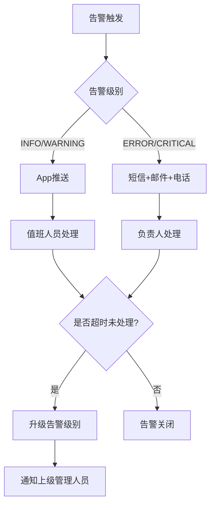
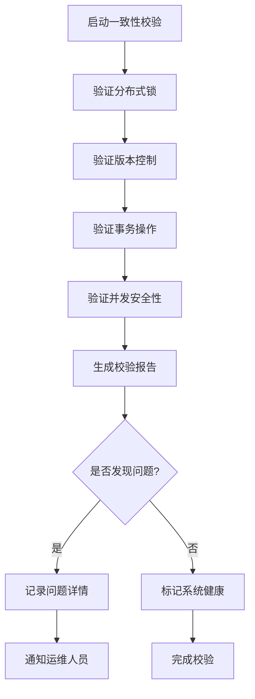

# 运维管理规范

<cite>
**本文档引用文件**  
- [门禁服务监控告警机制.md](file://documentation\04-部署运维\门禁服务监控告警机制.md)
- [智能视频系统开发检查清单.md](file://docs\CHECKLISTS\智能视频系统开发检查清单.md)
- [video-api-contract.md](file://documentation\api\video\video-api-contract.md)
- [real-time-monitoring-enhancement\spec.md](file://openspec\changes\archive\completed-proposals\implement-access-control-missing-functions\specs\real-time-monitoring-enhancement\spec.md)
- [t_alert_rule.sql](file://database-scripts\common-service\12-t_alert_rule.sql)
- [AlertEntity.java](file://microservices\microservices-common\src\main\java\net\lab1024\sa\common\monitor\domain\entity\AlertEntity.java)
- [docker-compose-monitoring.yml](file://deployment\monitoring\docker-compose-monitoring.yml)
- [prometheus.yml](file://deployment\monitoring\prometheus\prometheus.yml)
- [ConsistencyValidationController.java](file://restful_refactor_backup_20251202_014224\microservices_ioedream-consume-service_src_main_java_net_lab1024_sa_consume_controller_ConsistencyValidationController.java)
- [AuditManager.java](file://microservices\microservices-common\src\main\java\net\lab1024\sa\common\audit\manager\AuditManager.java)
- [AuditArchiveEntity.java](file://microservices\microservices-common\src\main\java\net\lab1024\sa\common\audit\entity\AuditArchiveEntity.java)
- [COMPLETE_CODE_QUALITY_AND_TODO_FIX_REPORT.md](file://documentation\technical\COMPLETE_CODE_QUALITY_AND_TODO_FIX_REPORT.md)
</cite>

## 目录

1. [存储容量预警与自动清理](#存储容量预警与自动清理)  
2. [告警通知机制](#告警通知机制)  
3. [录像文件生命周期管理](#录像文件生命周期管理)  
4. [日常巡检清单](#日常巡检清单)  
5. [故障排查步骤](#故障排查步骤)  
6. [备份恢复演练流程](#备份恢复演练流程)  
7. [数据一致性校验方法](#数据一致性校验方法)

## 存储容量预警与自动清理

### 存储容量预警阈值设置

系统通过Prometheus监控组件对视频存储服务进行实时容量监控。当存储使用率达到预设阈值时，系统将触发告警机制。告警规则配置在`t_alert_rule`表中，关键字段包括：

- **metric_name**: 监控指标名称，如`storage_usage_percent`
- **threshold_value**: 告警阈值，建议设置如下：
  - **警告级别（WARNING）**: 80%
  - **严重级别（ERROR）**: 90%
  - **紧急级别（CRITICAL）**: 95%
- **alert_level**: 告警级别，分为INFO、WARNING、ERROR、CRITICAL四级
- **duration_minutes**: 持续时间，建议设置为5分钟，避免瞬时波动触发误报

监控系统通过`video-service`暴露的`/actuator/prometheus`接口采集存储指标，并通过Prometheus规则引擎进行评估。

### 自动清理策略

系统采用分层存储与自动清理相结合的策略，确保存储资源的高效利用：

1. **分层存储策略**：
   - **热存储**：最近7天的录像文件，存储在高性能SSD上，支持快速检索与回放
   - **温存储**：7-30天的录像文件，存储在普通HDD上，支持按需检索
   - **冷存储**：超过30天的录像文件，自动归档至压缩文件并迁移至低成本存储介质

2. **自动清理机制**：
   - 系统每日凌晨2:00执行定时任务，扫描超过30天的录像文件
   - 对符合条件的文件执行归档操作，生成ZIP压缩包并存储至归档目录
   - 归档完成后，原始文件从主存储中删除，仅保留归档文件
   - 归档记录写入`t_audit_archive`表，包含归档时间、文件路径、操作人等信息

**Section sources**
- [智能视频系统开发检查清单.md](file://docs\CHECKLISTS\智能视频系统开发检查清单.md#L239-L244)
- [t_alert_rule.sql](file://database-scripts\common-service\12-t_alert_rule.sql#L1-L39)
- [docker-compose-monitoring.yml](file://deployment\monitoring\docker-compose-monitoring.yml#L20)
- [prometheus.yml](file://deployment\monitoring\prometheus\prometheus.yml#L76-L83)

## 告警通知机制

### 告警规则配置

告警规则通过`t_alert_rule`表进行集中管理，支持动态配置与实时生效。关键配置项包括：

| 字段 | 说明 |
|------|------|
| `rule_name` | 规则名称，如"存储空间告警" |
| `metric_name` | 监控指标，如`storage_usage_percent` |
| `condition_operator` | 条件操作符，如`GT`（大于） |
| `threshold_value` | 阈值，如80.0 |
| `alert_level` | 告警级别 |
| `notification_channels` | 通知渠道，支持`email,sms,app` |
| `notification_users` | 通知人员ID列表 |
| `notification_interval` | 通知频率（分钟） |
| `suppression_duration` | 抑制时间（分钟），避免重复告警 |

### 告警聚合与去重

为避免告警风暴，系统实现告警聚合机制。当短时间内收到大量相似告警时，系统将自动聚合为一条汇总告警：

- **聚合条件**：相同告警级别、来源和标题的告警
- **触发条件**：告警数量≥10条，或时间跨度≥5分钟
- **聚合内容**：包含告警类型统计、首次与最新告警时间
- **发送机制**：聚合后发送汇总告警，原单条告警不再单独通知

该机制由`AlertAggregationService`实现，通过`ConcurrentHashMap`缓存聚合器，确保高并发下的线程安全。

### 通知渠道与升级机制

系统支持多渠道告警通知，并根据告警级别自动选择通知对象：

- **低级别告警（INFO/WARNING）**：仅通过App推送通知值班人员
- **高级别告警（ERROR/CRITICAL）**：同时发送短信、邮件，并电话通知负责人

若告警在指定时间内未被处理，系统将自动升级告警级别，并通知更高级别的管理人员。升级规则可配置，确保关键问题得到及时响应。

**Diagram sources**
- [t_alert_rule.sql](file://database-scripts\common-service\12-t_alert_rule.sql#L1-L39)
- [AlertEntity.java](file://microservices\microservices-common\src\main\java\net\lab1024\sa\common\monitor\domain\entity\AlertEntity.java#L1-L54)
- [门禁服务监控告警机制.md](file://documentation\04-部署运维\门禁服务监控告警机制.md#L622-L712)

**Section sources**
- [t_alert_rule.sql](file://database-scripts\common-service\12-t_alert_rule.sql#L1-L39)
- [AlertEntity.java](file://microservices\microservices-common\src\main\java\net\lab1024\sa\common\monitor\domain\entity\AlertEntity.java#L1-L54)
- [门禁服务监控告警机制.md](file://documentation\04-部署运维\门禁服务监控告警机制.md#L622-L712)

## 录像文件生命周期管理

### 归档规则

录像文件的归档遵循以下规则：

- **归档条件**：文件创建时间超过30天
- **归档格式**：CSV导出后压缩为ZIP文件
- **归档目录**：按年月组织，如`/archive/2025/12/`
- **元数据记录**：归档信息写入`t_audit_archive`表，包含：
  - 归档开始/结束时间
  - 归档耗时（毫秒）
  - 操作人ID与姓名
  - 归档文件路径

归档过程由`AuditManager`类的`archiveAuditLogs`方法实现，确保数据完整性与可追溯性。

### 迁移策略

归档后的录像文件根据存储策略进行迁移：

1. **短期归档（1年内）**：保留在本地NAS存储，支持快速检索
2. **中期归档（1-3年）**：迁移至异地备份服务器，每月同步一次
3. **长期归档（3年以上）**：转存至离线磁带库，仅保留索引信息

迁移过程采用增量同步机制，确保数据一致性，并记录每次迁移的校验码。

### 删除规则

录像文件的删除遵循严格的审批流程：

- **自动删除**：临时录制的门禁事件视频，保留7天后自动删除
- **手动删除**：需经二级审批，记录删除原因与操作人
- **禁止删除**：涉及安全事件的录像文件，标记为"永久保留"，禁止任何删除操作

删除操作前必须进行数据校验，确保文件完整性，并生成删除审计日志。

**Section sources**
- [AuditManager.java](file://microservices\microservices-common\src\main\java\net\lab1024\sa\common\audit\manager\AuditManager.java#L516-L551)
- [AuditArchiveEntity.java](file://microservices\microservices-common\src\main\java\net\lab1024\sa\common\audit\entity\AuditArchiveEntity.java#L93-L129)
- [智能视频系统开发检查清单.md](file://docs\CHECKLISTS\智能视频系统开发检查清单.md#L83-L87)

## 日常巡检清单

每日运维人员需执行以下巡检任务：

| 检查项 | 检查方法 | 正常标准 | 异常处理 |
|--------|--------|--------|--------|
| 存储容量 | 查看Grafana仪表盘 | 使用率<80% | 触发预警，检查归档任务 |
| 服务状态 | 访问`/actuator/health` | 返回UP | 重启服务，检查日志 |
| 告警系统 | 检查AlertManager | 无未处理CRITICAL告警 | 立即处理，通知负责人 |
| 录像完整性 | 随机抽查录像文件 | 可正常播放 | 检查设备状态与存储 |
| 备份状态 | 检查备份日志 | 昨日备份成功 | 重新执行备份任务 |
| 网络延迟 | Ping核心服务 | 延迟<50ms | 检查网络设备 |

巡检结果需记录在《日常巡检记录表》中，由主管签字确认。

**Section sources**
- [docker-compose-monitoring.yml](file://deployment\monitoring\docker-compose-monitoring.yml#L1-L109)
- [prometheus.yml](file://deployment\monitoring\prometheus\prometheus.yml#L1-L99)
- [智能视频系统开发检查清单.md](file://docs\CHECKLISTS\智能视频系统开发检查清单.md#L544-L553)

## 故障排查步骤

### 存储空间不足

1. **确认告警**：检查Prometheus告警面板，确认存储使用率
2. **检查归档任务**：查看`AuditManager`日志，确认归档任务是否正常执行
3. **手动触发归档**：调用`/api/v1/audit/archive`接口强制执行归档
4. **清理临时文件**：删除`/tmp`目录下超过24小时的临时文件
5. **扩容存储**：联系基础设施团队增加存储容量

### 录像无法播放

1. **检查文件存在性**：确认录像文件在存储路径中存在
2. **验证文件完整性**：使用`ffmpeg -v error -i file.mp4 -f null -`检查文件是否损坏
3. **检查编码格式**：确认播放器支持H.264编码
4. **查看服务日志**：检查`video-service`日志，排查流媒体服务异常
5. **重启流媒体服务**：重启`video-service`容器

### 告警未通知

1. **检查告警状态**：在`AlertEntity`表中确认告警状态为"active"
2. **验证通知配置**：检查`t_alert_rule`中的`notification_channels`和`notification_users`
3. **测试通知渠道**：手动发送测试通知，验证短信/邮件服务
4. **查看通知日志**：检查`NotificationManager`日志，确认通知发送记录
5. **检查网络策略**：确认出站网络策略允许通知服务通信

**Section sources**
- [门禁服务监控告警机制.md](file://documentation\04-部署运维\门禁服务监控告警机制.md#L622-L712)
- [ConsistencyValidationController.java](file://restful_refactor_backup_20251202_014224\microservices_ioedream-consume-service_src_main_java_net_lab1024_sa_consume_controller_ConsistencyValidationController.java#L254-L269)
- [real-time-monitoring-enhancement\spec.md](file://openspec\changes\archive\completed-proposals\implement-access-control-missing-functions\specs\real-time-monitoring-enhancement\spec.md#L71-L99)

## 备份恢复演练流程

### 备份策略

- **全量备份**：每周日凌晨2:00执行，保留4份
- **增量备份**：每日凌晨2:00执行，保留7天
- **备份目标**：异地备份服务器，通过加密通道传输
- **备份验证**：备份完成后自动校验文件完整性

### 恢复演练步骤

1. **准备阶段**：
   - 选择非工作时间进行演练
   - 通知相关团队，准备回滚方案
   - 备份当前系统状态

2. **模拟故障**：
   - 删除测试环境中的录像数据库
   - 停止`video-service`服务

3. **执行恢复**：
   - 从备份服务器下载最近的全量备份
   - 使用`mysql -u root -p < backup.sql`恢复数据库
   - 启动`video-service`服务
   - 验证服务健康状态

4. **验证数据**：
   - 随机抽查10个录像文件，确认可正常播放
   - 检查告警记录，确认数据完整性
   - 验证用户权限配置

5. **演练总结**：
   - 记录恢复时间（RTO）和数据丢失量（RPO）
   - 分析演练过程中的问题
   - 更新应急预案

演练需每季度执行一次，并形成书面报告存档。

**Section sources**
- [real-time-monitoring-enhancement\spec.md](file://openspec\changes\archive\completed-proposals\implement-access-control-missing-functions\specs\real-time-monitoring-enhancement\spec.md#L127-L145)
- [openspec\changes\archive\completed-proposals\implement-access-control-missing-functions\specs\system-configuration-management\spec.md](file://openspec\changes\archive\completed-proposals\implement-access-control-missing-functions\specs\system-configuration-management\spec.md#L127-L144)

## 数据一致性校验方法

### 一致性保障机制

系统采用多重机制确保数据一致性：

- **分布式锁**：使用Redis实现分布式锁，防止并发操作冲突
- **版本控制**：关键数据表增加`version`字段，实现乐观锁
- **事务管理**：跨服务操作通过Saga模式保证最终一致性
- **定期对账**：每日执行数据对账任务，校验关键数据一致性

### 校验接口

系统提供一致性校验API，用于验证数据完整性：

- **接口路径**：`POST /api/v1/consume/consistency/validate/all`
- **功能**：执行完整的数据一致性保障验证
- **返回指标**：
  - `allMechanismsValid`: 所有机制验证通过
  - `systemHealthy`: 系统健康状态
  - `activeLocks`: 活跃锁数量
  - `versionEntries`: 版本条目数量
  - `hasIssues`: 是否存在问题

### 清理过期数据

定期清理过期的锁和版本数据，避免数据膨胀：

- **清理接口**：`POST /api/v1/consume/consistency/cleanup`
- **清理内容**：
  - 超时未释放的分布式锁
  - 30天前的历史版本记录
  - 失效的会话数据
- **执行频率**：每日凌晨3:00自动执行

该机制由`DataConsistencyManager`实现，确保系统长期运行的稳定性。

**Diagram sources**
- [ConsistencyValidationController.java](file://restful_refactor_backup_20251202_014224\microservices_ioedream-consume-service_src_main_java_net_lab1024_sa_consume_controller_ConsistencyValidationController.java#L50-L85)
- [COMPLETE_CODE_QUALITY_AND_TODO_FIX_REPORT.md](file://documentation\technical\COMPLETE_CODE_QUALITY_AND_TODO_FIX_REPORT.md#L175-L190)

**Section sources**
- [ConsistencyValidationController.java](file://restful_refactor_backup_20251202_014224\microservices_ioedream-consume-service_src_main_java_net_lab1024_sa_consume_controller_ConsistencyValidationController.java#L50-L296)
- [COMPLETE_CODE_QUALITY_AND_TODO_FIX_REPORT.md](file://documentation\technical\COMPLETE_CODE_QUALITY_AND_TODO_FIX_REPORT.md#L175-L190)