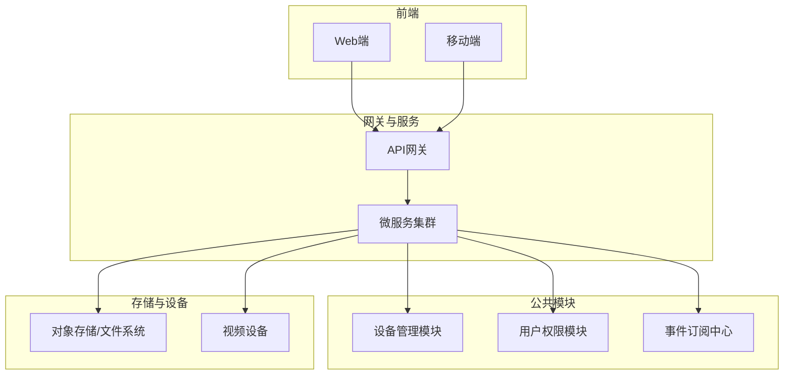
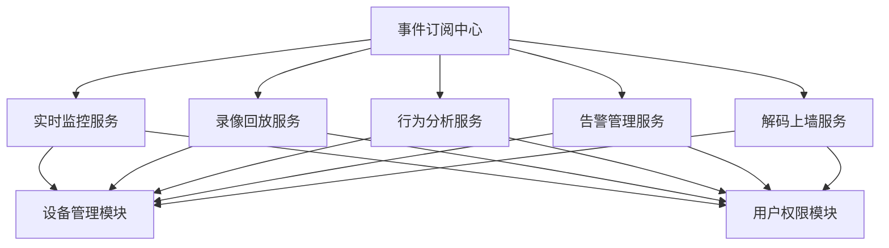
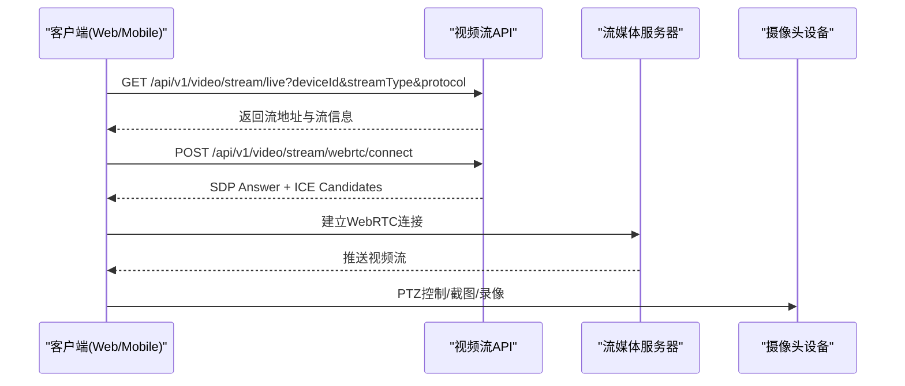
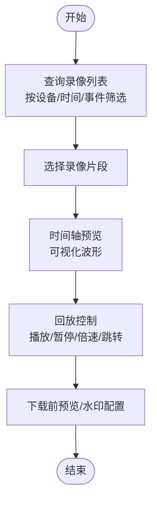
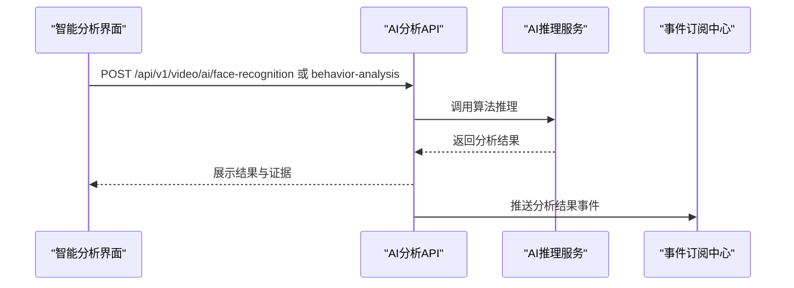
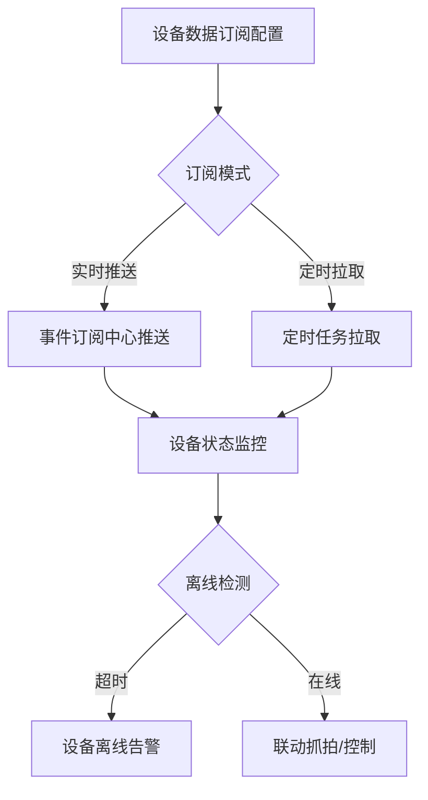
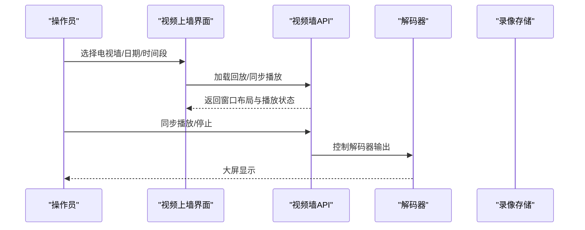
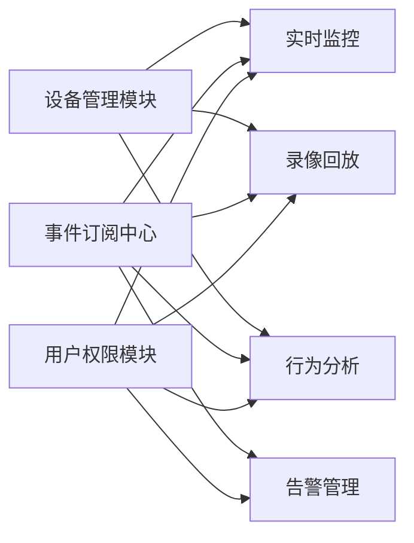
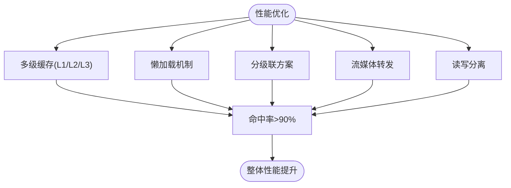

# 视频监控

<cite>
**本文引用的文件**
- [智能视频模块完整设计文档系统](file://documentation/03-业务模块/各业务模块文档/智能视频/01-项目概述与系统架构.md)
- [视频监控模块前端API接口设计](file://documentation/03-业务模块/视频监控/12-前端API接口设计.md)
- [界面原型图设计文档](file://documentation/03-业务模块/各业务模块文档/智能视频/04-界面原型图设计.md)
- [设备管理模块重构设计](file://documentation/03-业务模块/消费/14-设备管理模块重构设计.md)
- [行为分析页面功能布局文档_完善版](file://smart-admin-web-javascript/AI开发文档/行为分析页面功能布局文档_完善版.md)
- [视频上墙页面功能布局文档_完善版](file://smart-admin-web-javascript/AI开发文档/视频上墙页面功能布局文档_完善版.md)
- [智能视频系统页面实现指南](file://smart-admin-web-javascript/智能视频系统页面实现指南.md)
- [smart-device.md](file://documentation/technical/smart-device.md)
- [VideoAnalyticsController.java](file://restful_refactor_backup_20251202_014224/microservices_ioedream-video-service_src_main_java_net_lab1024_sa_video_controller_VideoAnalyticsController.java)
- [PhysicalDeviceController.java](file://restful_refactor_backup_20251202_014224/microservices_ioedream-device-service_src_main_java_net_lab1024_sa_device_controller_PhysicalDeviceController.java)
- [Frontend_Backend_Mobile_API_Complete_Analysis.md](file://documentation/technical/Frontend_Backend_Mobile_API_Complete_Analysis.md)
- [门禁关键控制点和性能指标.md](file://documentation/03-业务模块/门禁/11-关键控制点和性能指标.md)
</cite>

## 目录
1. [简介](#简介)
2. [项目结构](#项目结构)
3. [核心组件](#核心组件)
4. [架构总览](#架构总览)
5. [详细组件分析](#详细组件分析)
6. [依赖关系分析](#依赖关系分析)
7. [性能考虑](#性能考虑)
8. [故障排查指南](#故障排查指南)
9. [结论](#结论)
10. [附录](#附录)

## 简介
本文件面向视频监控系统使用者与开发者，系统性介绍实时预览、录像回放、智能分析、设备管理、解码上墙与电视墙管理、存储策略、性能优化与网络带宽管理等核心能力，并结合仓库中的设计文档与接口规范，给出可落地的使用说明与最佳实践。

## 项目结构
- 智能视频模块采用微服务架构，包含实时监控、录像回放、行为分析、告警管理、解码上墙、事件订阅、性能优化等子模块。
- 前端采用Vue3 + Ant Design Vue，提供Web与移动端适配；后端提供RESTful API与WebSocket实时推送。
- 与公共模块（设备管理、用户权限、系统配置）通过事件订阅中心进行数据交互。

**章节来源**
- file://documentation/03-业务模块/各业务模块文档/智能视频/01-项目概述与系统架构.md#L39-L113
- file://documentation/03-业务模块/各业务模块文档/智能视频/01-项目概述与系统架构.md#L262-L297

## 核心组件
- 实时监控：多画面布局、多协议（RTSP/RTMP/HLS/WebRTC）、云台控制、截图/录像、画面控制。
- 录像回放：多条件查询、回放控制、时间轴预览、下载前预览、水印配置、管理与统计。
- 智能分析：人脸识别、行为分析、异常检测、联动抓拍、分析统计与结果推送。
- 告警管理：告警规则、实时/历史告警、处理流程、联动控制与统计。
- 解码上墙：解码器管理、大屏布局、上墙显示、多屏联动与显示效果调节。
- 设备管理交互：设备数据订阅、状态监控、离线告警、联动抓拍、设备配置与维护。
- 性能优化：流媒体转发、懒加载、分级联、多级缓存、读写分离。

**章节来源**
- file://documentation/03-业务模块/各业务模块文档/智能视频/01-项目概述与系统架构.md#L160-L241

## 架构总览
- 事件订阅中心负责实时事件推送与历史数据拉取，跨模块数据交互。
- 微服务之间通过网关路由、鉴权与限流，结合缓存与数据库集群保证高可用与高性能。
- 前端通过REST API与WebSocket与后端交互，移动端具备自适应网络与码率优化。

**图表来源**
- [智能视频模块完整设计文档系统](file://documentation/03-业务模块/各业务模块文档/智能视频/01-项目概述与系统架构.md#L39-L113)

**章节来源**
- file://documentation/03-业务模块/各业务模块文档/智能视频/01-项目概述与系统架构.md#L87-L113

## 详细组件分析

### 实时预览与多协议接入
- 协议支持：HLS、WebRTC、RTMP、RTSP等，支持主/子/移动端码流切换。
- 多画面布局：2x2、3x3、4x4、1+5等布局组合，支持合成流输出。
- WebRTC连接：提供SDP Offer/Answer协商与ICE候选收集，支持STUN/TURN。
- 云台控制：PTZ移动、变焦、预置位调用、巡航等。
- 画面控制：缩放、旋转、镜像等。

**图表来源**
- [视频监控模块前端API接口设计](file://documentation/03-业务模块/视频监控/12-前端API接口设计.md#L333-L414)

**章节来源**
- file://documentation/03-业务模块/视频监控/12-前端API接口设计.md#L333-L456

### 录像回放与时间轴预览
- 录像查询：按设备、时间、事件类型、录制类型等多条件筛选。
- 回放控制：播放、暂停、倍速、跳转、下载前预览、缩略图预览。
- 时间轴预览：可视化波形，快速定位事件片段。
- 水印配置：传递给下载中心，支持时间戳、设备信息等水印。

**图表来源**
- [视频监控模块前端API接口设计](file://documentation/03-业务模块/视频监控/12-前端API接口设计.md#L459-L612)

**章节来源**
- file://documentation/03-业务模块/视频监控/12-前端API接口设计.md#L459-L612

### 智能分析（人脸识别、行为分析、异常检测）
- 人脸识别：支持实时与批量，返回人脸框、特征向量、年龄、性别、情绪、口罩/眼镜等属性。
- 行为分析：支持入侵、徘徊、暴力、跌倒等类型，返回事件、轨迹、证据（截图/片段）与统计。
- 人群检测：支持密度阈值与异常行为检测。
- 车辆识别：支持车牌、车型、颜色识别，支持白/黑名单比对。
- 联动抓拍：低延时联动抓拍，目标<200ms。
- 结果推送：通过事件订阅中心推送给其他模块。

**图表来源**
- [视频监控模块前端API接口设计](file://documentation/03-业务模块/视频监控/12-前端API接口设计.md#L633-L804)
- [行为分析页面功能布局文档_完善版](file://smart-admin-web-javascript/AI开发文档/行为分析页面功能布局文档_完善版.md#L2781-L2983)

**章节来源**
- file://documentation/03-业务模块/视频监控/12-前端API接口设计.md#L633-L804
- file://smart-admin-web-javascript/AI开发文档/行为分析页面功能布局文档_完善版.md#L2781-L2983
- file://restful_refactor_backup_20251202_014224/microservices_ioedream-video-service_src_main_java_net_lab1024_sa_video_controller_VideoAnalyticsController.java#L101-L127

### 设备管理交互（订阅、状态、离线告警、联动抓拍）
- 设备数据订阅：从公共设备管理模块订阅设备数据，支持实时推送与定时拉取。
- 设备状态监控：CPU/内存/磁盘使用率、在线状态、性能指标。
- 离线告警：心跳超时阈值、重试次数、告警通知方式。
- 联动抓拍：低延时控制，目标<200ms。
- 设备配置与维护：默认配置初始化、配置下发、维护记录与历史查询。

**图表来源**
- [智能视频模块完整设计文档系统](file://documentation/03-业务模块/各业务模块文档/智能视频/01-项目概述与系统架构.md#L172-L222)
- [设备管理模块重构设计](file://documentation/03-业务模块/消费/14-设备管理模块重构设计.md#L136-L178)

**章节来源**
- file://documentation/03-业务模块/各业务模块文档/智能视频/01-项目概述与系统架构.md#L172-L222
- file://documentation/03-业务模块/消费/14-设备管理模块重构设计.md#L136-L178
- file://documentation/technical/smart-device.md#L297-L640
- file://restful_refactor_backup_20251202_014224/microservices_ioedream-device-service_src_main_java_net_lab1024_sa_device_controller_PhysicalDeviceController.java#L228-L251

### 解码上墙与电视墙管理
- 解码器管理：注册、配置、状态监控（CPU/内存/通道使用）。
- 大屏布局：窗口、尺寸、位置配置，支持多屏联动（同步、轮询、分组）。
- 上墙显示：实时视频与回放画面，支持墙面截图。
- 电视墙控制：选择电视墙、日期/时间段、同步播放、停止回放、布局编辑。

**图表来源**
- [视频上墙页面功能布局文档_完善版](file://smart-admin-web-javascript/AI开发文档/视频上墙页面功能布局文档_完善版.md#L317-L725)

**章节来源**
- file://smart-admin-web-javascript/AI开发文档/视频上墙页面功能布局文档_完善版.md#L317-L725

### 前端页面与交互
- 实时监控：多画面布局、云台控制、截图/录像、底部信息栏。
- 录像回放：搜索条件、时间轴控件、播放器区域、下载对话框。
- 智能分析：人脸识别、行为分析、异常检测、联动抓拍、统计分析。
- 告警管理：实时告警、告警配置、告警详情与处理流程。
- 系统管理：用户管理、安全级别配置、权限矩阵。

**章节来源**
- file://documentation/03-业务模块/各业务模块文档/智能视频/04-界面原型图设计.md#L120-L266
- file://documentation/03-业务模块/各业务模块文档/智能视频/04-界面原型图设计.md#L400-L556
- file://documentation/03-业务模块/各业务模块文档/智能视频/04-界面原型图设计.md#L583-L653

## 依赖关系分析
- 模块依赖矩阵：实时监控、录像回放、行为分析依赖设备管理模块；告警管理依赖事件订阅中心；跨模块交互通过事件订阅中心实现。
- 用户权限模块提供认证授权；区域管理模块提供设备归属与权限控制；系统配置模块提供参数与模板管理。

**图表来源**
- [智能视频模块完整设计文档系统](file://documentation/03-业务模块/各业务模块文档/智能视频/01-项目概述与系统架构.md#L115-L126)

**章节来源**
- file://documentation/03-业务模块/各业务模块文档/智能视频/01-项目概述与系统架构.md#L115-L126

## 性能考虑
- 响应时间与并发指标：实时预览<1s、联动抓拍<200ms、时间轴预览<1s、同时预览画面2000+、大规模摄像头接入1000路+。
- 性能优化策略：流媒体转发（减少80%直连压力）、懒加载（提升50%页面加载速度）、分级联（支持5000+路设备）、多级缓存（命中率>90%）、读写分离（提升200%读性能）。
- 存储性能：数据库10TB、缓存100GB、文件存储100TB、录像存储1PB，支持5千路并发。
- 移动端优化：子码流优化、分辨率/码率自适应、缓冲区优化、网络质量检测与延迟优化。
- 网络带宽：内部≥1Gbps、外部≥100Mbps、设备通信≥10Mbps、视频传输≥4Mbps/路。

**图表来源**
- [智能视频模块完整设计文档系统](file://documentation/03-业务模块/各业务模块文档/智能视频/01-项目概述与系统架构.md#L300-L341)
- [Frontend_Backend_Mobile_API_Complete_Analysis.md](file://documentation/technical/Frontend_Backend_Mobile_API_Complete_Analysis.md#L254-L296)
- [门禁关键控制点和性能指标.md](file://documentation/03-业务模块/门禁/11-关键控制点和性能指标.md#L344-L360)

**章节来源**
- file://documentation/03-业务模块/各业务模块文档/智能视频/01-项目概述与系统架构.md#L300-L341
- file://documentation/technical/Frontend_Backend_Mobile_API_Complete_Analysis.md#L254-L296
- file://documentation/03-业务模块/门禁/11-关键控制点和性能指标.md#L344-L360

## 故障排查指南
- 设备离线告警：检查心跳超时阈值与重试次数配置，确认设备网络状态与在线状态。
- 录像回放异常：核对录像文件是否存在、播放地址是否正确、时间轴预览是否生成。
- AI分析失败：检查算法推理服务状态、输入参数（设备ID、时间段、灵敏度）与数据库连接。
- WebRTC连接失败：检查STUN/TURN配置、ICE候选收集、浏览器兼容性与网络策略。
- 解码器状态异常：检查CPU/内存/通道使用情况，确认解码器注册与配置正确。
- 设备维护记录：通过维护历史接口查询设备维护记录，定位问题根因。

**章节来源**
- file://documentation/03-业务模块/视频监控/12-前端API接口设计.md#L822-L941
- file://documentation/03-业务模块/视频监控/12-前端API接口设计.md#L1099-L1183
- file://documentation/03-业务模块/消费/14-设备管理模块重构设计.md#L202-L243
- file://restful_refactor_backup_20251202_014224/microservices_ioedream-device-service_src_main_java_net_lab1024_sa_device_controller_PhysicalDeviceController.java#L228-L251

## 结论
本视频监控系统以微服务架构为核心，围绕实时预览、录像回放、智能分析、设备管理、解码上墙与电视墙管理构建完整能力体系。通过事件订阅中心实现跨模块数据交互，结合多级缓存、流媒体转发、懒加载与读写分离等优化策略，满足大规模并发与低延迟场景需求。前端提供Web与移动端适配，移动端具备网络自适应与延迟优化。建议在部署与运维中重点关注网络带宽规划、存储容量与备份策略、设备心跳与离线告警配置，以及AI分析与联动抓拍的性能与稳定性。

## 附录
- 使用建议
  - 实时预览：优先选择WebRTC以获得更低延迟；移动端默认使用子码流，按网络类型自适应。
  - 录像回放：利用时间轴预览快速定位事件；下载前预览与水印配置确保合规与溯源。
  - 智能分析：合理设置灵敏度与检测区域，联动抓拍目标<200ms；关注分析结果推送与统计。
  - 设备管理：启用设备数据订阅与离线告警；定期维护与配置下发，确保设备稳定在线。
  - 解码上墙：合理配置电视墙布局与同步策略；关注解码器负载与通道使用情况。
- 性能优化
  - 采用多级缓存与读写分离，结合流媒体转发与懒加载，满足高并发与低延迟。
  - 移动端优化：分辨率/码率自适应、缓冲区健康检测、网络质量检测与延迟优化。
  - 网络带宽：确保内部≥1Gbps、外部≥100Mbps、设备通信≥10Mbps、视频传输≥4Mbps/路。