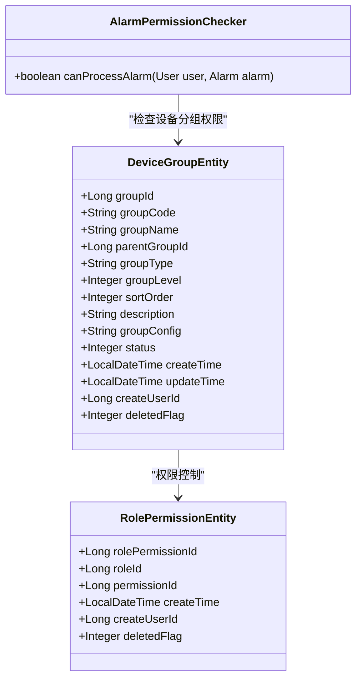
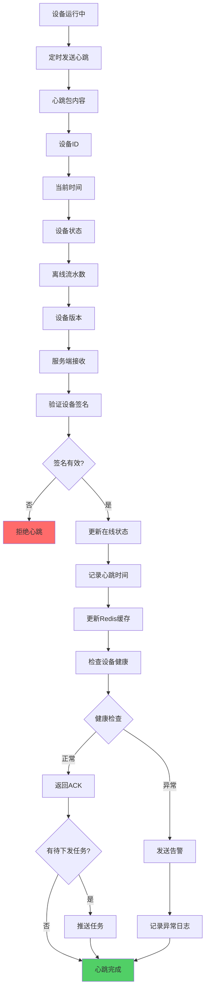
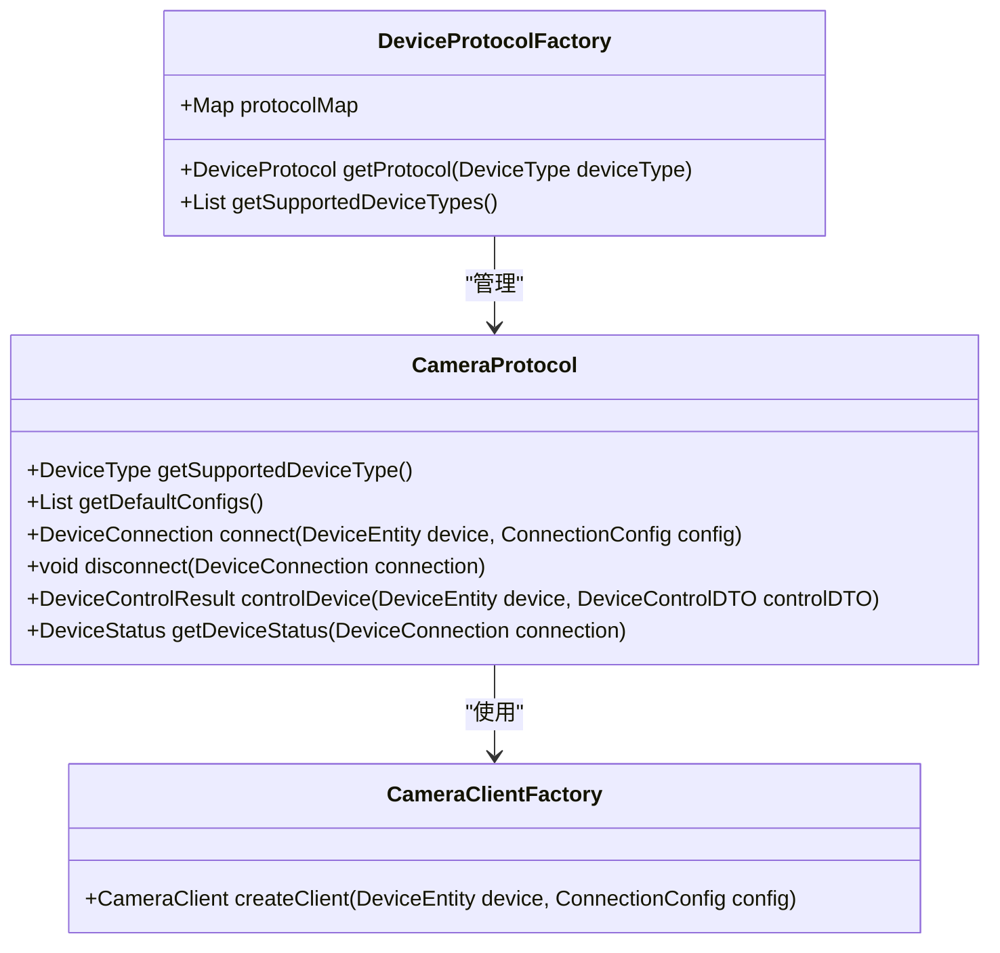
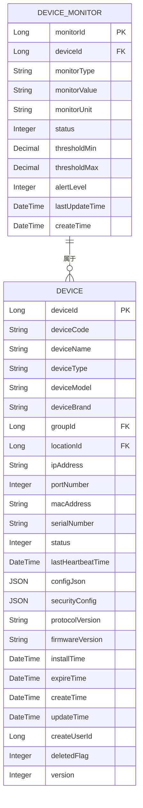

# 设备管理

<cite>
**本文档引用文件**  
- [VideoDeviceController.java](file://microservices/ioedream-video-service/src/main/java/net/lab1024/sa/video/controller/VideoDeviceController.java)
- [CameraProtocol.java](file://documentation/technical/smart-device.md)
- [device-const.js](file://smart-admin-web-javascript/src/constants/business/smart-video/device-const.js)
- [smart-device.md](file://documentation/technical/smart-device.md)
- [device-communication-service/spec.md](file://openspec/changes/seven-microservice-architecture-integration/specs/device-communication-service/spec.md)
- [device-communication-service/spec.md](file://openspec/changes/seven-microservice-architecture-integration/specs/device-communication-service/spec.md)
- [device-const.js](file://smart-admin-web-javascript/src/constants/business/smart-video/device-const.js)
- [smart-device.md](file://documentation/technical/smart-device.md)
- [smart-device.md](file://documentation/technical/smart-device.md)
- [smart-device.md](file://documentation/technical/smart-device.md)
- [smart-device.md](file://documentation/technical/smart-device.md)
- [smart-device.md](file://documentation/technical/smart-device.md)
- [smart-device.md](file://documentation/technical/smart-device.md)
- [smart-device.md](file://documentation/technical/smart-device.md)
- [smart-device.md](file://documentation/technical/smart-device.md)
</cite>

## 目录
1. [设备注册与配置管理](#设备注册与配置管理)
2. [设备分组与权限分配](#设备分组与权限分配)
3. [设备状态监控与心跳检测](#设备状态监控与心跳检测)
4. [设备控制与批量操作](#设备控制与批量操作)
5. [设备协议适配技术方案](#设备协议适配技术方案)
6. [设备性能监控指标](#设备性能监控指标)

## 设备注册与配置管理

视频设备管理功能通过`VideoDeviceController`提供完整的设备增删改查接口。设备注册时，系统会自动初始化默认配置，包括视频分辨率（1920x1080）、帧率（25fps）、默认用户名（admin）等基础参数。设备配置信息存储在`t_device_config`表中，支持加密存储敏感信息如密码。

设备注册流程包括：验证设备编码唯一性、验证设备类型、创建设备实体、初始化设备配置、启动设备监控等步骤。设备配置采用JSON格式存储，支持灵活扩展。系统通过`DeviceConfigEntity`实体管理设备配置，包含配置键、值、类型、加密状态等属性。

**Section sources**
- [VideoDeviceController.java](file://microservices/ioedream-video-service/src/main/java/net/lab1024/sa/video/controller/VideoDeviceController.java#L58-L71)
- [smart-device.md](file://documentation/technical/smart-device.md#L204-L238)

## 设备分组与权限分配

系统支持灵活的设备分组管理，通过`DEVICE_TYPE_ENUM`定义了网络摄像机（IPC）、NVR、DVR、解码器等设备类型。设备分组信息存储在`t_device_group`表中，支持多级分组结构，包含分组编码、名称、父分组、层级等属性。

权限分配基于角色的访问控制（RBAC）模型，通过`t_role_permission`表管理角色权限映射。不同安全级别的用户拥有不同的操作权限，如Level 5用户可查看和处理所有告警，Level 1用户仅可查看分配设备的告警。权限检查通过`AlarmPermissionChecker`类实现，根据用户安全级别和设备分配关系进行权限验证。

**Diagram sources**
- [smart-device.md](file://documentation/technical/smart-device.md#L252-L271)
- [smart-device.md](file://documentation/technical/smart-device.md#L14-L20)
- [smart-device.md](file://documentation/technical/smart-device.md#L418-L454)

## 设备状态监控与心跳检测

设备状态监控通过`CameraProtocol`类实现，支持在线状态、运行状态、故障状态的实时监控。系统通过心跳机制检测设备在线状态，设备定时发送心跳包，服务端验证签名后更新设备在线状态。心跳检测流程包括：接收心跳包、验证设备签名、更新在线状态、记录心跳时间、检查设备健康等步骤。

设备状态信息存储在`t_device_monitor`表中，监控类型包括CPU使用率、内存使用率、磁盘使用率等。系统设置阈值进行告警判断，如CPU使用率≥90%为严重告警，≥80%为警告。设备离线时，系统会触发离线告警并记录异常日志。

**Diagram sources**
- [smart-device.md](file://documentation/technical/smart-device.md#L162-L198)
- [smart-device.md](file://documentation/technical/smart-device.md#L1511-L1803)

## 设备控制与批量操作

系统提供全面的设备控制功能，包括云台控制（PTZ）、预置位调用、录像控制等。通过`VideoDeviceController`的`ptzControl`方法实现云台控制，支持上下左右移动、变倍放大缩小等操作。录像控制支持开始和停止录像，录像记录存储在`t_device_event`表中。

批量操作通过`batchOperateDevices`接口实现，支持批量删除设备、批量更新设备状态等操作。设备控制权限通过`@SaCheckPermission`注解进行验证，如云台控制需要`video:device:ptz`权限。系统通过`DeviceControlResult`返回控制结果，包含成功或失败状态及消息。

**Section sources**
- [VideoDeviceController.java](file://microservices/ioedream-video-service/src/main/java/net/lab1024/sa/video/controller/VideoDeviceController.java#L164-L299)
- [smart-device.md](file://documentation/technical/smart-device.md#L1596-L1612)

## 设备协议适配技术方案

设备通讯微服务（ioedream-device-comm-service）支持多种设备连接协议，包括TCP、UDP、HTTP、MQTT等。系统采用协议适配器模式，通过`DeviceProtocolFactory`工厂类管理不同设备类型的协议处理器。对于视频设备，`CameraProtocol`实现了ONVIF等标准协议的适配。

系统支持海康威视、大华、宇视等主流厂商设备的协议适配。协议适配框架提供统一的设备连接、状态获取、控制指令下发接口。设备连接时，根据设备类型选择相应的协议处理器，建立连接并进行状态同步。系统通过`CameraClientFactory`创建设备客户端，实现与不同厂商设备的通信。

**Diagram sources**
- [device-communication-service/spec.md](file://openspec/changes/seven-microservice-architecture-integration/specs/device-communication-service/spec.md#L20-L40)
- [smart-device.md](file://documentation/technical/smart-device.md#L71-L92)
- [smart-device.md](file://documentation/technical/smart-device.md#L1511-L1803)

## 设备性能监控指标

系统提供全面的设备性能监控，监控指标包括CPU使用率、内存使用率、磁盘使用率、网络流量等。通过`ResourceUsageVO`类定义资源使用情况，包含CPU核心数、CPU负载、总内存、已用内存、总磁盘空间、已用磁盘空间等属性。

监控数据通过`SystemMonitorManager`收集，从JVM和操作系统层面获取资源使用情况。CPU使用率通过`OperatingSystemMXBean`获取系统负载，内存使用情况通过`MemoryMXBean`获取堆内存使用量，磁盘使用情况通过`File.listRoots()`获取各磁盘分区的总空间和可用空间。

**Diagram sources**
- [smart-device.md](file://documentation/technical/smart-device.md#L18-L84)
- [smart-device.md](file://documentation/technical/smart-device.md#L73-L127)
- [smart-device.md](file://documentation/technical/smart-device.md#L277-L294)