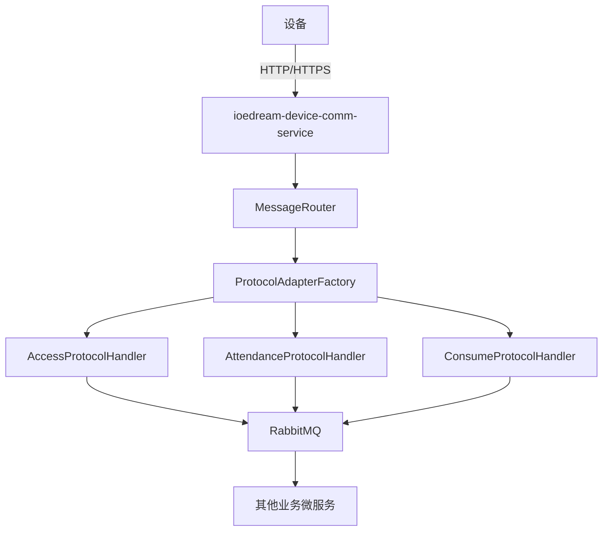
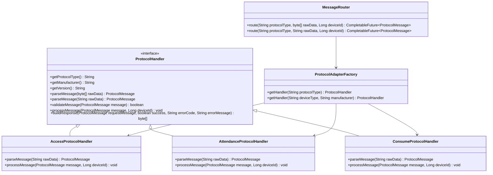
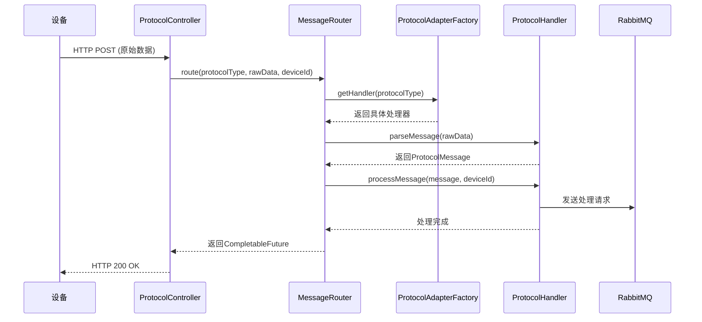

# 设备通讯协议

<cite>
**本文档引用的文件**   
- [MinerU_安防PUSH通讯协议 （熵基科技）V4.8-20240107(水印版)__20251206181130.md](file://docs/各个设备通讯协议/MinerU_安防PUSH通讯协议 （熵基科技）V4.8-20240107(水印版)__20251206181130.md)
- [MinerU_消费PUSH通讯协议 （中控智慧） V1.0-20181225__20251206181016.md](file://docs/各个设备通讯协议/MinerU_消费PUSH通讯协议 （中控智慧） V1.0-20181225__20251206181016.md)
- [MinerU_考勤PUSH通讯协议 （熵基科技） V4.0-20210113(水印版)__20251206181117.md](file://docs/各个设备通讯协议/MinerU_考勤PUSH通讯协议 （熵基科技） V4.0-20210113(水印版)__20251206181117.md)
- [AttendanceProtocolHandler.java](file://microservices/ioedream-device-comm-service/src/main/java/net/lab1024/sa/devicecomm/protocol/handler/impl/AttendanceProtocolHandler.java)
- [AccessProtocolHandler.java](file://microservices/ioedream-device-comm-service/src/main/java/net/lab1024/sa/devicecomm/protocol/handler/impl/AccessProtocolHandler.java)
- [ConsumeProtocolHandler.java](file://microservices/ioedream-device-comm-service/src/main/java/net/lab1024/sa/devicecomm/protocol/handler/impl/ConsumeProtocolHandler.java)
- [MessageRouter.java](file://microservices/ioedream-device-comm-service/src/main/java/net/lab1024/sa/devicecomm/protocol/router/MessageRouter.java)
</cite>

## 目录
1. [引言](#引言)
2. [项目结构与核心组件](#项目结构与核心组件)
3. [设备通讯协议分析](#设备通讯协议分析)
4. [协议实现架构](#协议实现架构)
5. [核心协议处理器分析](#核心协议处理器分析)
6. [消息路由机制](#消息路由机制)
7. [结论](#结论)

## 引言
本技术文档旨在全面分析IOE-DREAM项目中的设备通讯协议。文档基于项目中提供的多份设备通讯协议文档（安防、消费、考勤）以及对应的微服务实现代码，深入剖析了协议的规范、实现架构和核心处理逻辑。通过本分析，旨在为开发者提供一个清晰、系统的协议理解框架，确保设备与服务器之间的数据交互稳定、高效。

## 项目结构与核心组件
IOE-DREAM项目是一个包含多个微服务的复杂系统。与设备通讯协议直接相关的核心组件是`ioedream-device-comm-service`微服务，它负责处理来自不同厂商、不同类型设备的通讯请求。

**核心文件结构：**
- **协议文档**：位于`docs/各个设备通讯协议/`目录下，包含了安防、消费、考勤三类设备的详细通讯协议规范。
- **微服务实现**：位于`microservices/ioedream-device-comm-service/`目录下，其核心代码位于`src/main/java/net/lab1024/sa/devicecomm/`包中。

**核心组件关系：**

**Diagram sources**
- [MessageRouter.java](file://microservices/ioedream-device-comm-service/src/main/java/net/lab1024/sa/devicecomm/protocol/router/MessageRouter.java)
- [AttendanceProtocolHandler.java](file://microservices/ioedream-device-comm-service/src/main/java/net/lab1024/sa/devicecomm/protocol/handler/impl/AttendanceProtocolHandler.java)
- [AccessProtocolHandler.java](file://microservices/ioedream-device-comm-service/src/main/java/net/lab1024/sa/devicecomm/protocol/handler/impl/AccessProtocolHandler.java)
- [ConsumeProtocolHandler.java](file://microservices/ioedream-device-comm-service/src/main/java/net/lab1024/sa/devicecomm/protocol/handler/impl/ConsumeProtocolHandler.java)

**Section sources**
- [docs/各个设备通讯协议/](file://docs/各个设备通讯协议/)
- [microservices/ioedream-device-comm-service/](file://microservices/ioedream-device-comm-service/)

## 设备通讯协议分析
项目中定义了三种主要的设备通讯协议，均基于HTTP协议，但数据格式和字段定义各有不同。

### 安防PUSH通讯协议（熵基科技）
- **文档**：`MinerU_安防PUSH通讯协议 （熵基科技）V4.8-20240107(水印版)__20251206181130.md`
- **特点**：
  - 使用**键值对**格式，以制表符（HT）分隔。
  - 支持丰富的实时事件，包括正常事件、异常事件和报警事件（事件码4000-7000+）。
  - 支持多种验证方式，包括卡片、指纹、人脸、掌纹、二维码/健康码等。
  - 支持韦根2.0通信协议和可视对讲通讯录协议。
- **核心数据格式**：
  - **实时事件 (rtlog)**: `time={Time}\tpin={Pin}\tcardno={CardNo}\tevent={Event}\tinoutstatus={InOutStatus}\tverifytype={VerifyType}\tmaskflag={MaskFlag}\ttemperature={Temperature}`

### 考勤PUSH通讯协议（熵基科技）
- **文档**：`MinerU_考勤PUSH通讯协议 （熵基科技） V4.0-20210113(水印版)__20251206181117.md`
- **特点**：
  - 使用**制表符分隔**的文本格式。
  - 支持混合识别协议，统一了生物模板的上传/下发格式。
  - 支持测温功能，可上传口罩状态和温度信息。
  - 支持断点续传和实时上传。
- **核心数据格式**：
  - **考勤记录 (ATTLOG)**: `{Pin}\t{Time}\t{Status}\t{Verify}\t{Workcode}\t{Reserved1}\t{Reserved2}\t{MaskFlag}\t{Temperature}\t{ConvTemperature}`

### 消费PUSH通讯协议（中控智慧）
- **文档**：`MinerU_消费PUSH通讯协议 （中控智慧） V1.0-20181225__20251206181016.md`
- **特点**：
  - 使用**制表符分隔**的文本格式。
  - 支持单钱包和双钱包功能。
  - 支持消费记录、充值记录、补贴记录、商品消费明细等多种数据上传。
  - 支持挂失、解挂、修改密码等操作。
- **核心数据格式**：
  - **消费记录 (BUYLOG)**: `{SysID}\t{CARDNO}\t{PosTime}\t{PosMoney}\t{Balance}\t{CardRecID}\t{State}\t{MealType}\t{MealDate}\t{RecNo}\t{OPID}`

**Section sources**
- [MinerU_安防PUSH通讯协议 （熵基科技）V4.8-20240107(水印版)__20251206181130.md](file://docs/各个设备通讯协议/MinerU_安防PUSH通讯协议 （熵基科技）V4.8-20240107(水印版)__20251206181130.md)
- [MinerU_考勤PUSH通讯协议 （熵基科技） V4.0-20210113(水印版)__20251206181117.md](file://docs/各个设备通讯协议/MinerU_考勤PUSH通讯协议 （熵基科技） V4.0-20210113(水印版)__20251206181117.md)
- [MinerU_消费PUSH通讯协议 （中控智慧） V1.0-20181225__20251206181016.md](file://docs/各个设备通讯协议/MinerU_消费PUSH通讯协议 （中控智慧） V1.0-20181225__20251206181016.md)

## 协议实现架构
设备通讯服务采用了一种高度模块化和可扩展的架构设计，核心是**协议工厂模式**和**消息路由机制**。

### 架构设计

**Diagram sources**
- [AttendanceProtocolHandler.java](file://microservices/ioedream-device-comm-service/src/main/java/net/lab1024/sa/devicecomm/protocol/handler/impl/AttendanceProtocolHandler.java)
- [AccessProtocolHandler.java](file://microservices/ioedream-device-comm-service/src/main/java/net/lab1024/sa/devicecomm/protocol/handler/impl/AccessProtocolHandler.java)
- [ConsumeProtocolHandler.java](file://microservices/ioedream-device-comm-service/src/main/java/net/lab1024/sa/devicecomm/protocol/handler/impl/ConsumeProtocolHandler.java)
- [MessageRouter.java](file://microservices/ioedream-device-comm-service/src/main/java/net/lab1024/sa/devicecomm/protocol/router/MessageRouter.java)

**Section sources**
- [microservices/ioedream-device-comm-service/src/main/java/net/lab1024/sa/devicecomm/protocol/](file://microservices/ioedream-device-comm-service/src/main/java/net/lab1024/sa/devicecomm/protocol/)

## 核心协议处理器分析
每个协议处理器都实现了`ProtocolHandler`接口，负责特定协议的解析、验证和处理。

### 共同特性
- **协议类型标识**：每个处理器通过`getProtocolType()`方法返回唯一的协议类型码（如`ACCESS_ENTROPY_V4_8`）。
- **双模式解析**：`parseMessage()`方法重载，支持解析字节数组和字符串。对于HTTP协议，实际使用字符串解析。
- **异步处理**：`processMessage()`方法将解析后的数据发送到RabbitMQ队列，由消费者异步处理，保证了高吞吐量和系统稳定性。
- **监控指标**：集成`ProtocolMetricsCollector`，记录处理成功/失败次数和耗时。

### 门禁协议处理器 (AccessProtocolHandler)
- **数据解析**：将键值对格式的字符串解析为`Map<String, Object>`。
- **消息类型判断**：根据`event`、`sensor`等字段判断消息类型（`ACCESS_RECORD`, `DEVICE_STATUS`, `ALARM_EVENT`）。
- **字段映射**：将协议字段（如`pin`, `event`, `verifytype`）映射到业务模型，并处理温度、口罩等可选字段。
- **事件处理**：将门禁事件发送到`protocol.access.record`队列。

### 考勤协议处理器 (AttendanceProtocolHandler)
- **数据解析**：将制表符分隔的文本解析为`Map<String, Object>`。
- **批量处理**：支持多条考勤记录的批量上传和处理。
- **字段映射**：将`Pin`映射为用户ID，`Time`转换为Unix时间戳，并处理验证方式、状态等字段。
- **事件处理**：将考勤记录发送到`protocol.attendance.record`队列。

### 消费协议处理器 (ConsumeProtocolHandler)
- **数据解析**：解析制表符分隔的消费记录，支持单/双钱包格式。
- **用户ID查询**：通过`GatewayServiceClient`调用消费服务，根据卡号查询用户ID，并使用`ProtocolCacheManager`进行多级缓存。
- **金额处理**：将协议中的“分”单位转换为业务中的“元”单位。
- **事件处理**：将消费记录发送到`protocol.consume.record`队列。

**Section sources**
- [AttendanceProtocolHandler.java](file://microservices/ioedream-device-comm-service/src/main/java/net/lab1024/sa/devicecomm/protocol/handler/impl/AttendanceProtocolHandler.java)
- [AccessProtocolHandler.java](file://microservices/ioedream-device-comm-service/src/main/java/net/lab1024/sa/devicecomm/protocol/handler/impl/AccessProtocolHandler.java)
- [ConsumeProtocolHandler.java](file://microservices/ioedream-device-comm-service/src/main/java/net/lab1024/sa/devicecomm/protocol/handler/impl/ConsumeProtocolHandler.java)

## 消息路由机制
`MessageRouter`是整个通讯服务的核心，负责将接收到的原始数据分发到正确的协议处理器。

### 路由流程

**Diagram sources**
- [MessageRouter.java](file://microservices/ioedream-device-comm-service/src/main/java/net/lab1024/sa/devicecomm/protocol/router/MessageRouter.java)
- [ProtocolController.java](file://microservices/ioedream-device-comm-service/src/main/java/net/lab1024/sa/devicecomm/controller/ProtocolController.java)

**Section sources**
- [MessageRouter.java](file://microservices/ioedream-device-comm-service/src/main/java/net/lab1024/sa/devicecomm/protocol/router/MessageRouter.java)

## 结论
IOE-DREAM项目的设备通讯协议实现是一个设计精良、可扩展性强的系统。它通过以下方式实现了高效、稳定的设备数据接入：
1.  **协议与实现分离**：详细的协议文档与代码实现分离，便于维护和升级。
2.  **模块化设计**：采用工厂模式和接口，使得新增协议只需实现新的处理器，无需修改核心路由逻辑。
3.  **异步处理**：利用消息队列解耦，保证了高并发下的系统性能和稳定性。
4.  **健壮性**：完善的日志记录、错误处理和监控指标，便于问题排查和性能优化。

该架构为未来接入更多类型的设备和协议提供了坚实的基础。