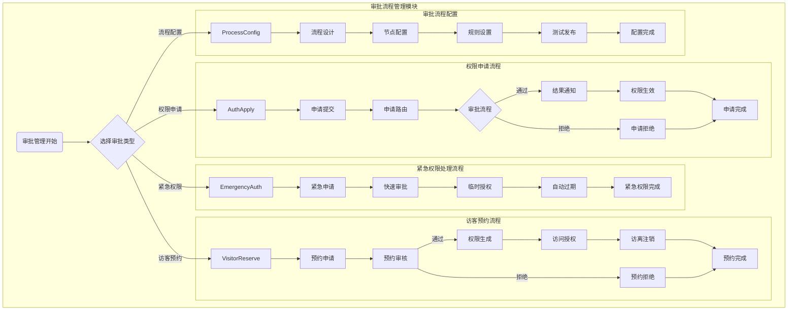
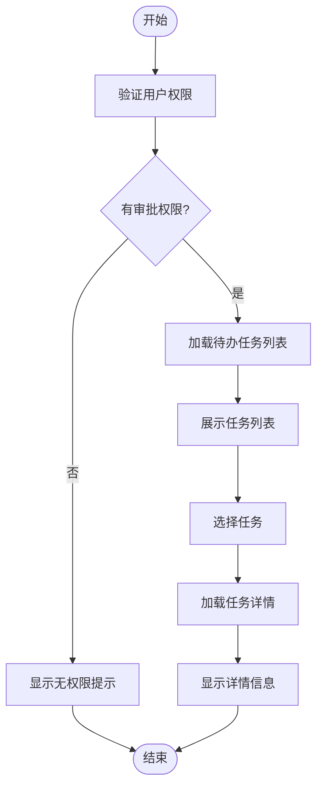
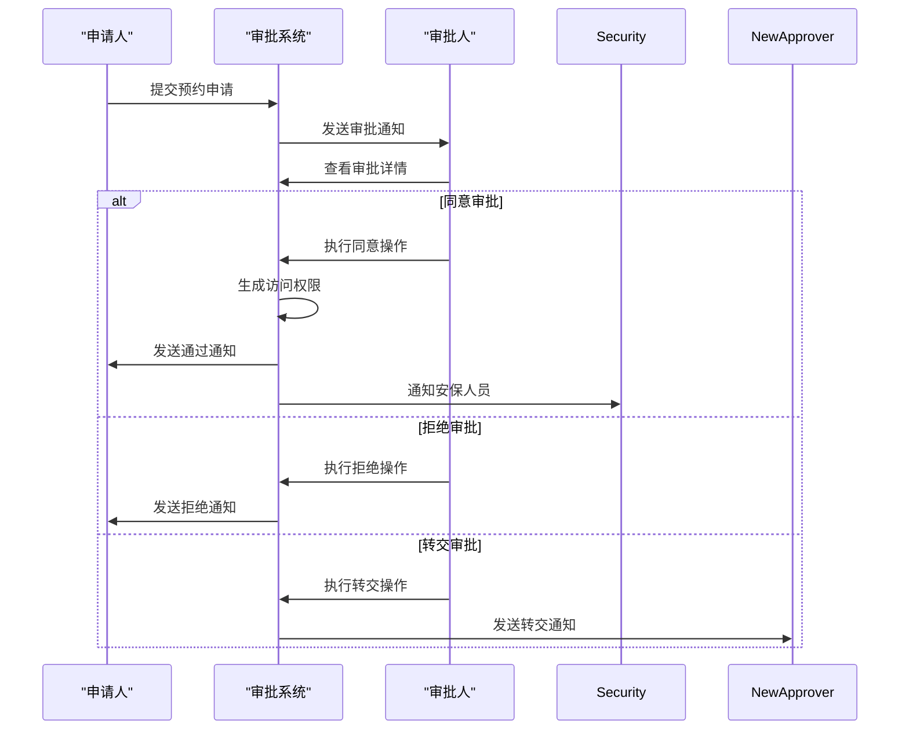
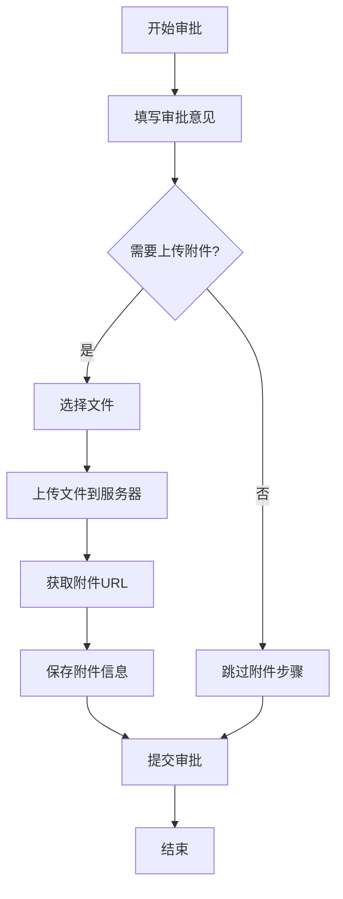
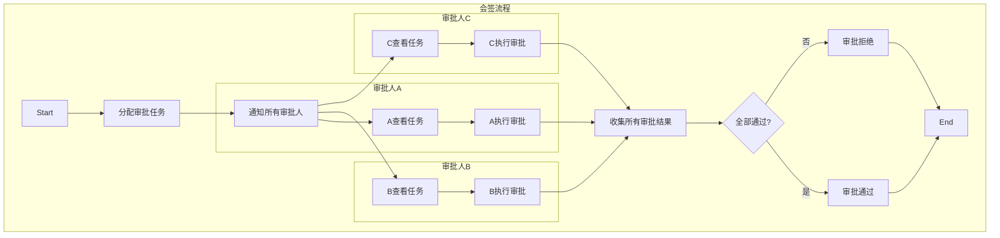
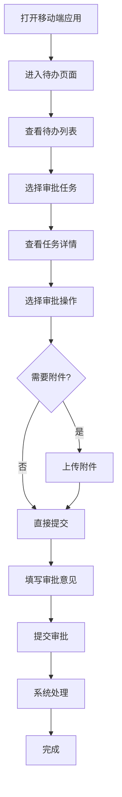

# 审批执行

<cite>
**本文档引用文件**  
- [visitor-module-architecture.md](file://documentation/03-业务模块/访客/visitor-module-architecture.md)
- [visitor-api-contract.md](file://documentation/api/visitor/visitor-api-contract.md)
- [approval-workflow-management\spec.md](file://openspec/changes/archive/completed-proposals/implement-access-control-missing-functions/specs/approval-workflow-management/spec.md)
- [12-前端API接口设计.md](file://documentation/03-业务模块/访客/12-前端API接口设计.md)
- [smart-app\src\pages\visitor\appointment.vue](file://smart-app/src/pages/visitor/appointment.vue)
- [smart-app\api\access.js](file://smart-app/api/access.js)
</cite>

## 目录
1. [审批流程概述](#审批流程概述)
2. [待办任务处理](#待办任务处理)
3. [审批操作指南](#审批操作指南)
4. [审批意见与附件](#审批意见与附件)
5. [特殊审批操作](#特殊审批操作)
6. [移动端审批](#移动端审批)

## 审批流程概述

访客审批流程是访客管理系统的核心功能，涵盖了从预约申请到权限生效的完整生命周期管理。系统支持被访人代为预约或访客自主预约，预约信息包含访问时间、访问区域和事由等关键要素。

审批流程遵循严格的四层架构设计，包括Controller（接口控制层）、Service（核心业务层）、Manager（流程管理层）和DAO（数据访问层）。审批状态包括待审核（PENDING）、已通过（APPROVED）、已拒绝（REJECTED）、已取消（CANCELLED）和已完成（COMPLETED）。

**Diagram sources**
- [approval-workflow-management\spec.md](file://openspec/changes/archive/completed-proposals/implement-access-control-missing-functions/specs/approval-workflow-management/spec.md)

**Section sources**
- [visitor-module-architecture.md](file://documentation/03-业务模块/访客/visitor-module-architecture.md)
- [approval-workflow-management\spec.md](file://openspec/changes/archive/completed-proposals/implement-access-control-missing-functions/specs/approval-workflow-management/spec.md)

## 待办任务处理

### 待办任务列表查看

用户可以通过移动端或PC端查看待办审批任务列表。在移动端，用户进入"访客"模块后，系统会自动显示待审批的预约列表。列表按照创建时间倒序排列，每条记录显示访客姓名、被访人、访问时间和当前状态。

通过API接口 `/api/v1/mobile/visitor/my-appointments` 可以查询当前用户的预约记录，支持按状态（待审批、已通过、已拒绝、已完成）进行筛选。系统还提供统计接口 `/api/v1/mobile/visitor/statistics`，显示待审批预约数量等关键指标。

### 审批详情查看

点击待办任务可以查看详细的审批信息。审批详情包括访客基本信息（姓名、手机号、证件号）、访问目的、访问区域、预计访问时间等。同时显示审批流程的当前节点、审批人和预计审批时间。

通过API接口 `GET /api/v1/mobile/visitor/appointment/{appointmentId}` 可以获取预约详情，返回数据包含预约编号、二维码、审批意见等完整信息。系统支持查看审批历史，记录每个审批节点的操作人和操作时间。

**Diagram sources**
- [visitor-api-contract.md](file://documentation/api/visitor/visitor-api-contract.md)
- [12-前端API接口设计.md](file://documentation/03-业务模块/访客/12-前端API接口设计.md)

**Section sources**
- [visitor-api-contract.md](file://documentation/api/visitor/visitor-api-contract.md)
- [12-前端API接口设计.md](file://documentation/03-业务模块/访客/12-前端API接口设计.md)

## 审批操作指南

### 同意操作

当审批人确认访客预约信息无误后，可以执行同意操作。同意操作会将预约状态更新为"已通过"，并触发权限生成流程。系统会自动生成临时访问凭证（如二维码），并通过邮件、短信或App推送通知申请人和相关安保人员。

同意操作通过API接口 `POST /api/v1/visitor/appointment/approve` 执行，需要提供审批意见。系统会记录审批人、审批时间和审批意见到审计日志中，确保操作可追溯。

### 拒绝操作

当审批人认为访客预约不符合要求时，可以执行拒绝操作。拒绝操作需要填写拒绝原因，系统会将预约状态更新为"已拒绝"，并通知申请人。被拒绝的预约无法激活访问权限。

拒绝操作通过API接口 `POST /api/v1/visitor/appointment/reject` 执行，必须提供拒绝原因。系统会记录完整的拒绝信息，包括操作人、操作时间和详细原因。

### 转交操作

当审批人无法处理当前审批任务时，可以执行转交操作。转交操作允许将审批任务转交给其他有权限的审批人。转交时需要选择新的审批人并填写转交原因。

转交操作确保了审批流程的灵活性和连续性，避免因审批人缺席导致流程停滞。系统会记录转交历史，包括原审批人、新审批人和转交原因。

**Diagram sources**
- [visitor-api-contract.md](file://documentation/api/visitor/visitor-api-contract.md)
- [approval-workflow-management\spec.md](file://openspec/changes/archive/completed-proposals/implement-access-control-missing-functions/specs/approval-workflow-management/spec.md)

**Section sources**
- [visitor-api-contract.md](file://documentation/api/visitor/visitor-api-contract.md)
- [approval-workflow-management\spec.md](file://openspec/changes/archive/completed-proposals/implement-access-control-missing-functions/specs/approval-workflow-management/spec.md)

## 审批意见与附件

### 审批意见填写规范

审批意见是审批流程中的重要组成部分，必须遵循以下规范：
- **必填要求**：所有审批操作（同意、拒绝、转交）都必须填写审批意见
- **内容要求**：意见应简明扼要，说明审批决策的理由
- **格式要求**：使用正式书面语言，避免使用口语化表达
- **长度限制**：建议控制在200字以内，最长不超过500字

系统通过后端验证确保审批意见的完整性，前端界面会提示用户填写必要的审批意见。审批意见将永久保存在系统中，作为审计依据。

### 附件上传功能

审批流程支持附件上传功能，允许上传与审批相关的文件。支持的文件类型包括：
- 图片文件（JPG、PNG、GIF）
- 文档文件（PDF、DOC、DOCX）
- 表格文件（XLS、XLSX）

附件上传通过API接口实现，系统会对上传文件进行安全检查，防止恶意文件上传。上传的附件与审批任务关联，审批人可以在审批详情中查看和下载所有附件。

**Diagram sources**
- [visitor-api-contract.md](file://documentation/api/visitor/visitor-api-contract.md)

**Section sources**
- [visitor-api-contract.md](file://documentation/api/visitor/visitor-api-contract.md)

## 特殊审批操作

### 加签操作

加签操作允许在审批流程中添加额外的审批人。当需要特定人员的额外审批时，当前审批人可以执行加签操作。加签分为两种模式：
- **会签模式**：所有加签的审批人都必须同意，审批才能通过
- **或签模式**：任意一个加签的审批人同意，审批即可通过

加签操作通过审批流程配置实现，系统会自动将任务分发给所有加签的审批人，并等待所有审批结果。

### 会签操作

会签是多个人员共同审批的特殊模式。在会签流程中，所有指定的审批人都必须完成审批操作，审批结果才会生效。系统会并行通知所有会签人员，并跟踪每个人的审批进度。

会签操作适用于重要事项的审批，确保多方共同决策。只有当所有会签人员都同意时，审批才能通过；任何一人拒绝都会导致审批失败。

**Diagram sources**
- [approval-workflow-management\spec.md](file://openspec/changes/archive/completed-proposals/implement-access-control-missing-functions/specs/approval-workflow-management/spec.md)

**Section sources**
- [approval-workflow-management\spec.md](file://openspec/changes/archive/completed-proposals/implement-access-control-missing-functions/specs/approval-workflow-management/spec.md)

## 移动端审批

### 移动端操作流程

移动端审批提供了便捷的审批体验，用户可以通过手机完成所有审批操作。操作流程如下：
1. 打开移动端应用，进入"待办"页面
2. 查看待办任务列表，点击需要审批的任务
3. 查看任务详情，包括访客信息、访问目的等
4. 根据情况选择同意、拒绝或转交操作
5. 填写审批意见，如有需要可上传附件
6. 提交审批，系统自动处理后续流程

移动端支持离线审批功能，当网络不可用时，审批操作会暂存本地，待网络恢复后自动同步到服务器。

### 用户体验说明

移动端审批界面设计遵循简洁直观的原则，确保用户能够快速完成审批操作。主要特点包括：
- **响应式设计**：适配各种屏幕尺寸的移动设备
- **手势操作**：支持滑动、点击等自然交互方式
- **消息提醒**：通过推送通知及时提醒待办任务
- **快速操作**：提供常用审批意见模板，提高审批效率

系统还提供审批统计功能，用户可以查看自己的审批历史、审批效率等数据，帮助优化审批行为。

**Diagram sources**
- [smart-app\src\pages\visitor\appointment.vue](file://smart-app/src/pages/visitor/appointment.vue)
- [smart-app\api\access.js](file://smart-app/api/access.js)

**Section sources**
- [smart-app\src\pages\visitor\appointment.vue](file://smart-app/src/pages/visitor/appointment.vue)
- [smart-app\api\access.js](file://smart-app/api/access.js)