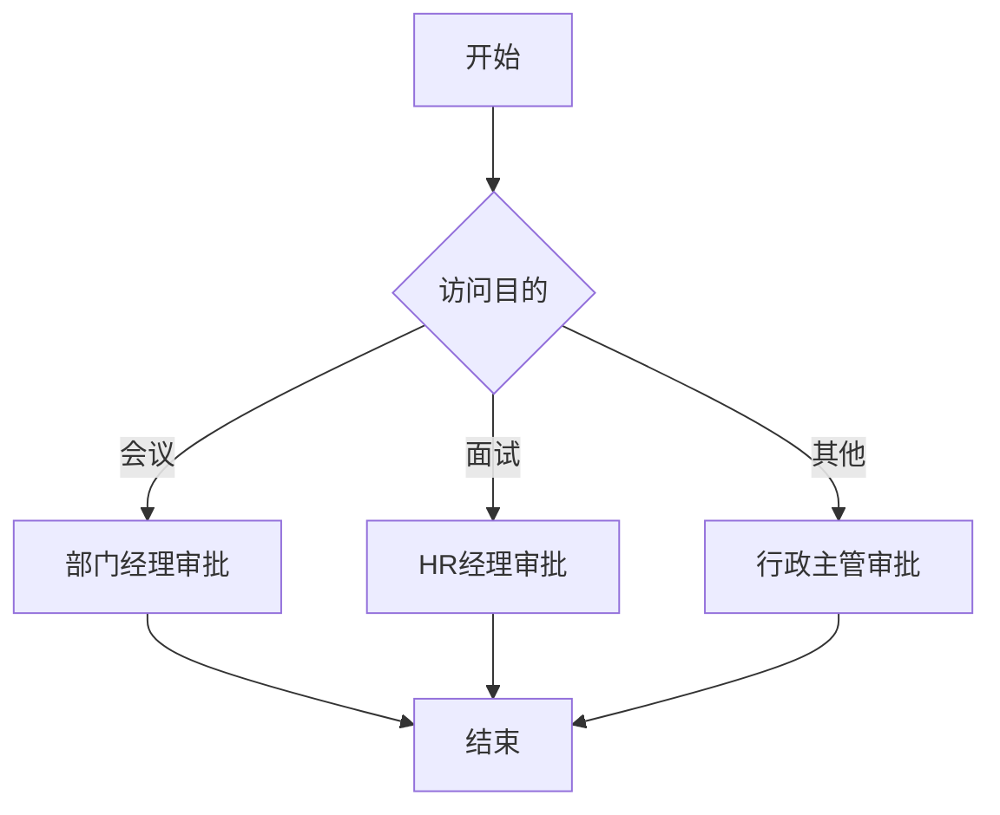
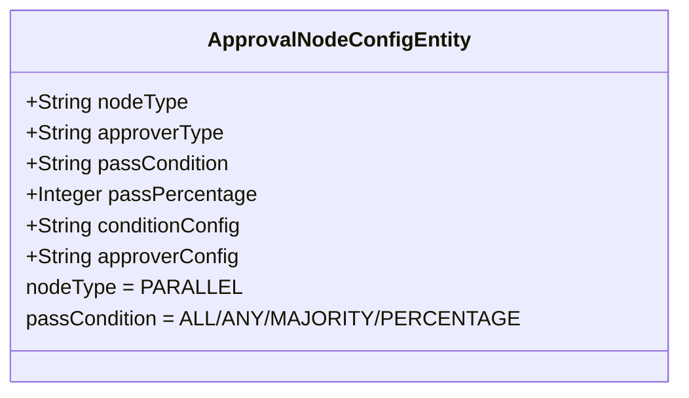
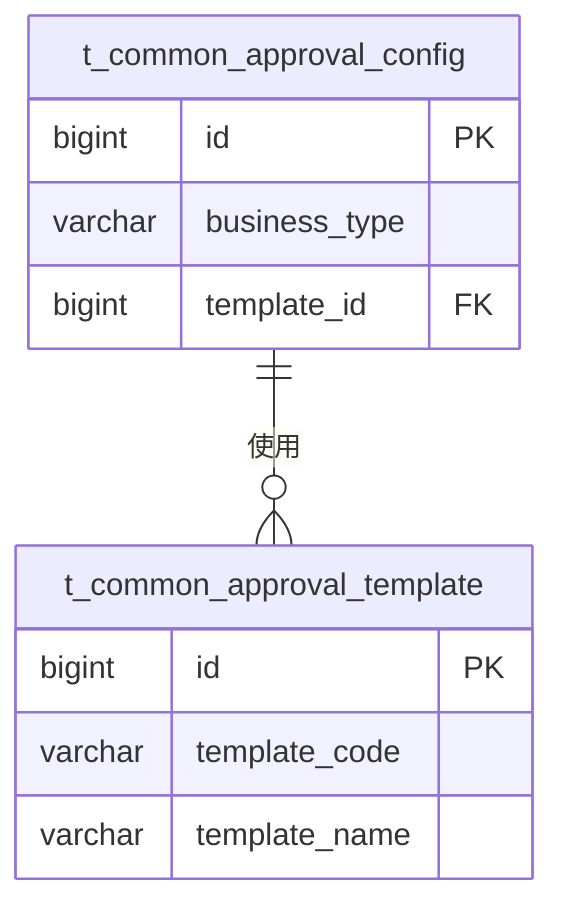
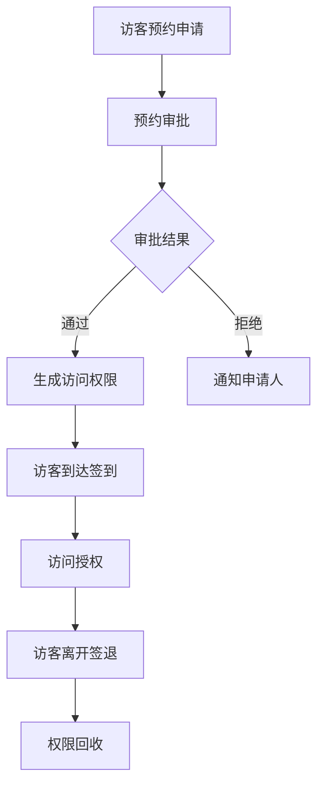
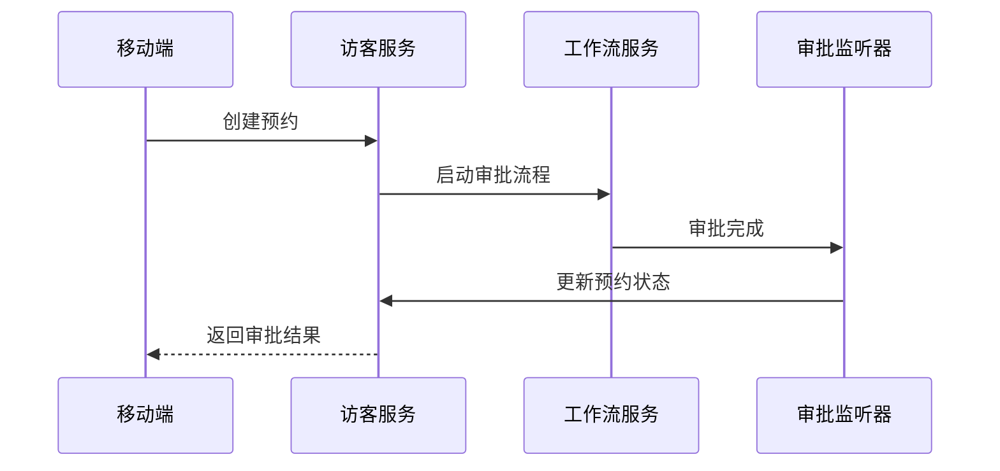
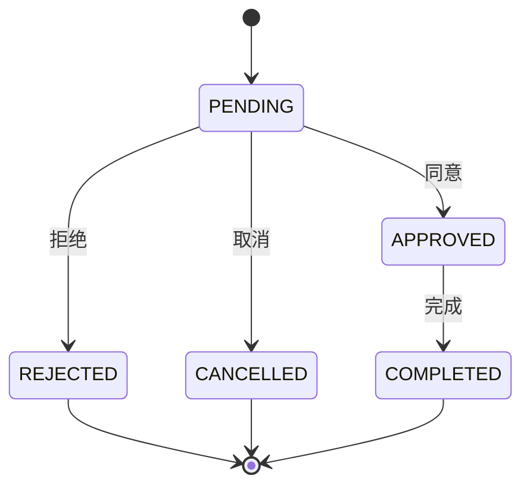
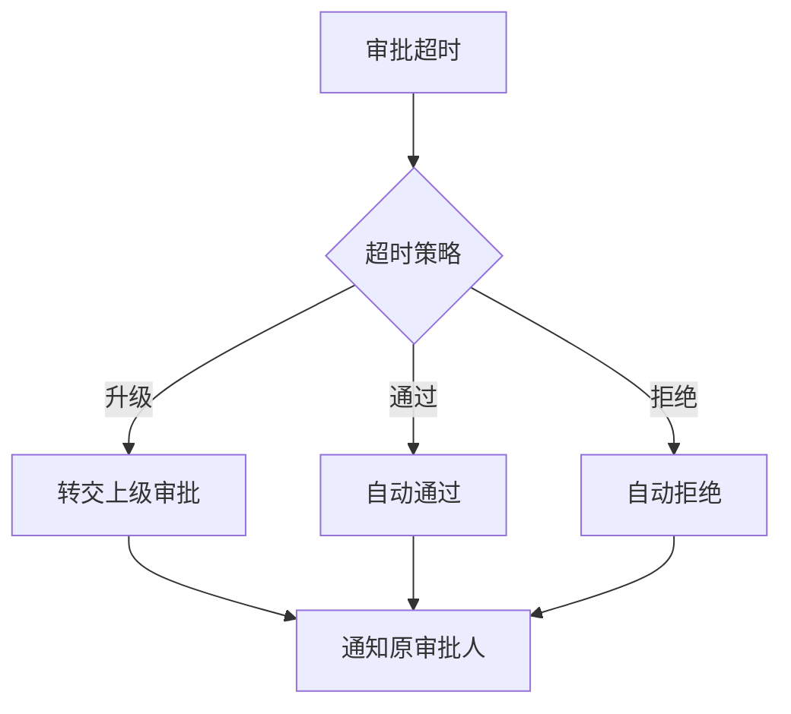

# 审批流程

<cite>
**本文档引用的文件**   
- [APPROVAL_SYSTEM_DATABASE_SCHEMA.sql](file://documentation/technical/APPROVAL_SYSTEM_DATABASE_SCHEMA.sql)
- [APPROVAL_CONFIG_SYSTEM_DESIGN.md](file://documentation/technical/APPROVAL_CONFIG_SYSTEM_DESIGN.md)
- [APPROVAL_CONFIG_IMPLEMENTATION_SUMMARY.md](file://documentation/technical/APPROVAL_CONFIG_IMPLEMENTATION_SUMMARY.md)
- [APPROVAL_SYSTEM_ENHANCEMENT_COMPLETE.md](file://documentation/technical/APPROVAL_SYSTEM_ENHANCEMENT_COMPLETE.md)
- [APPROVAL_SYSTEM_VS_DINGTALK_COMPARISON.md](file://documentation/technical/APPROVAL_SYSTEM_VS_DINGTALK_COMPARISON.md)
- [visitor-module-architecture.md](file://docs/各业务模块文档/访客/visitor-module-architecture.md)
- [visitor-api-contract.md](file://documentation/api/visitor/visitor-api-contract.md)
- [approval-workflow-management\spec.md](file://openspec/changes/archive/completed-proposals/implement-access-control-missing-functions/specs/approval-workflow-management/spec.md)
</cite>

## 目录
1. [引言](#引言)
2. [多级审批规则配置](#多级审批规则配置)
3. [审批模板管理](#审批模板管理)
4. [访客预约与审批流程关联](#访客预约与审批流程关联)
5. [审批任务处理指南](#审批任务处理指南)
6. [审批历史查询与状态跟踪](#审批历史查询与状态跟踪)
7. [异常情况处理策略](#异常情况处理策略)
8. [结论](#结论)

## 引言

本文档旨在详细说明访客审批流程的配置与管理机制。系统通过可配置化的设计，支持动态审批流程配置，无需修改代码即可实现新的审批流程。审批系统比钉钉更完善，具备9种审批人设置方式、6种节点类型、完善的审批规则、审批代理、抄送、撤销、催办等功能。

**Section sources**
- [APPROVAL_SYSTEM_ENHANCEMENT_COMPLETE.md](file://documentation/technical/APPROVAL_SYSTEM_ENHANCEMENT_COMPLETE.md#L1-L281)
- [APPROVAL_SYSTEM_VS_DINGTALK_COMPARISON.md](file://documentation/technical/APPROVAL_SYSTEM_VS_DINGTALK_COMPARISON.md#L1-L311)

## 多级审批规则配置

### 条件路由配置

审批流程支持基于条件的路由分支，可根据表单数据动态决定审批路径。条件配置以JSON格式存储在`t_common_approval_node_config`表的`condition_config`字段中。



**Diagram sources **
- [APPROVAL_SYSTEM_DATABASE_SCHEMA.sql](file://documentation/technical/APPROVAL_SYSTEM_DATABASE_SCHEMA.sql#L49-L86)

### 并行审批配置

系统支持并行审批节点，多个审批人可同时处理同一审批任务。并行审批通过设置节点类型为`PARALLEL`实现。



**Diagram sources **
- [APPROVAL_SYSTEM_DATABASE_SCHEMA.sql](file://documentation/technical/APPROVAL_SYSTEM_DATABASE_SCHEMA.sql#L49-L86)

### 审批节点配置

审批节点支持多种配置选项，包括审批人设置方式、审批通过条件、超时配置等。

| 配置项 | 说明 |
|-------|------|
| 节点类型 | SERIAL(串行)、PARALLEL(并行)、COUNTERSIGN(会签)、OR_SIGN(或签)、CONDITION(条件分支)、AUTO(自动) |
| 审批人设置 | SPECIFIED_USER(指定人员)、DIRECT_MANAGER(直属上级)、DEPARTMENT_MANAGER(部门负责人)、ROLE(角色)、INITIATOR_SELECT(发起人自选)、CONTINUOUS_MANAGERS(连续多级主管)、FORM_FIELD(表单字段)、DYNAMIC_RULE(动态规则) |
| 通过条件 | ALL(全部通过)、ANY(任意一人通过)、MAJORITY(多数通过)、PERCENTAGE(按比例通过) |

**Section sources**
- [APPROVAL_SYSTEM_DATABASE_SCHEMA.sql](file://documentation/technical/APPROVAL_SYSTEM_DATABASE_SCHEMA.sql#L49-L86)
- [APPROVAL_SYSTEM_ENHANCEMENT_COMPLETE.md](file://documentation/technical/APPROVAL_SYSTEM_ENHANCEMENT_COMPLETE.md#L32-L46)

## 审批模板管理

### 审批模板创建

审批模板通过`t_common_approval_template`表进行管理，支持模板分类、图标、描述等信息配置。

```sql
CREATE TABLE `t_common_approval_template` (
    `id` bigint NOT NULL AUTO_INCREMENT COMMENT '模板ID',
    `template_name` varchar(200) NOT NULL COMMENT '模板名称',
    `template_code` varchar(100) NOT NULL COMMENT '模板编码（唯一标识）',
    `category` varchar(100) DEFAULT NULL COMMENT '模板分类',
    `description` varchar(500) DEFAULT NULL COMMENT '模板描述',
    `icon` varchar(200) DEFAULT NULL COMMENT '模板图标',
    `form_design` text COMMENT '表单设计（JSON格式）',
    `status` varchar(20) NOT NULL DEFAULT 'ENABLED' COMMENT '状态（ENABLED-启用 DISABLED-禁用）',
    PRIMARY KEY (`id`),
    UNIQUE KEY `uk_template_code` (`template_code`, `deleted_flag`)
) ENGINE=InnoDB DEFAULT CHARSET=utf8mb4 COMMENT='审批模板表';
```

**Diagram sources **
- [APPROVAL_SYSTEM_DATABASE_SCHEMA.sql](file://documentation/technical/APPROVAL_SYSTEM_DATABASE_SCHEMA.sql#L91-L115)

### 审批模板关联

审批配置可关联审批模板，通过`template_id`字段建立关联关系。



**Diagram sources **
- [APPROVAL_SYSTEM_DATABASE_SCHEMA.sql](file://documentation/technical/APPROVAL_SYSTEM_DATABASE_SCHEMA.sql#L11-L44)

## 访客预约与审批流程关联

### 访客预约流程

访客预约流程包含预约申请、审批、授权、访问和签退等环节。



**Diagram sources **
- [approval-workflow-management\spec.md](file://openspec/changes/archive/completed-proposals/implement-access-control-missing-functions/specs/approval-workflow-management/spec.md#L26-L35)

### API接口关联

访客预约与审批流程通过API接口进行关联，审批结果通过回调更新预约状态。



**Diagram sources **
- [visitor-api-contract.md](file://documentation/api/visitor/visitor-api-contract.md#L29-L154)

## 审批任务处理指南

### 同意操作

审批人可通过移动端或PC端接口同意审批请求。

**接口**: `POST /api/v1/workflow/approval-task/{taskId}/approve`

**请求参数**:
```json
{
  "comment": "同意审批",
  "variables": {}
}
```

### 拒绝操作

审批人可拒绝审批请求并填写拒绝原因。

**接口**: `POST /api/v1/workflow/approval-task/{taskId}/reject`

**请求参数**:
```json
{
  "comment": "资料不全，需要补充",
  "variables": {}
}
```

### 转交操作

审批人可将审批任务转交给其他人员处理。

**接口**: `POST /api/v1/workflow/approval-task/{taskId}/delegate`

**请求参数**:
```json
{
  "delegateToUserId": 1001,
  "comment": "转交处理"
}
```

**Section sources**
- [visitor-api-contract.md](file://documentation/api/visitor/visitor-api-contract.md#L134-L154)
- [APPROVAL_CONFIG_SYSTEM_DESIGN.md](file://documentation/technical/APPROVAL_CONFIG_SYSTEM_DESIGN.md#L202-L215)

## 审批历史查询与状态跟踪

### 审批历史查询

系统提供审批历史查询接口，支持按业务类型、申请人、时间范围等条件查询。

**接口**: `GET /api/v1/workflow/approval-history`

**请求参数**:
- `businessType`: 业务类型
- `applicantId`: 申请人ID
- `startTime`: 开始时间
- `endTime`: 结束时间

### 状态跟踪机制

审批流程状态通过`t_common_approval_config`表的`status`字段进行管理。

| 状态 | 说明 |
|------|------|
| PENDING | 待审批 |
| APPROVED | 已通过 |
| REJECTED | 已拒绝 |
| CANCELLED | 已取消 |
| COMPLETED | 已完成 |



**Diagram sources **
- [APPROVAL_SYSTEM_DATABASE_SCHEMA.sql](file://documentation/technical/APPROVAL_SYSTEM_DATABASE_SCHEMA.sql#L11-L44)

## 异常情况处理策略

### 超时未处理

系统支持审批超时自动升级或通过的策略配置。

```json
{
  "timeoutConfig": {
    "timeout_hours": 24,
    "timeout_strategy": "escalate",
    "escalate_to": "next_level"
  }
}
```

### 审批人变更

当审批人发生变更时，系统支持自动代理和通知机制。

```json
{
  "proxy_config": {
    "proxy_user_id": 1002,
    "start_time": "2025-01-30 00:00:00",
    "end_time": "2025-02-05 23:59:59",
    "proxy_type": "MANUAL"
  }
}
```

### 异常处理流程



**Section sources**
- [APPROVAL_CONFIG_SYSTEM_DESIGN.md](file://documentation/technical/APPROVAL_CONFIG_SYSTEM_DESIGN.md#L141-L145)
- [APPROVAL_SYSTEM_DATABASE_SCHEMA.sql](file://documentation/technical/APPROVAL_SYSTEM_DATABASE_SCHEMA.sql#L63-L64)

## 结论

本文档详细说明了访客审批流程的配置与管理机制。系统通过可配置化的设计，支持灵活的多级审批规则、条件路由和并行审批。审批模板的创建和管理简化了审批流程的配置工作。访客预约与审批流程通过API接口紧密关联，实现了完整的业务闭环。审批任务的处理、历史查询和异常处理策略确保了系统的稳定性和可靠性。