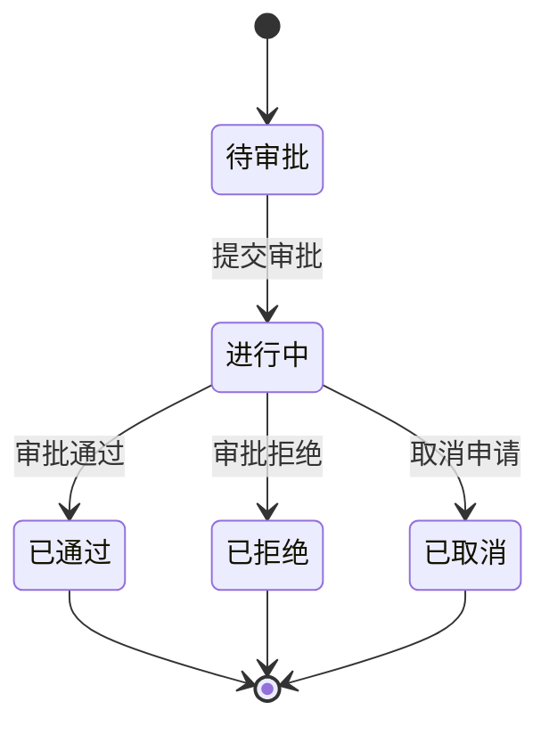
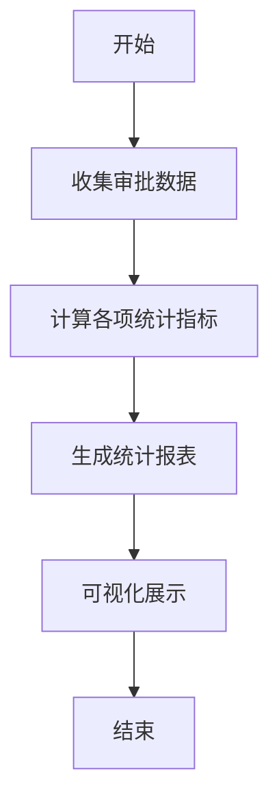
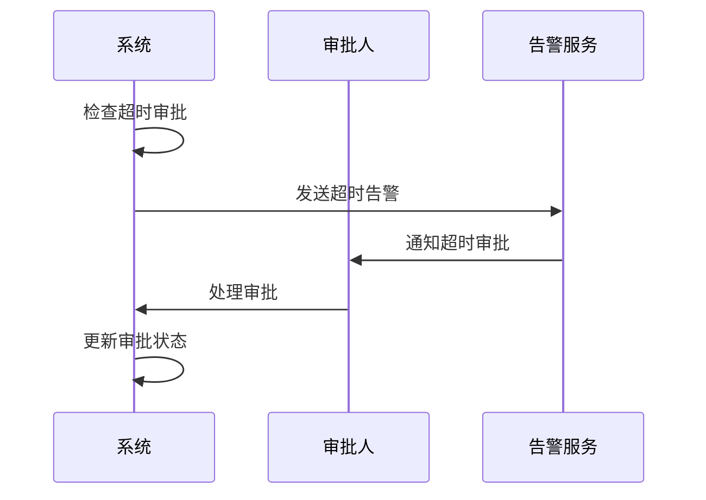
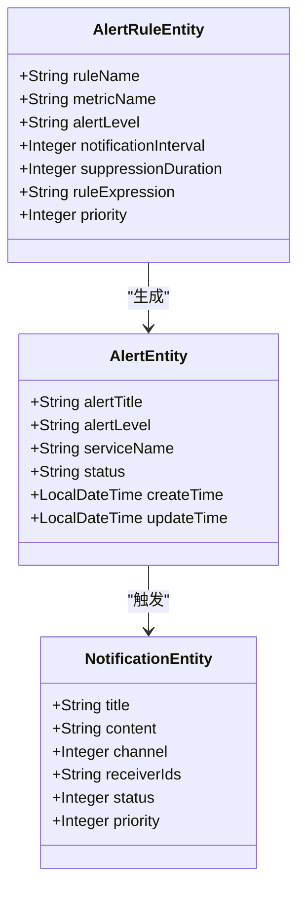

# 审批监控

<cite>
**本文档引用文件**   
- [visitor-module-architecture.md](file://documentation/03-业务模块/访客/visitor-module-architecture.md)
- [12-前端API接口设计.md](file://documentation/03-业务模块/访客/12-前端API接口设计.md)
- [ApprovalProcessDao.java](file://microservices/ioedream-access-service/src/main/java/net/lab1024/sa/access/dao/ApprovalProcessDao.java)
- [t_audit_log.sql](file://database-scripts/common-service/10-t_audit_log.sql)
- [t_alert.sql](file://database-scripts/common-service/11-t_alert.sql)
- [t_alert_rule.sql](file://database-scripts/common-service/12-t_alert_rule.sql)
- [visitor-module-architecture.md](file://documentation/03-业务模块/各业务模块文档/访客/visitor-module-architecture.md)
</cite>

## 目录
1. [引言](#引言)
2. [审批历史记录查询](#审批历史记录查询)
3. [审批流程状态跟踪](#审批流程状态跟踪)
4. [审批效率统计功能](#审批效率统计功能)
5. [审批流程异常监控机制](#审批流程异常监控机制)
6. [结论](#结论)

## 引言
本文档详细说明了访客审批流程的监控机制，包括审批历史记录查询、审批流程状态跟踪、审批效率统计以及异常监控等方面。系统通过完善的数据库设计和监控告警机制，实现了对审批流程全生命周期的可视化管理和实时监控。

## 审批历史记录查询

系统提供了完整的审批历史记录查询功能，用户可以通过多种条件组合查询历史审批记录。审批历史数据存储在`access_approval_process`表中，包含流程ID、状态、创建时间、更新时间等关键信息。

查询功能支持按以下维度进行筛选：
- 审批状态（待审批、进行中、已通过、已拒绝等）
- 时间范围（创建时间、更新时间）
- 审批类型
- 相关人员（申请人、审批人）

通过`ApprovalProcessDao`中的`selectTimeoutProcesses`和`selectExpiringSoon`方法，系统能够高效地查询超时和即将过期的审批流程，为管理人员提供决策支持。

**Section sources**
- [visitor-module-architecture.md](file://documentation/03-业务模块/访客/visitor-module-architecture.md#L1-L800)
- [ApprovalProcessDao.java](file://microservices/ioedream-access-service/src/main/java/net/lab1024/sa/access/dao/ApprovalProcessDao.java#L170-L201)

## 审批流程状态跟踪

系统实现了对审批流程全生命周期的状态跟踪，审批状态包括：待审批、进行中、已通过、已拒绝、已取消等。状态跟踪机制通过以下方式实现：

**Diagram sources**
- [visitor-module-architecture.md](file://documentation/03-业务模块/访客/visitor-module-architecture.md#L1-L800)

审批状态的变更会触发相应的业务逻辑和通知机制。系统通过`countByStatusGroup`方法统计各状态的流程数量，为管理人员提供审批流程的整体概览。

**Section sources**
- [12-前端API接口设计.md](file://documentation/03-业务模块/访客/12-前端API接口设计.md#L197-L198)
- [ApprovalProcessDao.java](file://microservices/ioedream-access-service/src/main/java/net/lab1024/sa/access/dao/ApprovalProcessDao.java#L183-L184)

## 审批效率统计功能

系统提供了丰富的审批效率统计功能，帮助管理人员评估审批流程的执行效率。主要统计指标包括：

| 统计指标 | 说明 | 数据来源 |
|---------|------|---------|
| 平均审批时长 | 从提交到完成的平均时间 | 审批流程开始和结束时间差值 |
| 超时审批统计 | 超过规定时限未处理的审批数量 | `selectTimeoutProcesses`查询结果 |
| 审批通过率 | 已通过审批占总审批的比例 | 状态统计 |
| 审批人工作效率 | 各审批人的平均处理时间 | 审批记录分析 |

**Diagram sources**
- [visitor-module-architecture.md](file://documentation/03-业务模块/访客/visitor-module-architecture.md#L1-L800)

系统通过定期执行统计任务，生成审批效率报告，帮助管理人员识别审批瓶颈，优化审批流程。

**Section sources**
- [ApprovalProcessDao.java](file://microservices/ioedream-access-service/src/main/java/net/lab1024/sa/access/dao/ApprovalProcessDao.java#L183-L184)
- [t_audit_log.sql](file://database-scripts/common-service/10-t_audit_log.sql#L1-L39)

## 审批流程异常监控机制

系统建立了完善的审批流程异常监控机制，能够及时发现并处理各种异常情况。主要监控场景包括：

### 超时未处理监控
系统通过定时任务检查是否存在超时未处理的审批流程。当审批步骤的处理时间超过预设时限时，系统会自动标记为超时状态，并触发告警。

**Diagram sources**
- [ApprovalProcessDao.java](file://microservices/ioedream-access-service/src/main/java/net/lab1024/sa/access/dao/ApprovalProcessDao.java#L170-L176)
- [t_alert.sql](file://database-scripts/common-service/11-t_alert.sql#L1-L35)

### 审批人离职情况处理
当审批人离职或岗位变动时，系统会自动检测到相关人员的状态变化，并将待处理的审批流程重新分配给指定的替代审批人或上级主管。

### 告警规则配置
系统支持灵活的告警规则配置，管理员可以根据业务需求设置不同的告警阈值和通知方式。告警规则存储在`t_alert_rule`表中，包含告警级别、通知频率、抑制时间等配置项。

**Diagram sources**
- [t_alert_rule.sql](file://database-scripts/common-service/12-t_alert_rule.sql#L1-L39)
- [t_alert.sql](file://database-scripts/common-service/11-t_alert.sql#L1-L35)

**Section sources**
- [t_alert_rule.sql](file://database-scripts/common-service/12-t_alert_rule.sql#L1-L39)
- [t_alert.sql](file://database-scripts/common-service/11-t_alert.sql#L1-L35)
- [ApprovalProcessDao.java](file://microservices/ioedream-access-service/src/main/java/net/lab1024/sa/access/dao/ApprovalProcessDao.java#L170-L176)

## 结论
本文档详细介绍了访客审批流程的监控机制，包括审批历史记录查询、状态跟踪、效率统计和异常监控等方面。系统通过完善的数据库设计和监控告警机制，实现了对审批流程全生命周期的可视化管理和实时监控。建议定期审查审批效率统计报告，优化审批流程，提高审批效率。