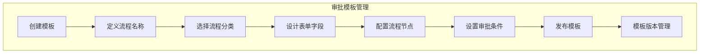
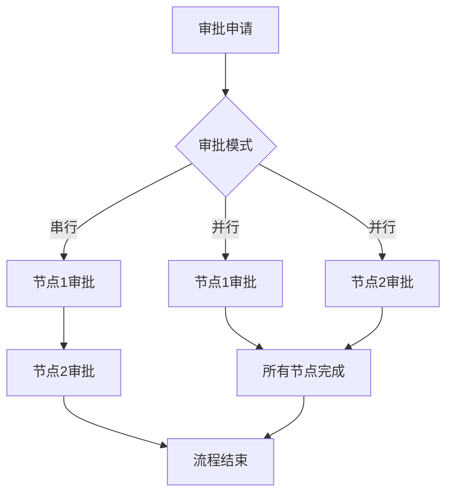
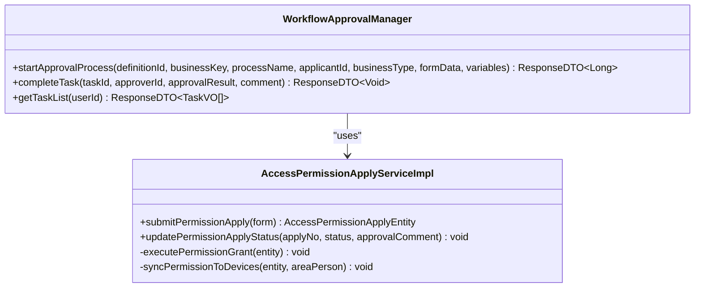
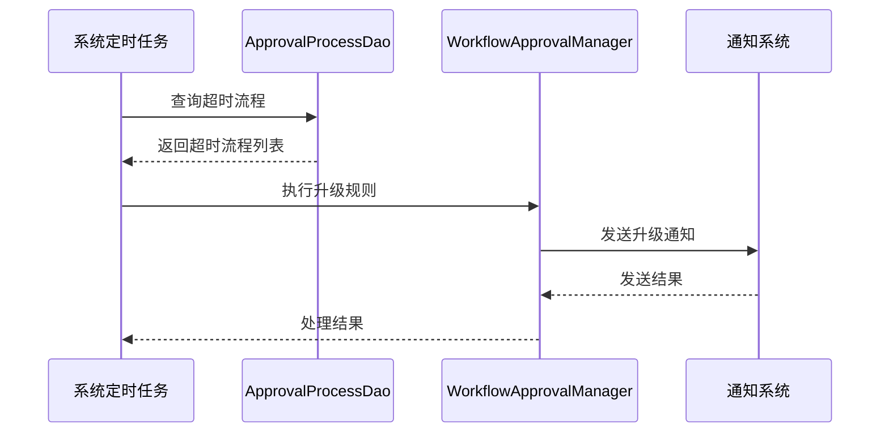
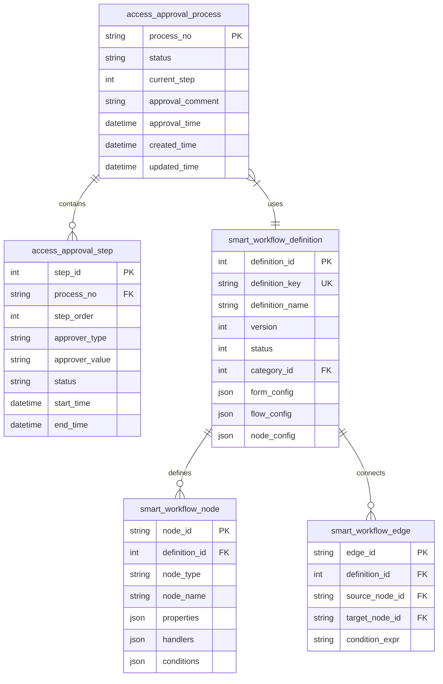

# 审批配置

<cite>
**本文档引用文件**   
- [spec.md](file://openspec\changes\archive\completed-proposals\implement-access-control-missing-functions\specs\approval-workflow-management\spec.md)
- [visitor-module-architecture.md](file://documentation\03-业务模块\访客\visitor-module-architecture.md)
- [visitor-api-contract.md](file://documentation\api\visitor\visitor-api-contract.md)
- [AccessPermissionApplyServiceImpl.java](file://microservices\ioedream-access-service\src\main\java\net\lab1024\sa\access\service\impl\AccessPermissionApplyServiceImpl.java)
- [AccessPermissionApplyEntity.java](file://microservices\ioedream-access-service\src\main\java\net\lab1024\sa\access\domain\entity\AccessPermissionApplyEntity.java)
- [ApprovalProcessDao.java](file://microservices\ioedream-access-service\src\main\java\net\lab1024\sa\access\dao\ApprovalProcessDao.java)
- [smart-workflow.md](file://documentation\technical\smart-workflow.md)
- [异常管理.md](file://documentation\03-业务模块\考勤\异常管理.md)
</cite>

## 目录
1. [引言](#引言)
2. [审批模板管理](#审批模板管理)
3. [条件路由配置](#条件路由配置)
4. [审批模式配置](#审批模式配置)
5. [审批人选择策略](#审批人选择策略)
6. [审批超时与自动处理](#审批超时与自动处理)
7. [系统集成与数据模型](#系统集成与数据模型)

## 引言

访客审批流程配置是门禁管理系统中的核心功能模块，旨在实现对访客访问权限申请的规范化、自动化管理。本系统通过集成工作流引擎，支持创建和管理复杂的审批流程，确保访问控制的安全性和合规性。审批流程不仅适用于访客预约，还涵盖门禁权限申请、紧急权限处理等多种场景。

系统采用四层架构设计，包括控制器层（Controller）、服务层（Service）、管理层（Manager）和数据访问层（DAO），严格遵循企业级微服务规范。通过API网关统一入口，实现了高可用、可扩展的分布式架构。审批流程与身份认证、通知系统、监控系统深度集成，提供了完整的端到端解决方案。

**Section sources**
- [spec.md](file://openspec\changes\archive\completed-proposals\implement-access-control-missing-functions\specs\approval-workflow-management\spec.md#L1-L233)
- [visitor-module-architecture.md](file://documentation\03-业务模块\访客\visitor-module-architecture.md#L1-L800)

## 审批模板管理

### 创建和管理审批模板

审批模板是审批流程的基础，系统支持创建单级和多级审批模板。模板配置通过可视化流程设计器实现，管理员可以拖拽式设计流程节点和连线，定义完整的审批路径。

单级审批模板适用于简单场景，如普通访客预约，只需一个审批节点即可完成。多级审批模板则适用于复杂场景，如高管访问或敏感区域访问，需要多个审批节点按顺序或并行处理。

审批模板的创建和管理主要通过`smart_workflow_definition`表实现，该表存储了流程定义的关键信息，包括流程名称、描述、版本、状态、分类、表单配置、流程配置和节点配置等。每个流程定义都有唯一的`definition_key`作为标识。



**Diagram sources **
- [smart-workflow.md](file://documentation\technical\smart-workflow.md#L3798-L3925)

**Section sources**
- [spec.md](file://openspec\changes\archive\completed-proposals\implement-access-control-missing-functions\specs\approval-workflow-management\spec.md#L107-L137)
- [smart-workflow.md](file://documentation\technical\smart-workflow.md#L3798-L3925)

## 条件路由配置

### 基于访客类型和访问区域的自动路由

条件路由是审批流程的核心功能之一，系统可以根据访客类型、访问区域、申请时间等多种条件自动选择审批路径。这种智能化的路由机制大大提高了审批效率，确保了不同场景下的审批策略能够精准执行。

在系统实现中，条件路由通过`approval_workflow` JSON配置结构中的`conditions`字段定义。例如，可以设置当访客类型为"高管"且访问区域为"数据中心"时，自动触发三级审批流程；而普通访客访问办公区则只需一级审批。

```json
{
  "workflow_name": "访客审批流程",
  "approval_levels": [
    {
      "level": 1,
      "approver_type": "host_user",
      "approver_role": "被访人",
      "required": true,
      "time_limit_hours": 24,
      "conditions": {
        "visitor_type": "普通访客",
        "visit_area": ["办公区", "会议室"]
      }
    },
    {
      "level": 2,
      "approver_type": "security_manager",
      "approver_role": "安保经理",
      "required": true,
      "time_limit_hours": 48,
      "conditions": {
        "visitor_type": "高管",
        "visit_area": ["数据中心", "研发区"]
      }
    }
  ]
}
```

系统通过`WorkflowApprovalManager`组件解析这些条件，并在审批流程启动时动态选择合适的审批路径。这种基于规则的路由机制不仅灵活，而且易于维护和扩展。

**Section sources**
- [异常管理.md](file://documentation\03-业务模块\考勤\异常管理.md#L271-L332)
- [spec.md](file://openspec\changes\archive\completed-proposals\implement-access-control-missing-functions\specs\approval-workflow-management\spec.md#L31-L41)

## 审批模式配置

### 串行与并行审批的配置差异

系统支持多种审批模式，包括串行审批、并行审批、会签和或签，以满足不同业务场景的需求。

**串行审批**：审批节点按顺序执行，前一个节点审批通过后，流程才会流转到下一个节点。这种模式适用于需要逐级审批的场景，如部门审批→主管审批→HR备案。在配置上，通过设置节点的`sequential`属性为`true`来实现。

**并行审批**：多个审批节点同时执行，所有节点都完成后流程才会继续。这种模式适用于需要多方同时确认的场景，如项目评审。在配置上，通过设置节点的`multiInstance`属性为`true`来实现。

**会签审批**：所有审批人都必须同意，审批才能通过。这在`node_config`中通过设置`assigneeType`为`role`并指定角色来实现，确保该角色下的所有成员都需要审批。

**或签审批**：任意一个审批人同意即可通过。这在`node_config`中通过设置`assigneeType`为`user`并指定多个用户来实现，系统会自动选择第一个响应的审批人。



**Diagram sources **
- [smart-workflow.md](file://documentation\technical\smart-workflow.md#L3862-L3879)

**Section sources**
- [spec.md](file://openspec\changes\archive\completed-proposals\implement-access-control-missing-functions\specs\approval-workflow-management\spec.md#L37-L39)
- [06-审批流程管理模块流程图.md](file://documentation\03-业务模块\门禁\06-审批流程管理模块流程图.md#L154-L158)

## 审批人选择策略

### 指定人员、角色和部门的选择方式

审批人选择策略决定了审批流程中每个节点的审批人如何确定。系统支持多种选择方式，包括指定具体人员、角色、部门等。

**指定人员**：直接指定某个用户作为审批人，适用于固定审批人的场景。在配置中通过`assigneeValue`指定用户ID实现。

**角色选择**：根据用户角色确定审批人，如"部门经理"、"HR专员"等。这种方式更加灵活，当人员变动时无需修改流程配置。在`node_config`中通过设置`assigneeType`为`role`并指定角色编码来实现。

**部门选择**：根据用户所属部门确定审批人，适用于按部门层级审批的场景。系统会自动查找该部门的负责人作为审批人。

在代码实现中，`AccessPermissionApplyServiceImpl`类通过`WorkflowApprovalManager`组件启动审批流程时，会根据申请类型选择不同的流程定义ID。例如，紧急权限申请使用`ACCESS_EMERGENCY_PERMISSION`流程定义，而普通权限申请使用`ACCESS_PERMISSION_APPLY`流程定义。



**Diagram sources **
- [AccessPermissionApplyServiceImpl.java](file://microservices\ioedream-access-service\src\main\java\net\lab1024\sa\access\service\impl\AccessPermissionApplyServiceImpl.java#L1-L404)

**Section sources**
- [AccessPermissionApplyServiceImpl.java](file://microservices\ioedream-access-service\src\main\java\net\lab1024\sa\access\service\impl\AccessPermissionApplyServiceImpl.java#L1-L404)
- [smart-workflow.md](file://documentation\technical\smart-workflow.md#L3862-L3879)

## 审批超时与自动处理

### 超时设置和自动处理规则

审批超时设置是确保审批流程高效运行的重要机制。系统允许为每个审批节点配置超时时间，当审批人在规定时间内未处理时，系统会自动执行预设的处理规则。

在`flow_config`中，可以设置`timeout`属性来定义超时规则。例如，可以设置审批节点的超时时间为24小时，系统会在超时前2小时发送提醒通知。超时后的处理规则包括自动升级到下一级审批、通知备用审批人或自动拒绝申请等。

```json
{
  "flow_config": {
    "timeout": {
      "enabled": true,
      "hours": 48
    },
    "reminder": {
      "enabled": true,
      "beforeHours": 2
    }
  },
  "escalation_rules": [
    {
      "condition": "approval_timeout",
      "action": "escalate_to_next_level",
      "timeout_hours": 24
    }
  ]
}
```

在数据库层面，`ApprovalProcessDao`提供了查询超时流程的方法`selectTimeoutProcesses`，系统可以通过定时任务定期检查并处理超时的审批流程。当发现超时流程时，会根据配置的升级规则自动执行相应的操作。



**Diagram sources **
- [ApprovalProcessDao.java](file://microservices\ioedream-access-service\src\main\java\net\lab1024\sa\access\dao\ApprovalProcessDao.java#L1-L150)
- [smart-workflow.md](file://documentation\technical\smart-workflow.md#L3881-L3899)

**Section sources**
- [ApprovalProcessDao.java](file://microservices\ioedream-access-service\src\main\java\net\lab1024\sa\access\dao\ApprovalProcessDao.java#L1-L150)
- [异常管理.md](file://documentation\03-业务模块\考勤\异常管理.md#L271-L332)

## 系统集成与数据模型

### 数据库表结构与系统集成

访客审批流程与多个系统深度集成，包括身份认证系统、通知系统和监控系统，形成了完整的生态系统。

**与身份认证系统集成**：通过`gatewayServiceClient`调用公共服务获取用户和区域信息，确保审批流程中使用的数据准确可靠。审批人和申请人的身份信息从统一身份认证系统同步。

**与通知系统集成**：审批过程中的关键事件（如申请提交、审批通过、超时提醒等）都会通过邮件、短信、App推送等方式通知相关人员。通知模板和渠道在`notification_rules`中配置。

**与监控系统集成**：所有审批操作都会记录审计日志，支持审批行为审计和异常告警。系统性能指标（如审批响应时间、并发处理能力）被实时监控。

在数据模型方面，核心表包括：
- `access_approval_process`：审批流程主表，记录流程状态、当前步骤、审批意见等
- `access_approval_step`：审批步骤表，记录每个审批节点的状态和处理人
- `smart_workflow_definition`：流程定义表，存储审批模板的配置
- `smart_workflow_node`：流程节点表，定义每个节点的属性和行为
- `smart_workflow_edge`：流程连线表，定义节点间的流转关系



**Diagram sources **
- [smart-workflow.md](file://documentation\technical\smart-workflow.md#L3798-L3925)
- [visitor-module-architecture.md](file://documentation\03-业务模块\访客\visitor-module-architecture.md#L249-L767)

**Section sources**
- [smart-workflow.md](file://documentation\technical\smart-workflow.md#L3798-L3925)
- [spec.md](file://openspec\changes\archive\completed-proposals\implement-access-control-missing-functions\specs\approval-workflow-management\spec.md#L177-L195)
- [visitor-module-architecture.md](file://documentation\03-业务模块\访客\visitor-module-architecture.md#L249-L767)