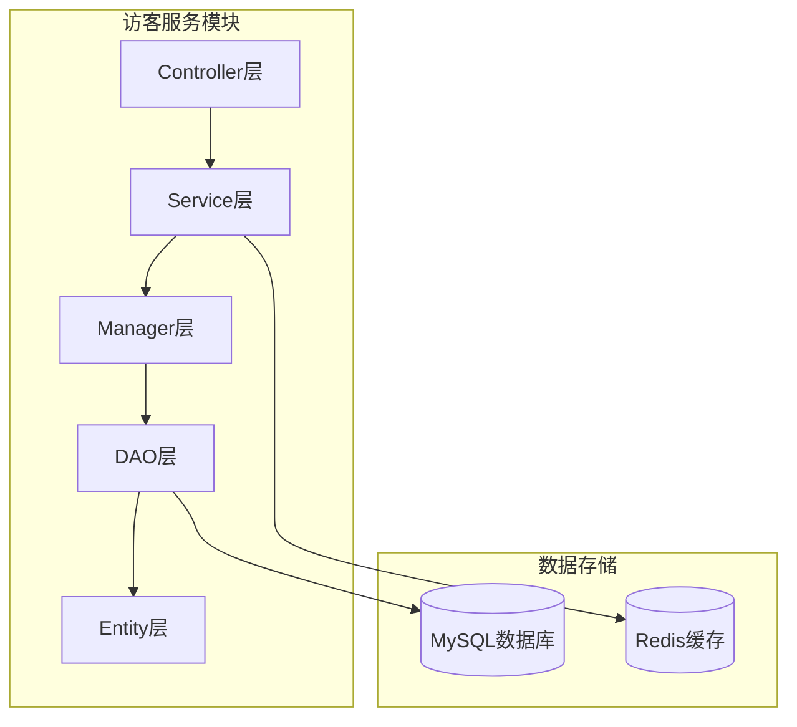
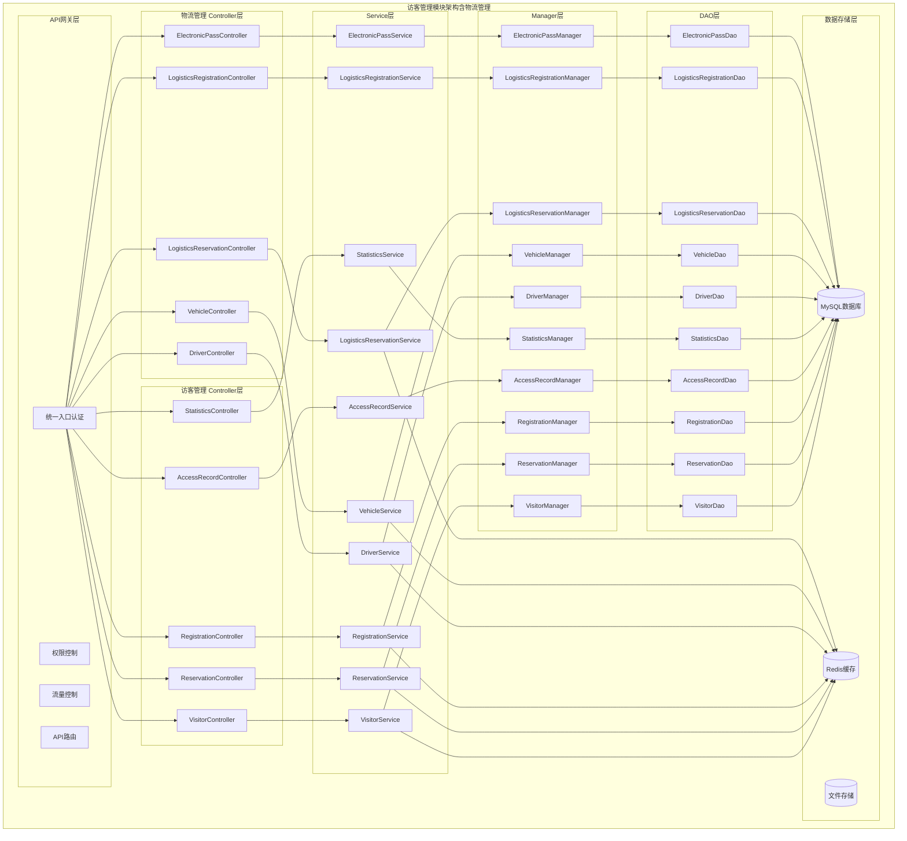
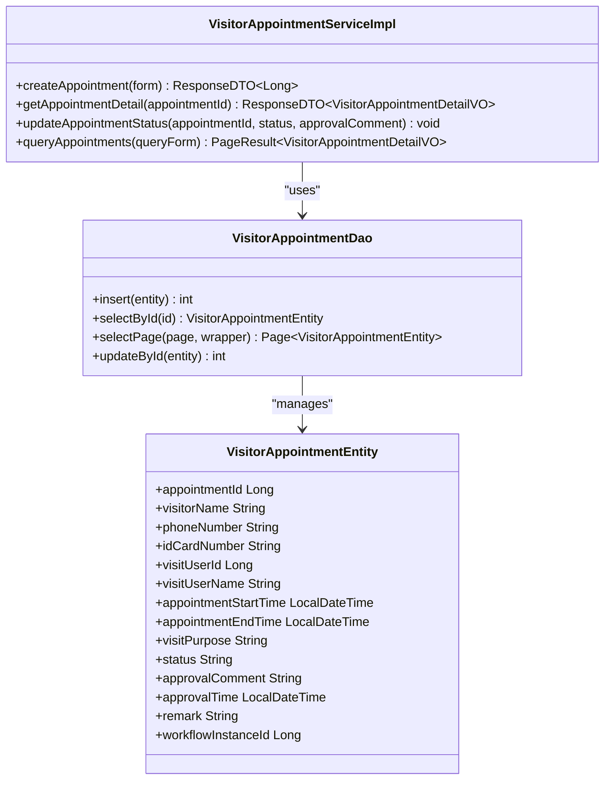
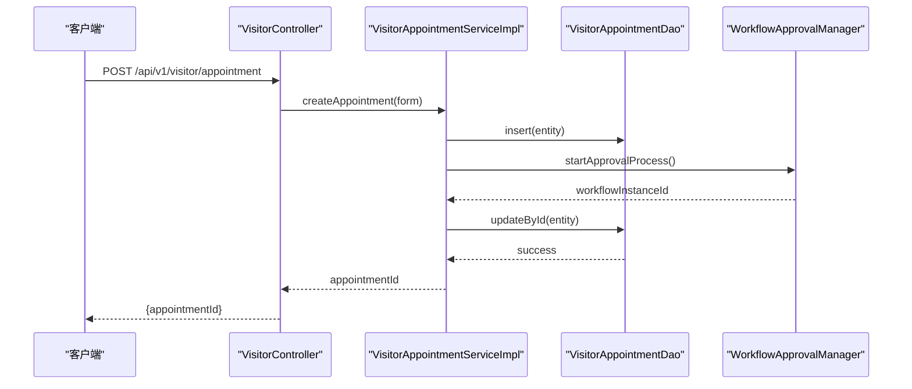
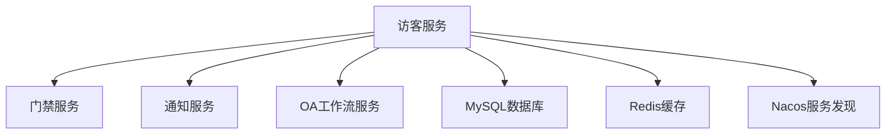

# 数据加载

<cite>
**本文档引用文件**   
- [VisitorAppointmentServiceImpl.java](file://microservices\ioedream-visitor-service\src\main\java\net\lab1024\sa\visitor\service\impl\VisitorAppointmentServiceImpl.java)
- [visitor_index_optimization.sql](file://microservices\ioedream-visitor-service\src\main\resources\sql\visitor_index_optimization.sql)
- [logistics-tables.sql](file://database-scripts\visitor\logistics-tables.sql)
- [visitor-module-architecture.md](file://documentation\03-业务模块\各业务模块文档\访客\visitor-module-architecture.md)
- [database_dictionary.md](file://documentation\03-业务模块\访客\database_dictionary.md)
</cite>

## 目录
1. [引言](#引言)
2. [项目结构](#项目结构)
3. [核心组件](#核心组件)
4. [架构概述](#架构概述)
5. [详细组件分析](#详细组件分析)
6. [依赖分析](#依赖分析)
7. [性能考虑](#性能考虑)
8. [故障排除指南](#故障排除指南)
9. [结论](#结论)
10. [附录](#附录) (如有必要)

## 引言
本文档详细说明了IoE-DREAM项目中访客系统数据加载模块的实现策略。文档重点阐述了批量数据加载的实现机制，包括事务管理、冲突解决和错误处理策略。通过批处理技术提高插入性能，并使用UPSERT操作处理数据冲突。同时，文档描述了数据一致性保障措施，包括分布式锁和幂等性设计，并提供了性能监控指标和调优建议。

## 项目结构
访客系统数据加载模块主要位于`ioedream-visitor-service`微服务中，其核心实现分布在service、dao和entity包中。数据库脚本位于`database-scripts/visitor`目录下，而性能优化相关的SQL脚本则位于`microservices/ioedream-visitor-service/src/main/resources/sql`目录中。

**图表来源**
- [VisitorAppointmentServiceImpl.java](file://microservices\ioedream-visitor-service\src\main\java\net\lab1024\sa\visitor\service\impl\VisitorAppointmentServiceImpl.java)
- [logistics-tables.sql](file://database-scripts\visitor\logistics-tables.sql)

**章节来源**
- [VisitorAppointmentServiceImpl.java](file://microservices\ioedream-visitor-service\src\main\java\net\lab1024\sa\visitor\service\impl\VisitorAppointmentServiceImpl.java)
- [visitor_index_optimization.sql](file://microservices\ioedream-visitor-service\src\main\resources\sql\visitor_index_optimization.sql)

## 核心组件
访客系统数据加载模块的核心组件包括`VisitorAppointmentService`接口及其`VisitorAppointmentServiceImpl`实现类，负责处理访客预约相关的业务逻辑。`VisitorAppointmentDao`接口继承自MyBatis-Plus的`BaseMapper`，提供对`visitor_appointment`表的数据库操作。`VisitorAppointmentEntity`实体类映射数据库表结构，包含访客预约的所有必要字段。

**章节来源**
- [VisitorAppointmentServiceImpl.java](file://microservices\ioedream-visitor-service\src\main\java\net\lab1024\sa\visitor\service\impl\VisitorAppointmentServiceImpl.java)
- [VisitorAppointmentDao.java](file://microservices\ioedream-visitor-service\src\main\java\net\lab1024\sa\visitor\dao\VisitorAppointmentDao.java)
- [VisitorAppointmentEntity.java](file://microservices\ioedream-visitor-service\src\main\java\net\lab1024\sa\visitor\domain\entity\VisitorAppointmentEntity.java)

## 架构概述
访客系统遵循典型的四层架构模式：Controller层处理HTTP请求，Service层实现业务逻辑，Manager层协调多个DAO操作，DAO层负责数据访问。该架构通过API网关进行统一入口认证、权限控制和流量控制，确保系统的安全性和稳定性。

**图表来源**
- [visitor-module-architecture.md](file://documentation\03-业务模块\各业务模块文档\访客\visitor-module-architecture.md)

## 详细组件分析

### 访客预约服务分析
`VisitorAppointmentServiceImpl`类实现了访客预约的核心业务逻辑，包括创建预约、查询预约详情、更新预约状态等功能。该服务通过`@Transactional`注解确保数据操作的原子性，并使用`WorkflowApprovalManager`启动审批流程。

#### 对象导向组件：

**图表来源**
- [VisitorAppointmentServiceImpl.java](file://microservices\ioedream-visitor-service\src\main\java\net\lab1024\sa\visitor\service\impl\VisitorAppointmentServiceImpl.java)
- [VisitorAppointmentDao.java](file://microservices\ioedream-visitor-service\src\main\java\net\lab1024\sa\visitor\dao\VisitorAppointmentDao.java)
- [VisitorAppointmentEntity.java](file://microservices\ioedream-visitor-service\src\main\java\net\lab1024\sa\visitor\domain\entity\VisitorAppointmentEntity.java)

#### API/服务组件：

**图表来源**
- [VisitorAppointmentServiceImpl.java](file://microservices\ioedream-visitor-service\src\main\java\net\lab1024\sa\visitor\service\impl\VisitorAppointmentServiceImpl.java)
- [VisitorController.java](file://microservices\ioedream-visitor-service\src\main\java\net\lab1024\sa\visitor\controller\VisitorController.java)

**章节来源**
- [VisitorAppointmentServiceImpl.java](file://microservices\ioedream-visitor-service\src\main\java\net\lab1024\sa\visitor\service\impl\VisitorAppointmentServiceImpl.java)
- [VisitorAppointmentDao.java](file://microservices\ioedream-visitor-service\src\main\java\net\lab1024\sa\visitor\dao\VisitorAppointmentDao.java)

## 依赖分析
访客系统数据加载模块依赖于多个外部服务和组件。它通过`GatewayServiceClient`与门禁服务和通知服务进行通信，使用`WorkflowApprovalManager`与OA工作流模块集成，并依赖MyBatis-Plus进行数据库操作。此外，系统还使用Redis作为缓存层，提高数据访问性能。

**图表来源**
- [VisitorAppointmentServiceImpl.java](file://microservices\ioedream-visitor-service\src\main\java\net\lab1024\sa\visitor\service\impl\VisitorAppointmentServiceImpl.java)
- [GatewayServiceClientConfiguration.java](file://microservices\ioedream-visitor-service\src\main\java\net\lab1024\sa\visitor\config\GatewayServiceClientConfiguration.java)

**章节来源**
- [VisitorAppointmentServiceImpl.java](file://microservices\ioedream-visitor-service\src\main\java\net\lab1024\sa\visitor\service\impl\VisitorAppointmentServiceImpl.java)
- [pom.xml](file://microservices\ioedream-visitor-service\pom.xml)

## 性能考虑
为提高数据加载性能，系统采用了多种优化策略。首先，通过批量插入和UPSERT操作减少数据库交互次数。其次，合理设计数据库索引，如在`t_visitor_record`表上创建`idx_visitor_record_visitor_time`组合索引，优化访客访问历史查询。此外，使用Redis缓存频繁访问的数据，减少数据库压力。

**章节来源**
- [visitor_index_optimization.sql](file://microservices\ioedream-visitor-service\src\main\resources\sql\visitor_index_optimization.sql)
- [VisitorAppointmentServiceImpl.java](file://microservices\ioedream-visitor-service\src\main\java\net\lab1024\sa\visitor\service\impl\VisitorAppointmentServiceImpl.java)

## 故障排除指南
当数据加载出现问题时，应首先检查日志文件，特别是`VisitorAppointmentServiceImpl`中的日志输出。常见的问题包括数据库连接失败、事务回滚、审批流程启动失败等。对于性能问题，应检查慢查询日志，分析索引使用情况，并监控Redis缓存命中率。

**章节来源**
- [VisitorAppointmentServiceImpl.java](file://microservices\ioedream-visitor-service\src\main\java\net\lab1024\sa\visitor\service\impl\VisitorAppointmentServiceImpl.java)
- [logistics-tables.sql](file://database-scripts\visitor\logistics-tables.sql)

## 结论
本文档详细介绍了IoE-DREAM项目中访客系统数据加载模块的设计与实现。通过合理的架构设计、事务管理、冲突解决和性能优化策略，确保了系统的高效性和稳定性。未来的工作将集中在进一步优化批量处理性能和增强系统的可扩展性上。