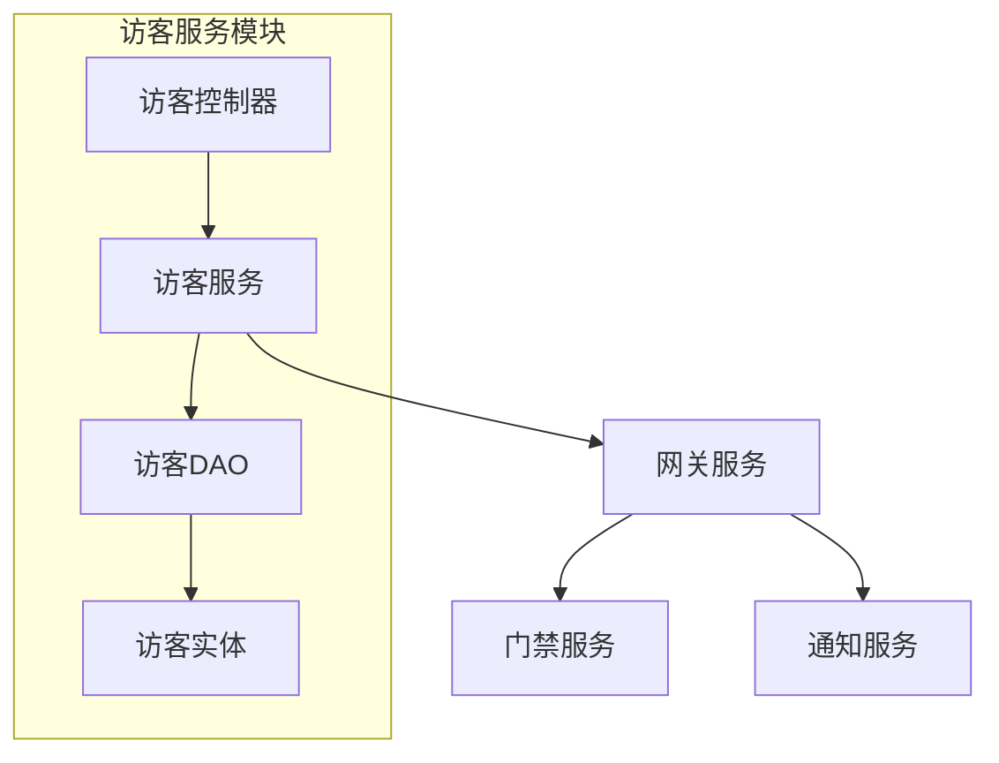
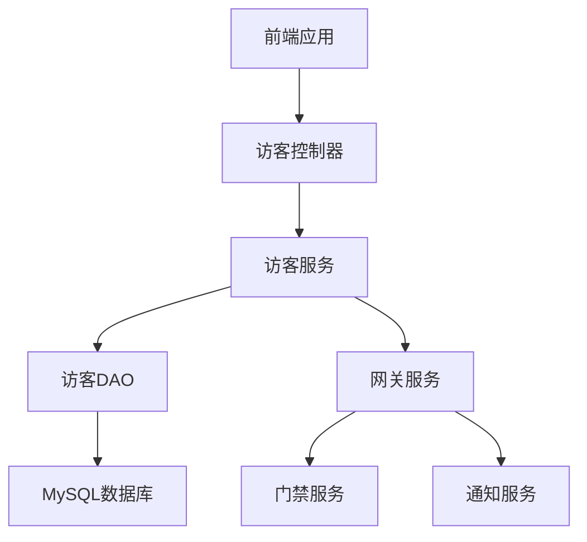
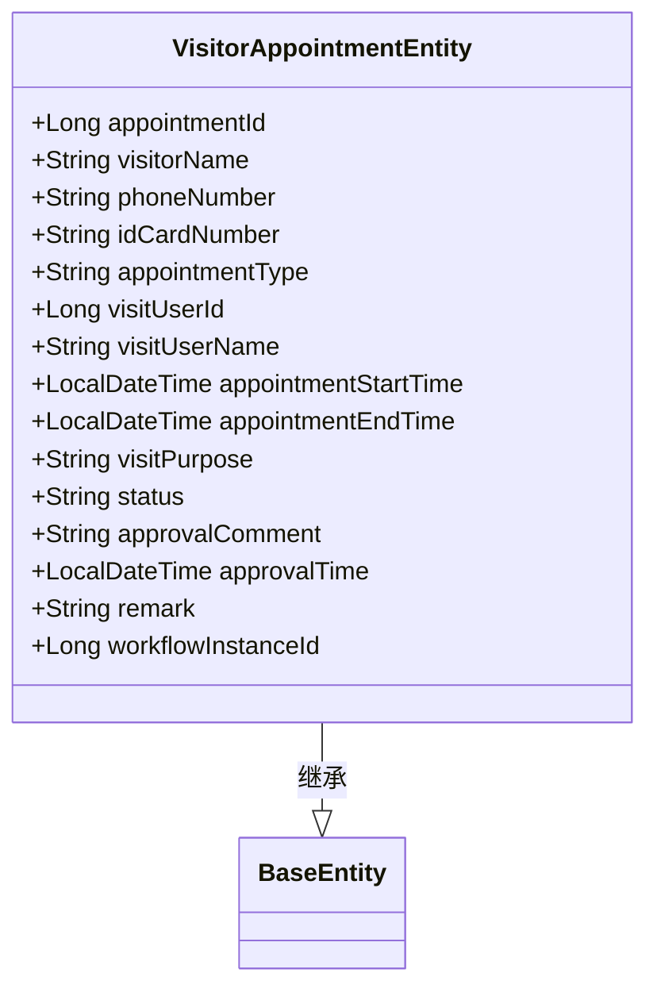
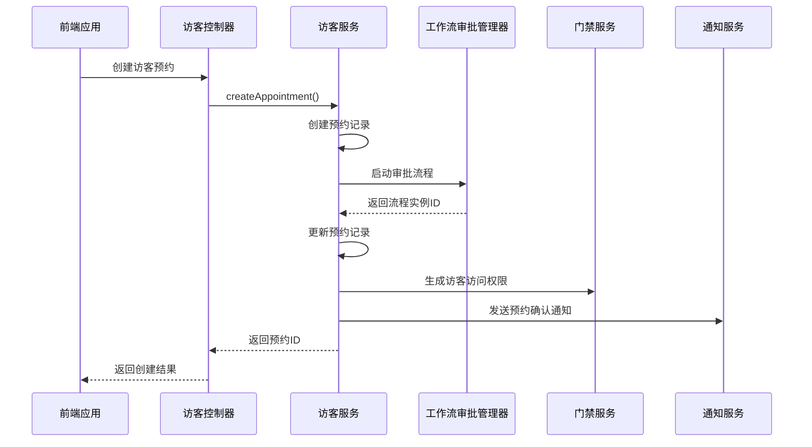
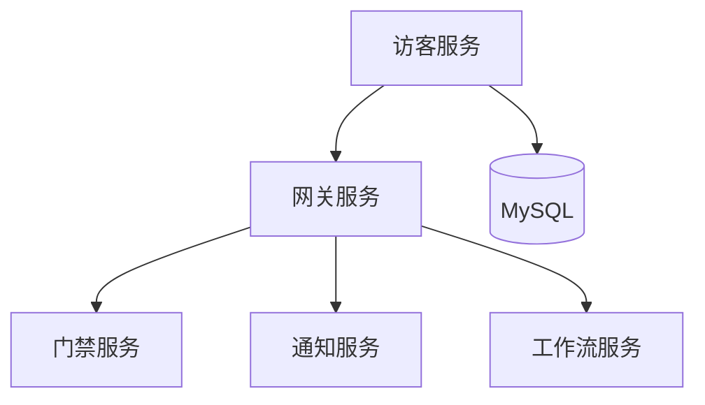
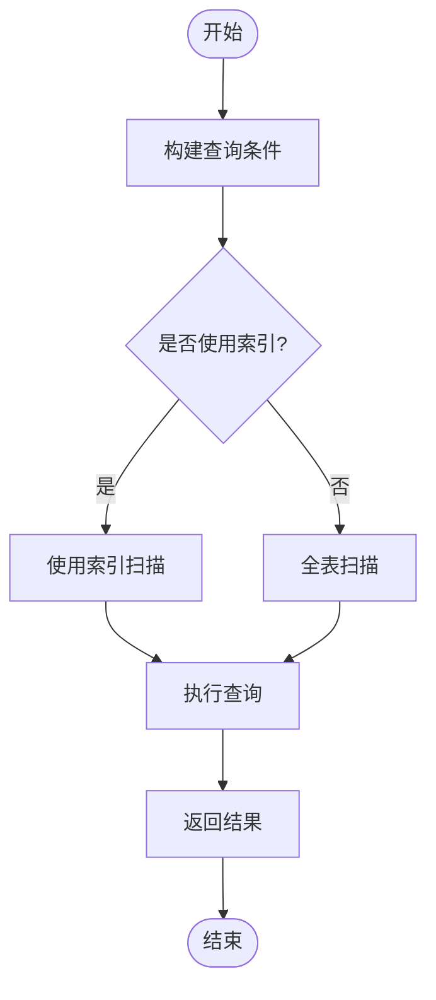

# 数据同步引擎

<cite>
**本文档引用文件**  
- [VisitorAppointmentEntity.java](file://microservices\ioedream-visitor-service\src\main\java\net\lab1024\sa\visitor\domain\entity\VisitorAppointmentEntity.java#L1-L124)
- [VisitorAppointmentServiceImpl.java](file://microservices\ioedream-visitor-service\src\main\java\net\lab1024\sa\visitor\service\impl\VisitorAppointmentServiceImpl.java#L1-L529)
- [VisitorController.java](file://microservices\ioedream-visitor-service\src\main\java\net\lab1024\sa\visitor\controller\VisitorController.java#L1-L192)
- [visitor_index_optimization.sql](file://microservices\ioedream-visitor-service\src\main\resources\sql\visitor_index_optimization.sql#L1-L69)
- [logistics-tables.sql](file://database-scripts\visitor\logistics-tables.sql#L1-L95)
- [application.yml](file://microservices\ioedream-visitor-service\src\main\resources\application.yml#L1-L83)
</cite>

## 目录
1. [引言](#引言)
2. [项目结构](#项目结构)
3. [核心组件](#核心组件)
4. [架构概述](#架构概述)
5. [详细组件分析](#详细组件分析)
6. [依赖分析](#依赖分析)
7. [性能考虑](#性能考虑)
8. [故障排除指南](#故障排除指南)
9. [结论](#结论)

## 引言
本文档旨在深入解析访客系统数据同步引擎的实现机制。该引擎负责处理访客预约数据的提取、转换和加载，确保访客信息在审批通过后能及时同步到门禁系统和通知系统。文档将详细说明高性能数据提取、智能数据转换和批量数据加载的实现策略。

## 项目结构
访客服务模块采用标准的微服务架构，包含控制器、服务、数据访问对象（DAO）和实体类等核心组件。该模块通过Spring Cloud Gateway与系统其他服务进行通信，并使用Nacos进行服务发现和配置管理。



**图表来源**  
- [VisitorController.java](file://microservices\ioedream-visitor-service\src\main\java\net\lab1024\sa\visitor\controller\VisitorController.java#L1-L192)
- [VisitorAppointmentServiceImpl.java](file://microservices\ioedream-visitor-service\src\main\java\net\lab1024\sa\visitor\service\impl\VisitorAppointmentServiceImpl.java#L1-L529)

**章节来源**
- [VisitorController.java](file://microservices\ioedream-visitor-service\src\main\java\net\lab1024\sa\visitor\controller\VisitorController.java#L1-L192)
- [VisitorAppointmentServiceImpl.java](file://microservices\ioedream-visitor-service\src\main\java\net\lab1024\sa\visitor\service\impl\VisitorAppointmentServiceImpl.java#L1-L529)

## 核心组件
访客系统的核心组件包括访客预约实体、访客预约服务实现类和访客控制器。这些组件协同工作，实现访客预约的创建、查询和状态更新功能。当预约审批通过后，系统会自动触发数据同步流程，将访客信息同步到门禁系统和通知系统。

**章节来源**
- [VisitorAppointmentEntity.java](file://microservices\ioedream-visitor-service\src\main\java\net\lab1024\sa\visitor\domain\entity\VisitorAppointmentEntity.java#L1-L124)
- [VisitorAppointmentServiceImpl.java](file://microservices\ioedream-visitor-service\src\main\java\net\lab1024\sa\visitor\service\impl\VisitorAppointmentServiceImpl.java#L1-L529)

## 架构概述
访客系统采用分层架构设计，包括表现层、业务逻辑层、数据访问层和数据存储层。系统通过RESTful API提供服务，使用MyBatis-Plus作为ORM框架，与MySQL数据库进行交互。数据同步主要通过网关服务调用其他微服务的API来实现。



**图表来源**  
- [VisitorController.java](file://microservices\ioedream-visitor-service\src\main\java\net\lab1024\sa\visitor\controller\VisitorController.java#L1-L192)
- [VisitorAppointmentServiceImpl.java](file://microservices\ioedream-visitor-service\src\main\java\net\lab1024\sa\visitor\service\impl\VisitorAppointmentServiceImpl.java#L1-L529)
- [application.yml](file://microservices\ioedream-visitor-service\src\main\resources\application.yml#L1-L83)

## 详细组件分析

### 访客预约实体分析
访客预约实体类定义了访客预约的核心数据结构，包括访客姓名、手机号、身份证号、预约时间、访问目的等字段。该实体类继承自BaseEntity，自动包含创建时间、更新时间等审计字段。



**图表来源**  
- [VisitorAppointmentEntity.java](file://microservices\ioedream-visitor-service\src\main\java\net\lab1024\sa\visitor\domain\entity\VisitorAppointmentEntity.java#L1-L124)

**章节来源**
- [VisitorAppointmentEntity.java](file://microservices\ioedream-visitor-service\src\main\java\net\lab1024\sa\visitor\domain\entity\VisitorAppointmentEntity.java#L1-L124)

### 访客预约服务分析
访客预约服务实现类负责处理访客预约的核心业务逻辑。当创建新的访客预约时，系统会启动工作流审批流程。审批通过后，系统会自动生成访客访问权限并发送通知。



**图表来源**  
- [VisitorAppointmentServiceImpl.java](file://microservices\ioedream-visitor-service\src\main\java\net\lab1024\sa\visitor\service\impl\VisitorAppointmentServiceImpl.java#L1-L529)

**章节来源**
- [VisitorAppointmentServiceImpl.java](file://microservices\ioedream-visitor-service\src\main\java\net\lab1024\sa\visitor\service\impl\VisitorAppointmentServiceImpl.java#L1-L529)

### 访客物流表分析
访客物流管理模块包含访客车辆表、访客司机表和电子出门单表。这些表用于管理访客车辆和司机信息，以及电子出门单的审批流程。

```mermaid
erDiagram
t_visitor_vehicle {
BIGINT vehicle_id PK
VARCHAR(20) vehicle_number UK
TINYINT vehicle_type
VARCHAR(20) vehicle_color
VARCHAR(50) vehicle_brand
VARCHAR(50) vehicle_model
VARCHAR(100) company_name
BIGINT driver_id FK
TINYINT status
VARCHAR(500) remark
DATETIME create_time
BIGINT create_user_id
DATETIME update_time
BIGINT update_user_id
TINYINT deleted_flag
}
t_visitor_driver {
BIGINT driver_id PK
VARCHAR(50) driver_name
VARCHAR(20) phone
VARCHAR(18) id_card
VARCHAR(10) license_type
VARCHAR(30) license_number UK
DATE license_expiry_date
VARCHAR(100) company_name
VARCHAR(200) photo_url
TINYINT status
VARCHAR(500) remark
DATETIME create_time
BIGINT create_user_id
DATETIME update_time
BIGINT update_user_id
TINYINT deleted_flag
}
t_visitor_electronic_pass {
BIGINT pass_id PK
VARCHAR(50) pass_number UK
BIGINT vehicle_id FK
BIGINT driver_id FK
TEXT goods_list
DECIMAL(10,2) total_value
VARCHAR(100) departure_place
VARCHAR(100) destination_place
DATETIME scheduled_departure_time
DATETIME actual_departure_time
DATETIME scheduled_return_time
DATETIME actual_return_time
BIGINT applicant_id
VARCHAR(50) applicant_name
BIGINT approver_id
VARCHAR(50) approver_name
TINYINT approval_status
DATETIME approval_time
VARCHAR(500) approval_comment
TINYINT pass_status
VARCHAR(500) remark
DATETIME create_time
BIGINT create_user_id
DATETIME update_time
BIGINT update_user_id
TINYINT deleted_flag
}
t_visitor_vehicle ||--o{ t_visitor_driver : "拥有"
t_visitor_vehicle ||--o{ t_visitor_electronic_pass : "关联"
t_visitor_driver ||--o{ t_visitor_electronic_pass : "关联"
```

**图表来源**  
- [logistics-tables.sql](file://database-scripts\visitor\logistics-tables.sql#L1-L95)

**章节来源**
- [logistics-tables.sql](file://database-scripts\visitor\logistics-tables.sql#L1-L95)

## 依赖分析
访客服务依赖于多个外部服务，包括门禁服务、通知服务和工作流审批服务。这些依赖通过网关服务进行调用，实现了服务间的解耦。



**图表来源**  
- [VisitorAppointmentServiceImpl.java](file://microservices\ioedream-visitor-service\src\main\java\net\lab1024\sa\visitor\service\impl\VisitorAppointmentServiceImpl.java#L1-L529)
- [application.yml](file://microservices\ioedream-visitor-service\src\main\resources\application.yml#L1-L83)

**章节来源**
- [VisitorAppointmentServiceImpl.java](file://microservices\ioedream-visitor-service\src\main\java\net\lab1024\sa\visitor\service\impl\VisitorAppointmentServiceImpl.java#L1-L529)
- [application.yml](file://microservices\ioedream-visitor-service\src\main\resources\application.yml#L1-L83)

## 性能考虑
为提高数据查询性能，系统为访客相关表创建了多个索引。这些索引覆盖了常见的查询场景，如按访客ID、被访人ID、预约状态和时间范围进行查询。



**图表来源**  
- [visitor_index_optimization.sql](file://microservices\ioedream-visitor-service\src\main\resources\sql\visitor_index_optimization.sql#L1-L69)

**章节来源**
- [visitor_index_optimization.sql](file://microservices\ioedream-visitor-service\src\main\resources\sql\visitor_index_optimization.sql#L1-L69)

## 故障排除指南
当访客预约数据同步出现问题时，应首先检查日志文件，确认是否有异常信息。然后检查网关服务是否正常运行，以及目标服务（如门禁服务、通知服务）是否可用。最后，验证数据库连接和索引使用情况。

**章节来源**
- [VisitorAppointmentServiceImpl.java](file://microservices\ioedream-visitor-service\src\main\java\net\lab1024\sa\visitor\service\impl\VisitorAppointmentServiceImpl.java#L1-L529)
- [application.yml](file://microservices\ioedream-visitor-service\src\main\resources\application.yml#L1-L83)

## 结论
访客系统数据同步引擎通过集成工作流审批、门禁服务和通知服务，实现了高效的访客管理。系统采用分层架构设计，具有良好的可维护性和扩展性。通过合理的索引优化和事务管理，确保了数据的一致性和查询性能。