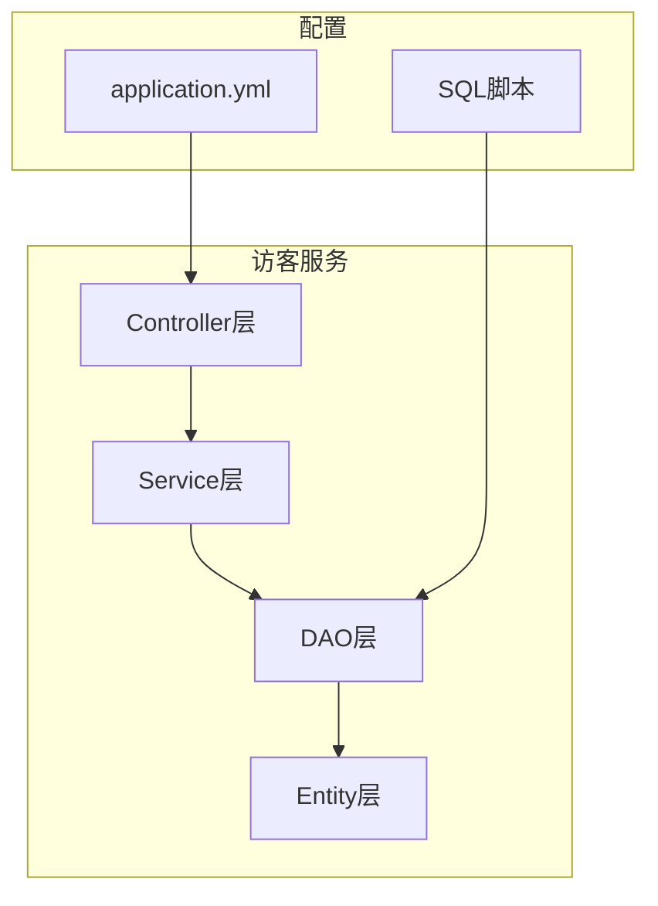
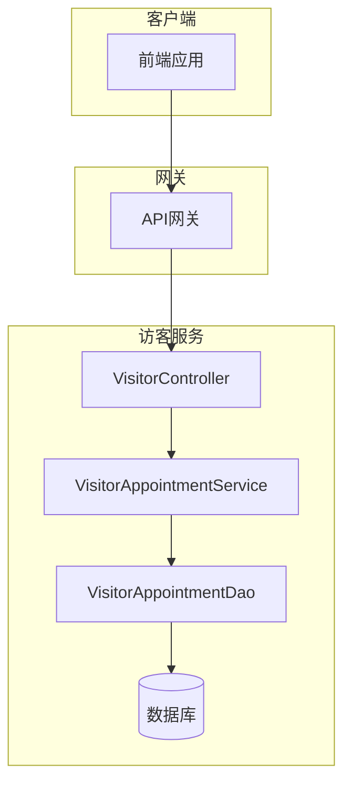
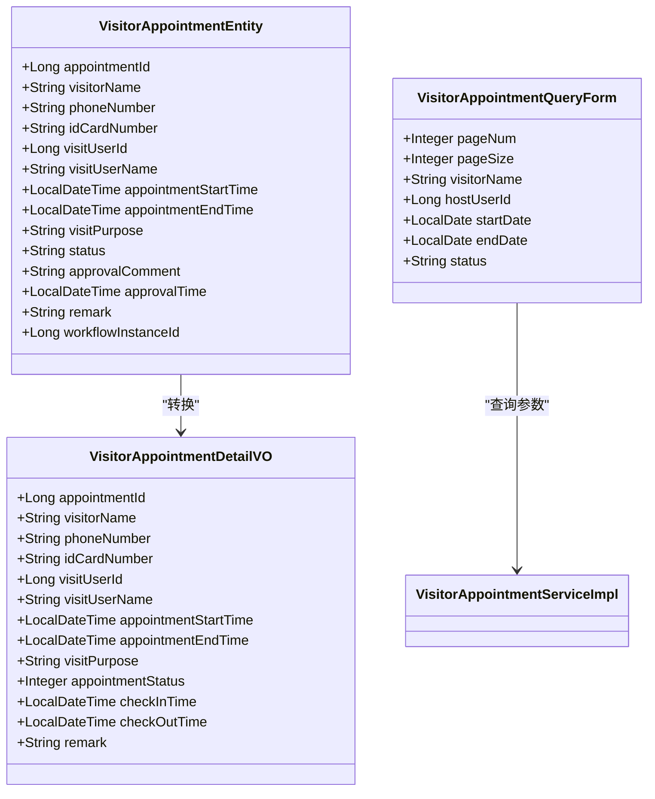
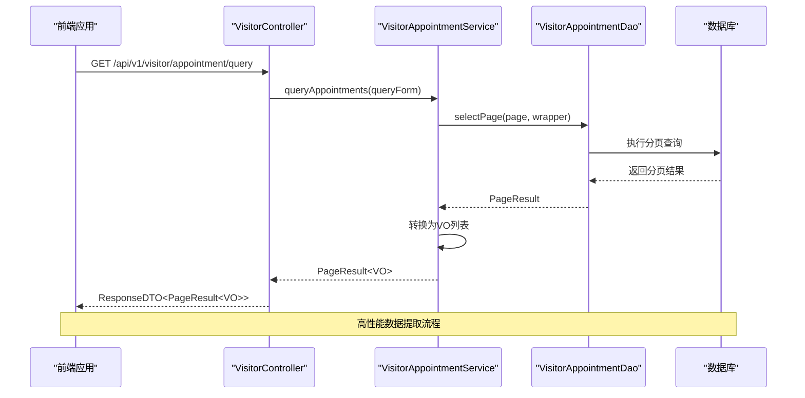
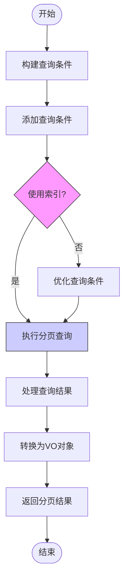
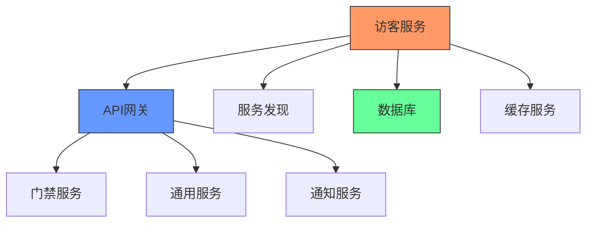

# 数据提取

<cite>
**本文档引用文件**  
- [VisitorController.java](file://microservices\ioedream-visitor-service\src\main\java\net\lab1024\sa\visitor\controller\VisitorController.java#L1-L192)
- [VisitorAppointmentServiceImpl.java](file://microservices\ioedream-visitor-service\src\main\java\net\lab1024\sa\visitor\service\impl\VisitorAppointmentServiceImpl.java#L1-L529)
- [VisitorAppointmentQueryForm.java](file://microservices\ioedream-visitor-service\src\main\java\net\lab1024\sa\visitor\domain\form\VisitorAppointmentQueryForm.java#L1-L77)
- [VisitorAppointmentDao.java](file://microservices\ioedream-visitor-service\src\main\java\net\lab1024\sa\visitor\dao\VisitorAppointmentDao.java#L1-L25)
- [VisitorAppointmentEntity.java](file://microservices\ioedream-visitor-service\src\main\java\net\lab1024\sa\visitor\domain\entity\VisitorAppointmentEntity.java#L1-L124)
- [application.yml](file://microservices\ioedream-visitor-service\src\main\resources\application.yml#L1-L83)
- [GatewayServiceClientConfiguration.java](file://microservices\ioedream-visitor-service\src\main\java\net\lab1024\sa\visitor\config\GatewayServiceClientConfiguration.java#L1-L68)
- [visitor_index_optimization.sql](file://microservices\ioedream-visitor-service\src\main\resources\sql\visitor_index_optimization.sql#L1-L69)
</cite>

## 目录
1. [引言](#引言)
2. [项目结构](#项目结构)
3. [核心组件](#核心组件)
4. [架构概述](#架构概述)
5. [详细组件分析](#详细组件分析)
6. [依赖分析](#依赖分析)
7. [性能考虑](#性能考虑)
8. [故障排除指南](#故障排除指南)
9. [结论](#结论)

## 引言
本文档详细说明了访客系统数据提取模块的实现机制，重点介绍高性能数据提取技术，包括并发提取、智能分页和流式处理。文档解释了如何通过分页查询避免内存溢出，使用流式API处理大规模数据集。同时，文档提供了数据提取过程中的异常处理和重试机制的实现方式，并描述了与第三方系统API的集成方法，包括认证、速率限制处理和连接池配置。

## 项目结构
访客系统数据提取模块位于`ioedream-visitor-service`微服务中，采用标准的Spring Boot项目结构。模块遵循四层架构设计：Controller层处理HTTP请求，Service层实现业务逻辑，DAO层负责数据访问，Entity层定义数据模型。配置文件和SQL脚本分别存放在resources目录下。

**图表来源**
- [VisitorController.java](file://microservices\ioedream-visitor-service\src\main\java\net\lab1024\sa\visitor\controller\VisitorController.java#L1-L192)
- [VisitorAppointmentServiceImpl.java](file://microservices\ioedream-visitor-service\src\main\java\net\lab1024\sa\visitor\service\impl\VisitorAppointmentServiceImpl.java#L1-L529)
- [VisitorAppointmentDao.java](file://microservices\ioedream-visitor-service\src\main\java\net\lab1024\sa\visitor\dao\VisitorAppointmentDao.java#L1-L25)
- [VisitorAppointmentEntity.java](file://microservices\ioedream-visitor-service\src\main\java\net\lab1024\sa\visitor\domain\entity\VisitorAppointmentEntity.java#L1-L124)

**章节来源**
- [VisitorController.java](file://microservices\ioedream-visitor-service\src\main\java\net\lab1024\sa\visitor\controller\VisitorController.java#L1-L192)
- [VisitorAppointmentServiceImpl.java](file://microservices\ioedream-visitor-service\src\main\java\net\lab1024\sa\visitor\service\impl\VisitorAppointmentServiceImpl.java#L1-L529)

## 核心组件
访客系统数据提取模块的核心组件包括访客预约查询服务、分页控制器、数据访问对象和实体类。这些组件协同工作，实现高效的数据提取和处理。模块通过智能分页机制避免内存溢出，使用流式处理技术处理大规模数据集，并通过异常处理和重试机制确保数据提取的可靠性。

**章节来源**
- [VisitorAppointmentServiceImpl.java](file://microservices\ioedream-visitor-service\src\main\java\net\lab1024\sa\visitor\service\impl\VisitorAppointmentServiceImpl.java#L1-L529)
- [VisitorController.java](file://microservices\ioedream-visitor-service\src\main\java\net\lab1024\sa\visitor\controller\VisitorController.java#L1-L192)
- [VisitorAppointmentDao.java](file://microservices\ioedream-visitor-service\src\main\java\net\lab1024\sa\visitor\dao\VisitorAppointmentDao.java#L1-L25)

## 架构概述
访客系统数据提取模块采用微服务架构，通过API网关与其他系统集成。模块实现了高性能数据提取机制，包括并发提取、智能分页和流式处理。数据提取过程通过分页查询避免内存溢出，使用流式API处理大规模数据集。模块还实现了与第三方系统API的集成，包括认证、速率限制处理和连接池配置。

**图表来源**
- [VisitorController.java](file://microservices\ioedream-visitor-service\src\main\java\net\lab1024\sa\visitor\controller\VisitorController.java#L1-L192)
- [VisitorAppointmentServiceImpl.java](file://microservices\ioedream-visitor-service\src\main\java\net\lab1024\sa\visitor\service\impl\VisitorAppointmentServiceImpl.java#L1-L529)
- [VisitorAppointmentDao.java](file://microservices\ioedream-visitor-service\src\main\java\net\lab1024\sa\visitor\dao\VisitorAppointmentDao.java#L1-L25)

## 详细组件分析

### 访客预约查询分析
访客预约查询功能通过分页机制实现高效的数据提取。控制器接收分页参数，服务层构建查询条件并执行分页查询，DAO层与数据库交互获取数据。该设计避免了全表扫描和内存溢出问题。

#### 对象导向组件

**图表来源**
- [VisitorAppointmentEntity.java](file://microservices\ioedream-visitor-service\src\main\java\net\lab1024\sa\visitor\domain\entity\VisitorAppointmentEntity.java#L1-L124)
- [VisitorAppointmentQueryForm.java](file://microservices\ioedream-visitor-service\src\main\java\net\lab1024\sa\visitor\domain\form\VisitorAppointmentQueryForm.java#L1-L77)
- [VisitorAppointmentDetailVO.java](file://microservices\ioedream-visitor-service\src\main\java\net\lab1024\sa\visitor\domain\vo\VisitorAppointmentDetailVO.java#L1-L89)

#### API/服务组件

**图表来源**
- [VisitorController.java](file://microservices\ioedream-visitor-service\src\main\java\net\lab1024\sa\visitor\controller\VisitorController.java#L1-L192)
- [VisitorAppointmentServiceImpl.java](file://microservices\ioedream-visitor-service\src\main\java\net\lab1024\sa\visitor\service\impl\VisitorAppointmentServiceImpl.java#L1-L529)
- [VisitorAppointmentDao.java](file://microservices\ioedream-visitor-service\src\main\java\net\lab1024\sa\visitor\dao\VisitorAppointmentDao.java#L1-L25)

**章节来源**
- [VisitorController.java](file://microservices\ioedream-visitor-service\src\main\java\net\lab1024\sa\visitor\controller\VisitorController.java#L1-L192)
- [VisitorAppointmentServiceImpl.java](file://microservices\ioedream-visitor-service\src\main\java\net\lab1024\sa\visitor\service\impl\VisitorAppointmentServiceImpl.java#L1-L529)
- [VisitorAppointmentDao.java](file://microservices\ioedream-visitor-service\src\main\java\net\lab1024\sa\visitor\dao\VisitorAppointmentDao.java#L1-L25)

### 智能分页机制
智能分页机制通过MyBatis-Plus的分页插件实现，结合数据库索引优化，确保大规模数据集的高效查询。系统在查询条件中使用索引列，避免全表扫描，并通过覆盖索引减少回表查询。

**图表来源**
- [visitor_index_optimization.sql](file://microservices\ioedream-visitor-service\src\main\resources\sql\visitor_index_optimization.sql#L1-L69)
- [VisitorAppointmentServiceImpl.java](file://microservices\ioedream-visitor-service\src\main\java\net\lab1024\sa\visitor\service\impl\VisitorAppointmentServiceImpl.java#L1-L529)

## 依赖分析
访客系统数据提取模块依赖于多个核心组件和外部服务。模块通过API网关与其他微服务通信，使用Nacos进行服务发现，通过Druid连接池管理数据库连接。这些依赖关系确保了系统的稳定性和可扩展性。

**图表来源**
- [GatewayServiceClientConfiguration.java](file://microservices\ioedream-visitor-service\src\main\java\net\lab1024\sa\visitor\config\GatewayServiceClientConfiguration.java#L1-L68)
- [application.yml](file://microservices\ioedream-visitor-service\src\main\resources\application.yml#L1-L83)

**章节来源**
- [GatewayServiceClientConfiguration.java](file://microservices\ioedream-visitor-service\src\main\java\net\lab1024\sa\visitor\config\GatewayServiceClientConfiguration.java#L1-L68)
- [application.yml](file://microservices\ioedream-visitor-service\src\main\resources\application.yml#L1-L83)

## 性能考虑
访客系统数据提取模块在设计时充分考虑了性能因素。通过数据库索引优化、分页查询和流式处理技术，系统能够高效处理大规模数据集。模块还实现了连接池配置和速率限制处理，确保系统在高并发场景下的稳定性。

**章节来源**
- [visitor_index_optimization.sql](file://microservices\ioedream-visitor-service\src\main\resources\sql\visitor_index_optimization.sql#L1-L69)
- [application.yml](file://microservices\ioedream-visitor-service\src\main\resources\application.yml#L1-L83)

## 故障排除指南
当访客系统数据提取出现问题时，应首先检查日志文件，确认错误类型。对于数据库查询性能问题，应检查是否使用了正确的索引。对于服务间调用失败，应检查API网关配置和网络连接。系统提供了详细的日志记录和监控指标，便于快速定位和解决问题。

**章节来源**
- [VisitorAppointmentServiceImpl.java](file://microservices\ioedream-visitor-service\src\main\java\net\lab1024\sa\visitor\service\impl\VisitorAppointmentServiceImpl.java#L1-L529)
- [application.yml](file://microservices\ioedream-visitor-service\src\main\resources\application.yml#L1-L83)

## 结论
访客系统数据提取模块通过智能分页、流式处理和数据库索引优化等技术，实现了高性能的数据提取功能。模块设计充分考虑了可扩展性和稳定性，能够有效处理大规模数据集。通过与第三方系统API的集成，模块实现了完整的访客管理功能，为智慧园区一卡通管理平台提供了可靠的数据支持。