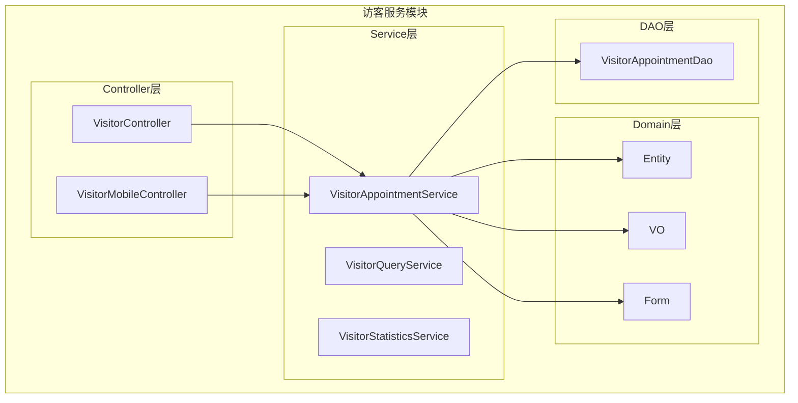
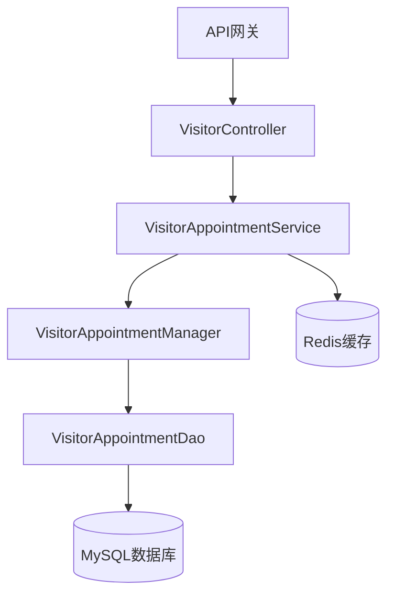
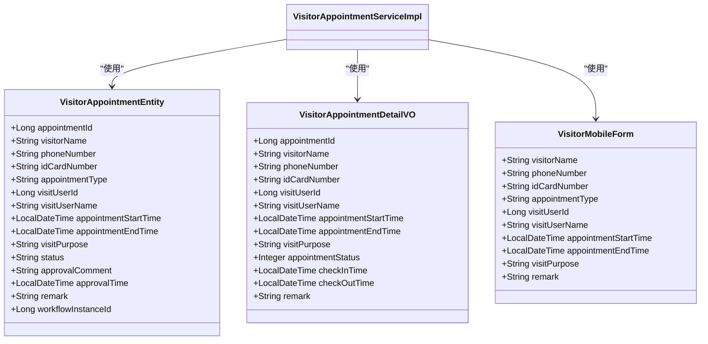
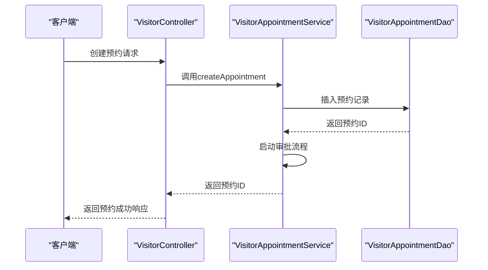
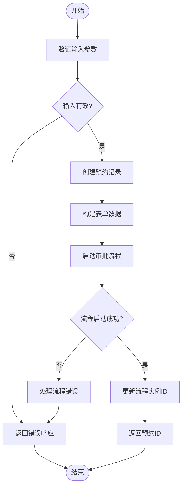
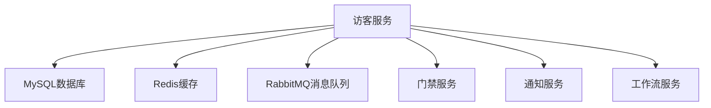

# 数据转换

<cite>
**本文档引用文件**   
- [VisitorAppointmentServiceImpl.java](file://microservices\ioedream-visitor-service\src\main\java\net\lab1024\sa\visitor\service\impl\VisitorAppointmentServiceImpl.java)
- [VisitorAppointmentEntity.java](file://microservices\ioedream-visitor-service\src\main\java\net\lab1024\sa\visitor\domain\entity\VisitorAppointmentEntity.java)
- [VisitorAppointmentDetailVO.java](file://microservices\ioedream-visitor-service\src\main\java\net\lab1024\sa\visitor\domain\vo\VisitorAppointmentDetailVO.java)
- [VisitorMobileForm.java](file://microservices\ioedream-visitor-service\src\main\java\net\lab1024\sa\visitor\domain\form\VisitorMobileForm.java)
- [visitor-module-architecture.md](file://documentation\03-业务模块\各业务模块文档\访客\visitor-module-architecture.md)
- [ACCOUNT_ENTITY_MIGRATION_GUIDE.md](file://documentation\archive\reports-2025-12-04\ACCOUNT_ENTITY_MIGRATION_GUIDE.md)
</cite>

## 目录
1. [引言](#引言)
2. [项目结构](#项目结构)
3. [核心组件](#核心组件)
4. [架构概述](#架构概述)
5. [详细组件分析](#详细组件分析)
6. [依赖分析](#依赖分析)
7. [性能考虑](#性能考虑)
8. [故障排除指南](#故障排除指南)
9. [结论](#结论)
10. [附录](#附录)（如有必要）

## 引言
本文档详细阐述了访客系统数据转换引擎的工作原理，涵盖字段映射、数据类型转换、数据清洗和自定义JavaScript函数扩展等功能。文档说明了如何通过配置化方式定义转换规则，支持动态脚本执行，并提供实际案例展示复杂数据结构的转换过程，包括嵌套对象处理和数组映射。同时，文档描述了转换过程中的错误处理机制和数据质量验证策略。

## 项目结构
访客系统数据转换引擎主要位于`ioedream-visitor-service`微服务中，其核心功能分布在`service`、`domain`和`controller`包中。数据转换主要在服务层实现，通过实体类（Entity）、值对象（VO）和表单类（Form）之间的映射完成。

**图表来源**
- [VisitorAppointmentServiceImpl.java](file://microservices\ioedream-visitor-service\src\main\java\net\lab1024\sa\visitor\service\impl\VisitorAppointmentServiceImpl.java)
- [VisitorAppointmentEntity.java](file://microservices\ioedream-visitor-service\src\main\java\net\lab1024\sa\visitor\domain\entity\VisitorAppointmentEntity.java)
- [VisitorAppointmentDetailVO.java](file://microservices\ioedream-visitor-service\src\main\java\net\lab1024\sa\visitor\domain\vo\VisitorAppointmentDetailVO.java)
- [VisitorMobileForm.java](file://microservices\ioedream-visitor-service\src\main\java\net\lab1024\sa\visitor\domain\form\VisitorMobileForm.java)

**章节来源**
- [VisitorAppointmentServiceImpl.java](file://microservices\ioedream-visitor-service\src\main\java\net\lab1024\sa\visitor\service\impl\VisitorAppointmentServiceImpl.java)
- [visitor-module-architecture.md](file://documentation\03-业务模块\各业务模块文档\访客\visitor-module-architecture.md)

## 核心组件
访客系统数据转换引擎的核心组件包括实体类（Entity）、值对象（VO）和表单类（Form）。这些组件通过服务层的转换逻辑实现数据的映射和转换。例如，`VisitorAppointmentEntity`用于持久化数据，`VisitorAppointmentDetailVO`用于返回给前端的数据，`VisitorMobileForm`用于接收移动端的输入数据。

**章节来源**
- [VisitorAppointmentEntity.java](file://microservices\ioedream-visitor-service\src\main\java\net\lab1024\sa\visitor\domain\entity\VisitorAppointmentEntity.java)
- [VisitorAppointmentDetailVO.java](file://microservices\ioedream-visitor-service\src\main\java\net\lab1024\sa\visitor\domain\vo\VisitorAppointmentDetailVO.java)
- [VisitorMobileForm.java](file://microservices\ioedream-visitor-service\src\main\java\net\lab1024\sa\visitor\domain\form\VisitorMobileForm.java)

## 架构概述
访客系统数据转换引擎采用四层架构设计，包括Controller层、Service层、Manager层和DAO层。数据转换主要在Service层完成，通过调用Manager层和DAO层的方法实现数据的持久化和查询。

**图表来源**
- [VisitorAppointmentServiceImpl.java](file://microservices\ioedream-visitor-service\src\main\java\net\lab1024\sa\visitor\service\impl\VisitorAppointmentServiceImpl.java)
- [visitor-module-architecture.md](file://documentation\03-业务模块\各业务模块文档\访客\visitor-module-architecture.md)

## 详细组件分析
### 访客预约服务分析
访客预约服务是数据转换引擎的核心组件，负责处理访客预约的创建、查询和更新。服务通过`VisitorAppointmentServiceImpl`类实现，包含多个方法用于处理不同的业务场景。

#### 对象导向组件

**图表来源**
- [VisitorAppointmentEntity.java](file://microservices\ioedream-visitor-service\src\main\java\net\lab1024\sa\visitor\domain\entity\VisitorAppointmentEntity.java)
- [VisitorAppointmentDetailVO.java](file://microservices\ioedream-visitor-service\src\main\java\net\lab1024\sa\visitor\domain\vo\VisitorAppointmentDetailVO.java)
- [VisitorMobileForm.java](file://microservices\ioedream-visitor-service\src\main\java\net\lab1024\sa\visitor\domain\form\VisitorMobileForm.java)

#### API/服务组件

**图表来源**
- [VisitorAppointmentServiceImpl.java](file://microservices\ioedream-visitor-service\src\main\java\net\lab1024\sa\visitor\service\impl\VisitorAppointmentServiceImpl.java)
- [VisitorController.java](file://microservices\ioedream-visitor-service\src\main\java\net\lab1024\sa\visitor\controller\VisitorController.java)

#### 复杂逻辑组件

**图表来源**
- [VisitorAppointmentServiceImpl.java](file://microservices\ioedream-visitor-service\src\main\java\net\lab1024\sa\visitor\service\impl\VisitorAppointmentServiceImpl.java)

**章节来源**
- [VisitorAppointmentServiceImpl.java](file://microservices\ioedream-visitor-service\src\main\java\net\lab1024\sa\visitor\service\impl\VisitorAppointmentServiceImpl.java)

### 概念概述
访客系统数据转换引擎通过配置化方式定义转换规则，支持动态脚本执行。转换规则包括字段映射、数据类型转换、数据清洗和自定义JavaScript函数扩展。复杂数据结构的转换过程包括嵌套对象处理和数组映射。

## 依赖分析
访客系统数据转换引擎依赖于多个外部服务和组件，包括数据库、缓存、消息队列和第三方服务。这些依赖通过Spring框架的依赖注入机制进行管理。

**图表来源**
- [VisitorAppointmentServiceImpl.java](file://microservices\ioedream-visitor-service\src\main\java\net\lab1024\sa\visitor\service\impl\VisitorAppointmentServiceImpl.java)
- [visitor-module-architecture.md](file://documentation\03-业务模块\各业务模块文档\访客\visitor-module-architecture.md)

**章节来源**
- [VisitorAppointmentServiceImpl.java](file://microservices\ioedream-visitor-service\src\main\java\net\lab1024\sa\visitor\service\impl\VisitorAppointmentServiceImpl.java)

## 性能考虑
访客系统数据转换引擎在设计时考虑了性能优化，包括数据库索引优化、缓存策略和异步处理。数据库表设计时添加了必要的索引以提高查询性能，使用Redis缓存频繁访问的数据，通过消息队列实现异步通知和审批流程。

## 故障排除指南
访客系统数据转换引擎在运行过程中可能会遇到各种问题，包括数据转换错误、依赖服务不可用和性能瓶颈。故障排除时应首先检查日志文件，定位问题根源，然后根据具体情况采取相应的解决措施。

**章节来源**
- [VisitorAppointmentServiceImpl.java](file://microservices\ioedream-visitor-service\src\main\java\net\lab1024\sa\visitor\service\impl\VisitorAppointmentServiceImpl.java)
- [visitor-module-architecture.md](file://documentation\03-业务模块\各业务模块文档\访客\visitor-module-architecture.md)

## 结论
访客系统数据转换引擎通过配置化方式定义转换规则，支持动态脚本执行，能够高效处理复杂数据结构的转换。引擎具备完善的错误处理机制和数据质量验证策略，确保数据转换的准确性和可靠性。通过合理的架构设计和性能优化，引擎能够满足高并发场景下的性能要求。