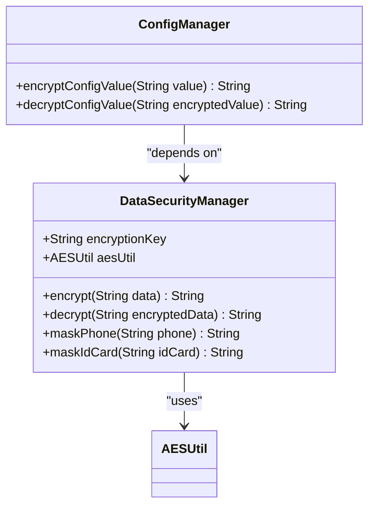
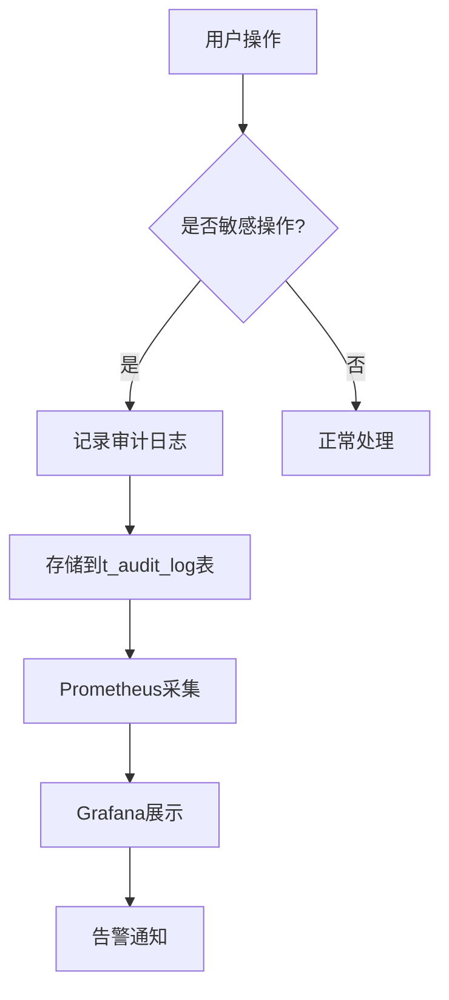

# 安全存储

<cite>
**本文档引用文件**   
- [security_hardening_guide.md](file://security/security_hardening_guide.md)
- [ConfigManager.java](file://microservices/microservices-common/src/main/java/net/lab1024/sa/common/system/manager/ConfigManager.java)
- [PRODUCTION_SECURITY_CHECKLIST.md](file://PRODUCTION_SECURITY_CHECKLIST.md)
- [t_audit_log.sql](file://database-scripts/common-service/10-t_audit_log.sql)
- [encrypt-config.java](file://scripts/encrypt-config.java)
- [smart-permission.md](file://documentation/technical/smart-permission.md)
- [third-party-system-integration\spec.md](file://openspec/changes/archive/completed-proposals/implement-third-party-system-integration/specs/third-party-system-integration/spec.md)
</cite>

## 目录
1. [引言](#引言)
2. [第三方数据源敏感信息存储方案](#第三方数据源敏感信息存储方案)
3. [加密算法选择与密钥管理机制](#加密算法选择与密钥管理机制)
4. [数据加解密实现流程与性能影响](#数据加解密实现流程与性能影响)
5. [密钥轮换策略与安全管理规范](#密钥轮换策略与安全管理规范)
6. [安全审计日志记录与监控方法](#安全审计日志记录与监控方法)
7. [安全存储架构设计与防御措施](#安全存储架构设计与防御措施)

## 引言
本文件详细阐述了IOE-DREAM系统中第三方数据源敏感信息的安全存储方案。文档涵盖了加密算法的选择、密钥管理机制、数据加解密的实现流程及其性能影响、密钥轮换策略、安全管理规范以及安全审计日志的记录和监控方法。通过这些措施，确保系统达到企业级安全标准，有效防范安全威胁。

## 第三方数据源敏感信息存储方案
在IOE-DREAM系统中，第三方数据源的敏感信息（如身份证号、手机号、银行卡号等）采用AES-256加密算法进行加密存储。所有敏感字段在存储前都会经过加密处理，确保即使数据库被非法访问，敏感信息也不会泄露。此外，系统还实现了数据脱敏机制，在界面展示时自动对敏感信息进行脱敏处理，进一步保护用户隐私。

**Section sources**
- [security_hardening_guide.md](file://security/security_hardening_guide.md#L130-L166)
- [third-party-system-integration\spec.md](file://openspec/changes/archive/completed-proposals/implement-third-party-system-integration/specs/third-party-system-integration/spec.md#L352-L356)

## 加密算法选择与密钥管理机制
### 加密算法选择
系统采用AES-256加密算法对敏感数据进行加密。AES-256是一种对称加密算法，具有高安全性和良好的性能表现，广泛应用于企业级应用中。该算法能够有效防止数据在传输和存储过程中的泄露风险。

### 密钥管理机制
密钥管理是安全存储的核心。系统通过Nacos配置中心管理加密密钥，密钥从环境变量或配置中心获取。生产环境中，密钥通过环境变量注入，避免硬编码在代码中。同时，系统支持密钥轮换，确保密钥的定期更新，降低密钥泄露的风险。

**Diagram sources **
- [security_hardening_guide.md](file://security/security_hardening_guide.md#L132-L166)
- [ConfigManager.java](file://microservices/microservices-common/src/main/java/net/lab1024/sa/common/system/manager/ConfigManager.java#L161-L233)

**Section sources**
- [security_hardening_guide.md](file://security/security_hardening_guide.md#L130-L166)
- [ConfigManager.java](file://microservices/microservices-common/src/main/java/net/lab1024/sa/common/system/manager/ConfigManager.java#L161-L233)

## 数据加解密实现流程与性能影响
### 实现流程
数据加解密的实现流程如下：
1. **加密流程**：当敏感数据需要存储时，系统调用`DataSecurityManager`的`encrypt`方法，使用AES-256算法对数据进行加密，并将加密后的数据存储到数据库中。
2. **解密流程**：当需要读取敏感数据时，系统调用`DataSecurityManager`的`decrypt`方法，将加密数据解密后返回给应用层。

### 性能影响
由于加密和解密操作涉及计算开销，会对系统性能产生一定影响。为了减少性能损耗，系统采用了多级缓存机制（L1本地缓存 + L2 Redis + L3数据库），将频繁访问的敏感数据缓存起来，减少重复的加解密操作。此外，系统还通过异步处理和批量操作优化性能。

**Section sources**
- [security_hardening_guide.md](file://security/security_hardening_guide.md#L143-L153)
- [ConfigManager.java](file://microservices/microservices-common/src/main/java/net/lab1024/sa/common/system/manager/ConfigManager.java#L161-L233)

## 密钥轮换策略与安全管理规范
### 密钥轮换策略
系统支持密钥轮换，确保密钥的定期更新。密钥轮换策略包括：
- **定期轮换**：每季度进行一次密钥轮换，确保密钥的时效性。
- **紧急轮换**：在发生安全事件或怀疑密钥泄露时，立即进行密钥轮换。
- **双密钥机制**：在轮换期间，系统同时支持新旧密钥，确保平滑过渡。

### 安全管理规范
为确保密钥的安全管理，系统制定了严格的安全管理规范：
- **最小权限原则**：只有授权人员才能访问密钥管理接口。
- **审计日志**：所有密钥操作（生成、轮换、删除）均记录在审计日志中，确保操作可追溯。
- **环境隔离**：开发、测试、生产环境使用不同的密钥，避免跨环境泄露。

**Section sources**
- [security_hardening_guide.md](file://security/security_hardening_guide.md#L444-L475)
- [PRODUCTION_SECURITY_CHECKLIST.md](file://PRODUCTION_SECURITY_CHECKLIST.md#L391-L434)

## 安全审计日志记录与监控方法
### 审计日志记录
系统通过`SecurityAuditAspect`切面记录所有敏感操作的审计日志。审计日志包含操作类型、操作人、客户端IP、操作时间等信息，并存储在`t_audit_log`表中。审计日志的记录确保了所有敏感操作的可追溯性。

### 监控方法
系统通过Prometheus + Grafana构建了实时监控体系，对审计日志进行实时监控。监控指标包括：
- **操作频率**：监控敏感操作的频率，发现异常行为。
- **失败率**：监控操作失败率，及时发现潜在的安全威胁。
- **响应时间**：监控操作响应时间，确保系统性能稳定。

**Diagram sources **
- [security_hardening_guide.md](file://security/security_hardening_guide.md#L212-L241)
- [t_audit_log.sql](file://database-scripts/common-service/10-t_audit_log.sql#L1-L39)

**Section sources**
- [security_hardening_guide.md](file://security/security_hardening_guide.md#L212-L241)
- [t_audit_log.sql](file://database-scripts/common-service/10-t_audit_log.sql#L1-L39)

## 安全存储架构设计与防御措施
### 架构设计
系统采用分层架构设计，确保安全存储的可靠性。架构分为四层：
1. **接入层**：通过API网关接收外部请求，进行身份认证和权限校验。
2. **业务逻辑层**：处理核心业务逻辑，调用安全存储服务进行数据加解密。
3. **数据管理层**：负责数据的加密、解密和存储，确保数据安全。
4. **持久化层**：使用MySQL和Redis进行数据持久化，支持多级缓存。

### 防御措施
系统采取了多种防御措施，确保数据安全：
- **HTTPS强制**：所有外部通信均通过HTTPS加密传输，防止数据在传输过程中被窃取。
- **防火墙配置**：通过防火墙限制数据库和Redis的访问，仅允许内网访问。
- **API限流防刷**：对关键接口进行限流，防止恶意攻击。
- **WAF防火墙**：部署WAF防火墙，防止SQL注入、XSS等常见攻击。

**Section sources**
- [security_hardening_guide.md](file://security/security_hardening_guide.md#L270-L325)
- [PRODUCTION_SECURITY_CHECKLIST.md](file://PRODUCTION_SECURITY_CHECKLIST.md#L207-L280)