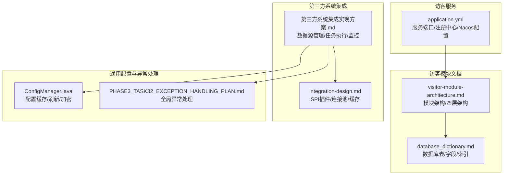
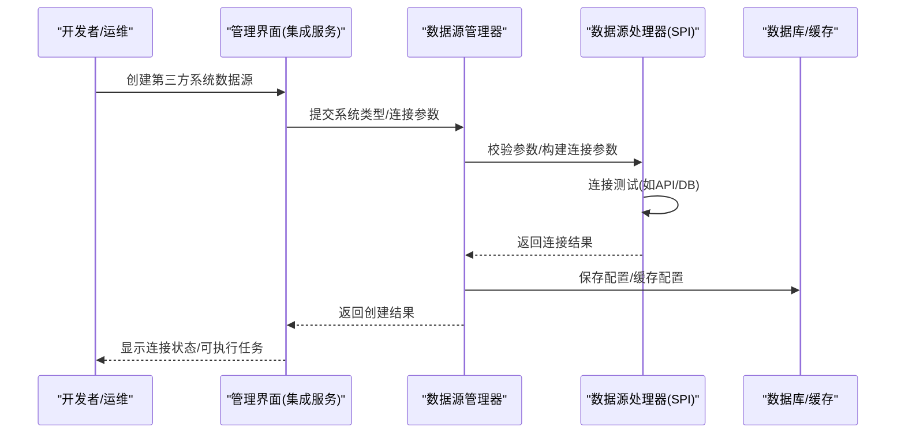
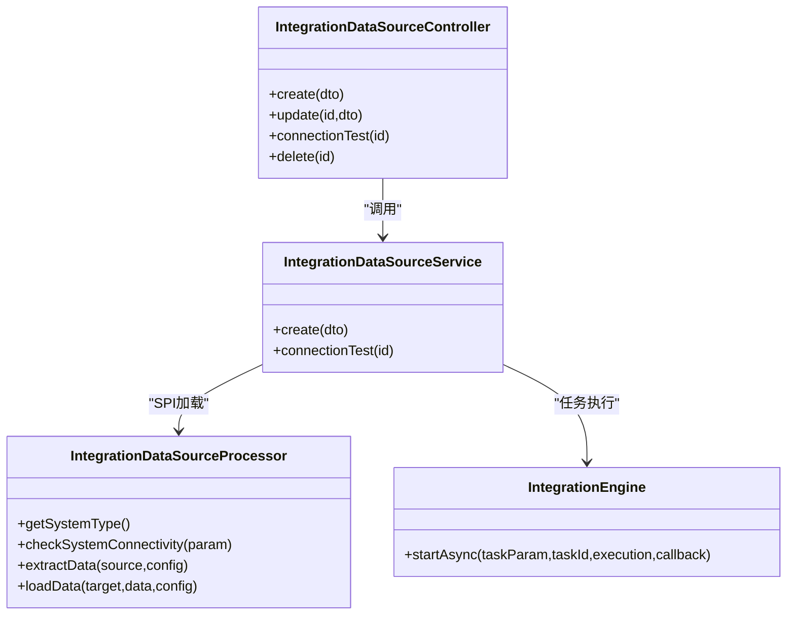
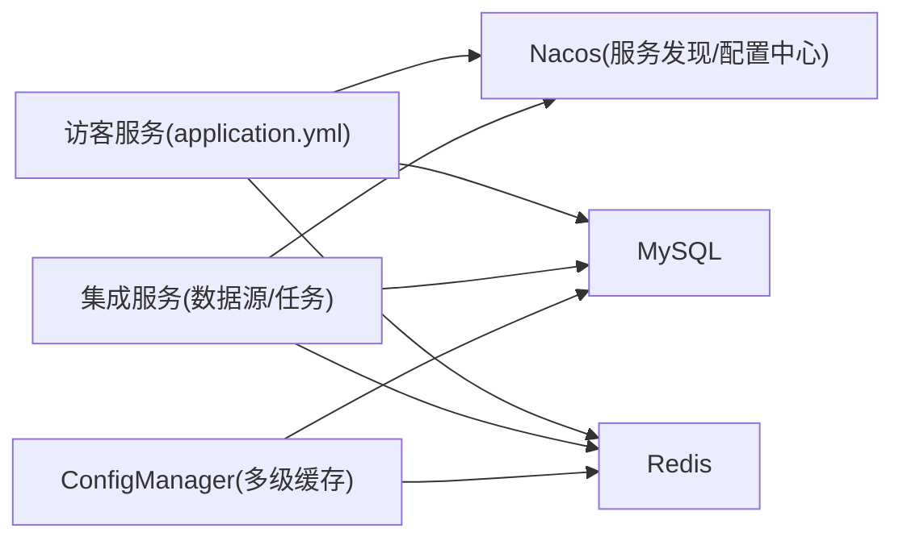

# 数据源配置

<cite>
**本文引用的文件**
- [application.yml](file://microservices/ioedream-visitor-service/src/main/resources/application.yml)
- [visitor-module-architecture.md](file://documentation/03-业务模块/访客/visitor-module-architecture.md)
- [database_dictionary.md](file://documentation/03-业务模块/访客/database_dictionary.md)
- [第三方系统集成实现方案.md](file://documentation/03-业务模块/第三方系统集成实现方案.md)
- [integration-design.md](file://openspec/changes/archive/completed-proposals/implement-third-party-system-integration/design.md)
- [PHASE3_TASK32_EXCEPTION_HANDLING_PLAN.md](file://documentation/archive/reports-2025-12-04/PHASE3_TASK32_EXCEPTION_HANDLING_PLAN.md)
- [ConfigManager.java](file://microservices/microservices-common/src/main/java/net/lab1024/sa/common/system/manager/ConfigManager.java)
</cite>

## 目录
1. [简介](#简介)
2. [项目结构](#项目结构)
3. [核心组件](#核心组件)
4. [架构总览](#架构总览)
5. [详细组件分析](#详细组件分析)
6. [依赖分析](#依赖分析)
7. [性能考虑](#性能考虑)
8. [故障排查指南](#故障排查指南)
9. [结论](#结论)
10. [附录](#附录)

## 简介
本文件面向访客系统数据源配置，聚焦“第三方系统连接参数”的配置与管理，覆盖配置文件与管理界面两方面；解释配置项的层级结构与继承机制；提供配置模板与最佳实践；描述配置验证流程与错误处理机制；并给出JSON Schema定义与数据校验规则说明，帮助开发者与运维人员快速、安全地完成数据源配置与上线。

## 项目结构
访客系统属于IOE-DREAM七微服务之一，其服务配置集中在独立的application.yml中，同时访客模块的数据库表结构与业务流程在文档中明确，便于理解数据源配置与业务数据之间的关系。

图表来源
- [application.yml](file://microservices/ioedream-visitor-service/src/main/resources/application.yml#L1-L83)
- [visitor-module-architecture.md](file://documentation/03-业务模块/访客/visitor-module-architecture.md#L1-L120)
- [database_dictionary.md](file://documentation/03-业务模块/访客/database_dictionary.md#L16-L110)
- [第三方系统集成实现方案.md](file://documentation/03-业务模块/第三方系统集成实现方案.md#L1-L120)
- [integration-design.md](file://openspec/changes/archive/completed-proposals/implement-third-party-system-integration/design.md#L1-L120)
- [PHASE3_TASK32_EXCEPTION_HANDLING_PLAN.md](file://documentation/archive/reports-2025-12-04/PHASE3_TASK32_EXCEPTION_HANDLING_PLAN.md#L37-L136)
- [ConfigManager.java](file://microservices/microservices-common/src/main/java/net/lab1024/sa/common/system/manager/ConfigManager.java#L1-L131)

章节来源
- [application.yml](file://microservices/ioedream-visitor-service/src/main/resources/application.yml#L1-L83)
- [visitor-module-architecture.md](file://documentation/03-业务模块/访客/visitor-module-architecture.md#L1-L120)
- [database_dictionary.md](file://documentation/03-业务模块/访客/database_dictionary.md#L16-L110)

## 核心组件
- 访客服务配置中心：通过application.yml集中管理服务端口、注册中心、Nacos配置、日志与监控等。
- 访客模块架构与数据字典：明确四层架构边界与数据库表结构，为数据源配置与业务数据落地提供依据。
- 第三方系统集成方案：提供数据源管理、连接测试、任务执行、监控告警的完整能力，支撑访客系统对接外部系统。
- 通用配置管理：提供配置缓存、动态刷新、加密存储等能力，保障配置的一致性与安全性。
- 全局异常处理：统一捕获参数校验、约束违反、运行时异常等，保证配置变更与调用过程的稳定性。

章节来源
- [application.yml](file://microservices/ioedream-visitor-service/src/main/resources/application.yml#L1-L83)
- [第三方系统集成实现方案.md](file://documentation/03-业务模块/第三方系统集成实现方案.md#L1-L200)
- [integration-design.md](file://openspec/changes/archive/completed-proposals/implement-third-party-system-integration/design.md#L1-L120)
- [ConfigManager.java](file://microservices/microservices-common/src/main/java/net/lab1024/sa/common/system/manager/ConfigManager.java#L1-L131)
- [PHASE3_TASK32_EXCEPTION_HANDLING_PLAN.md](file://documentation/archive/reports-2025-12-04/PHASE3_TASK32_EXCEPTION_HANDLING_PLAN.md#L37-L136)

## 架构总览
访客系统数据源配置涉及三层：
- 配置文件层：application.yml集中管理服务与注册中心配置。
- 管理界面层：第三方系统集成方案提供数据源创建、连接测试、任务管理等接口，支持对第三方系统的连接参数进行配置与验证。
- 数据存储层：数据库表结构与字段定义为配置落地与业务数据存储提供依据。

图表来源
- [第三方系统集成实现方案.md](file://documentation/03-业务模块/第三方系统集成实现方案.md#L200-L420)
- [integration-design.md](file://openspec/changes/archive/completed-proposals/implement-third-party-system-integration/design.md#L86-L120)

## 详细组件分析

### 组件A：访客服务配置(application.yml)
- 作用：定义服务端口、注册中心(Nacos)、配置中心(Nacos Config)、日志与监控等基础运行参数。
- 关键点：
  - 服务端口与上下文路径
  - Nacos服务发现与配置中心开关
  - 日志级别与输出格式
  - Actuator监控暴露与Prometheus导出

章节来源
- [application.yml](file://microservices/ioedream-visitor-service/src/main/resources/application.yml#L1-L83)

### 组件B：访客模块架构与数据字典
- 作用：明确四层架构边界与数据库表结构，为数据源配置与业务数据落地提供依据。
- 关键点：
  - 四层架构：Controller → Service → Manager → DAO
  - 数据库表：访客、被访人、区域、权限级别、登记、通行、统计等
  - 字段与索引：为配置项与业务数据的关联提供支撑

章节来源
- [visitor-module-architecture.md](file://documentation/03-业务模块/访客/visitor-module-architecture.md#L45-L120)
- [database_dictionary.md](file://documentation/03-业务模块/访客/database_dictionary.md#L16-L110)

### 组件C：第三方系统数据源配置与管理
- 作用：提供数据源创建、连接测试、任务管理、监控告警等能力，支撑访客系统对接外部系统。
- 关键点：
  - 数据源管理接口：创建/更新/删除/连接测试
  - SPI插件机制：按系统类型动态加载处理器
  - 连接参数：系统类型、API地址、认证凭据、超时设置、重试次数、批大小等
  - 任务执行：异步线程池、SAGA分布式事务、状态跟踪与回调
  - 监控与告警：Prometheus指标、告警规则

图表来源
- [第三方系统集成实现方案.md](file://documentation/03-业务模块/第三方系统集成实现方案.md#L200-L420)
- [integration-design.md](file://openspec/changes/archive/completed-proposals/implement-third-party-system-integration/design.md#L86-L120)

章节来源
- [第三方系统集成实现方案.md](file://documentation/03-业务模块/第三方系统集成实现方案.md#L200-L420)
- [integration-design.md](file://openspec/changes/archive/completed-proposals/implement-third-party-system-integration/design.md#L86-L120)

### 组件D：配置缓存与动态刷新(ConfigManager)
- 作用：提供多级缓存(L1本地/L2 Redis/L3数据库)、动态刷新、加密存储等能力，保障配置的一致性与安全性。
- 关键点：
  - L1本地缓存：毫秒级
  - L2 Redis缓存：秒级
  - L3数据库：持久化
  - 刷新策略：全量刷新/按Key刷新

章节来源
- [ConfigManager.java](file://microservices/microservices-common/src/main/java/net/lab1024/sa/common/system/manager/ConfigManager.java#L1-L131)

### 组件E：全局异常处理
- 作用：统一处理参数校验、约束违反、非法参数、运行时异常等，提升配置变更与调用过程的稳定性。
- 关键点：
  - 参数验证异常
  - 参数绑定异常
  - 约束违反异常
  - 通用异常兜底

章节来源
- [PHASE3_TASK32_EXCEPTION_HANDLING_PLAN.md](file://documentation/archive/reports-2025-12-04/PHASE3_TASK32_EXCEPTION_HANDLING_PLAN.md#L37-L136)

## 依赖分析
- 访客服务依赖Nacos进行服务发现与配置中心，依赖数据库与Redis进行数据与缓存存储。
- 第三方系统集成方案通过SPI加载不同系统类型的处理器，实现统一的数据源管理与任务执行。
- 配置管理器提供多级缓存与动态刷新，降低配置读取延迟并提高一致性。

图表来源
- [application.yml](file://microservices/ioedream-visitor-service/src/main/resources/application.yml#L1-L83)
- [第三方系统集成实现方案.md](file://documentation/03-业务模块/第三方系统集成实现方案.md#L1-L120)
- [ConfigManager.java](file://microservices/microservices-common/src/main/java/net/lab1024/sa/common/system/manager/ConfigManager.java#L1-L131)

章节来源
- [application.yml](file://microservices/ioedream-visitor-service/src/main/resources/application.yml#L1-L83)
- [第三方系统集成实现方案.md](file://documentation/03-业务模块/第三方系统集成实现方案.md#L1-L120)
- [ConfigManager.java](file://microservices/microservices-common/src/main/java/net/lab1024/sa/common/system/manager/ConfigManager.java#L1-L131)

## 性能考虑
- 连接池与超时：第三方系统集成方案中提供连接超时、重试次数、批大小等参数，建议根据第三方系统性能与网络状况合理设置。
- 线程池与异步：集成引擎使用线程池异步执行任务，建议根据任务规模与资源情况调整核心线程数、最大线程数与队列容量。
- 缓存策略：利用多级缓存降低配置读取延迟，建议对热点配置设置合理的TTL与刷新策略。
- 监控指标：通过Prometheus采集集成任务成功率、数据同步延迟、系统连接可用性等指标，及时发现性能瓶颈。

章节来源
- [第三方系统集成实现方案.md](file://documentation/03-业务模块/第三方系统集成实现方案.md#L1200-L1400)
- [integration-design.md](file://openspec/changes/archive/completed-proposals/implement-third-party-system-integration/design.md#L140-L225)

## 故障排查指南
- 参数校验失败：检查请求参数是否满足约束，关注字段级错误信息。
- 参数绑定异常：检查请求体与DTO字段映射是否一致。
- 约束违反异常：检查字段取值范围、枚举值等是否合法。
- 运行时异常：查看系统日志，定位具体异常堆栈并进行修复。
- 连接测试失败：检查系统类型、API地址、认证凭据、超时设置等是否正确；必要时开启更详细的日志级别。

章节来源
- [PHASE3_TASK32_EXCEPTION_HANDLING_PLAN.md](file://documentation/archive/reports-2025-12-04/PHASE3_TASK32_EXCEPTION_HANDLING_PLAN.md#L37-L136)
- [第三方系统集成实现方案.md](file://documentation/03-业务模块/第三方系统集成实现方案.md#L300-L420)

## 结论
访客系统数据源配置以“第三方系统集成方案”为核心，结合“访客服务配置”与“通用配置管理”，形成从参数配置、连接测试、任务执行到监控告警的完整闭环。通过SPI插件机制与多级缓存策略，既能灵活对接多种第三方系统，又能保障配置的高性能与一致性。建议在生产环境中严格遵循配置模板与最佳实践，配合完善的验证与异常处理机制，确保系统稳定运行。

## 附录

### A. 配置项层级结构与继承机制
- 层级结构
  - 顶层：系统类型(System Type)，决定使用的处理器与参数集合
  - 中层：连接参数(Connection Params)，包含API地址、端口、认证凭据、超时设置、重试次数、批大小等
  - 底层：业务配置(Extract/Load Config)，针对具体数据类型与字段映射
- 继承机制
  - 不同系统类型共享统一的参数结构，但具体字段与默认值由对应处理器定义
  - 连接参数可在全局配置基础上按系统类型进行差异化设置

章节来源
- [第三方系统集成实现方案.md](file://documentation/03-业务模块/第三方系统集成实现方案.md#L560-L760)
- [integration-design.md](file://openspec/changes/archive/completed-proposals/implement-third-party-system-integration/design.md#L86-L120)

### B. 配置模板与最佳实践
- 配置模板（示意）
  - 系统类型：ERP_U8/HR_BEISEN/OA_DINGTALK等
  - 连接参数：
    - apiUrl：第三方系统API地址
    - username/password：认证凭据
    - apiTimeout：API超时时间（毫秒）
    - retryTimes：重试次数
    - batchSize：批处理大小
    - oauthCacheTtl/messageRateLimit：特定系统参数
  - 业务配置：
    - extractConfig：数据提取配置（数据类型、过滤条件、分页参数）
    - loadConfig：数据加载配置（目标字段映射、冲突处理策略）
- 最佳实践
  - 使用最小权限原则配置认证凭据
  - 合理设置超时与重试，避免阻塞与雪崩
  - 对敏感字段进行加密存储
  - 使用连接池与批量处理提升性能
  - 建立完善的监控与告警机制

章节来源
- [第三方系统集成实现方案.md](file://documentation/03-业务模块/第三方系统集成实现方案.md#L1200-L1400)
- [integration-design.md](file://openspec/changes/archive/completed-proposals/implement-third-party-system-integration/design.md#L140-L225)

### C. 配置验证流程与错误处理
- 验证流程
  - 参数校验：对必填字段、格式、范围进行校验
  - 连接测试：通过处理器执行连接测试，返回连接状态
  - 业务配置校验：对数据类型、字段映射、过滤条件进行校验
- 错误处理
  - 参数校验异常：返回字段级错误信息
  - 约束违反异常：返回约束违反详情
  - 运行时异常：记录日志并返回通用错误提示
  - 连接测试失败：更新连接状态并返回失败结果

章节来源
- [第三方系统集成实现方案.md](file://documentation/03-业务模块/第三方系统集成实现方案.md#L300-L420)
- [PHASE3_TASK32_EXCEPTION_HANDLING_PLAN.md](file://documentation/archive/reports-2025-12-04/PHASE3_TASK32_EXCEPTION_HANDLING_PLAN.md#L37-L136)

### D. JSON Schema定义与数据校验规则
- 系统类型枚举：ERP_U8、HR_BEISEN、OA_DINGTALK等
- 连接参数Schema
  - apiUrl：字符串，必填，HTTP/HTTPS地址
  - username/password：字符串，按需必填
  - apiTimeout：数值，单位毫秒，范围>0
  - retryTimes：数值，范围>=0
  - batchSize：数值，范围>0
  - oauthCacheTtl：数值，范围>=0（特定系统）
  - messageRateLimit：数值，范围>=0（特定系统）
- 业务配置Schema
  - extractConfig：对象，包含dataType、filters、page等
  - loadConfig：对象，包含mapping、conflictPolicy等
- 校验规则
  - 必填字段缺失：返回字段级错误
  - 数值越界或负数：返回范围错误
  - 枚举值不在允许集合：返回枚举错误
  - 格式不匹配：返回格式错误

章节来源
- [第三方系统集成实现方案.md](file://documentation/03-业务模块/第三方系统集成实现方案.md#L560-L760)
- [PHASE3_TASK32_EXCEPTION_HANDLING_PLAN.md](file://documentation/archive/reports-2025-12-04/PHASE3_TASK32_EXCEPTION_HANDLING_PLAN.md#L37-L136)