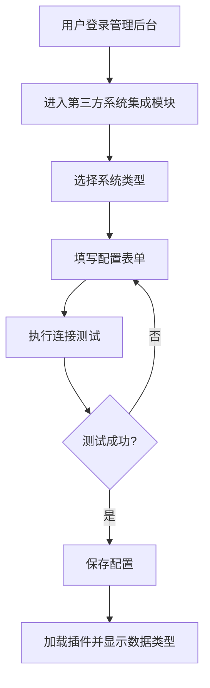
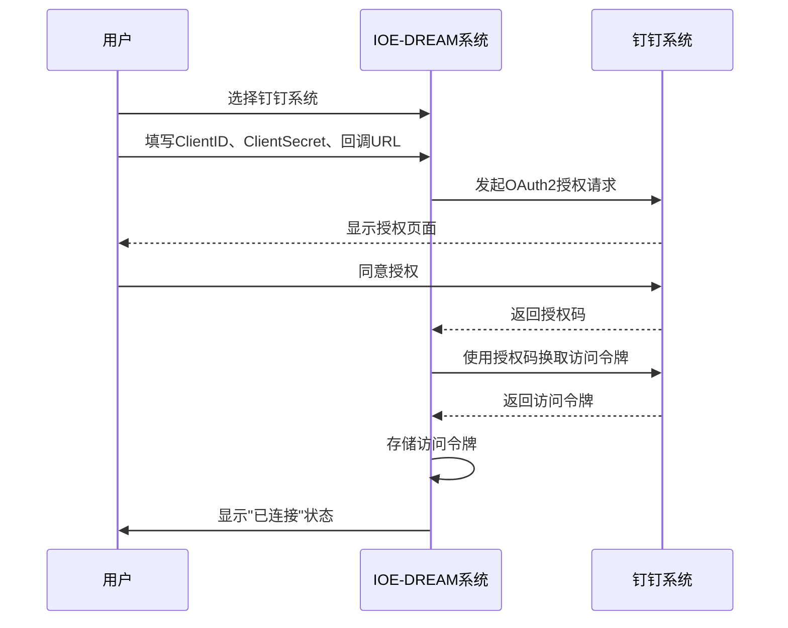
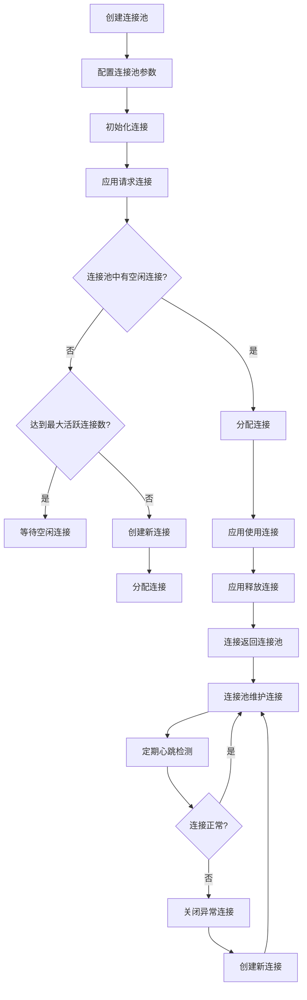
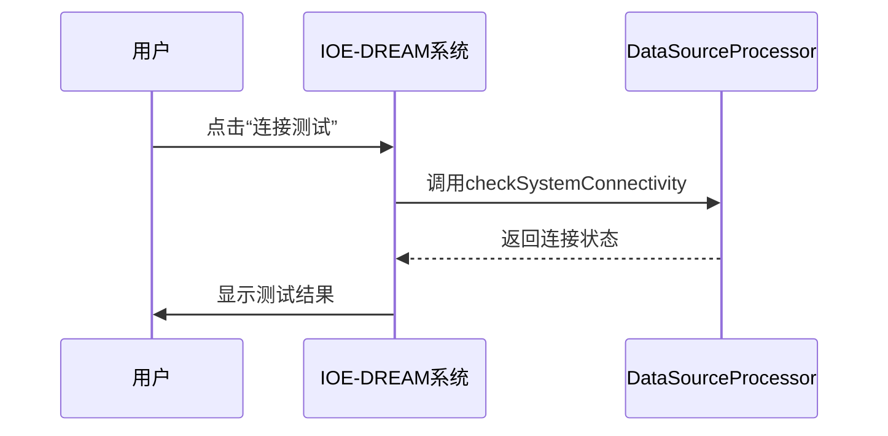

# 第三方数据源管理

<cite>
**本文档引用的文件**   
- [third-party-system-integration\spec.md](file://openspec/changes/archive/completed-proposals/implement-third-party-system-integration/specs/third-party-system-integration/spec.md)
- [design.md](file://openspec/changes/archive/completed-proposals/implement-third-party-system-integration/design.md)
- [tasks.md](file://openspec/changes/archive/completed-proposals/implement-third-party-system-integration/tasks.md)
- [第三方系统集成实现方案.md](file://documentation/03-业务模块/第三方系统集成实现方案.md)
- [security_hardening_guide.md](file://security/security_hardening_guide.md)
- [PHASE1_TASK4_CONFIG_SECURITY_FIX.md](file://documentation/archive/reports-2025-12-04/PHASE1_TASK4_CONFIG_SECURITY_FIX.md)
- [P0_EXECUTION_PLAN.md](file://documentation/archive/reports-2025-12-04/P0_EXECUTION_PLAN.md)
- [DOCUMENT_ANALYSIS_REPORT.md](file://docs/DOCUMENT_ANALYSIS_REPORT.md)
- [visitor-module-architecture.md](file://documentation/03-业务模块/访客/visitor-module-architecture.md)
- [logistics-tables.sql](file://database-scripts/visitor/logistics-tables.sql)
- [spec.md](file://openspec/changes/archive/completed-proposals/implement-third-party-system-integration/specs/third-party-system-integration/spec.md)
</cite>

## 目录
1. [引言](#引言)
2. [数据源配置与管理](#数据源配置与管理)
3. [认证机制实现](#认证机制实现)
4. [敏感信息加密存储](#敏感信息加密存储)
5. [连接池与状态监控](#连接池与状态监控)
6. [数据源配置结构](#数据源配置结构)
7. [连接测试与状态监控](#连接测试与状态监控)
8. [系统集成适配器](#系统集成适配器)

## 引言

本文档旨在详细说明IOE-DREAM系统中第三方数据源管理的实现机制。系统支持与ERP、HR、OA等多种第三方系统的集成，提供统一的数据源管理和连接配置功能。通过SPI插件机制，系统能够灵活扩展以支持新的第三方系统，同时确保了企业级的安全性和稳定性。

**Section sources**
- [third-party-system-integration\spec.md](file://openspec/changes/archive/completed-proposals/implement-third-party-system-integration/specs/third-party-system-integration/spec.md#L1-L367)
- [design.md](file://openspec/changes/archive/completed-proposals/implement-third-party-system-integration/design.md#L1-L225)

## 数据源配置与管理

系统提供统一的数据源管理界面，支持15+种主流第三方系统的接入，包括ERP、HR、OA、支付、消息等系统。用户可以通过可视化配置向导完成数据源的配置，包括系统名称、API地址、数据库连接信息和认证凭据。

### 配置流程

1. **选择系统类型**：用户在管理后台选择需要接入的第三方系统类型。
2. **填写配置信息**：根据所选系统类型，填写相应的配置表单，包括API地址、数据库连接信息等。
3. **连接测试**：系统提供连接测试功能，验证配置的正确性。
4. **保存配置**：测试通过后，保存配置信息，系统自动加载对应的插件并显示支持的数据类型。



**Diagram sources **
- [third-party-system-integration\spec.md](file://openspec/changes/archive/completed-proposals/implement-third-party-system-integration/specs/third-party-system-integration/spec.md#L10-L17)

**Section sources**
- [third-party-system-integration\spec.md](file://openspec/changes/archive/completed-proposals/implement-third-party-system-integration/specs/third-party-system-integration/spec.md#L10-L17)
- [design.md](file://openspec/changes/archive/completed-proposals/implement-third-party-system-integration/design.md#L11-L42)

## 认证机制实现

系统支持多种认证方式，包括API Key、OAuth2和用户名密码，确保与不同第三方系统的兼容性。

### API Key认证

API Key是一种简单的认证方式，适用于不需要复杂身份验证的场景。用户在配置数据源时，只需提供API Key即可完成认证。

### OAuth2认证

OAuth2是一种开放标准，允许用户授权第三方应用访问其资源，而无需提供用户名和密码。系统支持OAuth2授权流程，自动获取访问令牌并存储，定期刷新令牌以保持连接有效性。

#### 配置钉钉系统OAuth2认证

1. **选择钉钉系统**：用户在管理后台选择钉钉系统。
2. **填写认证信息**：填写ClientID、ClientSecret和回调URL。
3. **授权流程**：系统自动进行OAuth2授权流程，获取访问令牌。
4. **状态显示**：在数据源列表中，钉钉系统显示为"已连接"状态，并显示令牌过期时间。

### 用户名密码认证

对于支持用户名密码认证的系统，用户可以直接在配置表单中输入用户名和密码。系统会加密存储这些敏感信息，确保安全性。



**Diagram sources **
- [third-party-system-integration\spec.md](file://openspec/changes/archive/completed-proposals/implement-third-party-system-integration/specs/third-party-system-integration/spec.md#L27-L35)
- [design.md](file://openspec/changes/archive/completed-proposals/implement-third-party-system-integration/design.md#L90-L112)

**Section sources**
- [third-party-system-integration\spec.md](file://openspec/changes/archive/completed-proposals/implement-third-party-system-integration/specs/third-party-system-integration/spec.md#L21-L25)
- [design.md](file://openspec/changes/archive/completed-proposals/implement-third-party-system-integration/design.md#L90-L112)

## 敏感信息加密存储

为了确保敏感信息的安全，系统采用AES-256加密算法对敏感信息进行加密存储。所有敏感信息，如密码、API密钥等，均在Nacos配置中心中加密存储。

### 加密配置示例

```yaml
spring:
  datasource:
    password: ${DB_PASSWORD:ENC(AES256:encrypted_password_hash)}  # 加密配置
  cloud:
    nacos:
      config:
        password: ${NACOS_PASSWORD:ENC(AES256:nacos_encrypted_password)}  # 加密配置
```

### 加密步骤

1. **生成加密密钥**：使用OpenSSL生成32位AES密钥。
2. **加密敏感配置**：使用Nacos配置加密工具对敏感信息进行加密。
3. **配置加密规则**：在Nacos中配置加密规则，启用加密功能。

**Section sources**
- [security_hardening_guide.md](file://security/security_hardening_guide.md#L14-L35)
- [PHASE1_TASK4_CONFIG_SECURITY_FIX.md](file://documentation/archive/reports-2025-12-04/PHASE1_TASK4_CONFIG_SECURITY_FIX.md#L95-L133)

## 连接池与状态监控

系统通过连接池管理和复用，提高连接效率，减少资源消耗。同时，实现连接状态实时监控，确保连接的稳定性和可用性。

### 连接池管理

- **连接池类型**：使用Druid连接池，支持高并发、高可用。
- **连接池参数**：配置合理的连接池参数，如初始大小、最小空闲、最大活跃等。
- **连接复用**：通过连接池复用连接，减少频繁创建和销毁连接的开销。

### 连接状态监控

- **心跳检测**：定期发送心跳包，检测连接状态。
- **异常处理**：当连接异常时，自动重连或切换到备用连接。
- **状态显示**：在管理界面实时显示连接状态，便于监控和维护。



**Diagram sources **
- [design.md](file://openspec/changes/archive/completed-proposals/implement-third-party-system-integration/design.md#L51-L54)
- [third-party-system-integration\spec.md](file://openspec/changes/archive/completed-proposals/implement-third-party-system-integration/specs/third-party-system-integration/spec.md#L23-L24)

**Section sources**
- [design.md](file://openspec/changes/archive/completed-proposals/implement-third-party-system-integration/design.md#L51-L54)
- [third-party-system-integration\spec.md](file://openspec/changes/archive/completed-proposals/implement-third-party-system-integration/specs/third-party-system-integration/spec.md#L23-L24)

## 数据源配置结构

数据源配置采用JSON格式存储，包含系统类型、连接参数、认证信息等。配置结构清晰，易于扩展和维护。

### 配置结构示例

```json
{
  "systemName": "用友U8 ERP",
  "systemType": "ERP_U8",
  "connectionParams": {
    "apiUrl": "http://u8-server:8080/api",
    "username": "admin",
    "password": "******",
    "database": "ufdata_001_2024"
  },
  "environment": "PROD"
}
```

### 配置参数说明

- **systemName**：系统名称，用于标识数据源。
- **systemType**：系统类型，如ERP_U8、HR_BEISEN等。
- **connectionParams**：连接参数，包含API地址、用户名、密码、数据库等。
- **environment**：环境类型，如PROD（生产）、TEST（测试）等。

**Section sources**
- [第三方系统集成实现方案.md](file://documentation/03-业务模块/第三方系统集成实现方案.md#L762-L771)

## 连接测试与状态监控

系统提供连接测试功能，用户可以在配置完成后立即测试连接，确保配置的正确性。同时，系统实时监控连接状态，提供告警和通知功能。

### 连接测试流程

1. **发起测试请求**：用户在管理界面点击“连接测试”按钮。
2. **执行连接测试**：系统调用对应的DataSourceProcessor执行连接测试。
3. **返回测试结果**：根据测试结果，更新连接状态并返回给用户。

### 状态监控

- **实时状态**：在管理界面实时显示数据源的连接状态。
- **历史记录**：记录每次连接测试的结果，便于追溯和分析。
- **告警通知**：当连接异常时，通过邮件、短信等方式通知管理员。



**Diagram sources **
- [第三方系统集成实现方案.md](file://documentation/03-业务模块/第三方系统集成实现方案.md#L787-L798)

**Section sources**
- [第三方系统集成实现方案.md](file://documentation/03-业务模块/第三方系统集成实现方案.md#L350-L374)

## 系统集成适配器

系统通过SPI插件机制，支持多种第三方系统的集成适配器，包括ERP、HR、OA等。

### ERP系统集成适配器

- **支持系统**：用友U8、金蝶K3、SAP ERP等。
- **核心功能**：主数据同步、库存数据同步、订单数据同步、财务数据同步。
- **双向同步**：支持ERP与IOE-DREAM之间的双向数据同步，确保数据一致性。

### HR系统集成适配器

- **支持系统**：北森HR、Moka HR、拉勾招聘等。
- **核心功能**：员工数据全生命周期管理，包括入职、在职、离职等。
- **敏感数据保护**：身份证、银行卡、薪资等敏感信息AES加密存储。

### OA系统集成适配器

- **支持系统**：钉钉、企业微信、飞书等。
- **核心功能**：审批流程无缝集成、智能消息通知推送、日程会议协同。
- **单点登录**：支持OA系统单点登录，用户一次登录全网通行。

**Section sources**
- [third-party-system-integration\spec.md](file://openspec/changes/archive/completed-proposals/implement-third-party-system-integration/specs/third-party-system-integration/spec.md#L309-L391)