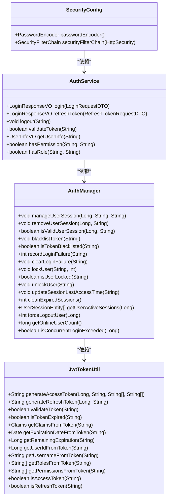
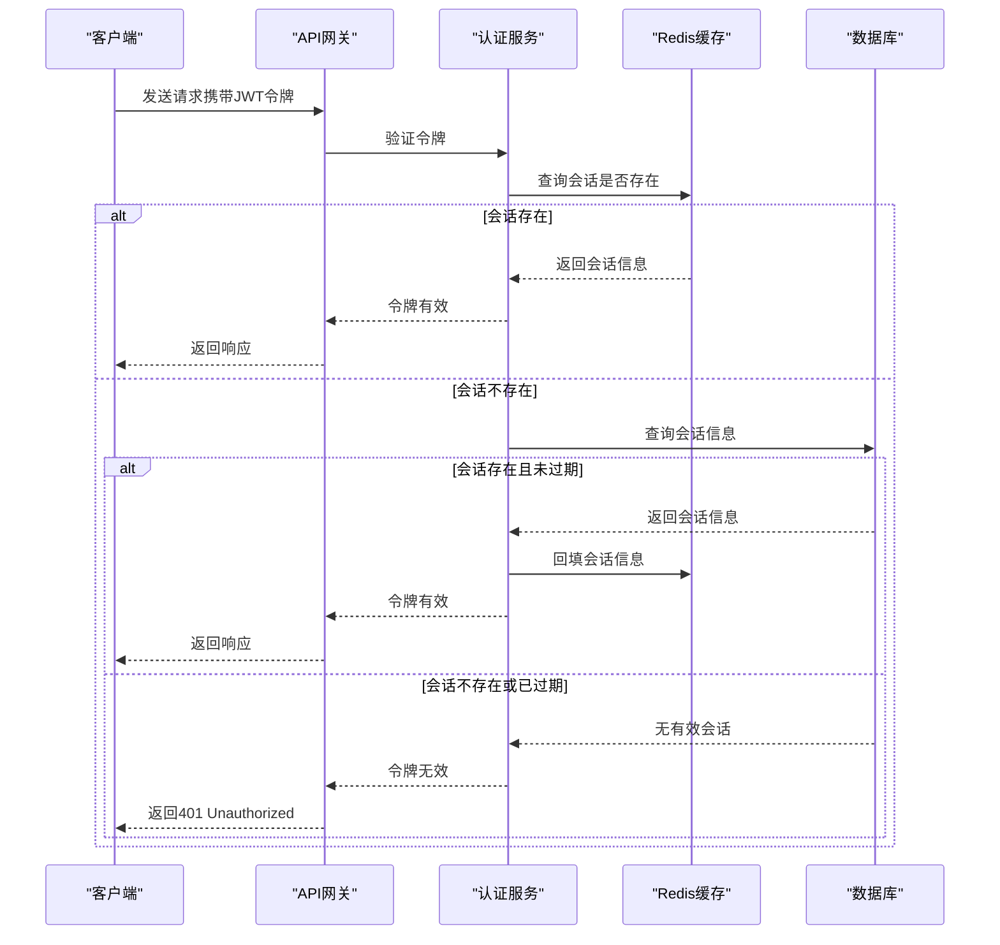
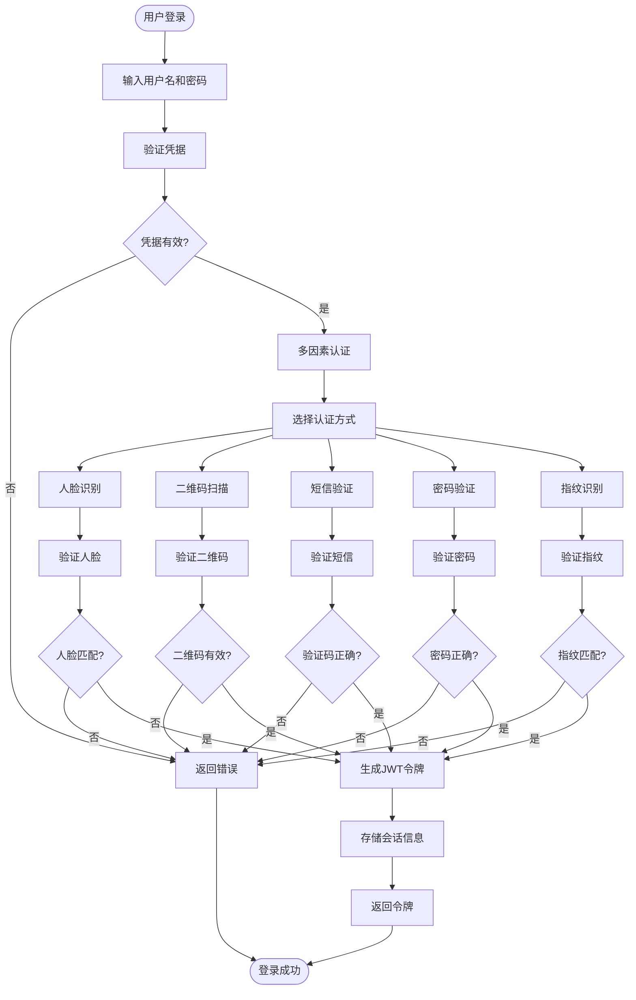

# 认证机制

<cite>
**本文档引用文件**   
- [SecurityConfig.java](file://microservices/microservices-common/src/main/java/net/lab1024/sa/common/auth/config/SecurityConfig.java)
- [AuthService.java](file://microservices/microservices-common/src/main/java/net/lab1024/sa/common/auth/service/AuthService.java)
- [AuthManager.java](file://microservices/microservices-common/src/main/java/net/lab1024/sa/common/auth/manager/AuthManager.java)
- [JwtTokenUtil.java](file://microservices/microservices-common/src/main/java/net/lab1024/sa/common/auth/util/JwtTokenUtil.java)
- [VisitorMobileController.java](file://microservices/ioedream-visitor-service/src/main/java/net/lab1024/sa/visitor/controller/VisitorMobileController.java)
- [VisitorController.java](file://microservices/ioedream-visitor-service/src/main/java/net/lab1024/sa/visitor/controller/VisitorController.java)
- [12-前端API接口设计.md](file://documentation/03-业务模块/访客/12-前端API接口设计.md)
- [13-前端移动端组件设计.md](file://documentation/03-业务模块/访客/13-前端移动端组件设计.md)
</cite>

## 目录
1. [引言](#引言)
2. [第三方数据源认证机制](#第三方数据源认证机制)
3. [认证方式实现原理与安全特性](#认证方式实现原理与安全特性)
4. [配置示例与使用场景分析](#配置示例与使用场景分析)
5. [令牌刷新机制、会话管理与认证缓存策略](#令牌刷新机制会话管理与认证缓存策略)
6. [多因素认证集成方法与安全增强措施](#多因素认证集成方法与安全增强措施)

## 引言
本文件详细说明访客系统支持的多种第三方数据源认证机制，涵盖API Key、OAuth2、用户名密码、证书认证等多种方式。文档将深入解析每种认证方式的实现原理和安全特性，提供配置示例和使用场景分析，并描述令牌刷新机制、会话管理和认证缓存策略。此外，文档还将说明多因素认证的集成方法和安全增强措施，确保系统的安全性与可靠性。

## 第三方数据源认证机制
访客系统通过多种认证机制支持第三方数据源的身份验证，以确保系统的安全性和灵活性。这些机制包括API Key、OAuth2、用户名密码、证书认证等。

### API Key 认证
API Key是一种简单的认证方式，客户端在请求中携带预分配的密钥进行身份验证。系统通过验证密钥的有效性来确认请求来源的合法性。

### OAuth2 认证
OAuth2是一种广泛使用的授权框架，允许第三方应用在用户授权的情况下访问受保护资源。系统支持OAuth2的授权码模式和客户端凭证模式，适用于不同场景下的身份验证需求。

### 用户名密码认证
用户名密码认证是最常见的认证方式，用户通过提供用户名和密码进行身份验证。系统采用BCrypt算法对密码进行加密存储，确保密码的安全性。

### 证书认证
证书认证利用数字证书进行身份验证，适用于高安全要求的场景。客户端在请求中携带数字证书，服务器通过验证证书的有效性来确认客户端身份。

**Section sources**
- [SecurityConfig.java](file://microservices/microservices-common/src/main/java/net/lab1024/sa/common/auth/config/SecurityConfig.java)
- [AuthService.java](file://microservices/microservices-common/src/main/java/net/lab1024/sa/common/auth/service/AuthService.java)

## 认证方式实现原理与安全特性
### 实现原理
访客系统的认证机制基于Spring Security框架实现，结合JWT（JSON Web Token）进行无状态会话管理。系统通过`SecurityConfig`类配置安全规则，定义公开接口和受保护接口的访问权限。`AuthService`接口提供了登录、刷新令牌、登出等核心功能，而`AuthManager`类负责复杂的认证业务流程编排，如多级缓存管理、会话管理和并发控制。

### 安全特性
- **BCrypt密码加密**：系统使用BCrypt算法对用户密码进行加密存储，确保即使数据库泄露，密码也无法被轻易破解。
- **无状态会话管理**：采用JWT令牌进行身份验证，避免了传统会话管理中的服务器端状态存储，提高了系统的可扩展性。
- **CORS跨域配置**：支持跨域请求，同时通过严格的CORS策略防止跨站请求伪造攻击。
- **CSRF防护**：禁用CSRF保护，因为JWT令牌本身具有防重放攻击的能力。
- **多级缓存策略**：结合Redis和本地缓存，提高会话验证的性能，同时保证数据的一致性。
- **防暴力破解**：通过记录登录失败次数和自动账户锁定机制，防止暴力破解攻击。



**Diagram sources **
- [SecurityConfig.java](file://microservices/microservices-common/src/main/java/net/lab1024/sa/common/auth/config/SecurityConfig.java)
- [AuthService.java](file://microservices/microservices-common/src/main/java/net/lab1024/sa/common/auth/service/AuthService.java)
- [AuthManager.java](file://microservices/microservices-common/src/main/java/net/lab1024/sa/common/auth/manager/AuthManager.java)
- [JwtTokenUtil.java](file://microservices/microservices-common/src/main/java/net/lab1024/sa/common/auth/util/JwtTokenUtil.java)

## 配置示例与使用场景分析
### 配置示例
#### API Key 配置
```yaml
auth:
  api-key:
    enabled: true
    header: X-API-KEY
    secret: your-secret-key
```

#### OAuth2 配置
```yaml
spring:
  security:
    oauth2:
      client:
        registration:
          google:
            client-id: your-client-id
            client-secret: your-client-secret
            scope: profile,email
            redirect-uri: "{baseUrl}/login/oauth2/code/{registrationId}"
```

#### 用户名密码认证配置
```yaml
auth:
  jwt:
    secret: ioedream-jwt-secret-key-2025-must-be-at-least-256-bits
    access-token-expiration: 86400
    refresh-token-expiration: 604800
```

#### 证书认证配置
```yaml
server:
  ssl:
    key-store: classpath:keystore.jks
    key-store-password: your-password
    trust-store: classpath:truststore.jks
    trust-store-password: your-password
```

### 使用场景分析
- **API Key**：适用于内部系统之间的调用，如微服务间的通信，确保调用方的合法性。
- **OAuth2**：适用于第三方应用接入，如社交媒体登录，允许用户授权第三方应用访问其资源。
- **用户名密码**：适用于普通用户的登录，如员工登录系统，提供基本的身份验证。
- **证书认证**：适用于高安全要求的场景，如金融系统或政府机构，确保通信双方的身份可信。

**Section sources**
- [application.yml](file://microservices/ioedream-visitor-service/src/main/resources/application.yml)

## 令牌刷新机制、会话管理与认证缓存策略
### 令牌刷新机制
系统采用JWT令牌进行身份验证，令牌分为访问令牌（Access Token）和刷新令牌（Refresh Token）。访问令牌的有效期较短，通常为24小时，而刷新令牌的有效期较长，通常为7天。当访问令牌过期时，客户端可以使用刷新令牌请求新的访问令牌，从而延长会话的有效期。

### 会话管理
系统通过`AuthManager`类管理用户会话，支持多级缓存策略。会话信息首先存储在Redis中，作为二级缓存，同时在数据库中持久化存储。当用户登录时，系统会检查当前会话数量，如果超过最大会话数，则移除最旧的会话。用户登出时，系统会将令牌加入黑名单，防止令牌重放攻击。

### 认证缓存策略
系统采用多级缓存策略，提高会话验证的性能。一级缓存为本地缓存，二级缓存为Redis，三级缓存为数据库。当验证会话时，系统首先查询Redis，如果未命中，则查询数据库并将结果回填到Redis中。



**Diagram sources **
- [AuthManager.java](file://microservices/microservices-common/src/main/java/net/lab1024/sa/common/auth/manager/AuthManager.java)
- [JwtTokenUtil.java](file://microservices/microservices-common/src/main/java/net/lab1024/sa/common/auth/util/JwtTokenUtil.java)

## 多因素认证集成方法与安全增强措施
### 多因素认证集成方法
系统支持多因素认证（MFA），结合多种认证方式提高安全性。例如，用户在登录时除了提供用户名和密码外，还需通过短信验证码或指纹识别进行二次验证。系统通过`VisitorMobileController`类提供移动端的多因素认证接口，支持人脸识别、二维码扫描、短信验证、密码验证和指纹识别等多种方式。

### 安全增强措施
- **多级缓存同步**：确保会话信息在本地缓存、Redis和数据库之间的一致性，防止数据不一致导致的安全问题。
- **令牌黑名单管理**：用户登出时，系统将令牌加入黑名单，防止令牌重放攻击。
- **登录安全策略**：通过记录登录失败次数和自动账户锁定机制，防止暴力破解攻击。
- **并发登录控制**：限制同一用户的同时登录会话数，防止账号共享。
- **强制下线**：管理员可以强制下线用户的会话，及时处理异常账户。



**Diagram sources **
- [VisitorMobileController.java](file://microservices/ioedream-visitor-service/src/main/java/net/lab1024/sa/visitor/controller/VisitorMobileController.java)
- [13-前端移动端组件设计.md](file://documentation/03-业务模块/访客/13-前端移动端组件设计.md)