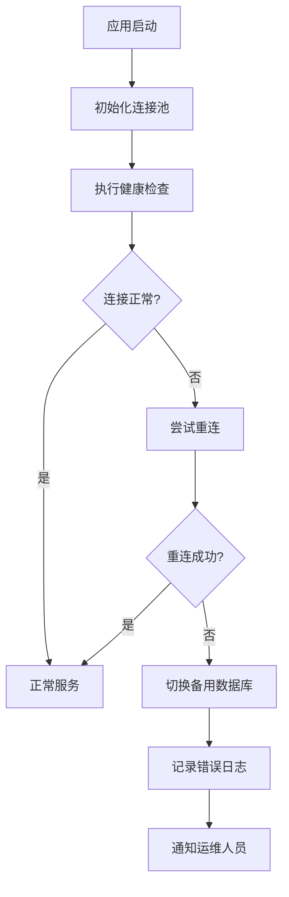
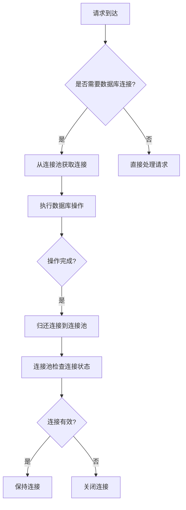

# 连接管理

<cite>
**本文档引用的文件**   
- [DRUID_CONNECTION_POOL_CONFIGURATION.md](file://documentation/deployment/DRUID_CONNECTION_POOL_CONFIGURATION.md)
- [application.yml](file://microservices/ioedream-visitor-service/src/main/resources/application.yml)
- [secure-application.yml](file://templates/secure-application.yml)
- [fix-hikari-to-druid.ps1](file://scripts/fix-hikari-to-druid.ps1)
- [HealthCheckController.java](file://restful_refactor_backup_20251202_014224/microservices_microservices-common_src_main_java_net_lab1024_sa_common_controller_HealthCheckController.java)
- [SystemHealthController.java](file://restful_refactor_backup_20251202_014224/microservices_ioedream-monitor-service_src_main_java_net_lab1024_sa_monitor_controller_SystemHealthController.java)
- [docker-compose-monitoring.yml](file://deployment/monitoring/docker-compose-monitoring.yml)
- [visitor-module-architecture.md](file://documentation/03-业务模块/访客/visitor-module-architecture.md)
</cite>

## 目录
1. [连接池配置与性能调优](#连接池配置与性能调优)
2. [连接状态监控与健康检查](#连接状态监控与健康检查)
3. [长连接与短连接管理策略](#长连接与短连接管理策略)
4. [连接泄漏检测与资源回收](#连接泄漏检测与资源回收)
5. [连接统计信息收集与展示](#连接统计信息收集与展示)

## 连接池配置与性能调优

访客系统采用Druid连接池作为数据库连接管理的核心组件，替代了原有的HikariCP连接池。该变更通过`fix-hikari-to-druid.ps1`脚本批量完成，确保了所有微服务的一致性。

### 连接池配置参数

连接池的核心配置参数如下表所示：

| 参数 | 说明 | 推荐值 | 说明 |
|------|------|--------|------|
| `initial-size` | 初始连接数 | 10 | 根据并发量调整 |
| `min-idle` | 最小空闲连接数 | 10 | 保持的最小连接数 |
| `max-active` | 最大活跃连接数 | 50 | 根据数据库性能调整 |
| `max-wait` | 获取连接最大等待时间 | 60000 | 单位：毫秒 |

### 性能调优方法

根据不同的应用场景，提供以下性能调优建议：

**高并发场景**：
```yaml
initial-size: 20
min-idle: 20
max-active: 100
```

**低并发场景**：
```yaml
initial-size: 5
min-idle: 5
max-active: 20
```

**数据库性能较差场景**：
```yaml
max-active: 30
max-wait: 120000  # 增加等待时间
```

连接池配置还包含连接有效性检测机制，包括`validation-query: SELECT 1`用于验证连接，`test-while-idle: true`在空闲时检测连接有效性，而`test-on-borrow: false`和`test-on-return: false`则避免了借用和归还时的性能开销。

**Section sources**
- [DRUID_CONNECTION_POOL_CONFIGURATION.md](file://documentation/deployment/DRUID_CONNECTION_POOL_CONFIGURATION.md#L1-L186)
- [application.yml](file://microservices/ioedream-visitor-service/src/main/resources/application.yml#L1-L83)
- [secure-application.yml](file://templates/secure-application.yml#L40-L84)

## 连接状态监控与健康检查

系统实现了全面的连接状态监控和健康检查机制，确保数据库连接的稳定性和可靠性。

### 健康检查机制

系统通过Actuator监控端点提供健康检查功能，配置如下：
```yaml
management:
  endpoints:
    web:
      exposure:
        include: health,info,metrics,prometheus
  endpoint:
    health:
      show-details: when-authorized
```

健康检查包括数据库连接、缓存状态、表健康、索引状态和碎片情况等多个维度。系统会定期检查这些组件的状态，并返回总体健康状态。

### 故障转移机制

当检测到数据库连接异常时，系统会自动执行故障转移策略。健康检查管理器会尝试重新建立连接，并在必要时切换到备用数据库。同时，系统会记录详细的错误日志，便于后续分析和处理。



**Diagram sources**
- [SystemHealthController.java](file://restful_refactor_backup_20251202_014224/microservices_ioedream-monitor-service_src_main_java_net_lab1024_sa_monitor_controller_SystemHealthController.java#L1-L137)
- [HealthCheckController.java](file://restful_refactor_backup_20251202_014224/microservices_microservices-common_src_main_java_net_lab1024_sa_common_controller_HealthCheckController.java#L1-L47)

**Section sources**
- [SystemHealthController.java](file://restful_refactor_backup_20251202_014224/microservices_ioedream-monitor-service_src_main_java_net_lab1024_sa_monitor_controller_SystemHealthController.java#L1-L137)
- [HealthCheckController.java](file://restful_refactor_backup_20251202_014224/microservices_microservices-common_src_main_java_net_lab1024_sa_common_controller_HealthCheckController.java#L1-L47)

## 长连接与短连接管理策略

系统根据不同的业务场景采用不同的连接管理策略。

### 长连接使用场景

长连接主要用于需要频繁访问数据库的业务场景，如访客登记、预约查询等。长连接可以减少连接建立和关闭的开销，提高系统性能。

### 短连接使用场景

短连接适用于一次性或低频次的数据库操作，如系统配置更新、批量数据导入等。短连接可以避免长时间占用数据库连接资源。

### 管理策略

系统通过连接池统一管理长连接和短连接。连接池会根据配置参数自动回收空闲连接，确保资源的有效利用。同时，系统会监控连接的使用情况，及时发现和处理异常连接。



**Diagram sources**
- [visitor-module-architecture.md](file://documentation/03-业务模块/访客/visitor-module-architecture.md#L22-L155)

**Section sources**
- [visitor-module-architecture.md](file://documentation/03-业务模块/访客/visitor-module-architecture.md#L22-L155)

## 连接泄漏检测与资源回收

系统实现了完善的连接泄漏检测和资源回收机制，确保数据库连接资源的有效管理。

### 连接泄漏检测

Druid连接池内置了连接泄漏检测功能，通过以下配置启用：
```yaml
druid:
  filter:
    stat:
      enabled: true
      log-slow-sql: true
      slow-sql-millis: 1000
```

当连接的使用时间超过指定阈值时，系统会记录慢SQL日志，便于开发人员定位潜在的连接泄漏问题。

### 资源回收实现方案

系统通过以下机制实现资源的自动回收：

1. **空闲连接回收**：配置`time-between-eviction-runs-millis: 60000`，每60秒检查一次空闲连接。
2. **最小空闲时间**：配置`min-evictable-idle-time-millis: 300000`，连接空闲超过5分钟才会被回收。
3. **预编译语句池**：启用`pool-prepared-statements: true`，提高SQL执行效率。

此外，系统还实现了连接的优雅关闭机制，确保在应用关闭时所有数据库连接都能被正确释放。

**Section sources**
- [DRUID_CONNECTION_POOL_CONFIGURATION.md](file://documentation/deployment/DRUID_CONNECTION_POOL_CONFIGURATION.md#L1-L186)
- [secure-application.yml](file://templates/secure-application.yml#L40-L84)

## 连接统计信息收集与展示

系统通过Prometheus和Grafana实现连接统计信息的收集和可视化展示。

### 统计信息收集

系统通过Actuator的metrics端点收集连接相关的统计信息，包括：
- 活跃连接数
- 等待连接数
- 连接池利用率
- SQL执行时间

这些指标通过Prometheus定时抓取，并存储在时间序列数据库中。

### 信息展示方法

Grafana仪表板提供了直观的连接状态可视化，包括：
- 连接池使用率趋势图
- 活跃连接数实时监控
- 慢SQL统计分析
- 数据库响应时间分布


运维人员可以通过Grafana仪表板实时监控数据库连接状态，及时发现和解决性能瓶颈。

**Diagram sources**
- [docker-compose-monitoring.yml](file://deployment/monitoring/docker-compose-monitoring.yml#L1-L109)

**Section sources**
- [docker-compose-monitoring.yml](file://deployment/monitoring/docker-compose-monitoring.yml#L1-L109)