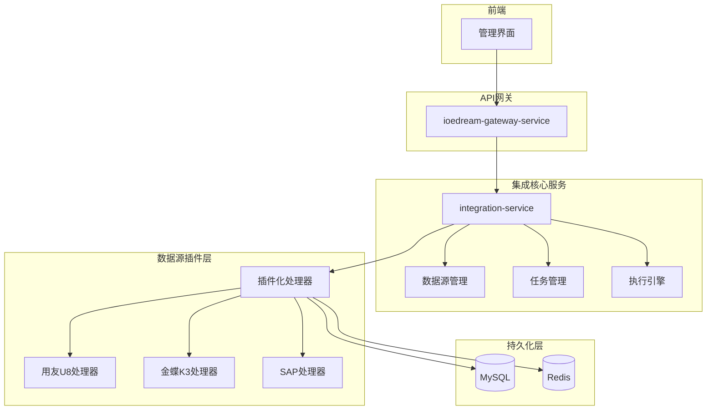
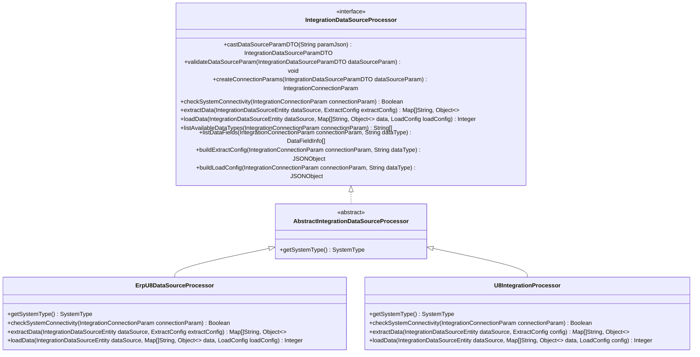
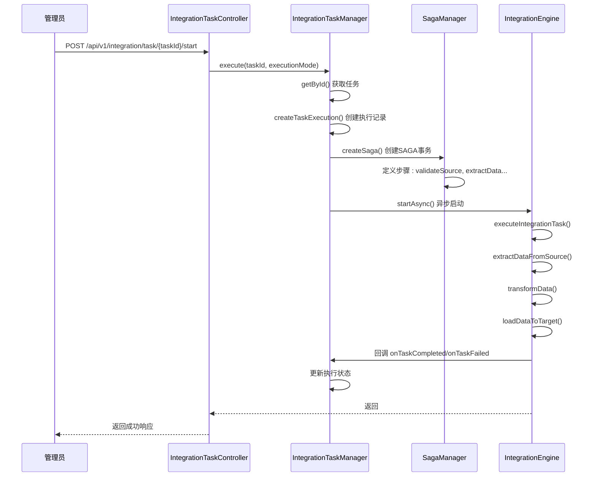
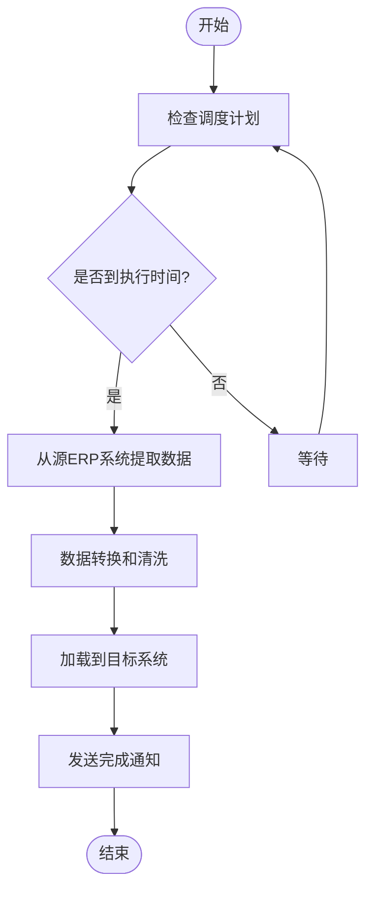

# ERP系统适配器

<cite>
**本文档引用的文件**  
- [第三方系统集成实现方案.md](file://documentation/03-业务模块/第三方系统集成实现方案.md)
- [spec.md](file://openspec/changes/archive/completed-proposals/implement-third-party-system-integration/specs/third-party-system-integration/spec.md)
</cite>

## 目录
1. [引言](#引言)
2. [系统架构与设计](#系统架构与设计)
3. [核心组件分析](#核心组件分析)
4. [适配器连接与认证](#适配器连接与认证)
5. [数据同步策略](#数据同步策略)
6. [数据映射规则](#数据映射规则)
7. [异常处理与事务管理](#异常处理与事务管理)
8. [配置与切换机制](#配置与切换机制)
9. [代码示例与接口调用](#代码示例与接口调用)
10. [总结](#总结)

## 引言

本文档详细阐述了IOE-DREAM智能管理系统中ERP系统适配器的设计与实现。该适配器旨在提供一个企业级、开箱即用的解决方案，用于无缝集成用友U8、金蝶K3、SAP等主流ERP系统。文档将深入探讨适配器的连接配置、认证协议、数据同步模式、数据映射规则以及异常处理机制，并解释其在保障数据一致性、事务管理和错误重试方面的设计考量。

**Section sources**
- [第三方系统集成实现方案.md](file://documentation/03-业务模块/第三方系统集成实现方案.md#L1-L20)

## 系统架构与设计

ERP系统适配器是IOE-DREAM七微服务架构中的关键组成部分，它遵循严格的四层架构规范（Controller → Service → Manager → DAO），确保了代码的清晰度和可维护性。整个集成平台采用微服务架构，核心服务为`ioedream-integration-service`，它通过API网关对外提供服务。

适配器的设计基于插件化和SPI（Service Provider Interface）机制，实现了高度的可扩展性。不同的ERP系统通过实现统一的`IntegrationDataSourceProcessor`接口来提供具体的集成能力。这种设计使得新增一个ERP系统支持变得非常简单，只需开发一个对应的处理器插件并注册即可，无需修改核心引擎代码。



**Diagram sources**
- [第三方系统集成实现方案.md](file://documentation/03-业务模块/第三方系统集成实现方案.md#L114-L192)

**Section sources**
- [第三方系统集成实现方案.md](file://documentation/03-业务模块/第三方系统集成实现方案.md#L45-L203)

## 核心组件分析

### IntegrationDataSourceProcessor 接口

`IntegrationDataSourceProcessor`是所有ERP适配器必须实现的核心接口，它定义了一套标准化的操作契约，确保了不同厂商适配器的一致性。



**Diagram sources**
- [第三方系统集成实现方案.md](file://documentation/03-业务模块/第三方系统集成实现方案.md#L581-L602)
- [第三方系统集成实现方案.md](file://documentation/03-业务模块/第三方系统集成实现方案.md#L517-L575)
- [第三方系统集成实现方案.md](file://documentation/03-业务模块/第三方系统集成实现方案.md#L1569-L1688)

**Section sources**
- [第三方系统集成实现方案.md](file://documentation/03-业务模块/第三方系统集成实现方案.md#L517-L602)

### IntegrationTaskManager 任务执行管理器

`IntegrationTaskManager`是集成任务的执行核心，负责任务的生命周期管理、状态跟踪和分布式事务协调。它采用SAGA模式来确保跨系统操作的数据一致性。



**Diagram sources**
- [第三方系统集成实现方案.md](file://documentation/03-业务模块/第三方系统集成实现方案.md#L396-L507)
- [第三方系统集成实现方案.md](file://documentation/03-业务模块/第三方系统集成实现方案.md#L716-L742)

**Section sources**
- [第三方系统集成实现方案.md](file://documentation/03-业务模块/第三方系统集成实现方案.md#L386-L507)

## 适配器连接与认证

### 连接配置方式

配置一个ERP系统数据源是集成的第一步。用户通过管理界面或API提供必要的连接参数。以用友U8为例，其连接参数通常包括：

- **apiUrl**: ERP系统的API基础地址。
- **username** 和 **password**: 用于API认证的凭据。
- **database**: 需要连接的数据库名称（用于数据库直连方式）。

这些参数以JSON格式存储在`integration_data_source`表的`connection_params`字段中。

### 认证协议

适配器支持多种认证方式，以适应不同ERP系统的安全要求：

1.  **API Key/用户名密码**: 适用于用友U8、金蝶K3等系统。连接参数中的`username`和`password`会被用于HTTP Basic Auth或作为API调用的参数。
2.  **OAuth2**: 适用于钉钉、企业微信等现代云服务。系统会引导用户完成OAuth2授权流程，获取`access_token`并安全地存储，后续API调用均使用此令牌。
3.  **数据库直连**: 对于支持数据库访问的ERP系统（如用友U8），适配器可以直接通过JDBC连接其后台数据库，使用数据库的用户名和密码进行认证。

所有敏感信息（如密码、access_token）在存储前都会进行加密处理，确保数据安全。

**Section sources**
- [第三方系统集成实现方案.md](file://documentation/03-业务模块/第三方系统集成实现方案.md#L764-L768)
- [spec.md](file://openspec/changes/archive/completed-proposals/implement-third-party-system-integration/specs/third-party-system-integration/spec.md#L21-L24)

## 数据同步策略

适配器支持灵活的数据同步模式，以满足不同的业务需求。

### 实时同步

实时同步通常通过Webhook或消息队列实现。当ERP系统中的数据发生变化时，它会主动向IOE-DREAM系统推送变更事件。IOE-DREAM的适配器监听这些事件，并立即触发相应的数据处理流程，确保目标系统能近乎实时地获得最新数据。这种方式延迟最低，但对网络和系统稳定性要求较高。

### 定时同步

定时同步是更常见和可靠的模式。通过集成Quartz和Nacos的分布式调度引擎，可以配置任务按Cron表达式定期执行。例如，可以设置一个任务每天凌晨2点从用友U8同步员工数据。



**Diagram sources**
- [第三方系统集成实现方案.md](file://documentation/03-业务模块/第三方系统集成实现方案.md#L905-L910)
- [spec.md](file://openspec/changes/archive/completed-proposals/implement-third-party-system-integration/specs/third-party-system-integration/spec.md#L101-L105)

**Section sources**
- [第三方系统集成实现方案.md](file://documentation/03-业务模块/第三方系统集成实现方案.md#L833-L867)

## 数据映射规则

数据映射是连接不同系统的关键环节，它定义了如何将源系统的数据字段转换为目标系统的字段。

### 映射配置

映射规则通过JSON配置，支持多种映射类型：
- **DIRECT_MAPPING**: 直接映射，将源字段的值直接赋给目标字段。
- **LOOKUP_MAPPING**: 查找映射，根据源字段的值在预定义的映射表（如`department_mapping`）中查找对应的目标值。
- **DATE_FORMAT**: 日期格式转换，将源日期字符串转换为目标系统要求的格式。

### 数据转换与清洗

除了简单的字段映射，适配器还支持复杂的数据转换和清洗：
- **数据类型转换**: 如将字符串转换为数字或日期。
- **自定义函数**: 支持JavaScript等脚本语言编写复杂的转换逻辑。
- **数据验证**: 在加载前验证数据的完整性，如检查必填字段是否为空。
- **数据清洗**: 去除无效字符、统一格式等。

**Section sources**
- [第三方系统集成实现方案.md](file://documentation/03-业务模块/第三方系统集成实现方案.md#L938-L967)
- [spec.md](file://openspec/changes/archive/completed-proposals/implement-third-party-system-integration/specs/third-party-system-integration/spec.md#L71-L75)

## 异常处理与事务管理

### SAGA分布式事务

为了保证跨系统操作的数据一致性，适配器采用了SAGA模式。一个集成任务被分解为一系列步骤（如验证、提取、转换、加载），每个步骤都有一个对应的补偿操作。如果某个步骤失败，SAGA协调器会自动执行之前所有成功步骤的补偿操作，将系统状态回滚到初始状态，避免了数据不一致的问题。

### 错误重试机制

适配器内置了智能的错误重试策略：
- **可配置的重试次数**: 可以在配置中指定最大重试次数。
- **指数退避**: 重试间隔时间会逐渐增加（如5秒、15秒、30秒），避免对目标系统造成过大压力。
- **错误分类处理**: 系统会区分网络超时、认证失败、数据异常等不同类型的错误，并采取不同的处理策略。

### 数据一致性保障

- **幂等性设计**: 数据加载操作设计为幂等的，即使同一批数据被重复加载，也不会产生重复记录。
- **版本控制**: 记录数据的变更历史，支持在必要时进行数据回滚。
- **冲突解决策略**: 当数据冲突时，支持多种策略，如“以ERP为准”、“以本地为准”或“手动解决”。

**Section sources**
- [第三方系统集成实现方案.md](file://documentation/03-业务模块/第三方系统集成实现方案.md#L420-L427)
- [spec.md](file://openspec/changes/archive/completed-proposals/implement-third-party-system-integration/specs/third-party-system-integration/spec.md#L135-L151)

## 配置与切换机制

### 配置文件驱动

整个集成平台的行为可以通过Nacos配置中心进行灵活调整。例如，`application.yml`中的`integration`部分可以配置不同ERP系统的超时时间、重试次数、批处理大小等参数。

```yaml
integration:
  systems:
    erp:
      u8:
        api-timeout: 30000
        retry-times: 3
        batch-size: 1000
      k3:
        api-timeout: 45000
        retry-times: 2
        batch-size: 500
```

### 灵活切换实现

通过SPI机制，系统在启动时会自动扫描并加载所有实现了`IntegrationDataSourceProcessor`接口的类。当需要切换不同的ERP厂商实现时，只需在配置中指定`system_type`（如`ERP_U8`, `ERP_K3`），系统就会通过`IntegrationDataSourceProcessorProvider`获取对应的处理器实例。这种设计完全解耦了核心引擎与具体实现，使得切换和扩展变得非常简单。

**Section sources**
- [第三方系统集成实现方案.md](file://documentation/03-业务模块/第三方系统集成实现方案.md#L2355-L2389)
- [第三方系统集成实现方案.md](file://documentation/03-业务模块/第三方系统集成实现方案.md#L378-L380)

## 代码示例与接口调用

### 获取员工薪资信息

通过配置一个从ERP到内部系统的同步任务，可以获取员工薪资信息。核心流程在`U8IntegrationProcessor`中实现：

```java
@Override
public List<Map<String, Object>> extractData(IntegrationDataSourceEntity dataSource, ExtractConfig config) {
    U8ApiClient client = createU8Client(dataSource);
    // 当数据类型为薪资时，调用特定的API
    if (config.getDataType() == ExtractDataType.SALARY) {
        return client.getSalaryData(config.getParams());
    }
    // ... 其他数据类型
}
```

### 获取部门组织架构

```java
private List<Map<String, Object>> extractDepartments(U8ApiClient client, ExtractConfig config) {
    // 构建查询参数，查询HR部门表
    U8QueryParams params = U8QueryParams.builder()
        .table("HR_Department")
        .fields(config.getFields())
        .build();
    // 执行查询并返回结果
    return client.query(params).getData();
}
```

### 获取财务账户数据

```java
@Override
public Integer loadData(IntegrationDataSourceEntity dataSource, List<Map<String, Object>> data, LoadConfig config) {
    U8ApiClient client = createU8Client(dataSource);
    // 当数据类型为财务账户时，执行写入操作
    if (config.getDataType() == LoadDataType.FINANCIAL_ACCOUNTS) {
        return client.batchWriteFinancialAccounts(convertToU8Accounts(data));
    }
    return 0;
}
```

**Section sources**
- [第三方系统集成实现方案.md](file://documentation/03-业务模块/第三方系统集成实现方案.md#L1604-L1607)
- [第三方系统集成实现方案.md](file://documentation/03-业务模块/第三方系统集成实现方案.md#L1613-L1643)
- [第三方系统集成实现方案.md](file://documentation/03-业务模块/第三方系统集成实现方案.md#L1649-L1658)

## 总结

IOE-DREAM的ERP系统适配器通过插件化、SPI机制和SAGA分布式事务，构建了一个强大、灵活且可靠的集成平台。它不仅支持与用友U8、金蝶K3、SAP等主流ERP系统的深度集成，还通过标准化的接口和配置，实现了连接、认证、同步、映射和异常处理的全流程管理。该设计确保了数据的一致性和系统的高可用性，为企业打通数据孤岛、实现业务流程自动化提供了坚实的技术基础。