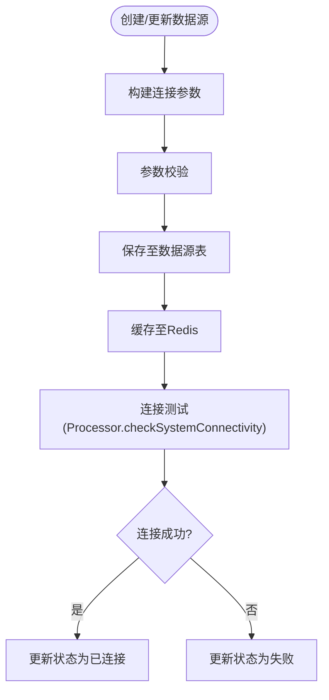

# HR系统适配器

<cite>
**本文引用的文件**
- [第三方系统集成实现方案.md](file://documentation/03-业务模块/第三方系统集成实现方案.md)
- [HR系统集成适配器规格.md](file://openspec/changes/archive/completed-proposals/implement-third-party-system-integration/specs/third-party-system-integration/spec.md)
- [EmployeeEntity.java](file://microservices/microservices-common/src/main/java/net/lab1024/sa/common/system/employee/domain/entity/EmployeeEntity.java)
- [EmployeeVO.java](file://microservices/microservices-common/src/main/java/net/lab1024/sa/common/system/employee/domain/vo/EmployeeVO.java)
- [EmployeeServiceImpl.java](file://microservices/microservices-common/src/main/java/net/lab1024/sa/common/system/employee/service/impl/EmployeeServiceImpl.java)
- [t_employee.sql](file://database-scripts/common-service/18-t_employee.sql)
- [Employee vs User 区别.md](file://documentation/archive/reports-2025-12-04/EMPLOYEE_VS_USER_COMPARISON.md)
- [安全体系强化改造指南.md](file://security/security_hardening_guide.md)
- [生产安全检查清单.md](file://PRODUCTION_SECURITY_CHECKLIST.md)
- [secure-application.yml](file://templates/secure-application.yml)
- [事件订阅页面功能布局文档_完善版.md](file://smart-admin-web-javascript/AI开发文档/事件订阅页面功能布局文档_完善版.md)
</cite>

## 目录
1. [简介](#简介)
2. [项目结构](#项目结构)
3. [核心组件](#核心组件)
4. [架构总览](#架构总览)
5. [详细组件分析](#详细组件分析)
6. [依赖分析](#依赖分析)
7. [性能考虑](#性能考虑)
8. [故障排查指南](#故障排查指南)
9. [结论](#结论)
10. [附录](#附录)

## 简介
本文件面向HR系统适配器的开发与集成，聚焦于与北森HR、Moka HR等系统的对接方案，涵盖员工数据全生命周期管理（入职、岗位变动、离职等事件的实时同步）、数据订阅模型、Webhook回调处理、增量数据拉取策略以及数据冲突解决规则。同时，结合项目现有能力，说明适配器在数据安全传输、权限验证与性能优化方面的实现要点与最佳实践。

## 项目结构
- 适配器能力由“第三方系统集成平台”提供，包含数据源管理、任务编排、执行引擎、监控告警等模块，支持多系统（含HR系统）的统一接入。
- 员工数据在本地系统中以“员工档案”形式管理，与“用户账户”形成一对一体系，便于在HR数据回写与本地业务联动时进行关联。

**章节来源**
- file://documentation/03-业务模块/第三方系统集成实现方案.md#L113-L193
- file://documentation/archive/reports-2025-12-04/EMPLOYEE_VS_USER_COMPARISON.md#L180-L215

## 核心组件
- 数据源管理：负责HR系统（如北森、Moka）的连接参数配置、认证方式（OAuth2等）、连接测试与状态监控。
- 集成任务管理：定义从HR系统抽取、转换、加载到本地系统的任务，支持可视化配置、依赖关系、调度策略。
- 执行引擎：异步执行任务，串联“提取-转换-加载”，并提供状态回调与历史记录。
- 员工档案模块：提供员工基本信息、组织关系、人事信息、合同与薪资福利等字段，支撑HR数据落地与回写。
- 安全与权限：基于Nacos加密配置、敏感字段加密与脱敏、接口鉴权与限流、审计日志等。

**章节来源**
- file://documentation/03-业务模块/第三方系统集成实现方案.md#L206-L248
- file://documentation/03-业务模块/第三方系统集成实现方案.md#L252-L283
- file://documentation/03-业务模块/第三方系统集成实现方案.md#L606-L744
- file://microservices/microservices-common/src/main/java/net/lab1024/sa/common/system/employee/domain/entity/EmployeeEntity.java#L1-L234
- file://microservices/microservices-common/src/main/java/net/lab1024/sa/common/system/employee/domain/vo/EmployeeVO.java#L1-L260
- file://security/security_hardening_guide.md#L1-L120

## 架构总览
HR适配器采用“任务驱动 + 插件化处理器”的架构：
- 通过数据源插件（SPI）对接不同HR系统（北森、Moka等），实现连接测试、数据提取与加载。
- 任务定义包含“抽取配置、转换规则、加载策略、通知与重试”等，支持定时/手动/增量执行。
- 执行引擎负责异步调度、状态跟踪、异常处理与重试，结合监控告警实现可观测性。

**图表来源**
- [第三方系统集成实现方案.md](file://documentation/03-业务模块/第三方系统集成实现方案.md#L748-L800)
- [HR系统集成适配器规格.md](file://openspec/changes/archive/completed-proposals/implement-third-party-system-integration/specs/third-party-system-integration/spec.md#L307-L364)

**章节来源**
- file://documentation/03-业务模块/第三方系统集成实现方案.md#L195-L248
- file://openspec/changes/archive/completed-proposals/implement-third-party-system-integration/specs/third-party-system-integration/spec.md#L307-L364

## 详细组件分析

### 1) 数据源管理与连接测试（HR系统）
- 支持多种认证方式（API Key、OAuth2、用户名密码），敏感信息加密存储，连接池与心跳检测。
- 连接测试通过对应数据源处理器执行，返回连接状态并更新缓存。

**图表来源**
- [第三方系统集成实现方案.md](file://documentation/03-业务模块/第三方系统集成实现方案.md#L310-L383)

**章节来源**
- file://documentation/03-业务模块/第三方系统集成实现方案.md#L212-L248
- file://documentation/03-业务模块/第三方系统集成实现方案.md#L310-L383

### 2) 集成任务定义与执行（HR数据同步）
- 任务类型：员工数据同步（EMPLOYEE_SYNC），支持定时/手动执行。
- 任务配置：抽取配置（字段、过滤、分页）、转换规则（字段映射、清洗、验证）、加载策略（Upsert/Merge、冲突策略、批量大小）。
- 执行引擎：异步执行，状态回调，历史记录，异常重试与通知。

**图表来源**
- [第三方系统集成实现方案.md](file://documentation/03-业务模块/第三方系统集成实现方案.md#L606-L744)
- [HR系统集成适配器规格.md](file://openspec/changes/archive/completed-proposals/implement-third-party-system-integration/specs/third-party-system-integration/spec.md#L53-L95)

**章节来源**
- file://documentation/03-业务模块/第三方系统集成实现方案.md#L252-L283
- file://documentation/03-业务模块/第三方系统集成实现方案.md#L606-L744
- file://openspec/changes/archive/completed-proposals/implement-third-party-system-integration/specs/third-party-system-integration/spec.md#L53-L95

### 3) 员工数据全生命周期管理（入职/岗位变动/离职）
- 入职：新员工基本信息、合同信息、入职审批同步至本地系统，生成员工档案并关联用户账户。
- 在职：岗位变动、薪资调整、绩效评估等事件通过增量同步更新本地档案。
- 离职：离职流程、离职原因、后续安排同步处理，更新员工状态与归档。

**图表来源**
- [HR系统集成适配器规格.md](file://openspec/changes/archive/completed-proposals/implement-third-party-system-integration/specs/third-party-system-integration/spec.md#L337-L362)

**章节来源**
- file://openspec/changes/archive/completed-proposals/implement-third-party-system-integration/specs/third-party-system-integration/spec.md#L337-L362

### 4) 数据订阅模型与Webhook回调
- 事件订阅：支持模块/事件类型/推送方式（邮件、短信、微信、Webhook、WebSocket）等配置。
- Webhook：提供测试连接、失败重试、推送频率限制、权限控制与日志脱敏等安全建议。

**图表来源**
- [事件订阅页面功能布局文档_完善版.md](file://smart-admin-web-javascript/AI开发文档/事件订阅页面功能布局文档_完善版.md#L1203-L1395)
- [事件订阅页面功能布局文档_完善版.md](file://smart-admin-web-javascript/AI开发文档/事件订阅页面功能布局文档_完善版.md#L2298-L2460)

**章节来源**
- file://smart-admin-web-javascript/AI开发文档/事件订阅页面功能布局文档_完善版.md#L1203-L1395
- file://smart-admin-web-javascript/AI开发文档/事件订阅页面功能布局文档_完善版.md#L2298-L2460

### 5) 增量数据拉取策略
- 基于时间戳的增量：按最后更新时间获取增量数据。
- 基于日志/触发器/API轮询：通过数据库变更日志或API轮询实现增量同步。
- 分页与批量：支持分页与批量处理，避免超时与内存压力。

**章节来源**
- file://openspec/changes/archive/completed-proposals/implement-third-party-system-integration/specs/third-party-system-integration/spec.md#L329-L334

### 6) 数据冲突解决规则
- 加载模式：Upsert/Merge，支持冲突策略（如“源系统优先/目标系统优先/手动解决”）。
- 事务与回滚：批量写入采用事务管理，失败整批回滚。
- 错误处理与重试：智能错误分类、可配置重试策略、失败告警与人工干预。

**章节来源**
- file://openspec/changes/archive/completed-proposals/implement-third-party-system-integration/specs/third-party-system-integration/spec.md#L84-L95
- file://openspec/changes/archive/completed-proposals/implement-third-party-system-integration/specs/third-party-system-integration/spec.md#L135-L152

### 7) 适配器API使用示例（获取员工基本信息/组织关系/考勤规则）
- 员工基本信息/组织关系：通过本地系统提供的员工档案接口获取，字段覆盖员工基本信息、部门/岗位/职级、上级关系、入职/转正/离职日期等。
- 考勤规则：可参考考勤模块的基础信息接口设计，用于获取部门/岗位/职级等组织关系，辅助考勤策略配置。

**图表来源**
- [EmployeeEntity.java](file://microservices/microservices-common/src/main/java/net/lab1024/sa/common/system/employee/domain/entity/EmployeeEntity.java#L1-L234)
- [t_employee.sql](file://database-scripts/common-service/18-t_employee.sql#L25-L46)
- [Employee vs User 区别.md](file://documentation/archive/reports-2025-12-04/EMPLOYEE_VS_USER_COMPARISON.md#L180-L215)

**章节来源**
- file://microservices/microservices-common/src/main/java/net/lab1024/sa/common/system/employee/domain/vo/EmployeeVO.java#L1-L260
- file://microservices/microservices-common/src/main/java/net/lab1024/sa/common/system/employee/service/impl/EmployeeServiceImpl.java#L52-L110
- file://microservices/microservices-common/src/main/java/net/lab1024/sa/common/system/employee/service/impl/EmployeeServiceImpl.java#L135-L234

### 8) 数据安全传输、权限验证与性能优化
- 安全传输：HTTPS、Nacos加密配置（AES-256）、敏感字段加密存储（身份证、银行卡、薪资等）。
- 权限验证：接口鉴权、角色权限控制、审计日志记录、数据脱敏展示。
- 性能优化：连接池与复用、异步执行、线程池与队列容量、批量写入、内存与网络优化、监控与告警。

**章节来源**
- file://security/security_hardening_guide.md#L1-L120
- file://PRODUCTION_SECURITY_CHECKLIST.md#L139-L191
- file://templates/secure-application.yml#L1-L44
- file://documentation/03-业务模块/第三方系统集成实现方案.md#L606-L744

## 依赖分析
- 组件耦合：数据源管理与任务管理通过执行引擎解耦；执行引擎与HR系统通过处理器SPI解耦。
- 外部依赖：Nacos（配置/注册）、Redis（缓存）、MySQL（持久化）、第三方HR系统API/数据库。
- 潜在风险：连接超时/重试、网络抖动、API限流、数据一致性（SAGA分布式事务）。

**图表来源**
- [第三方系统集成实现方案.md](file://documentation/03-业务模块/第三方系统集成实现方案.md#L130-L193)

**章节来源**
- file://documentation/03-业务模块/第三方系统集成实现方案.md#L130-L193

## 性能考虑
- 并发与异步：执行引擎使用线程池与异步任务，支持高并发与任务排队。
- 批量与分页：批量写入与分页拉取，避免超时与内存压力。
- 监控与告警：实时性能指标、任务成功率、第三方系统可用性监控与智能告警。
- 资源限制：CPU/内存/网络/磁盘使用率阈值与任务优先级管理。

**章节来源**
- file://documentation/03-业务模块/第三方系统集成实现方案.md#L221-L277
- file://documentation/03-业务模块/第三方系统集成实现方案.md#L606-L744

## 故障排查指南
- 连接测试失败：检查认证参数、网络连通性、API可用性与令牌有效期。
- 任务执行异常：查看执行历史与日志，确认错误类型（网络/认证/数据异常），按重试策略处理。
- Webhook失败：验证URL、签名与权限，开启失败重试与频率限制，关注推送日志。
- 数据冲突：核对加载策略与冲突规则，必要时进行手动干预与数据修正。

**章节来源**
- file://documentation/03-业务模块/第三方系统集成实现方案.md#L310-L383
- file://openspec/changes/archive/completed-proposals/implement-third-party-system-integration/specs/third-party-system-integration/spec.md#L135-L152
- file://smart-admin-web-javascript/AI开发文档/事件订阅页面功能布局文档_完善版.md#L2298-L2460

## 结论
HR系统适配器依托统一的集成平台，具备完善的任务编排、插件化处理器、异步执行与监控告警能力，能够满足北森HR、Moka HR等系统的对接需求。通过增量同步、冲突解决与安全机制，实现员工数据全生命周期的稳定同步与合规管理。

## 附录
- 北森HR/Moka HR集成配置示例（任务定义、抽取/转换/加载参数、通知与重试）可参考“第三方系统集成实现方案”中的任务配置与示例。
- 员工档案字段与本地系统表结构可参考EmployeeEntity与t_employee.sql。

**章节来源**
- file://documentation/03-业务模块/第三方系统集成实现方案.md#L900-L1034
- file://microservices/microservices-common/src/main/java/net/lab1024/sa/common/system/employee/domain/entity/EmployeeEntity.java#L1-L234
- file://database-scripts/common-service/18-t_employee.sql#L25-L46