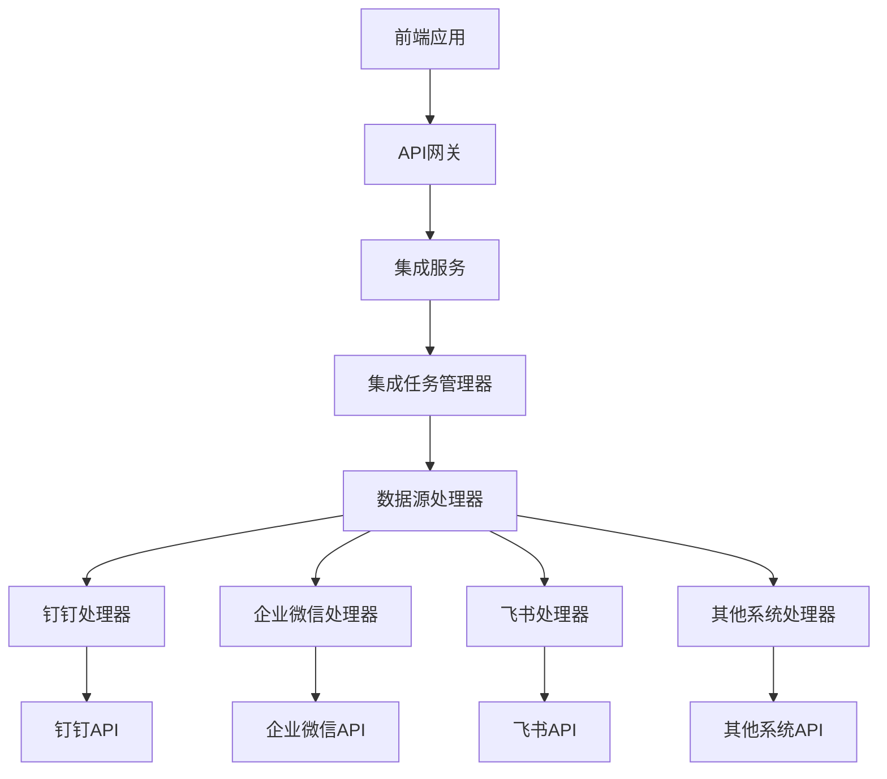
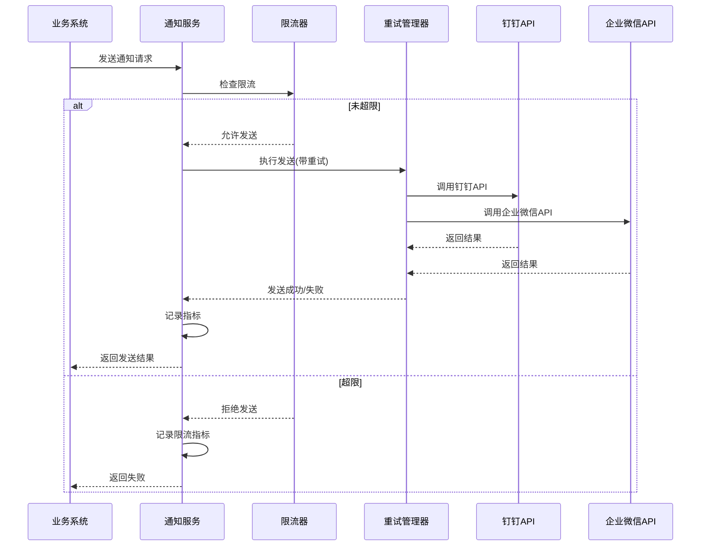

# OA系统适配器

<cite>
**本文档引用文件**  
- [DingTalkIntegrationProcessor.java](file://documentation\03-业务模块\第三方系统集成实现方案.md)
- [DingTalkNotificationManager.java](file://microservices\ioedream-common-service\src\main\java\net\lab1024\sa\common\notification\manager\DingTalkNotificationManager.java)
- [WechatNotificationManager.java](file://microservices\ioedream-common-service\src\main\java\net\lab1024\sa\common\notification\manager\WechatNotificationManager.java)
- [smart-workflow.md](file://documentation\technical\smart-workflow.md)
- [第三方系统集成实现方案.md](file://documentation\03-业务模块\第三方系统集成实现方案.md)
</cite>

## 目录
1. [引言](#引言)
2. [系统架构与集成设计](#系统架构与集成设计)
3. [审批流程双向集成机制](#审批流程双向集成机制)
4. [消息通知推送功能实现](#消息通知推送功能实现)
5. [多平台API差异处理案例](#多平台api差异处理案例)
6. [高并发场景下的异步处理策略](#高并发场景下的异步处理策略)
7. [总结](#总结)

## 引言

本文档旨在详细阐述OA系统适配器的设计与实现，重点说明其与钉钉、企业微信、飞书等主流办公平台的集成工作原理。适配器作为企业级数据同步的核心组件，实现了审批流程的双向集成、消息通知的统一推送以及高并发场景下的稳定处理。通过插件化架构和SPI机制，适配器能够灵活对接多种第三方OA系统，确保企业内部业务流程的自动化与数据一致性。

## 系统架构与集成设计

OA系统适配器采用微服务架构，基于Spring Boot 3.5 + Spring Cloud 2023构建，严格遵循四层架构规范（Controller→Service→Manager→DAO）。适配器通过插件化设计，利用Java SPI（Service Provider Interface）机制动态加载各第三方系统的处理器，实现了松耦合、高扩展性的集成能力。

适配器的核心是`IntegrationDataSourceProcessor`接口，所有第三方系统集成处理器均需实现该接口。通过`@AutoService`注解，处理器在应用启动时自动注册到`IntegrationDataSourceProcessorProvider`中，实现即插即用。

**Diagram sources**
- [第三方系统集成实现方案.md](file://documentation\03-业务模块\第三方系统集成实现方案.md)

## 审批流程双向集成机制

### 推送审批请求至第三方OA系统

当访客预约等业务需要审批时，系统通过适配器将审批请求推送到指定的第三方OA平台。此过程主要由`DingTalkIntegrationProcessor`或`WechatNotificationManager`等具体处理器实现。

1.  **请求构建**：根据审批模板和业务数据，构建符合目标平台API规范的请求体。例如，钉钉使用`DingTalkMessage`对象，企业微信使用`Map<String, Object>`结构。
2.  **身份认证**：获取访问令牌（access_token）。钉钉通过`getAccessToken()`方法获取，企业微信则通过`getAccessToken()`方法并利用Redis缓存Token，有效期2小时，提前5分钟刷新。
3.  **安全加签**：对于钉钉，若配置了密钥（secret），则使用HMAC-SHA256算法生成签名，并将时间戳和签名附加到Webhook URL上，确保请求的安全性。
4.  **异步发送**：调用`sendWithRetry()`方法，通过`RestTemplate`发送HTTP POST请求。该方法内置重试机制（最多3次，指数退避），并处理Token过期等异常情况。

### 接收审批结果回调

适配器通过Webhook或轮询方式接收第三方OA系统的审批结果回调。

1.  **回调接收**：系统暴露特定的HTTP端点（如`/api/v1/callback/dingtalk`）来接收钉钉的审批状态变更通知。
2.  **数据解析**：解析回调请求中的JSON数据，提取审批实例ID、审批状态（同意/拒绝）、审批意见等关键信息。
3.  **状态同步**：将解析后的审批结果同步回本地工作流引擎，更新审批流程实例的状态，并触发后续业务逻辑（如生成访客通行码）。

**Section sources**
- [DingTalkIntegrationProcessor.java](file://documentation\03-业务模块\第三方系统集成实现方案.md)
- [smart-workflow.md](file://documentation\technical\smart-workflow.md)

## 消息通知推送功能实现

### 通知模板配置

系统提供统一的`NotificationTemplateEntity`实体来管理通知模板。模板包含标题、内容、消息类型（文本、卡片、图文）等字段。管理员可在后台配置不同场景（如审批通过、系统告警）的模板。

### 消息格式转换

适配器根据目标平台和配置的消息类型，将通用的`NotificationEntity`转换为特定平台的消息格式。

-   **钉钉**：
    -   **Markdown**：默认格式，支持富文本和`@`用户。
    -   **ActionCard**：交互式卡片，包含标题、描述和操作按钮。
    -   **FeedCard**：多卡片消息，适合展示多个通知。
-   **企业微信**：
    -   **文本消息**：简单的文本内容。
    -   **卡片消息 (news)**：包含标题、描述、链接和图片的卡片。
    -   **图文消息 (mpnews)**：支持HTML格式的富文本内容。

消息格式由通知内容中的关键字（如"actioncard"、"news"）或扩展字段决定。

### 发送状态跟踪

为确保消息可靠送达，系统实现了完整的状态跟踪机制：

1.  **异步发送**：所有通知发送均通过`@Async("notificationExecutor")`注解在独立线程池中执行，避免阻塞主业务流程。
2.  **限流保护**：使用`NotificationRateLimiter`对各渠道（钉钉、企业微信）进行限流，防止因频繁发送被平台封禁。
3.  **重试机制**：`NotificationRetryManager`负责处理发送失败的重试，支持指数退避策略。
4.  **指标监控**：`NotificationMetricsCollector`收集发送成功率、耗时、失败原因等指标，用于Prometheus监控和告警。
5.  **日志记录**：详细的日志记录了发送的全过程，便于问题排查。

**Diagram sources**
- [DingTalkNotificationManager.java](file://microservices\ioedream-common-service\src\main\java\net\lab1024\sa\common\notification\manager\DingTalkNotificationManager.java)
- [WechatNotificationManager.java](file://microservices\ioedream-common-service\src\main\java\net\lab1024\sa\common\notification\manager\WechatNotificationManager.java)

## 多平台API差异处理案例

### 钉钉 vs 企业微信 Token管理

| 特性 | 钉钉 | 企业微信 |
| :--- | :--- | :--- |
| **Token获取方式** | 通过Webhook URL的参数传递 | 通过API `/cgi-bin/gettoken` 获取 |
| **Token有效期** | 2小时 | 2小时 |
| **Token存储** | 无状态，每次请求重新生成签名 | 有状态，需在Redis中缓存 |
| **Token刷新** | 无，每次请求生成新签名 | 有，过期前自动刷新 |

**实现方案**：
-   **钉钉**：在每次发送消息前，根据当前时间戳和密钥动态生成签名，附加到URL上。
-   **企业微信**：实现`getAccessToken()`方法，优先从Redis获取缓存的Token，若过期则调用API获取新Token并缓存。

### 消息格式与接收人处理

| 特性 | 钉钉 | 企业微信 |
| :--- | :--- | :--- |
| **消息格式** | 支持Markdown、ActionCard、FeedCard | 支持text、news、mpnews |
| **接收人标识** | 用户ID或部门ID | 用户ID（用`|`分隔） |
| **@所有人** | `at.isAtAll=true` | 在消息内容中添加`@all` |

**实现方案**：
-   **消息构建**：通过`buildDingTalkMessage()`和`buildWechatMessage()`两个独立方法，分别构建符合各自平台规范的消息体。
-   **接收人解析**：`WechatNotificationManager`中的`parseReceiverUserIds()`方法支持根据接收人类型（用户、角色、部门）查询并转换为企业微信用户ID列表。

## 高并发场景下的消息队列缓冲和异步处理策略

为应对高并发场景下的消息洪峰，系统采用了多级缓冲和异步处理策略：

1.  **异步化**：所有通知发送操作均标记为`@Async`，由独立的线程池`notificationExecutor`执行，与主业务完全解耦。
2.  **消息队列缓冲**：虽然当前实现直接调用API，但架构上预留了消息队列（如RabbitMQ）的接入点。可将通知请求先发送到消息队列，再由消费者服务异步处理，实现削峰填谷。
3.  **线程池管理**：`notificationExecutor`线程池配置了核心线程数、最大线程数和队列容量，防止因创建过多线程导致系统资源耗尽。
4.  **批量处理**：对于企业微信等支持批量发送的API，可优化`WechatNotificationManager`，将多个通知合并为一个请求，减少API调用次数。
5.  **降级策略**：当外部API持续失败时，可启用降级策略，将消息持久化到数据库，待系统恢复后再进行补偿发送。

## 总结

OA系统适配器通过插件化、异步化和标准化的设计，成功实现了与钉钉、企业微信等平台的深度集成。其核心优势在于：
-   **高扩展性**：基于SPI的插件机制，可快速接入新平台。
-   **高可靠性**：完善的重试、限流和监控机制，保障消息必达。
-   **高性能**：异步处理和潜在的消息队列支持，有效应对高并发。
-   **易用性**：统一的配置和模板管理，降低运维复杂度。

该适配器为企业构建统一的办公自动化生态提供了坚实的技术基础。